# PlantUML Professional Themes Skill

This skill provides a curated collection of 5 professional PlantUML themes, each with carefully selected color palettes and styling optimized for software requirement analysis and enterprise architecture diagrams.

## Purpose

To apply consistent, professional styling to PlantUML diagrams including:
- System architecture diagrams
- Business process flows
- Requirement analysis diagrams
- Technical documentation visuals
- Enterprise architecture blueprints

Each theme includes:
- A cohesive color palette with hex codes
- Layer-specific styling (value, support, foundation layers)
- Optimized font settings for Chinese/English content
- Professional visual identity suitable for different business contexts

## Usage Instructions

To apply styling to PlantUML diagrams:

1. **Show available themes**: Display all 5 available themes with their characteristics
2. **Ask for user preference**: Ask which theme fits their diagram context
3. **Wait for selection**: Get explicit confirmation about the chosen theme
4. **Provide theme code**: Generate the complete PlantUML skinparam code for the selected theme
5. **Apply styling**: Help integrate the theme into their diagram

## 🎯 Quick Theme Selection Guide

| **Scenario** | **Recommended Theme** | **Why** |
|---|---|---|
| 📊 Executive presentations | `pyramid-executive` | Professional hierarchy, authority |
| ☁️ Technical architecture | `sky-explorer` | Modern, cloud-native feel |
| 🎨 Creative business processes | `rainbow-innovator` | Vibrant, value-driven |
| 🔍 Requirement analysis | `blue-analyst` | Logical, analytical clarity |
| 👤 User experience design | `warm-designer` | Human-centered, accessible |

## Available Themes

The following 5 professional themes are available:

### 1. **🏛️ Golden Pyramid Executive** (`pyramid-executive`)
- **Design Philosophy**: Stable foundation • Collaborative support • Value-oriented
- **Color Palette**: Gold + Blue + Gray gradient system
- **Best For**: System architecture, hierarchical structures, executive presentations
- **Business Power**: ⭐⭐⭐⭐⭐
- **Visual Style**: Professional, stable, clear hierarchy

### 2. **☁️ Sky Explorer** (`sky-explorer`) 
- **Design Philosophy**: Modern technology • Fresh simplicity • Tech-oriented
- **Color Palette**: AWS Orange + Blue gradient system
- **Best For**: Technical architecture, microservices, cloud-native designs
- **Business Power**: ⭐⭐⭐⭐
- **Visual Style**: Modern, clean, technology-focused

### 3. **🌈 Rainbow Innovator** (`rainbow-innovator`)
- **Design Philosophy**: Value-driven • Scenario-driven • Vibrant creativity
- **Color Palette**: Multi-color gradient combinations
- **Best For**: Business processes, value chain displays, innovation showcases
- **Business Power**: ⭐⭐⭐⭐⭐
- **Visual Style**: Vibrant, creative, value-highlighting

### 4. **🔬 Blue Analyst** (`blue-analyst`)
- **Design Philosophy**: Professional rationality • Logic clarity • Analysis-focused
- **Color Palette**: Blue-green + Purple system
- **Best For**: Requirement analysis, use case diagrams, data analysis
- **Business Power**: ⭐⭐⭐⭐
- **Visual Style**: Professional, rational, logical clarity

### 5. **🎨 Warm Designer** (`warm-designer`)
- **Design Philosophy**: Humanized • User-friendly • Balanced aesthetics
- **Color Palette**: Warm + Cool color balance
- **Best For**: User journeys, interface prototypes, UX workflows
- **Business Power**: ⭐⭐⭐⭐
- **Visual Style**: Human-centered, user-friendly, aesthetically balanced

## Theme Structure

Each theme file in the `themes/` directory contains:
- Theme metadata (name, philosophy, use cases)
- Complete PlantUML skinparam configuration
- Color specifications with hex codes
- Layer-specific styling definitions
- Usage examples and best practices

## Application Process

After a theme is selected:
1. Read the corresponding theme file from the `themes/` directory
2. Generate the complete skinparam configuration
3. Provide integration instructions
4. Ensure proper Chinese font support (Microsoft YaHei)
5. Maintain consistent styling across diagram elements

## ⚠️ **CRITICAL DESIGN PRINCIPLES**

### **Primary Principle: Visual-Only Enhancement**
- ✅ **DO**: Change colors, fonts, borders, shadows, and visual styling
- ❌ **DON'T**: Modify diagram content, logic, relationships, or structure
- ❌ **DON'T**: Add/remove use cases, actors, or functional elements
- ❌ **DON'T**: Change business logic or information architecture

### **Correct Theme Application**

```plantuml
' ✅ GOOD: Only visual styling applied
@startuml
' Apply theme skinparam configuration
[theme configuration here]

' Original diagram structure UNCHANGED
actor User
usecase "Login System" as UC1
User --> UC1
@enduml
```


### **Incorrect Theme Application**

```plantuml
' ❌ BAD: Adding content beyond original diagram
@startuml
[theme configuration here]

' DON'T add new elements or modify existing content
actor PremiumUser as User
usecase "Advanced Login with Extra Features" as UC1
rectangle "Extra Component" as NewComp
User --> UC1
UC1 --> NewComp

' The above violates theme principles by:
' - Adding descriptive labels beyond original design
' - Including implementation details in names  
' - Adding new components not in original diagram
@enduml
```


## Custom Theme Creation

For specific requirements not covered by existing themes:
1. Analyze the diagram context and requirements
2. Create a new theme following the established pattern
3. Generate appropriate color palette and styling
4. Test for readability and contrast
5. **Always preserve original diagram structure**
6. Provide the theme for review before application

## 🖼️ Theme Preview

Each theme provides a distinct visual identity:

```
🏛️ Pyramid Executive: Gold/Blue gradient → Corporate authority
☁️ Sky Explorer: Orange/Blue → Modern tech
🌈 Rainbow Innovator: Multi-color → Creative energy  
🔬 Blue Analyst: Blue/Purple → Professional logic
🎨 Warm Designer: Pink/Orange → Human-friendly
```

## 🛠️ Utility Functions

### Color Palette Extraction
- Extract dominant colors from any theme for external use
- Generate CSS/SCSS color variables
- Create brand guideline color swatches

### Custom Theme Generator
- Input your brand colors → Generate matching PlantUML theme
- Maintain professional contrast ratios
- Ensure accessibility compliance

### Theme Compatibility Checker
- Validate theme application on different diagram types
- Suggest best theme for your specific use case
- Check color contrast and readability

## Integration Examples

Each theme can be integrated into PlantUML diagrams by:
- Adding the skinparam configuration at the beginning
- Using the predefined stereotypes for visual layer organization
- Following the layer-based color coding system
- Maintaining consistent font and styling choices
- **Preserving the original diagram's logical structure completely**

## 🚀 Advanced Usage Tips

### Multi-Layer Theme Application
```plantuml
' Apply different themes to different sections
package "Executive View" <<pyramid_executive_style>> {
  [Business Logic]
}
package "Technical View" <<sky_explorer_style>> {
  [Implementation Details]
}
```

### Theme Inheritance
- Base theme for overall styling
- Specialized accents for specific components
- Consistent brand identity across complex diagrams

### Performance Optimization
- Load only required skinparam configurations
- Minimize theme switching within single diagram
- Cache theme configurations for repeated use

## 📈 Theme Selection Workflow

1. **Analyze audience**: Technical vs Business vs Creative
2. **Consider context**: Presentation vs Documentation vs Analysis
3. **Match brand**: Corporate vs Modern vs Innovative
4. **Test readability**: Ensure contrast and legibility
5. **Apply consistently**: Use same theme family across project

## 🎨 Color Psychology Guide

- **🏛️ Gold/Blue**: Authority, trust, stability (Executive)
- **☁️ Orange/Blue**: Innovation, reliability, modern (Technical)
- **🌈 Multi-color**: Creativity, diversity, energy (Creative)
- **🔬 Blue/Purple**: Logic, analysis, professionalism (Analytical)
- **🎨 Pink/Orange**: Warmth, accessibility, human-centered (UX)