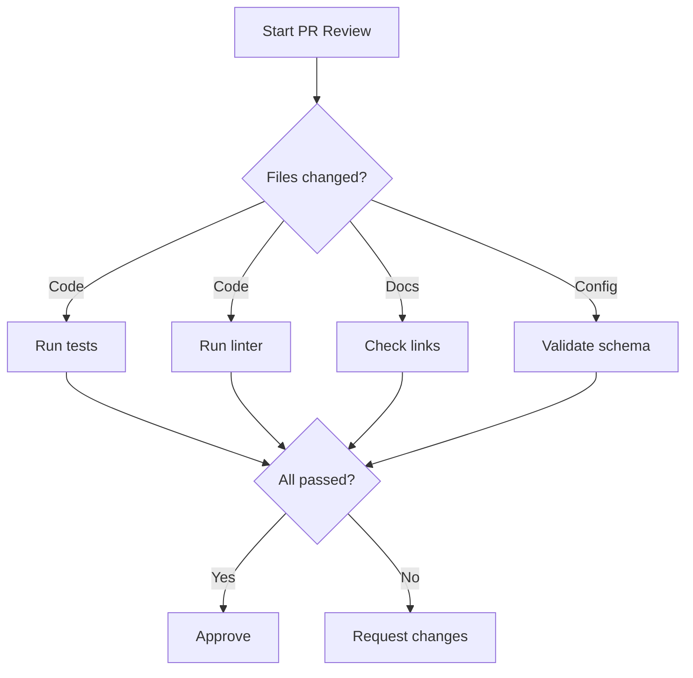
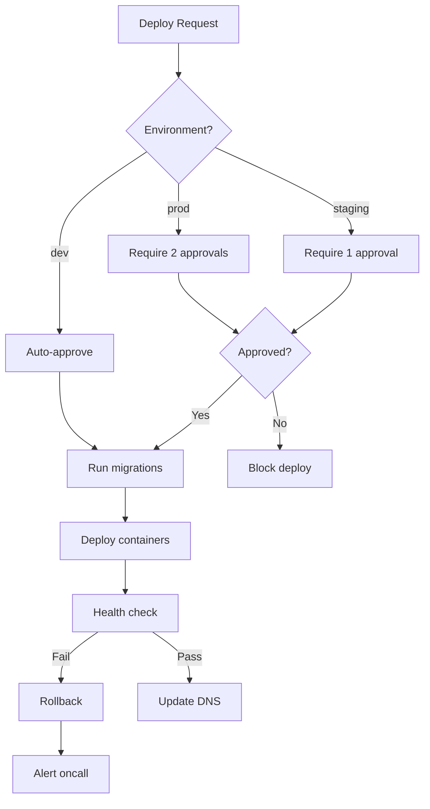

# Claude Code Prompt Optimization

Optimize CLAUDE.md files and Agent Skills for Claude Code CLI using Anthropic's official prompt engineering best practices.

## Core Principles

### 1. Positive Framing Over Prohibitions

Models attend to key nouns/concepts. "NEVER use cat" still activates "use cat". Negation requires an extra logical step that can get lost during generation.

| Instead of        | Write                            |
| ----------------- | -------------------------------- |
| "Never use X"     | "Use Y instead [because reason]" |
| "Don't include X" | "Include only Y"                 |
| "Avoid X"         | "Prefer Y"                       |
| "X is forbidden"  | "Use Y for this operation"       |
| "Don't explain"   | "Output only the result"         |

### 2. Be Specific Over Vague

From Anthropic's memory best practices: "Use 2-space indentation" is better than "Format code properly".

| Vague                        | Specific                                                         |
| ---------------------------- | ---------------------------------------------------------------- |
| "Format code properly"       | "Use 2-space indentation for all code"                           |
| "Write good commit messages" | "Use conventional commits: `type(scope): description`"           |
| "Handle errors correctly"    | "Catch exceptions only when you have a specific recovery action" |
| "Be concise"                 | "Lead with observations, state facts, omit preamble"             |

### 3. Provide Context and Motivation

Claude generalizes better when it understands WHY. Each instruction benefits from a brief reason.

```markdown
## Python Environment
Use `uv run` for all Python execution.
**Reason**: Manages virtual environments and dependencies automatically.
```

### 4. Structure with Markdown Headings

Group related instructions under descriptive headings. Format each memory as a bullet point.

```markdown
## File Operations
- Read files with `Read()` tool (handles encoding, large files)
- Search patterns with `Grep()` tool (returns structured matches)
- Find files with `Glob()` tool (respects gitignore)

## Communication Style
- Lead with findings and observations
- State facts directly without hedging
- Acknowledge dependencies when uncertain about duration
```

### 5. Front-Load Priorities

Key instructions placed early receive more attention. Put critical behaviors at the top of CLAUDE.md.

### 6. Use Examples for Complex Behaviors

3-5 diverse, relevant examples dramatically improve accuracy and consistency. Wrap in `<example>` tags.

```markdown
## Commit Message Format
<examples>
<example>
feat(auth): add OAuth2 support for GitHub login
</example>
<example>
fix(api): handle null response in user endpoint
</example>
<example>
docs(readme): update installation instructions
</example>
</examples>
```

## CLAUDE.md Optimization Process

### Step 1: Identify Negative Patterns

Scan for prohibition markers:

- "NEVER", "DON'T", "FORBIDDEN", "PROHIBITED"
- "❌", "⛔", "🚫" emoji markers
- "Avoid", "Do not", "Must not"

### Step 2: Extract the Desired Behavior

For each prohibition, ask: "What SHOULD Claude do instead?"

| Prohibition                      | Desired Behavior                          |
| -------------------------------- | ----------------------------------------- |
| "Never use bare python commands" | "Run Python with `uv run script.py`"      |
| "Don't use cat, head, tail"      | "Use `Read()` tool for file content"      |
| "Never state timelines"          | "Acknowledge dependencies when uncertain" |
| "Avoid performative gratitude"   | "Lead with observations and findings"     |

Prohibition markers are used only with very explicit absolute examples.

### Step 3: Add Motivation

For each instruction, provide a brief reason:

```markdown
## Tool Selection
| Operation | Tool | Reason |
|-----------|------|--------|
| Read files | `Read()` | Handles encoding, large files, binary detection |
| Search patterns | `Grep()` | Returns structured matches with context |
| Write files | `Write()` | Atomic writes, preserves permissions |
| Run Python | `Bash(uv run ...)` | Manages venv and dependencies correctly |
```

### Step 4: Provide Concrete Examples

Replace abstract descriptions with multishot examples:

```markdown
## Error Handling Pattern

Catch exceptions only when you have a specific recovery action:

<example>
def get_user(id):
    return db.query(User, id)  # Errors surface naturally

def get_user_with_fallback(id):
    try:
        return db.query(User, id)
    except ConnectionError:
        logger.warning("DB unavailable, using cache")
        return cache.get(f"user:{id}")  # Specific recovery
</example>
```

### Step 5: Structure with Headings

Organize instructions into logical groups:

```markdown
## Tool Usage
## Communication Style
## Code Standards
## Verification Process
## Project-Specific Context
```

## Claude 4.5 Specific Optimizations

### Direct Action Language

Claude 4.5 models follow instructions precisely. Be explicit about actions:

| Indirect                   | Direct                   |
| -------------------------- | ------------------------ |
| "Can you suggest changes?" | "Make these changes"     |
| "It might be good to..."   | "Implement this feature" |
| "Consider adding..."       | "Add X to Y"             |

### Parallel Tool Usage

Claude 4.5 fires multiple tool calls simultaneously. Structure instructions to enable this:

```markdown
## Research Tasks
When investigating an issue:
1. Search codebase for related patterns (Grep)
2. Read relevant configuration files (Read)
3. Check test files for expected behavior (Glob + Read)

Execute independent operations simultaneously for efficiency.
```

### Concise Communication

Claude 4.5 is more concise by default. Reinforce this:

```markdown
## Response Style
- Lead with findings, not process descriptions
- State facts directly without hedging language
- Skip summaries after tool operations unless explicitly requested
- Provide code changes, not descriptions of changes
```

### Extended Thinking Guidance

For complex reasoning tasks:

```markdown
## Complex Analysis
For multi-step problems, think through the full approach before acting.
Consider multiple solutions and select the most robust.
Verify your solution with test cases before declaring complete.
```

## Skill File Optimization

### Description Field

The description is critical for Claude to discover when to use your Skill. Include both WHAT and WHEN:

```yaml
---
name: code-reviewer
description: Review code for best practices, security issues, and potential bugs. Use when reviewing PRs, analyzing code quality, or checking implementations before merge.
---
```

### Tool Restrictions

Use `allowed-tools` for focused Skills:

```yaml
---
name: safe-file-reader
description: Read and search files without modifications. Use for code review or analysis tasks requiring read-only access.
allowed-tools: Read, Grep, Glob
---
```

### Progressive Disclosure

Keep SKILL.md focused. Reference supporting files for details:

```markdown
# Code Review Skill

## Quick Checklist
1. Security vulnerabilities
2. Error handling
3. Performance concerns
4. Test coverage

For detailed patterns, see [patterns.md](patterns.md).
For security checklist, see [security.md](security.md).
```

## Anti-Patterns to Transform

### Prohibition Lists

**Before:**

```markdown
## FORBIDDEN ACTIONS
❌ NEVER use bare python commands
❌ NEVER use cat, head, tail, sed, awk
❌ NEVER state timelines or estimates
❌ NEVER use performative gratitude
```

**After:**

```markdown
## Tool Selection
| Operation | Tool | Reason |
|-----------|------|--------|
| Run Python | `Bash(uv run ...)` | Manages venv and dependencies |
| Read files | `Read()` | Handles encoding and large files |
| Search files | `Grep()` | Structured matches with context |

## Communication Style
- Lead with observations and findings
- State facts directly
- Acknowledge dependencies when uncertain about duration
```

### Vague Quality Instructions

**Before:**

```markdown
Write good code and handle errors properly.
```

**After:**

```markdown
## Error Handling
Catch exceptions only when you have a specific recovery action.
Let all other errors propagate to surface issues early.

<example>
# Good: specific recovery action
try:
    return db.query(User, id)
except ConnectionError:
    return cache.get(f"user:{id}")

# Good: let errors propagate
def process(data):
    return transform(data)  # Errors surface naturally
</example>
```

### Unmotivated Rules

**Before:**

```markdown
Always use conventional commits.
```

**After:**

```markdown
## Commit Messages
Use conventional commits format: `type(scope): description`

**Reason**: Enables automated changelog generation and semantic versioning.

Types: `feat`, `fix`, `docs`, `style`, `refactor`, `test`, `chore`
```

## Quick Reference: Transformation Patterns

| Pattern                 | Problem              | Solution                          |
| ----------------------- | -------------------- | --------------------------------- |
| "NEVER X"               | Activates X concept  | "Use Y instead"                   |
| "Don't do X"            | Unclear alternative  | "Do Y" with example               |
| "Avoid X"               | Vague guidance       | "Prefer Y because Z"              |
| "X is forbidden"        | No positive action   | Table mapping operations to tools |
| Long prohibition list   | Cognitive overload   | Positive tool/action table        |
| Vague quality terms     | Inconsistent results | Concrete examples                 |
| Missing motivation      | Brittle compliance   | "Reason:" annotations             |
| Buried key instructions | Ignored guidance     | Front-load priorities             |

## Verification Checklist

After optimization, verify:

- [ ] Prohibition markers (NEVER, DON'T, FORBIDDEN, ❌) are used only with very explicit absolute examples.
- [ ] Each instruction states what TO do
- [ ] Key behaviors have motivations (Reason:)
- [ ] Complex behaviors have 2-3 examples
- [ ] Instructions grouped under descriptive headings
- [ ] Critical behaviors appear early
- [ ] Specific over vague ("2-space indent" not "format properly")
- [ ] Action language is direct ("Make changes" not "Consider making")

## Verification of Technical Terms

When encountering unique names, tool references, or technical jargon (e.g., "WebFetch", "Exa", "Ref", "Context7"):

1.  **NEVER Paraphrase**: Do not attempt to reword or summarize technical terms you haven't verified. Paraphrasing functional requirements can break tool calls or mislead the AI.
2.  **Verify Official Definitions**: Search for the official documentation or definition within the context of the tool (e.g., Claude Code CLI).
3.  **Use Precise Terminology**: Once verified, use the exact terminology found in the official source.

**Example:**

- **Incorrect**: "Use the web summary tool to get page info." (Paraphrased "WebFetch")
- **Correct**: "Use `WebFetch` to retrieve specific web content." (Verified term)

> [Web resource access, definitive guide for getting accurate data for high quality results](./references/accessing_online_resources.md)

## Compression Techniques

When CLAUDE.md or Skill files grow too large, apply these density optimizations. Use judiciously—over-compression can reduce compliance.

### Phrase Transformations

| Verbose Pattern                  | Compressed Form      |
| -------------------------------- | -------------------- |
| "You might want to"              | Direct imperative    |
| "Consider doing X when Y"        | "IF Y THEN X"        |
| "It's important to remember"     | "CONSTRAINT:"        |
| "One approach is to"             | Numbered step        |
| "For example, when X happens"    | "IF X THEN [action]" |
| "It would be great if you could" | Direct imperative    |
| "Please make sure to"            | Direct imperative    |

### Removal Targets

Strip these elements when compressing:

- Greetings and sign-offs
- Meta-commentary about the document itself
- Motivational language ("Great job!", "You've got this!")
- Redundant restatements of the same rule
- Background context (unless operationally necessary)
- Explanations of concepts Claude already knows

### Preservation Targets

Always keep:

- Exact technical specifications
- File paths and patterns
- Command syntax
- Decision logic flows
- Edge case conditions
- Concrete examples (compress to 2-3, not zero)
- Motivation for non-obvious rules (brief "Reason:" annotations)

### Structural Templates

**Simple Protocol (<50 lines):**

```text
## [Protocol Name]

TRIGGER: [When this applies]

PROCEDURE:
1. [Action]
2. [Action]
3. [Action]

CONSTRAINTS:
- [Required behavior]
- [Required behavior]

OUTPUT: [Expected deliverable]
```

### Density Techniques

- Use glob patterns: `**/*.{ts,js}` not "all TypeScript and JavaScript files"
- Use regex directly: `^ERROR:\s+` not "lines starting with ERROR followed by spaces"
- Reference patterns by name: "conventional commits" not full explanation
- Use tool names directly: `Read()`, `Grep()`, `Glob()`

### Mermaid Diagrams for Complex Flows

For large multi-step workflows with conditions and parallel execution, Mermaid diagrams encode exact logic far more clearly than prose. Prose breaks down quickly when describing concurrent paths and join conditions.

**Parallel execution example:**



**Complex workflow with conditions:**



**Best for:**

- CI/CD pipelines with parallel jobs
- Approval workflows with multiple reviewers
- Error handling with rollback paths
- Multi-service deployment orchestration
- Any workflow where prose would require "meanwhile", "concurrently", or "wait for all"

**Why it works:** Claude can trace graph edges precisely. Prose like "run tests and linting in parallel, then wait for both before proceeding" requires Claude to mentally reconstruct the DAG. The diagram makes the DAG explicit.

### Before/After Example

**Before (67 words):**

```text
When you complete work that resolves any of the items in this audit,
you should really make sure to update the file so everyone knows
what's been done. First, find the item in the file. Then change its
status to resolved and add today's date. It's also helpful to add a
note about which file you changed.
```

**After (28 words):**

```text
TRIGGER: Resolved drift item X.Y

PROCEDURE:
1. Edit item X.Y: status → `✅ RESOLVED (YYYY-MM-DD)`
2. Add resolution evidence: file:line
3. Commit: `docs: resolve drift item X.Y`
```

### Length Targets

| Document Type           | Target     |
| ----------------------- | ---------- |
| Single-purpose protocol | <50 lines  |
| Agent task instructions | <100 lines |
| Complex workflow        | <200 lines |
| Full CLAUDE.md          | <500 lines |

### Compression vs. Compliance Tradeoff

Over-compression risks:

- Removing motivations reduces generalization to edge cases
- Stripping all examples reduces pattern matching accuracy
- Excessive terseness can increase ambiguity

Balance: Compress structure and phrasing, preserve motivations and 2-3 key examples.

## Sources

- [Be clear and direct](https://platform.claude.com/docs/en/build-with-claude/prompt-engineering/be-clear-and-direct.md)
- [Use examples (multishot prompting)](https://platform.claude.com/docs/en/build-with-claude/prompt-engineering/multishot-prompting.md)
- [Use XML tags to structure prompts](https://platform.claude.com/docs/en/build-with-claude/prompt-engineering/use-xml-tags.md)
- [Chain of thought prompting](https://platform.claude.com/docs/en/build-with-claude/prompt-engineering/chain-of-thought.md)
- [Chain complex prompts](https://platform.claude.com/docs/en/build-with-claude/prompt-engineering/chain-prompts.md)
- [Prefill Claude's response](https://platform.claude.com/docs/en/build-with-claude/prompt-engineering/prefill-claudes-response.md)
- [Long context tips](https://platform.claude.com/docs/en/build-with-claude/prompt-engineering/long-context-tips.md)
- [Extended thinking tips](https://platform.claude.com/docs/en/build-with-claude/prompt-engineering/extended-thinking-tips.md)
- [What's new in Claude 4.5](https://platform.claude.com/docs/en/about-claude/models/whats-new-claude-4-5.md)
- [Claude Code: Agent Skills](https://code.claude.com/docs/en/skills.md)
- [Claude Code: Plugins reference](https://code.claude.com/docs/en/plugins-reference.md)
- [Anthropic blog: Prompt engineering best practices](https://www.claude.com/blog/best-practices-for-prompt-engineering)
