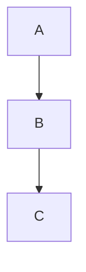
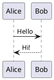

# Publishing Astro Websites

Build fast, content-driven static websites with Astro's zero-runtime SSG approach, partial hydration, and extensive Markdown support.

## Contents

- [Quick Start](#quick-start)
- [When Not to Use](#when-not-to-use)
- [Project Structure](#project-structure)
- [SSG vs SSR vs Hybrid](#ssg-vs-ssr-vs-hybrid)
- [Content Collections](#content-collections) — Legacy, Content Layer API, Custom Loaders
- [Syntax Highlighting](#syntax-highlighting) — Shiki, Transformers, Expressive Code
- [Diagram Integration](#diagram-integration) — Mermaid, PlantUML, Dark Mode Theming
- [Client-Side Search](#client-side-search) — Pagefind (controls, weighting), Fuse.js
- [Versioned Documentation](#versioned-documentation) — Starlight, Multi-version
- [Internationalization](#internationalization-i18n) — Routing, Fallbacks
- [Common Patterns](#common-patterns) — Pagination, Tags, RSS, Forms
- [Performance Best Practices](#performance-best-practices) — Prefetching, Critical CSS
- [Deployment](#deployment) — Firebase URL Config, GitHub Pages
- [Pre-Deploy Checklist](#pre-deploy-checklist)
- [Testing & Quality](#testing--quality) — Vitest, Playwright, Link Checking
- [Troubleshooting](#troubleshooting)

## Quick Start

```bash
# Create new project (use Blog template for Markdown sites)
npm create astro@latest

# Development
npm run dev          # Local server at http://localhost:4321
npm run build        # Generate static files in dist/
npm run preview      # Preview production build
```

## When Not to Use

This skill focuses on **static site generation (SSG)**. Consider other approaches for:

- **Real-time data applications** - Use SSR mode with database connections
- **User authentication flows** - Requires server-side session handling
- **E-commerce with dynamic inventory** - Use hybrid mode or full SSR
- **Single-page applications (SPAs)** - Consider React/Vue frameworks directly

For hybrid SSG+SSR patterns, see Astro's adapter documentation.

## Project Structure

```
src/
  components/     # Astro, React, Vue, Svelte components
  content/        # Content Collections (Markdown/MDX)
    config.ts     # Collection schemas
    docs/         # Example collection
  layouts/        # Page wrappers with slots
  pages/          # File-based routing
public/           # Static assets (images, fonts, favicons)
astro.config.mjs  # Framework configuration
```

## SSG vs SSR vs Hybrid

| Mode | When Pages Render | Use Case |
|------|-------------------|----------|
| **SSG** (default) | Build time | Blogs, docs, marketing sites |
| **SSR** | Each request | Dynamic data, personalization |
| **Hybrid** | Mix of both | Static pages + dynamic endpoints |

For pure static sites, use default `output: 'static'` - no adapter needed.

## Content Collections

### Legacy Pattern (Astro 4.x)

Define schemas in `src/content/config.ts`:

```typescript
import { defineCollection, z } from "astro:content";

export const collections = {
  docs: defineCollection({
    schema: z.object({
      title: z.string(),
      description: z.string().optional(),
      tags: z.array(z.string()).optional(),
      order: z.number().optional(),
      draft: z.boolean().default(false)
    })
  })
};
```

### Content Layer API (Astro 5.0+)

New pattern with `glob()` loader - up to 75% faster builds for large sites:

```typescript
// src/content.config.ts (note: different filename)
import { defineCollection } from 'astro:content';
import { glob } from 'astro/loaders';
import { z } from 'astro/zod';

const blog = defineCollection({
  loader: glob({ pattern: '**/*.md', base: './src/data/blog' }),
  schema: ({ image }) => z.object({
    title: z.string(),
    pubDate: z.coerce.date(),
    draft: z.boolean().default(false),
    cover: image(),  // Validates image exists
    author: reference('authors'),  // Cross-collection reference
  })
});

export const collections = { blog };
```

### Advanced Schema Patterns

```typescript
schema: ({ image }) => z.object({
  cover: image(),                    // Validates image in src/
  category: z.enum(['tech', 'news']),
  author: reference('authors'),      // Cross-collection ref
  relatedPosts: z.array(reference('blog')).optional(),
})
```

### Custom Loaders (Remote Content)

Fetch content from external APIs (GitHub releases, CMS, etc.):

```typescript
// src/loaders/github-releases.ts
import type { Loader } from 'astro/loaders';

export function githubReleasesLoader(repo: string): Loader {
  return {
    name: 'github-releases',
    load: async ({ store, logger }) => {
      logger.info(`Fetching releases for ${repo}`);
      const response = await fetch(`https://api.github.com/repos/${repo}/releases`);
      const releases = await response.json();

      for (const release of releases) {
        store.set({
          id: release.tag_name,
          data: {
            version: release.tag_name,
            published_at: release.published_at,
            body: release.body  // Markdown release notes
          }
        });
      }
    }
  };
}
```

Register in `content.config.ts`:

```typescript
import { githubReleasesLoader } from './loaders/github-releases';

const releases = defineCollection({
  loader: githubReleasesLoader('owner/repo'),
  schema: z.object({
    version: z.string(),
    published_at: z.string(),
    body: z.string(),
  })
});
```

Query and render collections:

```astro
---
import { getCollection } from "astro:content";

export async function getStaticPaths() {
  const docs = await getCollection("docs");
  return docs.map(doc => ({
    params: { slug: doc.slug },
    props: { doc }
  }));
}

const { doc } = Astro.props;
const { Content } = await doc.render();
---

<article>
  <h1>{doc.data.title}</h1>
  <Content />
</article>
```

## Syntax Highlighting

### Basic Shiki Configuration

```javascript
import { defineConfig } from "astro/config";

export default defineConfig({
  markdown: {
    shikiConfig: {
      theme: "github-dark",
      wrap: true
    }
  }
});
```

### Dual Light/Dark Theme

```javascript
shikiConfig: {
  themes: {
    light: 'github-light',
    dark: 'github-dark',
  },
}
```

Add CSS to switch themes:

```css
@media (prefers-color-scheme: dark) {
  .astro-code, .astro-code span {
    color: var(--shiki-dark) !important;
    background-color: var(--shiki-dark-bg) !important;
  }
}
```

### Line Highlighting and Transformers

~~~markdown
```typescript {2,4}
const a = 1;
const b = 2;  // highlighted
const c = 3;
console.log(a + b + c);  // highlighted
```
~~~

**Shiki Transformers (Astro 4.14+):**

```javascript
import { transformerNotationFocus, transformerNotationDiff } from '@shikijs/transformers';

shikiConfig: {
  transformers: [transformerNotationFocus(), transformerNotationDiff()],
}
```

Use notation comments in code:
- `// [!code focus]` - Focus this line
- `// [!code ++]` - Mark as addition (green)
- `// [!code --]` - Mark as deletion (red)

### Expressive Code (Recommended for Docs)

Rich code blocks with copy buttons, filenames, diff highlighting:

```bash
npm install astro-expressive-code
```

```javascript
import expressiveCode from 'astro-expressive-code';

export default defineConfig({
  integrations: [expressiveCode()],
});
```

Features: Copy button, file tabs, line markers, terminal frames, text markers.

## Diagram Integration

### Mermaid (Recommended)

Install the Astro integration:

```bash
npm install astro-mermaid mermaid
```

```javascript
// astro.config.mjs
import { defineConfig } from 'astro/config';
import mermaid from 'astro-mermaid';

export default defineConfig({
  integrations: [mermaid({ theme: 'default' })]
});
```

Use in Markdown:

~~~markdown

~~~

Features: Client-side rendering, automatic theme switching, offline capable, no Playwright required.

**Alternative (build-time static SVG):** Use `rehype-mermaid` with Playwright for pre-rendered diagrams (`npx playwright install --with-deps` required).

**Dark Mode Theming Strategies:**

1. **CSS Variables** - Let browser resolve colors at runtime:
```javascript
// mermaid config
mermaid.initialize({
  theme: 'base',
  themeVariables: {
    primaryColor: 'var(--diagram-primary)',
    lineColor: 'var(--diagram-line)'
  }
});
```

2. **Picture Element** - Generate both themes, swap with media query:
```html
<picture>
  <source srcset="/diagrams/flow-dark.svg" media="(prefers-color-scheme: dark)">
  
</picture>
```

3. **Inline SVG** - Target SVG classes with CSS (risk: style collisions):
```css
.dark .mermaid-svg .node rect {
  fill: var(--bg-dark);
}
```

### PlantUML

```bash
npx astro add plantuml
```

Use in Markdown:

~~~markdown

~~~

## Client-Side Search

### Pagefind (Recommended for Large Sites)

Zero-config static search that indexes at build time:

```bash
npm install pagefind
```

Add to `package.json`:

```json
{
  "scripts": {
    "build": "astro build && npx pagefind --site dist",
    "postbuild": "pagefind --site dist"
  }
}
```

Use in components:

```astro
<link href="/pagefind/pagefind-ui.css" rel="stylesheet" />
<script src="/pagefind/pagefind-ui.js" type="text/javascript"></script>

<div id="search"></div>
<script>
  window.addEventListener('DOMContentLoaded', () => {
    new PagefindUI({ element: '#search', showSubResults: true });
  });
</script>
```

Features: No external service, works offline, automatic indexing, small bundle (~10KB).

**Granular Indexing Control:**

```html
<!-- Only index main content, not headers/sidebars -->
<main data-pagefind-body>
  <h1 data-pagefind-meta="title">Page Title</h1>
  <p data-pagefind-weight="10">Important intro text</p>

  <!-- Exclude from search snippets -->
  <nav data-pagefind-ignore>
    <a href="/related">Related Posts</a>
  </nav>
</main>
```

| Attribute | Purpose |
|-----------|---------|
| `data-pagefind-body` | Limit indexing to this element only |
| `data-pagefind-ignore` | Exclude element from index |
| `data-pagefind-meta="key"` | Define metadata field |
| `data-pagefind-weight="10"` | Boost relevance (default: 1) |

### Pagefind vs Fuse.js

| Feature | Pagefind | Fuse.js |
|---------|----------|---------|
| Architecture | Pre-built binary chunks | Runtime in-memory |
| Bandwidth | Low (loads only needed chunks) | High (downloads full index) |
| Scalability | 10,000+ pages | < 500 pages |
| Multilingual | Native stemming | Manual config |
| Use Case | Global site search | Small list filtering |

### Fuse.js (Lightweight Alternative)

For smaller sites with custom UI needs:

```astro
---
import { getCollection } from "astro:content";
const posts = await getCollection('blog');
const searchIndex = JSON.stringify(posts.map(post => ({
  title: post.data.title,
  slug: post.slug,
  body: post.body.slice(0, 500)
})));
---

<input type="search" id="search" placeholder="Search..." />
<ul id="results"></ul>

<script define:vars={{ searchIndex }}>
  import Fuse from 'fuse.js';

  const fuse = new Fuse(JSON.parse(searchIndex), {
    keys: ['title', 'body'],
    threshold: 0.3
  });

  document.getElementById('search').addEventListener('input', (e) => {
    const results = fuse.search(e.target.value);
    const resultsEl = document.getElementById('results');

    // Clear previous results safely
    resultsEl.replaceChildren();

    // Build results using safe DOM methods
    results.forEach(r => {
      const li = document.createElement('li');
      const link = document.createElement('a');
      link.href = `/blog/${r.item.slug}`;
      link.textContent = r.item.title;
      li.appendChild(link);
      resultsEl.appendChild(li);
    });
  });
</script>
```

For enterprise needs, consider Algolia (hosted search API).

## Versioned Documentation

### Starlight (Recommended for Docs Sites)

Purpose-built documentation framework on Astro:

```bash
npm create astro@latest -- --template starlight
```

Key features: Built-in search (Pagefind), i18n, sidebar navigation, dark mode, component overrides.

```javascript
// astro.config.mjs
import { defineConfig } from 'astro/config';
import starlight from '@astrojs/starlight';

export default defineConfig({
  integrations: [
    starlight({
      title: 'My Docs',
      sidebar: [
        { label: 'Guides', autogenerate: { directory: 'guides' } },
        { label: 'Reference', autogenerate: { directory: 'reference' } },
      ],
    }),
  ],
});
```

### Multi-Version Docs Pattern

Use folder-based structure:

```
src/content/docs/
  v1/
    getting-started.md
    api-reference.md
  v2/
    getting-started.md
    api-reference.md
    new-feature.md
```

For Starlight versioning, use `starlight-utils` plugin:

```bash
npm install starlight-utils
```

```javascript
import { defineConfig } from 'astro/config';
import starlight from '@astrojs/starlight';
import starlightUtils from 'starlight-utils';

export default defineConfig({
  integrations: [
    starlight({
      plugins: [starlightUtils({ multiSidebar: { switcherStyle: 'dropdown' } })],
      sidebar: [
        { label: 'v2', items: [{ label: 'Guides', autogenerate: { directory: 'v2' } }] },
        { label: 'v1', items: [{ label: 'Guides', autogenerate: { directory: 'v1' } }] },
      ],
    }),
  ],
});
```

## Internationalization (i18n)

Configure in `astro.config.mjs`:

```javascript
export default defineConfig({
  i18n: {
    defaultLocale: "en",
    locales: ["en", "fr", "es"],
    routing: {
      prefixDefaultLocale: false
    }
  }
});
```

Structure content by locale:

```
src/content/docs/
  en/
    getting-started.md
  fr/
    getting-started.md
```

Detect locale in components:

```astro
---
const locale = Astro.currentLocale || 'en';
---
```

### Fallback for Missing Translations

Show English content with a banner when translations don't exist:

```astro
---
// src/pages/[lang]/[...slug].astro
import { getCollection, getEntry } from "astro:content";

const languages = ['en', 'es', 'fr'];
const defaultLang = 'en';

export async function getStaticPaths() {
  const englishDocs = await getCollection('docs', ({ id }) => id.startsWith('en/'));
  const paths = [];

  for (const doc of englishDocs) {
    const slug = doc.id.replace(/^en\//, '');

    for (const lang of languages) {
      const localizedId = `${lang}/${slug}`;
      const localizedDoc = await getEntry('docs', localizedId);

      paths.push({
        params: { lang, slug },
        props: {
          entry: localizedDoc || doc,  // Fallback to English
          isFallback: !localizedDoc
        }
      });
    }
  }
  return paths;
}

const { entry, isFallback } = Astro.props;
const { Content } = await entry.render();
---

{isFallback && (
  <div class="translation-notice">
    This page is not yet available in your language.
  </div>
)}
<Content />
```

## Common Patterns

### Paginated Listings

For sites with 50+ posts, split into pages:

```astro
---
// src/pages/blog/page/[page].astro
import { getCollection } from "astro:content";

const POSTS_PER_PAGE = 10;

export async function getStaticPaths() {
  const allPosts = await getCollection("blog");
  const totalPages = Math.ceil(allPosts.length / POSTS_PER_PAGE);

  return Array.from({ length: totalPages }, (_, i) => ({
    params: { page: String(i + 1) },
  }));
}

const { page } = Astro.params;
const pageNum = parseInt(page);
const allPosts = await getCollection("blog");
const sortedPosts = allPosts.sort((a, b) =>
  b.data.pubDate.getTime() - a.data.pubDate.getTime()
);

const start = (pageNum - 1) * POSTS_PER_PAGE;
const posts = sortedPosts.slice(start, start + POSTS_PER_PAGE);
const totalPages = Math.ceil(allPosts.length / POSTS_PER_PAGE);
---

{posts.map(post => <article>{post.data.title}</article>)}

<nav>
  {pageNum > 1 && <a href={`/blog/page/${pageNum - 1}`}>← Previous</a>}
  <span>Page {pageNum} of {totalPages}</span>
  {pageNum < totalPages && <a href={`/blog/page/${pageNum + 1}`}>Next →</a>}
</nav>
```

### Tag/Category Archives

Generate a page for each tag:

```astro
---
// src/pages/tags/[tag].astro
import { getCollection } from "astro:content";

export async function getStaticPaths() {
  const allPosts = await getCollection("blog");
  const tags = new Set();
  allPosts.forEach(post => post.data.tags?.forEach(tag => tags.add(tag)));

  return Array.from(tags).map(tag => ({
    params: { tag },
    props: { tag },
  }));
}

const { tag } = Astro.props;
const allPosts = await getCollection("blog");
const postsWithTag = allPosts.filter(post => post.data.tags?.includes(tag));
---

<h1>Posts tagged: {tag}</h1>
{postsWithTag.map(post => <a href={`/blog/${post.slug}`}>{post.data.title}</a>)}
```

### RSS Feed

```javascript
// src/pages/rss.xml.js
import rss from "@astrojs/rss";
import { getCollection } from "astro:content";

export async function GET(context) {
  const blog = await getCollection("blog");
  return rss({
    title: "My Blog",
    description: "A blog about Astro",
    site: context.site,
    items: blog.map(post => ({
      title: post.data.title,
      description: post.data.description,
      pubDate: post.data.pubDate,
      link: `/blog/${post.slug}/`,
    })),
  });
}
```

### Static Forms

For SSG sites, use third-party form handlers:

**Formspree (Easiest):**
```html
<form action="https://formspree.io/f/YOUR_FORM_ID" method="POST">
  <input type="text" name="name" required />
  <input type="email" name="email" required />
  <textarea name="message" required></textarea>
  <button type="submit">Send</button>
</form>
```

**Netlify Forms:**
```html
<form name="contact" method="POST" data-netlify="true">
  <input type="hidden" name="form-name" value="contact" />
  <input type="text" name="name" required />
  <button type="submit">Send</button>
</form>
```

### JSON-LD Structured Data

Add rich snippets for SEO:

```astro
---
const jsonLd = {
  "@context": "https://schema.org",
  "@type": "BlogPosting",
  headline: entry.data.title,
  description: entry.data.description,
  datePublished: entry.data.pubDate?.toISOString(),
  author: { "@type": "Person", name: entry.data.author },
};
---

<script type="application/ld+json" set:html={JSON.stringify(jsonLd)} />
```

### Dark Mode Toggle

```astro
<button id="theme-toggle">🌙</button>

<script>
  const toggle = document.getElementById("theme-toggle");
  const html = document.documentElement;

  // Load saved preference or detect system preference
  const savedTheme = localStorage.getItem("theme");
  const prefersDark = window.matchMedia("(prefers-color-scheme: dark)").matches;

  if (savedTheme === "dark" || (!savedTheme && prefersDark)) {
    html.classList.add("dark");
  }

  toggle?.addEventListener("click", () => {
    html.classList.toggle("dark");
    localStorage.setItem("theme", html.classList.contains("dark") ? "dark" : "light");
  });
</script>
```

With Tailwind, enable `darkMode: "class"` in config.

## Performance Best Practices

1. **Partial Hydration**: Use `client:*` directives only where needed
   - `client:load` - Hydrate immediately
   - `client:idle` - Hydrate when browser is idle
   - `client:visible` - Hydrate when in viewport
   - `client:media` - Hydrate on media query match
   - `client:only="react"` - Skip server render, client-only

2. **Image Optimization**: Use Astro's `<Image />` component

3. **Keep Static Where Possible**: Islands architecture means most content remains static HTML

4. **Asset Fingerprinting**: Automatic in production builds

5. **Prefetching**: Auto-load links before user clicks

```javascript
// astro.config.mjs
export default defineConfig({
  prefetch: {
    prefetchAll: true,           // Prefetch all links
    defaultStrategy: 'viewport'  // When links enter viewport
  }
});
```

Options: `'tap'` (on hover/focus), `'viewport'` (when visible), `'load'` (on page load).

6. **Critical CSS**: Inline above-the-fold CSS with astro-critters

```bash
npm install astro-critters
```

```javascript
import critters from 'astro-critters';

export default defineConfig({
  integrations: [critters()]
});
```

Extracts critical CSS and inlines it, deferring the rest for faster first paint.

## Deployment

### Deployment Workflow

1. **Build**: Run `npm run build` and verify `dist/` output
2. **Preview**: Test with `npm run preview` at localhost:4321
3. **Configure**: Set `site`, `base`, and `trailingSlash` in astro.config.mjs
4. **Platform Setup**: Initialize hosting (e.g., `firebase init hosting`)
5. **Deploy**: Push to platform (`firebase deploy`, `vercel`, or git push)
6. **Verify**: Check live URL, test 404 page, validate assets load

### Quick Deploy Commands

```bash
# Build for production
npm run build

# Preview before deploy
npm run preview
```

### Platform-Specific

**Netlify/Vercel/Cloudflare Pages:**
Connect Git repository - auto-deploys on push.

**GitHub Pages:**
```javascript
// astro.config.mjs
export default defineConfig({
  site: 'https://username.github.io',
  base: '/repo-name'
});
```

**Firebase Hosting:**
```bash
npm install -g firebase-tools
firebase login
firebase init hosting  # Set public to 'dist'
npm run build
firebase deploy
```

`firebase.json` (recommended configuration):
```json
{
  "hosting": {
    "public": "dist",
    "ignore": ["firebase.json", "**/.*"],
    "cleanUrls": true,
    "trailingSlash": false,
    "headers": [
      {
        "source": "/_astro/**",
        "headers": [{"key": "Cache-Control", "value": "public, max-age=31536000, immutable"}]
      }
    ]
  }
}
```

**Align Astro config** to prevent redirect loops:
```javascript
// astro.config.mjs - match Firebase settings
export default defineConfig({
  trailingSlash: 'never',  // Must match Firebase trailingSlash: false
  build: {
    format: 'directory'    // Default - generates /about/index.html
  }
});
```

| Firebase Setting | Astro Setting | Result |
|------------------|---------------|--------|
| `trailingSlash: false` | `trailingSlash: 'never'` | `/about` (no slash) |
| `trailingSlash: true` | `trailingSlash: 'always'` | `/about/` (with slash) |
| Mismatch | Mismatch | Redirect loops! |

### Common Deployment Gotchas

| Issue | Solution |
|-------|----------|
| Trailing slash problems | Set `trailingSlash: 'always'` or `'never'` |
| Assets not loading on subpath | Configure `base` in astro.config.mjs |
| 404 not working | Create custom `404.astro` page |
| Build fails on deploy | Check Node version matches local |

## Pre-Deploy Checklist

Before deploying, verify:

- [ ] `npm run build` completes without errors
- [ ] `npm run preview` shows site correctly at localhost:4321
- [ ] All Content Collection schemas validate (`astro check`)
- [ ] Images use `<Image />` component or are in `public/`
- [ ] SEO metadata present on all pages (title, description, og:*)
- [ ] 404.astro page exists and renders correctly
- [ ] `base` path configured if deploying to subdirectory
- [ ] Environment variables set on deployment platform
- [ ] `trailingSlash` setting matches hosting platform expectations
- [ ] RSS feed working (`/rss.xml`)
- [ ] Sitemap generated (`/sitemap-index.xml`)
- [ ] Lighthouse score > 90
- [ ] Component tests pass (`npm run test`)
- [ ] E2E tests pass (`npm run test:e2e`)
- [ ] Link checker finds no broken links (`npx linkinator dist`)

## Testing & Quality

### Static Analysis

```bash
# Type checking and validation
npx astro check

# Linting (with ESLint)
npm install -D eslint
npx eslint .

# Preview production build
npm run build && npm run preview
```

**Build-time validation** happens automatically with Content Collections - schema errors fail the build.

### Component Testing with Vitest

```bash
npm install -D vitest @vitest/ui @astrojs/testing
```

```typescript
// vitest.config.ts
import { getViteConfig } from 'astro/config';

export default getViteConfig({
  test: {
    include: ['src/**/*.test.ts'],
  },
});
```

```typescript
// src/components/Button.test.ts
import { experimental_AstroContainer as AstroContainer } from 'astro/container';
import { expect, test } from 'vitest';
import Button from './Button.astro';

test('Button renders with text', async () => {
  const container = await AstroContainer.create();
  const result = await container.renderToString(Button, {
    props: { text: 'Click me' }
  });
  expect(result).toContain('Click me');
});
```

### E2E Testing with Playwright

```bash
npm install -D @playwright/test
npx playwright install
```

```typescript
// tests/homepage.spec.ts
import { test, expect } from '@playwright/test';

test('homepage loads correctly', async ({ page }) => {
  await page.goto('/');
  await expect(page).toHaveTitle(/My Site/);
  await expect(page.locator('h1')).toBeVisible();
});

test('navigation works', async ({ page }) => {
  await page.goto('/');
  await page.click('a[href="/about"]');
  await expect(page).toHaveURL(/about/);
});
```

```json
// package.json
{
  "scripts": {
    "test": "vitest",
    "test:e2e": "playwright test",
    "test:e2e:ui": "playwright test --ui"
  }
}
```

### Link Checking

Validate internal links don't break:

```bash
npm install -D linkinator
npx linkinator dist --recurse
```

Add to CI:

```yaml
# .github/workflows/links.yml
- run: npm run build
- run: npx linkinator dist --recurse --skip "^(?!http://localhost)"
```

## .astro File Anatomy

```astro
---
// Frontmatter: JavaScript/TypeScript runs at build time
import Layout from '../layouts/Layout.astro';
import { getCollection } from 'astro:content';

const { title } = Astro.props;
const posts = await getCollection('blog');
---

<!-- Template: HTML with JSX expressions -->
<Layout title={title}>
  <h1>{title}</h1>
  <ul>
    {posts.map(post => (
      <li><a href={`/blog/${post.slug}`}>{post.data.title}</a></li>
    ))}
  </ul>
</Layout>

<style>
  /* Scoped to this component */
  h1 { color: navy; }
</style>

<script>
  // Client-side JavaScript
  console.log('Runs in browser');
</script>
```

## File-Based Routing

| File | Route |
|------|-------|
| `src/pages/index.astro` | `/` |
| `src/pages/about.astro` | `/about` |
| `src/pages/blog/index.astro` | `/blog` |
| `src/pages/blog/[slug].astro` | `/blog/:slug` (dynamic) |
| `src/pages/[...path].astro` | Catch-all |

Dynamic routes require `getStaticPaths()` for SSG:

```astro
---
export function getStaticPaths() {
  return [
    { params: { slug: 'post-1' } },
    { params: { slug: 'post-2' } }
  ];
}
---
```

## SEO Essentials

### Manual Approach

```astro
---
const { title, description, image } = Astro.props;
const canonicalURL = new URL(Astro.url.pathname, Astro.site);
---

<head>
  <title>{title}</title>
  <meta name="description" content={description} />
  <link rel="canonical" href={canonicalURL} />

  <!-- Open Graph -->
  <meta property="og:title" content={title} />
  <meta property="og:description" content={description} />
  <meta property="og:image" content={image} />
  <meta property="og:type" content="website" />

  <!-- Twitter -->
  <meta name="twitter:card" content="summary_large_image" />
</head>
```

### astro-seo (Simplified)

```bash
npm install astro-seo
```

```astro
---
import { SEO } from 'astro-seo';
---

<head>
  <SEO
    title="Page Title"
    description="Page description"
    openGraph={{
      basic: {
        title: "OG Title",
        type: "website",
        image: "/og-image.png",
      }
    }}
    twitter={{ creator: "@handle" }}
  />
</head>
```

Handles meta tags, Open Graph, Twitter Cards, and canonical URLs automatically.

## Essential Integrations

```bash
# Add integrations
npx astro add react      # React components
npx astro add tailwind   # Tailwind CSS
npx astro add mdx        # MDX support
npx astro add sitemap    # Auto-generate sitemap

# RSS feed
npm install @astrojs/rss
```

## Troubleshooting

**"Works locally but breaks on deploy"**
- Check environment variables are set on host
- Verify `base` path configuration
- Ensure Node version matches (v18+ recommended)

**Dynamic routes missing pages**
- Verify `getStaticPaths()` returns all needed paths
- Check for typos in params

**Content Collection schema errors**
- Run `astro check` for validation details
- Ensure frontmatter matches Zod schema exactly

**Assets not loading**
- Use `import` for processed assets
- Use `public/` for unprocessed static files

## References

For detailed guides on specific topics, see:
- `references/markdown-deep-dive.md` - Advanced Markdown/MDX patterns
- `references/deployment-platforms.md` - Platform-specific deployment details

## Key Resources

- [Astro Documentation](https://docs.astro.build/)
- [Content Collections](https://docs.astro.build/en/guides/content-collections/)
- [Markdown in Astro](https://docs.astro.build/en/guides/markdown-content/)
- [Deploy Astro](https://docs.astro.build/en/guides/deploy/)
- [Starlight Docs Theme](https://starlight.astro.build/)
