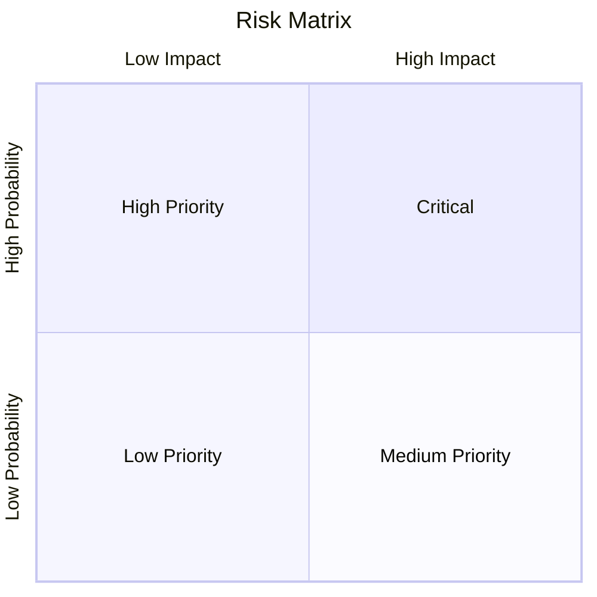
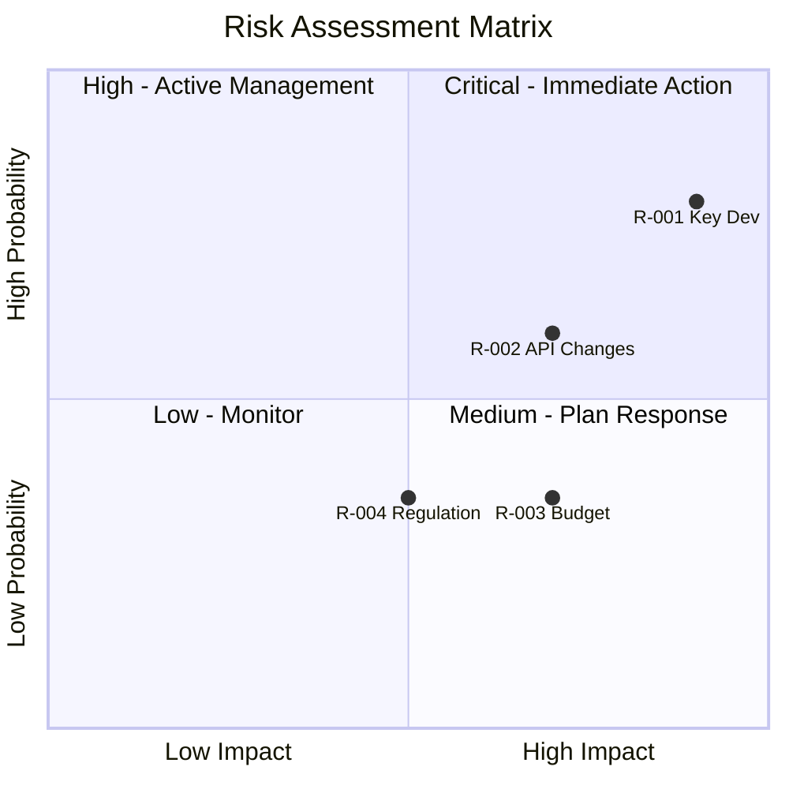

# Risk Analysis

## When to Use This Skill

Use this skill when:

- **Risk Analysis tasks** - Working on risk analysis using risk registers, probability/impact matrices, and mitigation planning. identifies, assesses, and manages project, business, and technical risks with structured response strategies
- **Planning or design** - Need guidance on Risk Analysis approaches
- **Best practices** - Want to follow established patterns and standards

## Overview

Systematically identify, assess, and manage risks using risk registers, probability/impact matrices, and structured response planning. Supports project risks, business risks, technical risks, and opportunity management.

## What is Risk Analysis?

**Risk** is an uncertain event or condition that, if it occurs, has a positive or negative effect on objectives. Risk analysis involves:

- **Identification**: What could happen?
- **Assessment**: How likely? How impactful?
- **Response Planning**: What will we do about it?
- **Monitoring**: Track and update risks

### Risk vs Issue

| Concept | Definition | Action |
|---------|------------|--------|
| **Risk** | Potential future event (uncertain) | Plan response |
| **Issue** | Current problem (certain) | Resolve now |

### Threats vs Opportunities

| Type | Effect | Response Goal |
|------|--------|---------------|
| **Threat** | Negative impact | Minimize exposure |
| **Opportunity** | Positive impact | Maximize benefit |

## Risk Register

The central repository for all identified risks:

```markdown
## Risk Register

| ID | Risk Description | Category | Probability | Impact | Score | Owner | Response | Status |
|----|-----------------|----------|-------------|--------|-------|-------|----------|--------|
| R-001 | [Description] | [Category] | H/M/L | H/M/L | [P×I] | [Name] | [Strategy] | Open |
```

### Risk Register Fields

| Field | Description |
|-------|-------------|
| **ID** | Unique identifier |
| **Description** | Clear risk statement |
| **Category** | Type of risk |
| **Probability** | Likelihood of occurrence |
| **Impact** | Consequence if it occurs |
| **Score** | Risk priority (P × I) |
| **Owner** | Person responsible |
| **Response** | Planned response strategy |
| **Status** | Open, Mitigated, Closed, Occurred |

### Risk Categories

| Category | Examples |
|----------|----------|
| **Technical** | Technology failure, integration issues |
| **Schedule** | Delays, dependencies |
| **Cost** | Budget overrun, resource costs |
| **Resource** | Skill gaps, availability |
| **External** | Vendor, regulatory, market |
| **Organizational** | Change resistance, priorities |
| **Quality** | Defects, performance |
| **Security** | Data breach, unauthorized access |

## Probability/Impact Matrix

### Scoring Scales

**Probability Scale:**

| Level | Score | Description | Likelihood |
|-------|-------|-------------|------------|
| Very Low | 1 | Rare | < 10% |
| Low | 2 | Unlikely | 10-30% |
| Medium | 3 | Possible | 30-50% |
| High | 4 | Likely | 50-70% |
| Very High | 5 | Almost Certain | > 70% |

**Impact Scale:**

| Level | Score | Schedule | Cost | Quality |
|-------|-------|----------|------|---------|
| Very Low | 1 | < 1 week | < 5% | Minor |
| Low | 2 | 1-2 weeks | 5-10% | Noticeable |
| Medium | 3 | 2-4 weeks | 10-20% | Significant |
| High | 4 | 1-3 months | 20-40% | Major |
| Very High | 5 | > 3 months | > 40% | Critical |

### Risk Score Calculation

```text
Risk Score = Probability × Impact

Score Range: 1-25
```

**Risk Priority Zones:**

| Score | Priority | Action |
|-------|----------|--------|
| 1-4 | Low | Accept or monitor |
| 5-9 | Medium | Active management |
| 10-14 | High | Priority attention |
| 15-25 | Critical | Immediate action |

### Visual Matrix



## Risk Response Strategies

### For Threats (Negative Risks)

| Strategy | Description | When to Use |
|----------|-------------|-------------|
| **Avoid** | Eliminate the threat | High probability and impact |
| **Transfer** | Shift to third party | Financial/contractual risks |
| **Mitigate** | Reduce probability or impact | Most common approach |
| **Accept** | Acknowledge, no action | Low priority risks |

### For Opportunities (Positive Risks)

| Strategy | Description | When to Use |
|----------|-------------|-------------|
| **Exploit** | Ensure opportunity occurs | High-value opportunities |
| **Share** | Partner to increase capability | Need external help |
| **Enhance** | Increase probability or impact | Moderate opportunities |
| **Accept** | Take advantage if it occurs | Low-effort opportunities |

### Response Planning Template

```markdown
## Risk Response Plan: R-001

**Risk:** [Description]
**Strategy:** [Avoid/Transfer/Mitigate/Accept]

### Prevention Actions
| Action | Owner | Due Date | Status |
|--------|-------|----------|--------|
| [Preventive measure] | [Name] | [Date] | [Status] |

### Contingency Plan
**Trigger:** [What indicates risk is occurring]
**Actions:**
1. [Contingency action 1]
2. [Contingency action 2]

### Residual Risk
**After mitigation:**
- Probability: [Reduced level]
- Impact: [Reduced level]
- New Score: [Residual score]
```

## Workflow

### Phase 1: Risk Identification

#### Step 1: Gather Inputs

Sources for risk identification:

- Project plans and schedules
- Stakeholder concerns
- Historical data from similar projects
- SWOT analysis (Threats)
- Technical assessments
- External environment analysis

#### Step 2: Brainstorm Risks

Techniques:

- **Checklist review**: Standard risk categories
- **Expert interviews**: Subject matter experts
- **Assumption analysis**: Test project assumptions
- **Root cause analysis**: Work backward from impacts
- **SWOT**: Threats and opportunities

#### Step 3: Document Risks

Risk statement format:

```text
"There is a risk that [CONDITION/CAUSE] may result in [CONSEQUENCE/IMPACT]"

Example:
"There is a risk that key developer leaves may result in schedule delay and knowledge loss"
```

### Phase 2: Risk Assessment

#### Step 1: Assess Probability

For each risk:

- What is the likelihood of occurrence?
- What evidence supports this assessment?
- Use defined scale (1-5)

#### Step 2: Assess Impact

For each risk:

- What would be the consequence?
- Consider multiple impact types (schedule, cost, quality)
- Use the highest impact dimension
- Use defined scale (1-5)

#### Step 3: Calculate and Prioritize

```markdown
## Risk Assessment Summary

| ID | Risk | P | I | Score | Priority |
|----|------|---|---|-------|----------|
| R-001 | [Risk 1] | 4 | 5 | 20 | Critical |
| R-002 | [Risk 2] | 3 | 3 | 9 | Medium |
| R-003 | [Risk 3] | 2 | 2 | 4 | Low |
```

### Phase 3: Response Planning

#### Step 1: Select Response Strategy

For each significant risk:

- Match strategy to risk characteristics
- Consider cost of response vs. risk exposure
- Assign risk owner

#### Step 2: Define Response Actions

- Specific, measurable actions
- Clear owners and due dates
- Contingency triggers defined

#### Step 3: Calculate Residual Risk

After planned mitigations:

- Re-assess probability and impact
- Calculate residual risk score
- Determine if acceptable

### Phase 4: Monitoring

#### Step 1: Track Risk Status

Regular review cadence:

- Critical risks: Weekly
- High risks: Bi-weekly
- Medium risks: Monthly
- Low risks: Quarterly

#### Step 2: Update Register

- New risks identified
- Risk scores changed
- Responses executed
- Risks closed or occurred

## Output Formats

### Risk Register (Markdown Table)

```markdown
## Risk Register: [Project/Initiative]

**Date:** [ISO Date]
**Owner:** [Name]
**Review Cycle:** [Weekly/Monthly]

| ID | Risk Description | Category | P | I | Score | Owner | Response | Actions | Status |
|----|-----------------|----------|---|---|-------|-------|----------|---------|--------|
| R-001 | Key developer may leave during critical phase | Resource | 4 | 5 | 20 | PM | Mitigate | Cross-train, document | Open |
| R-002 | Third-party API may have breaking changes | Technical | 3 | 4 | 12 | Tech Lead | Mitigate | Abstraction layer | Open |
| R-003 | Budget approval may be delayed | Cost | 2 | 4 | 8 | Sponsor | Accept | Monitor | Open |
| R-004 | New regulation may require features | External | 2 | 3 | 6 | BA | Accept | Watch | Open |

### Summary
- **Total Risks:** 4
- **Critical (15+):** 1
- **High (10-14):** 1
- **Medium (5-9):** 1
- **Low (1-4):** 1
```

### Risk Matrix Visualization



### Structured Data (YAML)

```yaml
risk_register:
  name: "[Project/Initiative]"
  version: "1.0"
  date: "2025-01-15"
  owner: "Project Manager"
  review_cycle: "weekly"

  risk_appetite:
    overall: "moderate"
    schedule: "low"
    cost: "moderate"
    quality: "low"

  scales:
    probability:
      1: "Rare (<10%)"
      2: "Unlikely (10-30%)"
      3: "Possible (30-50%)"
      4: "Likely (50-70%)"
      5: "Almost Certain (>70%)"
    impact:
      1: "Very Low"
      2: "Low"
      3: "Medium"
      4: "High"
      5: "Very High"

  risks:
    - id: "R-001"
      description: "Key developer may leave during critical phase"
      category: "Resource"
      probability: 4
      impact: 5
      score: 20
      priority: "critical"
      owner: "Project Manager"
      response_strategy: "mitigate"
      response_actions:
        - action: "Cross-train team member"
          owner: "Tech Lead"
          due_date: "2025-02-01"
          status: "in_progress"
        - action: "Document critical knowledge"
          owner: "Developer"
          due_date: "2025-02-15"
          status: "not_started"
      contingency:
        trigger: "Developer gives notice"
        actions:
          - "Accelerate knowledge transfer"
          - "Engage contractor"
      residual_risk:
        probability: 3
        impact: 3
        score: 9
      status: "open"
      created_date: "2025-01-15"
      last_reviewed: "2025-01-15"

  summary:
    total: 4
    by_priority:
      critical: 1
      high: 1
      medium: 1
      low: 1
    by_status:
      open: 4
      mitigated: 0
      closed: 0
      occurred: 0
```

### Narrative Summary

```markdown
## Risk Assessment Summary

**Project:** [Name]
**Date:** [ISO Date]
**Assessed By:** risk-analyst

### Risk Profile

| Priority | Count | Top Risk |
|----------|-------|----------|
| Critical | 1 | Key developer leaving |
| High | 1 | Third-party API changes |
| Medium | 1 | Budget approval delay |
| Low | 1 | Regulatory changes |

### Critical Risks Requiring Action

#### R-001: Key Developer Departure
- **Score:** 20 (P:4 × I:5)
- **Response:** Mitigate through cross-training and documentation
- **Target Residual:** 9 (P:3 × I:3)
- **Actions:** 2 in progress, 0 completed

### Risk Trends

| Metric | This Period | Last Period | Trend |
|--------|-------------|-------------|-------|
| Total Risks | 4 | 3 | ↑ |
| Critical | 1 | 0 | ↑ |
| Closed | 0 | 1 | ↓ |

### Recommendations

1. **Immediate:** Accelerate R-001 mitigation actions
2. **This Week:** Complete API abstraction layer design
3. **Monitor:** Watch for regulatory announcements
```

## Common Pitfalls

| Pitfall | Prevention |
|---------|------------|
| Vague risk descriptions | Use "condition may cause consequence" format |
| Inconsistent scoring | Define and use standard scales |
| No risk owners | Assign owner at identification |
| Stale register | Schedule regular reviews |
| Ignoring opportunities | Include positive risks |
| Over-analysis | Focus on high-priority risks |
| No contingency | Plan for when risks occur |

## Integration

### Upstream

- **swot-pestle-analysis** - Threats from strategic analysis
- **stakeholder-analysis** - Stakeholder concerns as risks
- **decision-analysis** - Risks inform decisions

### Downstream

- **Project planning** - Risk-adjusted schedules
- **Budgeting** - Contingency reserves
- **Monitoring** - Risk tracking dashboards

## Related Skills

- `swot-pestle-analysis` - Strategic threats/opportunities
- `root-cause-analysis` - When risks occur
- `decision-analysis` - Risk-based decisions
- `prioritization` - Risk prioritization

## Version History

- **v1.0.0** (2025-12-26): Initial release
