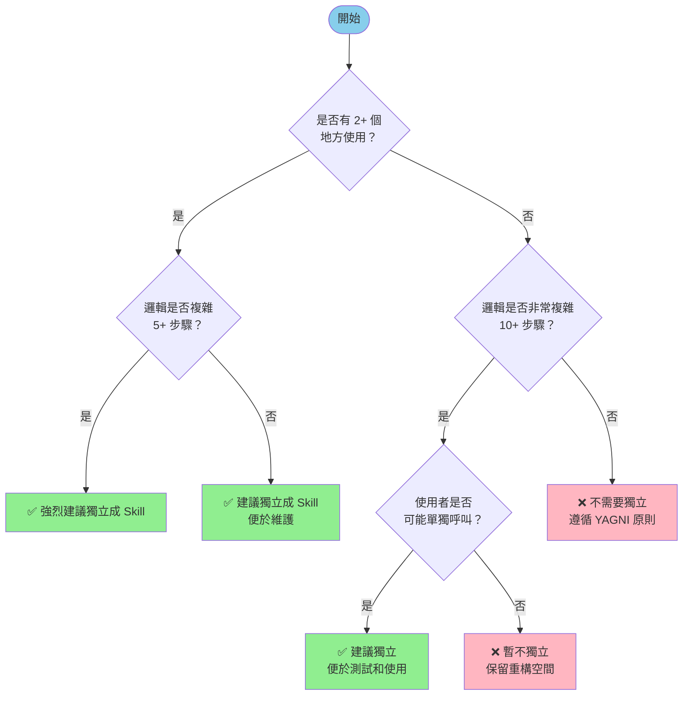

# Skills 設計指南

> 本指南遵循 [Claude Code Skills 官方規範](https://docs.claude.com/en/docs/claude-code/skills)
> 並整合此 marketplace 專案的最佳實踐。

協助你設計和開發 Claude Code Skills，提供清晰的判斷標準、設計原則和實際案例，確保 skill 的設計符合「可重複使用的工作流程」的核心定位。

## 📚 文件導覽

本 skill 包含以下文件：

1. **[SKILL.md](SKILL.md)**（本文件）：核心判斷標準和設計原則
2. **[official-reference.md](official-reference.md)**：官方定義、特性和參考資源
3. **[examples.md](examples.md)**：實際案例分析和專案範例
4. **[implementation.md](implementation.md)**：實施指南、檔案結構和命名規範
5. **[best-practices.md](best-practices.md)**：最佳實踐和常見錯誤

**建議閱讀順序**：
1. 先閱讀本文件了解核心概念和判斷標準
2. 查看 [official-reference.md](official-reference.md) 了解官方定義
3. 閱讀 [examples.md](examples.md) 學習實際案例
4. 使用 [implementation.md](implementation.md) 進行實作
5. 參考 [best-practices.md](best-practices.md) 避免常見錯誤

---

## 核心概念

### 什麼是 Skill？

Skill 是 **可重複使用的工作流程**，定義在 `SKILL.md` 檔案中，可以在多個 commands、agents 或其他 skills 中被引用和重複使用。

#### 關鍵特性

- **模組化設計**：每個 skill 是獨立的資料夾，包含指令、說明和相關資源
- **跨平台通用**：可在 Claude.ai、API 和 Claude Code 之間共用
- **動態載入**：Claude 會在相關時自動發現和載入 skills
- **單一定義**：設計一次，可在多個地方重複使用

> 詳細的官方定義請參閱：[official-reference.md](official-reference.md)

---

## 判斷標準

### 何時「需要」獨立成 Skill？

使用以下檢查清單來判斷：

#### ✅ 強烈建議獨立

1. **多處重複使用**
   - 有 **2 個以上** 的 commands/agents 需要使用相同的邏輯
   - 預期未來會有更多地方需要這個功能

2. **邏輯複雜度高**
   - 工作流程包含 **5 個以上** 的步驟
   - 需要複雜的條件判斷或分支邏輯
   - 維護和測試時需要獨立處理

3. **使用者可能單獨呼叫**
   - 這個功能本身具有獨立的使用價值
   - 使用者可能只想執行這個特定的工作流程

4. **需要獨立維護和版本控制**
   - 這個邏輯的更新頻率較高
   - 需要獨立測試和驗證
   - 多個開發者協作時需要獨立的職責劃分

#### ❌ 不建議獨立

1. **單一使用場景**
   - 只在 **1 個** command/agent 中使用
   - 未來也不太可能在其他地方重複使用

2. **邏輯簡單**
   - 只有 **3 個以下** 的簡單步驟
   - 沒有複雜的條件判斷

3. **與特定 command 緊密耦合**
   - 邏輯與 command 的其他部分緊密相關
   - 獨立出來反而降低可讀性

4. **過度工程化**
   - 為了「可能的」未來需求而設計
   - 增加不必要的抽象層次

> 詳細的案例分析請參閱：[examples.md](examples.md)

---

## 設計原則

### 1. YAGNI 原則（You Aren't Gonna Need It）

**不要過度設計**

❌ 錯誤思維：
> 「雖然現在只有一個地方用到，但未來可能會用到，所以我先獨立成 skill 好了。」

✅ 正確做法：
> 「目前只有一個地方使用，先保持簡單。等到第二個地方需要時，再考慮重構成 skill。」

### 2. DRY 原則（Don't Repeat Yourself）

**避免重複邏輯**

時機點：
- **1st 使用** → 直接寫在 command/agent 中
- **2nd 使用** → 考慮抽取成 skill
- **3rd 使用** → 必須抽取成 skill

### 3. 單一職責原則

**一個 Skill 只做一件事**

✅ 好的設計：
- `analyze-atomicity`: 只負責分析提交的原子性
- `generate-commit-message`: 只負責產生提交訊息
- `resolve-conflict`: 只負責解決 Git 衝突

❌ 不好的設計：
- `commit-helper`: 包含原子性分析、訊息產生、推送等多個功能（職責不清晰，難以重複使用）

### 4. 清晰的介面設計

**明確的輸入和輸出**

每個 skill 應該清楚定義：

```markdown
## 輸入條件
- 需要哪些前置資訊？
- 依賴哪些工具或環境？

## 執行步驟
1. 步驟 1
2. 步驟 2
3. 步驟 3

## 輸出結果
- 返回什麼資訊？
- 如何被其他 commands/skills 使用？
```

> 詳細的實施指南請參閱：[implementation.md](implementation.md)

---

## 決策樹

使用這個決策樹快速判斷：



---

## 執行步驟

當使用者詢問「是否需要將某個功能獨立成 skill」時，按照以下步驟進行分析：

### 步驟 1：收集資訊

收集以下資訊（使用 AskUserQuestion 或直接分析）：

1. **目前使用情況**
   - 這個功能目前在哪些地方使用？
   - 使用次數是 1 次、2 次還是更多？

2. **未來使用預期**
   - 是否已經規劃其他會使用這個功能的 command/agent？
   - 使用者是否明確表達未來的擴展需求？

3. **邏輯複雜度**
   - 包含幾個步驟？
   - 是否有複雜的條件判斷或分支邏輯？

4. **獨立使用價值**
   - 使用者是否可能單獨執行這個功能？
   - 這個功能是否具有獨立的使用場景？

### 步驟 2：套用判斷標準

根據「判斷標準」章節的檢查清單進行評估：

```markdown
檢查清單：
- [ ] 多處使用？
- [ ] 邏輯複雜？
- [ ] 可獨立呼叫？
- [ ] 需要獨立維護？

評分：勾選 3+ 項 → ✅ 建議獨立
     勾選 1-2 項 → ❓ 視情況決定
     勾選 0 項 → ❌ 不建議獨立
```

### 步驟 3：提供建議

根據評估結果，提供清晰的建議：

#### 如果建議獨立

```markdown
✅ 建議獨立成 Skill

理由：
1. [列出符合的條件]
2. [說明獨立後的好處]
3. [未來的擴展可能性]

建議的 Skill 設計：
- 名稱：{plugin-name}:{skill-name}
- 位置：plugins/{plugin-name}/skills/{skill-name}/SKILL.md
- 核心功能：[簡述]
- 預期使用者：[列出會使用這個 skill 的 commands/agents]
```

#### 如果不建議獨立

```markdown
❌ 目前不建議獨立成 Skill

理由：
1. [列出不符合的條件]
2. [說明保持現狀的好處]
3. [遵循的設計原則]

建議：
- 保持在 {current-location} 中
- 等到出現第二個使用場景時再考慮重構

未來觸發條件：
[列出什麼情況下應該重新評估]
```

### 步驟 4：提供實施計畫（如果建議獨立）

如果決定要獨立成 skill，引導使用者查看詳細的實施計畫：

> 詳細的實施步驟請參閱：[implementation.md](implementation.md)

主要步驟：
1. 創建 Skill 檔案結構
2. 設計 SKILL.md（YAML Front Matter、內容結構）
3. 重構現有 Command/Agent（移除重複邏輯、引用新 skill）
4. 更新文件（README.md、CHANGELOG.md、版本號）

---

## 快速參考

### 常見問題快速解答

| 問題 | 答案 | 參考文件 |
|------|------|---------|
| 第一次使用這個邏輯，要獨立嗎？ | ❌ 不要，遵循 YAGNI 原則 | [best-practices.md](best-practices.md) |
| 第二次使用，要獨立嗎？ | ✅ 強烈建議獨立 | [examples.md](examples.md) |
| 邏輯很複雜但只用一次？ | 視情況，看是否有獨立價值 | [SKILL.md](SKILL.md#判斷標準) |
| 如何命名 skill？ | 使用 kebab-case，動詞開頭 | [implementation.md](implementation.md#命名規範) |
| SKILL.md 必須包含什麼？ | YAML Front Matter、核心功能、執行步驟 | [implementation.md](implementation.md#skillmd-格式規範) |
| 可以在 skill 中引用其他 skills 嗎？ | 可以，但要避免循環依賴 | [best-practices.md](best-practices.md) |

### 設計檢查清單

創建 skill 前快速檢查：

- [ ] 有 2+ 個使用場景（或邏輯極其複雜）
- [ ] 職責單一且清晰
- [ ] 名稱具有描述性
- [ ] 規劃了完整的文件結構
- [ ] 考慮了與現有 commands/skills 的整合

---

## 總結

設計 Skill 的核心原則：

1. **YAGNI**：不要過度設計，等需求明確時再抽取
2. **DRY**：出現重複時才抽取，而不是提前
3. **單一職責**：一個 skill 只做一件事
4. **清晰介面**：明確的輸入輸出，完整的文件

**記住：保持簡單永遠是最好的設計。**

---

## 延伸閱讀

- **官方資訊**：[official-reference.md](official-reference.md) - Claude Code Skills 官方定義和特性
- **實際案例**：[examples.md](examples.md) - 包含成功和失敗的設計案例
- **實作指南**：[implementation.md](implementation.md) - 詳細的檔案結構和命名規範
- **避免錯誤**：[best-practices.md](best-practices.md) - 常見錯誤和最佳實踐

**專案相關**：
- 專案結構說明：[`CLAUDE.md`](../../../../CLAUDE.md)
- 其他 skills 範例：
  - [`plugins/git/skills/resolving-conflict/SKILL.md`](../../../git/skills/resolving-conflict/SKILL.md)
  - [`plugins/plugin-dev/skills/quick-fix/SKILL.md`](../test/plugin-dev/quick-fix/SKILL.md)
