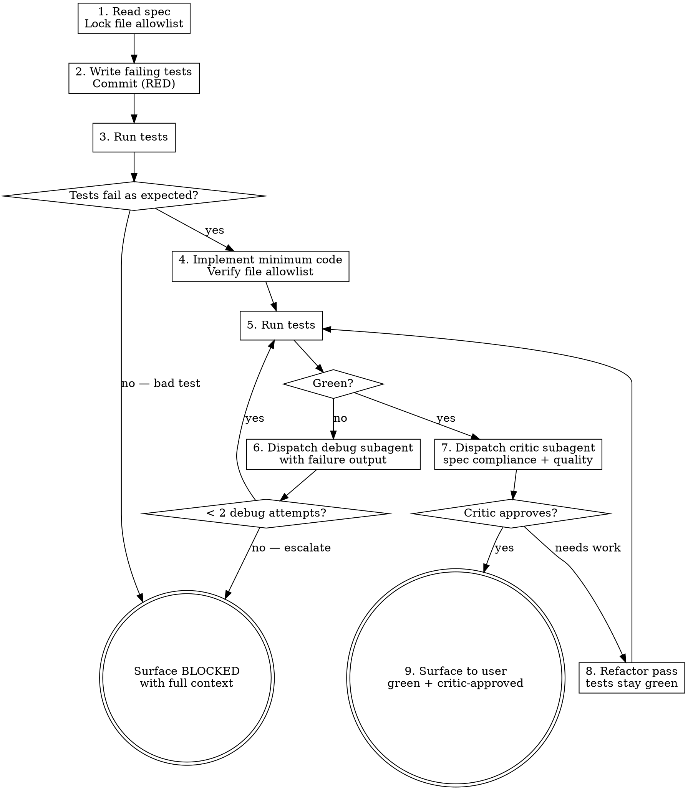

# TDD Loop

## Overview

Autonomous orchestrator for strict test-first development. Reads spec → writes failing tests → implements → debugs failures via subagent → runs critic review against the spec → refactors → reports. Hard file-gate prevents drift outside the planned file list. Surface to user only on green+critic-approved or genuine blocker.

**Core principle:** The user is the decision-maker, not the debugger. Failures get fixed by subagents working with the failure output. Drift gets caught by a critic, not by the user reading diffs.

**REQUIRED BACKGROUND:** `../_vendored/test-driven-development/SKILL.md` for the TDD discipline this skill enforces. `../_vendored/dispatching-parallel-agents/SKILL.md` for subagent contracts. `../_vendored/verification-before-completion/SKILL.md` for the green claim.

## When to Use

- Spec or ticket with clear acceptance criteria + a known test framework
- Feature small enough to hold the file list in your head (≤ 5 files)
- User explicitly wants autonomous execution

## When NOT to Use

- Spec is ambiguous → run `../refine/SKILL.md` first (it writes the spec where the epic survey reads it)
- Acceptance criteria undefined → write the spec first, don't guess
- No existing test infrastructure → set it up as a separate task
- Refactors with no behavior change → use a different workflow
- Cross-cutting changes touching > 5 files → decompose first

## The Loop



## Step Detail

### 1. Read spec, lock file allowlist

- Read the spec/ticket fully. Extract acceptance criteria as a bullet list.
- Determine the file list — every path you may modify (existing or new). New files marked `(new)`.
- Write the allowlist to `.tdd-loop/allowlist.txt` in the repo (gitignored). One path per line.
- Confirm test command for this codebase (e.g. `pytest`, `npm test`, `cargo test`).

### 2. Write failing tests first (RED)

- Tests express acceptance criteria, one test per criterion minimum.
- Tests reference the not-yet-existing function/module signatures from the spec.
- Commit on a branch `tdd/<slug>` with message `red: failing tests for <feature>`.

### 3. Run tests — must fail for the right reason

- New tests must fail with `NotImplementedError`, `ImportError`, `AssertionError` on missing behavior — NOT a syntax error or test framework misconfiguration.
- If tests don't fail, or fail for the wrong reason → STOP, surface BLOCKED.

### 4. Implement minimum code

- Smallest change that could plausibly turn tests green. No speculation, no premature abstraction.
- Run `bash "<suite_root>/skills/tdd-loop/file-gate.sh" .tdd-loop/allowlist.txt` after editing — it will exit non-zero if any out-of-allowlist file changed.

### 5. Run tests

- All previously-green tests must still pass.
- All RED tests must turn green.
- If green → step 7. If failing → step 6.

### 6. Debug via subagent (max 2 attempts)

- REQUIRED: use `../_vendored/dispatching-parallel-agents/SKILL.md` to dispatch a debug subagent.
- Hand the subagent: the failing test output (verbatim), the relevant source files, the allowlist, the spec.
- Subagent's instructions: diagnose root cause, propose minimal fix, modify only allowlist files, return the diff.
- After subagent returns: re-run tests + file-gate. If still failing, dispatch ONE more debug attempt with both failure outputs in context.
- After 2 failed attempts: STOP, surface BLOCKED with full debug history.

### 7. Critic subagent

- REQUIRED: use the prompt at `<suite_root>/skills/tdd-loop/critic-prompt.md`.
- Hand the critic: the spec, the full diff (`git diff main...HEAD`), the test output, the allowlist.
- Critic returns: APPROVED, or NEEDS WORK with specific issues (drift from spec, missing edge cases, quality problems).

### 8. Refactor (only if critic flagged issues)

- Address each critic issue. Re-run tests after every change — they must stay green.
- Re-run file-gate.
- Send refactored diff back to the critic. Repeat until APPROVED or 2 critic rounds (then surface BLOCKED).

### 9. Surface to user

Report includes:
- Branch name and commit list
- Test output (all green)
- Critic's APPROVED report
- Full diff
- Shipped checklist: pushed? deployed? verified live? docs updated?

## File Gate

Run after every implementation or refactor edit:

```bash
bash "<suite_root>/skills/tdd-loop/file-gate.sh" .tdd-loop/allowlist.txt
```

The script compares `git diff --name-only HEAD` against the allowlist. Exit 0 if all changed files are in allowlist. Exit non-zero with the offending paths otherwise.

If the gate fails, the loop STOPS — do not commit, do not proceed. Either:
- Revert the out-of-scope edit (preferred)
- Surface to user that the spec requires a wider allowlist (acceptable)

Never silently expand the allowlist mid-loop.

## Surface BLOCKED When

- RED test fails for the wrong reason (framework, import, syntax)
- 2 debug subagent attempts failed
- 2 critic rounds didn't reach APPROVED
- File gate would require expanding allowlist beyond the spec
- Acceptance criteria are ambiguous in a way that makes "done" undefined
- Any infrastructure failure (test runner won't start, deps missing)

When BLOCKED: report what was tried, what failed, and the recommended next decision the user needs to make.

## Stop Conditions (do not surface as success)

- Tests green but file gate failed → not done
- Tests green but critic flagged drift → not done
- Tests green but you skipped a debug or critic step → not done

Green + critic-approved + file-gate-clean is the only "done."

## Common Failures

| Failure | Cause | Mitigation |
|---------|-------|------------|
| Tests pass on first run | Wrote weak tests, or implementation snuck in | Tests MUST fail first — verify RED commit |
| Subagent expands allowlist | Didn't enforce file-gate in subagent contract | Make file-gate verification a required step in subagent prompt |
| Critic rubber-stamps | Critic prompt too vague | Use the structured critic prompt; don't paraphrase it |
| Loop runs forever | No attempt cap | Hard cap: 2 debug attempts, 2 critic rounds, then surface |
| Refactor breaks tests | Refactor without re-running tests | Re-run tests after every refactor edit, before next change |

## Project Defaults

When running on the configured project:
- Test command: the project's suite (e.g. `pytest` for a Python backend, `npm test` for a frontend) — from `test_commands` / project config
- Branch convention: `tdd/<slug>` off `<base-branch>`
- Push: REQUIRED at end — verify with `git log origin/<branch>`
- Deploy: only after PR merge — TDD loop produces the PR, doesn't deploy
- Lint: the repo's linter (e.g. `ruff check`) on touched files before commit
