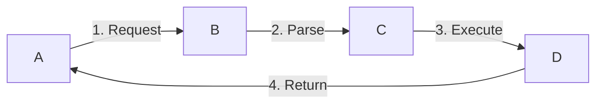

# Technical Blog Writing Skill

Write technical blog posts that explain system internals, architecture, and implementation details.

## When to Use

- Explaining system internals or implementation details
- Source code analysis and walkthrough
- Comparing different implementations or approaches
- Doc-driven architecture/comparison posts (no source code in scope)

## Document Structure

```markdown
# [Topic] Deep Dive

Brief intro + why it matters.
> **Code Version**: Based on [project] `vX.Y.Z` tag (or commit id for external repos).

## 1. Introduction (problem + scope)
## 2. Background / Prerequisites
## 3-N. Core Content (by data flow, not code structure)
## N+1. Comparison / Trade-offs
## N+2. Code Index (files, functions, line numbers)
## References
```

**Key guidelines**:
- Chapter 1 = Introduction + Navigation only, no implementation details
- Organize content by data flow, not by code components
- Use `> ⏭️ If reading first time, skip to §X, return here when needed.`

---

## Core Principles

### 1. Progressive Explanation
- Start with the problem, not the solution
- Build concepts layer by layer
- Explain "why" not just "what"

### 2. Concept-First (概念前置)
- **Never use undefined terms**: Define before use
- **Add concept sections**: Create §X.Y.1 to introduce concepts before implementation
- **Use navigation hints**: `> ⏭️ If unfamiliar with X, see §Y first`

### 3. Big Picture First (整体图景优先)
- Start with unified visual overview before details
- Use comparison diagrams/tables for 2+ approaches
- Show complete flow in one diagram

### 4. Balanced Comparison
- Analyze BOTH sides; don't cherry-pick
- Use comparison tables for similar concepts
- Identify what's truly different vs. equivalent

### 5. Design Decision Explanation
- What problem does it solve?
- What alternatives exist?
- What trade-offs?

### 6. Concrete Examples
- 1-2 practical examples per major section
- Show input → process → output
- Use real data for abstract concepts (e.g., inverted index with actual words)

### 7. Terminology Accuracy
- Verify terms via source code or official docs
- Define domain-specific terms when introducing
- Don't assume terms are interchangeable

---

## Research Strategy

### Source Code Exploration (MUST for project-specific details)
- Specific code logic, conditions, data structures
- Configuration parameters and defaults
- File paths and line numbers for citations
- Implementation variants (e.g., Wide vs Compact)

### Knowledge/Memory (OK for standard protocols)
- Standard syntax (ES DSL, HTTP, SQL)
- Well-known algorithms (B+ tree, inverted index)
- Public documentation content

### Doc-Driven Research (when no source code)
1. Extract claim list (defaults, limitations, "supports X")
2. Find authoritative sources (official docs → vendor blogs → community)
3. Cite at claim location: `（来源：[Label]）`
4. Use reference-style links: `[Label]: https://...`
5. Separate fact vs inference
6. Never fabricate numbers

> 💡 Don't search source code for info not in the project. Focus on project-specific implementation.

---

## Writing Guidelines

### Code Examples
- Include file path and line numbers
- Explain what it does, not just show it
- Replace large blocks with flow diagrams + key snippets
- Add practical query/command examples

### Diagrams (Prefer Mermaid)

**Use colors to distinguish components**:


**Color scheme**:
- 🔵 Blue (#e1f5fe): Client/Entry points
- 🟠 Orange (#fff3e0): Processing components
- 🟢 Green (#e8f5e9): Data/Storage
- 🔴 Pink (#fce4ec): Distributed execution

**Add step numbers for complex flows**:


### Tables
- Use for comparisons, performance data, component summaries

### Callouts
- 💡 **Key Point**: Critical insights
- ⚠️ **Gotcha**: Common mistakes
- 📝 **Terminology**: Definitions
- ⏭️ **Navigation**: Cross-references

---

## Hybrid Architecture Documentation

When documenting systems combining multiple technologies (e.g., ES + ClickHouse, Java + C++):

### 1. Clarify Component Responsibilities
- **Don't assume**: Each component's role may differ from standalone usage
- **Verify**: Which handles metadata? Query parsing? Distributed execution?
- **Document boundaries**: Where does one end and another begin?

**Example (TSearch = ES + ClickHouse)**:
- ES: Metadata management, DSL parsing, routing table
- ClickHouse: Data storage, distributed query execution
- ⚠️ Common mistake: Assuming RPC handles distributed execution

### 2. Communication Mechanism Evolution
- **Document history**: "Initially Thrift RPC, now migrating to JNI"
- **Current state**: Which interfaces use which mechanism?
- **Why the change**: Performance? Simplicity?

### 3. Data Flow Verification
Before writing, trace actual flow:
1. Where does request enter?
2. Which component parses it?
3. How is it transformed?
4. Which component executes?
5. How are results returned?

---

## Concept Consolidation (DRY)

When same concept appears in multiple sections:
1. Create ONE authoritative section
2. Other sections reference it: "See §3.1 for details"
3. Only add context-specific details elsewhere

**When to consolidate**: Same concept in 3+ sections, or updates require editing multiple places.

---

## Data Integrity

### NEVER Fabricate
- ❌ "Compression ratio is 16:1" (without test)
- ❌ "Query speed improved by 38%" (without benchmark)
- ✅ "LZ4 provides fast compression" (qualitative)
- ✅ "Based on [source], ratio is X:Y" (with citation)

### Requires Citation
- Specific compression ratios
- Performance benchmarks
- Memory usage numbers
- Any quantitative comparison

---

## Common Pitfalls

| Pitfall | Solution |
|---------|----------|
| Abrupt transitions | Add connection sentences |
| One-sided comparison | Use comparison tables |
| Code without context | Explain role in system |
| Too much source code | Use flow diagrams + key snippets |
| Undefined concepts | Add concept section before use |
| Missing big picture | Start with unified visual overview |
| Fabricated data | Use qualitative or cite sources |
| Assuming communication paths | Verify actual mechanisms for hybrid systems |
| Missing commit id | Always specify for external repos |
| Monotone diagrams | Use colors and step numbers |

---

## Large Document Operations

For documents >500 lines:
1. Create draft file: `[topic]-DRAFT.md`
2. Build new structure in draft
3. Review with user
4. Merge into original
5. Delete draft

---

## Verification Checklist

**Structure & Flow**:
- [ ] Sections flow naturally with transitions
- [ ] Summary-detail pattern with overview diagrams
- [ ] Concepts introduced before use

**Content Quality**:
- [ ] Code examples include file paths and line numbers
- [ ] Each section has concrete examples
- [ ] No fabricated data; all numbers cited
- [ ] Terminology verified against source

**Technical Accuracy**:
- [ ] Code version/commit id specified
- [ ] Hybrid architecture responsibilities verified
- [ ] Communication mechanisms documented

**Visual Clarity**:
- [ ] Diagrams use colors and step numbers
- [ ] Comparison tables for similar concepts
- [ ] Practical query/command examples included

---

## Output

- Location: `docs/`, `ai_docs/`, or project-specific folder
- Filename: `[topic-name].md`
- Language: Match user's preference
