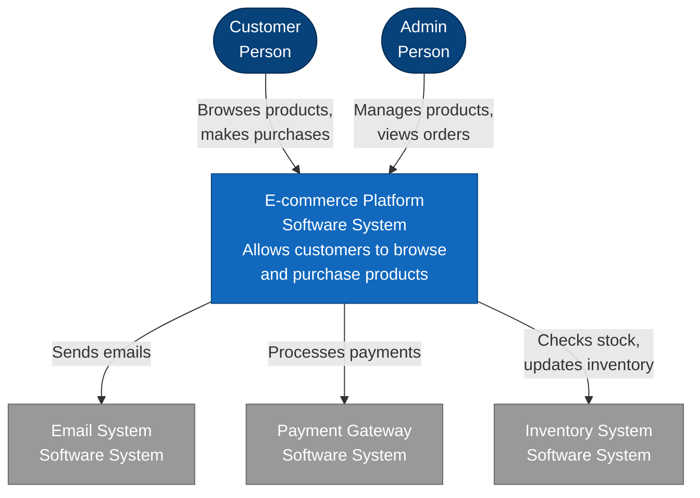
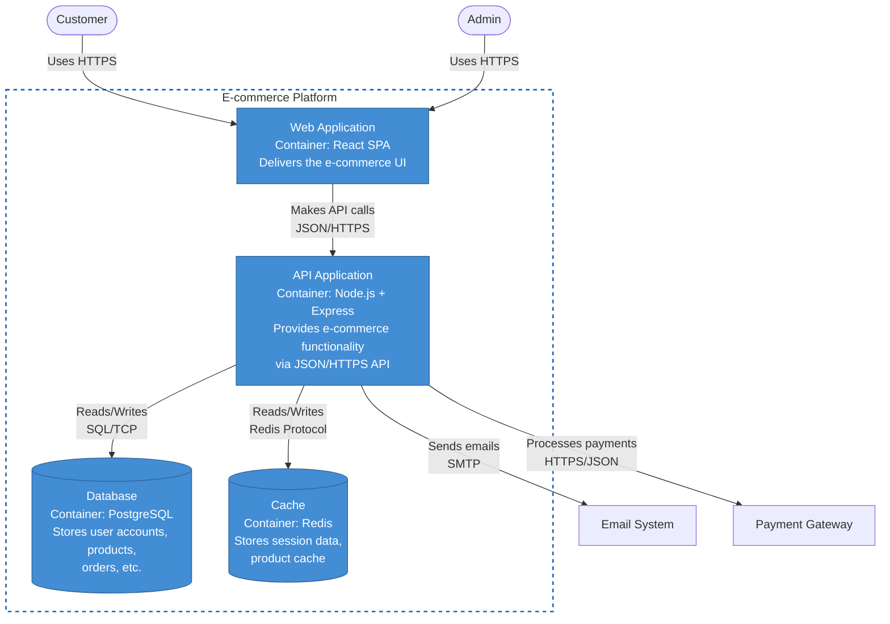
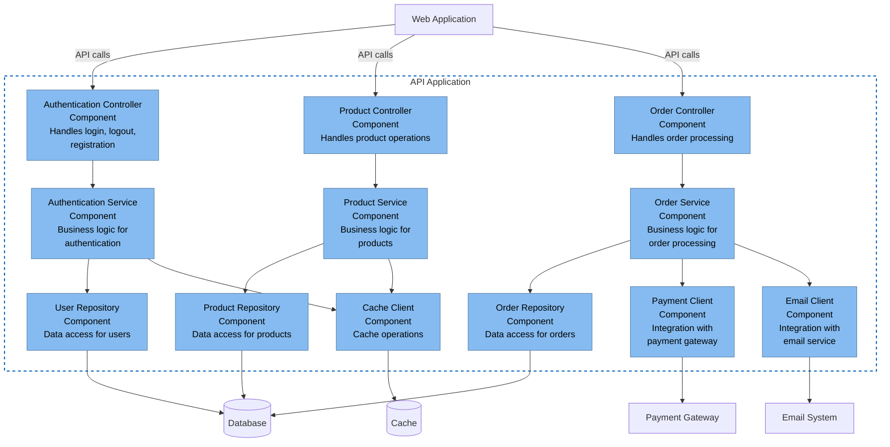
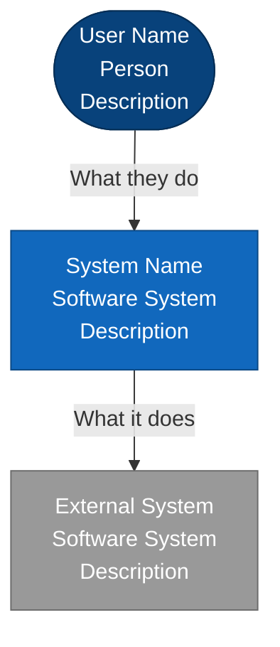
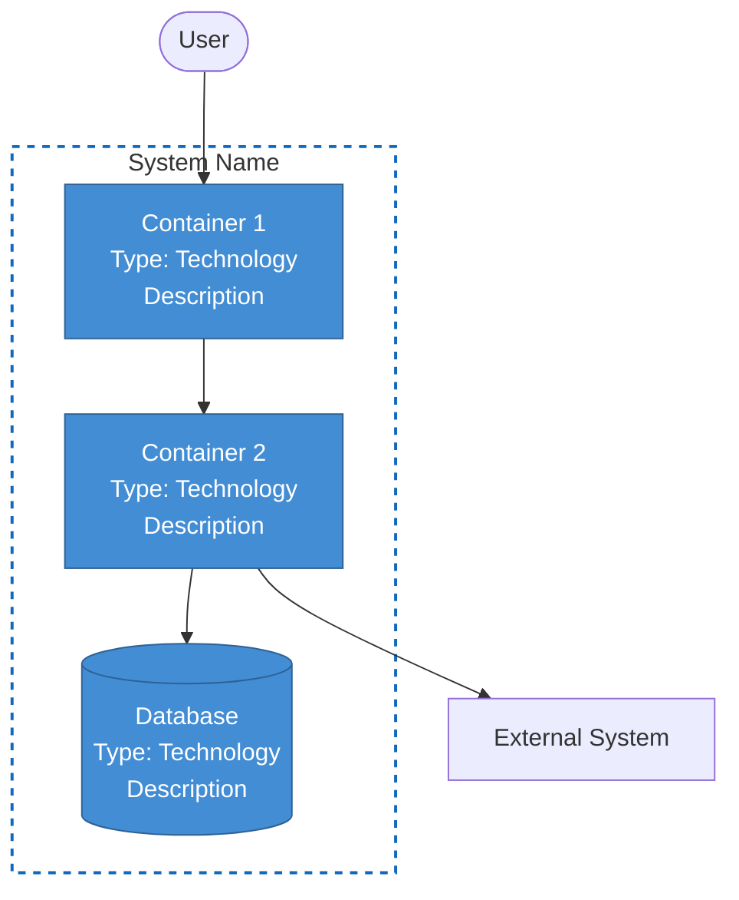
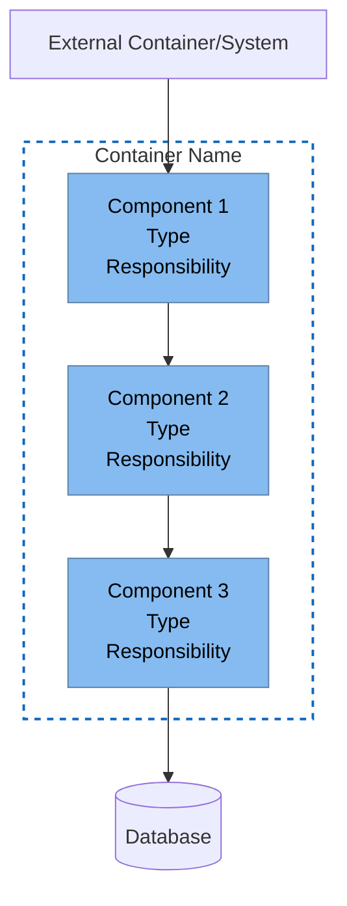

# C4 Model - Software Architecture Visualization & Documentation

## Purpose

Help developers and architects visualize and document software architecture using the C4 Model (Context, Container, Component, Code) with Mermaid diagrams. Transform abstract architecture into clear, actionable visual documentation at the appropriate level of detail.

## When to Use This Skill

- Documenting architecture for a new project or major feature
- Onboarding new team members to an existing codebase
- Planning a refactoring or redesign
- Communicating architecture to different audiences (technical and non-technical)
- Understanding an unfamiliar codebase
- Reviewing or auditing system design
- Creating technical documentation that stays current

## Core Concept

The C4 Model uses hierarchical "maps" of your software system, like Google Maps for code:

- **Level 1 (Context)**: Zoomed out - 10,000 foot view (system + users + external systems)
- **Level 2 (Container)**: Applications and data stores that make up the system
- **Level 3 (Component)**: Major building blocks within each container
- **Level 4 (Code)**: Classes and interfaces (usually skip this, use IDE instead)

**Key insight**: Different audiences need different zoom levels. Start broad, zoom in only where needed.

## The Four Levels Explained

### Level 1: System Context Diagram

**Purpose**: Show your system in its environment - the big picture

**Audience**: Everyone (developers, managers, stakeholders, users)

**Shows**:

- Your system (one box)
- People who use it (personas/roles)
- Other systems it integrates with
- High-level relationships

**When to create**:

- Starting a new project
- Explaining what your system does to non-technical stakeholders
- Identifying integration points
- Scoping a project

**Example - E-commerce System Context:**



**Documentation Template:**

```markdown
# System Context - [System Name]

## Overview

[1-2 paragraph description of what the system does and why it exists]

## Users

- **[User Type 1]**: [What they do with the system]
- **[User Type 2]**: [What they do with the system]

## External Systems

- **[System 1]**: [How we integrate, what data flows]
- **[System 2]**: [How we integrate, what data flows]

## Key Interactions

1. [User/System] → [Your System]: [What happens]
2. [Your System] → [External System]: [What happens]
```

### Level 2: Container Diagram

**Purpose**: Show the high-level technology choices and how they interact

**Audience**: Technical team, architects, senior developers

**Shows**:

- Applications (web apps, APIs, mobile apps)
- Data stores (databases, caches, file storage)
- How containers communicate
- Technology choices (Node.js, PostgreSQL, React, etc.)

**When to create**:

- Designing system architecture
- Planning deployment strategy
- Understanding technology stack
- Identifying scaling bottlenecks

**Example - E-commerce Container Diagram:**



**Documentation Template:**

```markdown
# Container Diagram - [System Name]

## Containers

### [Container 1 Name]

- **Type**: [Web App / API / Database / etc.]
- **Technology**: [Specific tech stack]
- **Responsibilities**:
  - [What it does 1]
  - [What it does 2]
- **Deployed**: [Where/how it's deployed]

### [Container 2 Name]

[Same structure]

## Communication Patterns

- **[Container A] → [Container B]**: [Protocol, what data, why]
- **[Container B] → [Container C]**: [Protocol, what data, why]

## Technology Decisions

- **[Technology 1]**: [Why we chose it, what problem it solves]
- **[Technology 2]**: [Why we chose it, what problem it solves]

## Deployment Notes

[How containers are deployed, scaling considerations]
```

### Level 3: Component Diagram

**Purpose**: Show the major building blocks within a container

**Audience**: Developers working on that specific container

**Shows**:

- Components (groups of related functionality)
- Component responsibilities
- Dependencies between components
- Which components talk to external systems

**When to create**:

- Designing a new container's internal structure
- Planning a refactoring within a container
- Onboarding developers to a specific service
- Identifying coupling and cohesion issues

**Example - API Application Component Diagram:**



**Documentation Template:**

```markdown
# Component Diagram - [Container Name]

## Components

### [Component 1 Name]

- **Type**: [Controller / Service / Repository / Client / etc.]
- **Responsibilities**:
  - [Specific responsibility 1]
  - [Specific responsibility 2]
- **Dependencies**:
  - Uses [Component X] for [reason]
  - Uses [Component Y] for [reason]
- **Location**: [Package/folder path]

### [Component 2 Name]

[Same structure]

## Design Patterns

- **[Pattern 1]**: [Where used, why]
- **[Pattern 2]**: [Where used, why]

## Key Interactions

1. **[Flow 1]**: [Component A] → [Component B] → [Component C]
   - [What happens at each step]
2. **[Flow 2]**: [Similar description]

## Component Responsibilities Matrix

| Component      | Handles HTTP | Business Logic | Data Access | External Integration |
| -------------- | ------------ | -------------- | ----------- | -------------------- |
| [Controllers]  | ✓            |                |             |                      |
| [Services]     |              | ✓              |             |                      |
| [Repositories] |              |                | ✓           |                      |
| [Clients]      |              |                |             | ✓                    |
```

### Level 4: Code Diagram (Often Skipped)

**Purpose**: Show classes, interfaces, and their relationships

**Audience**: Individual developers

**When to create**:

- Almost never - your IDE does this better
- Only for particularly complex algorithms or patterns
- When documenting a reusable library's API

**Why skip it**:

- Too detailed to maintain
- Changes too frequently
- IDEs show this information better
- Code is the source of truth

**Alternative**: Use IDE features like class diagrams, call hierarchies, and type hierarchies instead.

## Decision Framework: Which Level to Create?

### Start with Level 1 (Context) if:

- [ ] Explaining the system to non-technical stakeholders
- [ ] Starting a new project
- [ ] Identifying all integration points
- [ ] Creating an overview for new team members

### Add Level 2 (Container) if:

- [ ] Making deployment decisions
- [ ] Choosing technology stack
- [ ] Planning scaling strategy
- [ ] Understanding system-wide data flow
- [ ] Multiple teams working on different parts

### Add Level 3 (Component) for:

- [ ] Individual containers with >3 developers
- [ ] Complex business logic requiring clear separation
- [ ] Refactoring existing code
- [ ] Onboarding to a specific service
- [ ] Identifying tight coupling

### Skip Level 4 (Code) unless:

- [ ] Documenting a reusable library's API
- [ ] Extremely complex algorithm that needs visual explanation
- [ ] You have a very specific reason (rare)

## Mermaid Syntax Reference

### Basic C4-Style Mermaid Template



### Container Diagram Template



### Component Diagram Template



## Color Coding Best Practices

**C4 Model Standard Colors:**

```
People:           Blue (#08427b)
Your System:      Dark Blue (#1168bd)
Your Containers:  Medium Blue (#438dd5)
Your Components:  Light Blue (#85bbf0)
External Systems: Grey (#999999)
Databases:        Same as container level
```

**Mermaid Style Format:**

```mermaid
style ElementName fill:#colorcode,stroke:#strokecolor,color:#textcolor
```
