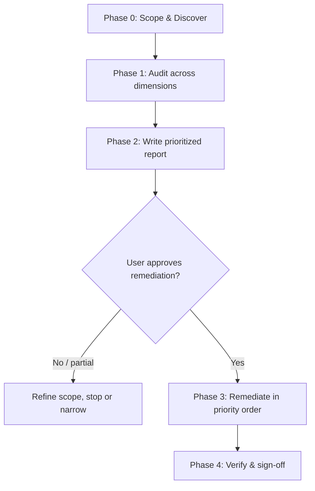

# Production Readiness Review

A generic, stack-agnostic workflow for taking a SaaS project from "it works on my
machine" to **production-grade**. It performs a structured audit across every
dimension that matters at scale, then delivers a prioritized report. Fixes are
**only** applied after the user approves.

## Golden rule: Report first, remediate second

> **Never start changing code during the audit.** The audit is read-only.
> Produce the report, present it, and wait for explicit approval before making
> any change. When the user approves, remediate in priority order and verify
> each fix.

This two-phase contract is the whole point of the skill. Respect it even if the
user seems impatient — a good report saves far more time than premature fixes.

---

## When to use this skill

Trigger on requests like:

- "Do a final check on my project before we launch."
- "Make this SaaS production-grade / production-ready."
- "Audit my app for security and scalability."
- "Harden this codebase" / "pre-launch review" / "readiness assessment."
- "Is this ready to ship to real users?"
- "Optimize my tests / performance / infrastructure for production."

If the user only asks about a single narrow topic (e.g. "add rate limiting"),
you can jump straight to the relevant reference — but still offer the full review.

---

## The workflow



### Phase 0 — Scope & discover (read-only)

Before auditing, understand what you are looking at. Do **not** assume a stack.

1. **Detect the stack & topology.** Inspect manifests and configs to identify
   languages, frameworks, datastores, infra, and deployment target. Useful signals:
   - `package.json`, `requirements.txt`, `pyproject.toml`, `go.mod`, `pom.xml`,
     `build.gradle`, `Gemfile`, `composer.json`, `Cargo.toml`, `*.csproj`
   - `Dockerfile`, `docker-compose.yml`, `k8s/`, `helm/`, `terraform/`, `*.tf`
   - `.github/workflows/`, `.gitlab-ci.yml`, `Jenkinsfile`, `.circleci/`
   - `.env*`, config directories, migration folders, IaC state
2. **Map the architecture.** Entry points, services, external dependencies,
   datastores, background workers, third-party APIs, tenancy model.
3. **Establish context & constraints.** Ask the user (only if unknown and it
   materially changes recommendations):
   - Expected scale / traffic and growth expectations
   - Compliance requirements (SOC 2, GDPR, HIPAA, PCI, etc.)
   - Team size / on-call maturity
   - Deploy target (serverless, containers, VMs, PaaS) and cloud
   - Timeline / risk appetite for launch

Every SaaS is different — monolith or microservices, serverless or containers,
one datastore or many. **Do not assume an architecture.** Adapt the depth and
which dimensions apply to what you actually find. Keep discovery proportionate:
for a small app a quick pass is fine; for a large monorepo, spend more time
mapping before auditing.

### Phase 1 — Audit across dimensions (read-only)

Work through the dimensions below. For each, load the matching reference file
for the detailed checklist, "how to verify", and common fixes. You do **not**
need every reference every time — pick the ones relevant to the stack, but do
not silently skip security, reliability, or observability.

| # | Dimension | Reference |
|---|-----------|-----------|
| 1 | Security & multi-tenancy | [references/security.md](references/security.md) |
| 2 | Reliability & resilience | [references/reliability.md](references/reliability.md) |
| 3 | Scalability & performance | [references/scalability.md](references/scalability.md) |
| 4 | Testing & quality | [references/testing.md](references/testing.md) |
| 5 | Observability | [references/observability.md](references/observability.md) |
| 6 | Data & database | [references/data-database.md](references/data-database.md) |
| 7 | API design | [references/api-design.md](references/api-design.md) |
| 8 | CI/CD & release | [references/ci-cd-release.md](references/ci-cd-release.md) |
| 9 | Infrastructure & config | [references/infrastructure-config.md](references/infrastructure-config.md) |
| 10 | Cost optimization | [references/cost-optimization.md](references/cost-optimization.md) |
| 11 | Compliance & privacy | [references/compliance-privacy.md](references/compliance-privacy.md) |
| 12 | Frontend & UX quality | [references/frontend-ux.md](references/frontend-ux.md) |

For each finding, capture: **what**, **where** (file:line), **why it matters**,
**severity**, **effort**, and a concrete **recommended fix**.

### Phase 2 — Write the prioritized report

Use [templates/audit-report.md](templates/audit-report.md) as the structure.
The report must include:

- **Executive summary** — overall readiness verdict + top risks in plain language.
- **Readiness scorecard** — a rating per dimension (see rubric below).
- **Findings** — grouped by dimension, each with severity, effort, evidence, fix.
- **Prioritized remediation plan** — ordered by the priority rubric, grouped
  into "Must fix before launch", "Should fix soon", "Nice to have".
- **Quick wins** — high-impact, low-effort items called out explicitly.

Full production-readiness checklist to cross-check against:
[references/production-readiness-checklist.md](references/production-readiness-checklist.md).

### Phase 3 — Remediate (ONLY after explicit approval)

1. Restate the agreed scope (which items, in which order).
2. Work in **priority order**, smallest safe increments first.
3. After each meaningful change: run relevant tests/linters/build and confirm
   green before moving on.
4. Prefer reversible, well-scoped changes. For risky changes (migrations, auth,
   infra), explain the blast radius and confirm before proceeding.
5. Never bypass safety controls (no `--no-verify`, no disabling tests to make
   CI pass, no committing secrets). See guardrails below.
6. Keep the report updated: mark items done, note anything deferred.

### Phase 4 — Verify & sign-off

- Re-run the full test suite, linters, type checks, and build.
- Re-walk the checklist to confirm the addressed findings are resolved.
- Summarize what changed, what remains, and residual risk.
- Provide a short "go / no-go" recommendation and any follow-up backlog.

---

## Severity & prioritization rubric

Rate every finding on two axes, then prioritize.

**Severity**

| Severity | Meaning |
|----------|---------|
| 🔴 Critical | Exploitable vulnerability, data loss/leak, outage risk, or legal exposure. Blocks launch. |
| 🟠 High | Serious risk that will likely cause incidents or breaches under real load. Fix before/near launch. |
| 🟡 Medium | Degrades reliability, performance, or maintainability; not an immediate blocker. |
| 🟢 Low | Polish, hygiene, or nice-to-have. |

**Effort:** S (hours) · M (1–3 days) · L (multi-day / cross-team).

**Priority = Severity first, then lowest effort.** Always surface "quick wins"
(High/Critical impact + Small effort) at the top of the plan.

**Readiness scorecard rating per dimension:** `A` solid · `B` minor gaps ·
`C` notable gaps · `D` serious gaps · `F` not production-ready.

---

## Guardrails

- **Audit phase is strictly read-only.** No edits until approval.
- **Never introduce or expose secrets.** Flag hardcoded secrets as Critical;
  recommend rotation, never print full secret values.
- **No security theater.** Don't suppress warnings, delete failing tests, or add
  `# nosec`/`eslint-disable` to silence real findings.
- **Right-size recommendations.** A 3-person startup and a regulated enterprise
  need different rigor. Match advice to the user's scale and constraints; avoid
  over-engineering.
- **Evidence over assertion.** Cite file:line for findings. If you can't verify
  something, mark it "needs verification" rather than guessing.
- **Destructive/irreversible changes need explicit confirmation** (DB migrations,
  deleting resources, force-push, infra changes).

---

## Repository layout

```
SKILL.md                    ← this file (entry point + workflow)
references/                 ← detailed, load-on-demand playbooks
  security.md
  reliability.md
  scalability.md
  testing.md
  observability.md
  data-database.md
  api-design.md
  ci-cd-release.md
  infrastructure-config.md
  cost-optimization.md
  compliance-privacy.md
  frontend-ux.md
  production-readiness-checklist.md
templates/
  audit-report.md           ← report structure to fill in
  remediation-plan.md        ← standalone plan template
```

Everything is plain Markdown — no scripts, no tooling to install, no assumptions
about your stack. The skill works by reading and reasoning, so it adapts to any
SaaS architecture.
