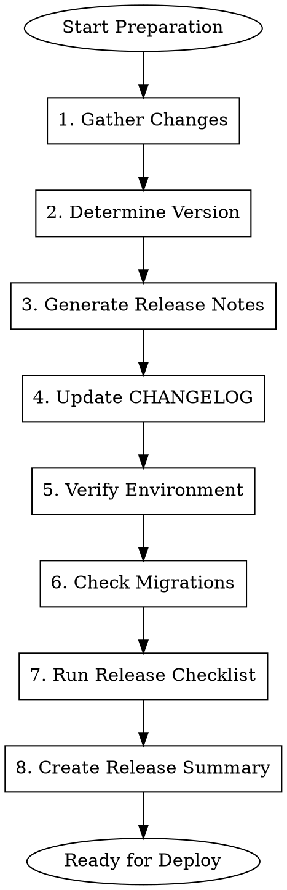

# Gmacko Release Preparation

Prepare release artifacts including changelog, release notes, and environment verification.

## When to Use

- QA verification is complete (APPROVED)
- Ready to deploy to staging or production
- Need to generate release notes
- Cutting a new version

## Prerequisites

- QA handoff exists and is APPROVED
- All related PRs are merged
- Branch is ready for deployment

## Workflow



## Execution Steps

### Step 1: Gather Changes

Collect all changes since last release:

```bash
# Get last release tag
LAST_TAG=$(git describe --tags --abbrev=0 2>/dev/null || echo "")

# List commits since last release
if [ -n "$LAST_TAG" ]; then
    git log ${LAST_TAG}..HEAD --oneline --no-merges
else
    git log --oneline -20
fi

# List merged PRs
gh pr list --state merged --limit 20 --json number,title,labels
```

Categorize changes:
- **Features**: New functionality
- **Fixes**: Bug fixes
- **Improvements**: Enhancements
- **Breaking**: Breaking changes
- **Docs**: Documentation updates
- **Chores**: Maintenance/tooling

### Step 2: Determine Version

Follow semantic versioning:

```
MAJOR.MINOR.PATCH

MAJOR: Breaking changes
MINOR: New features (backwards compatible)
PATCH: Bug fixes (backwards compatible)
```

Ask user:
> Based on the changes, I recommend version **[X.Y.Z]**.
>
> Changes include:
> - [N] new features
> - [N] bug fixes
> - [N] breaking changes
>
> Is this version correct, or would you like to specify?

### Step 3: Generate Release Notes

Create release notes:

```markdown
# Release Notes: v[X.Y.Z]

**Release Date**: [YYYY-MM-DD]
**Environment**: [staging/production]

## Highlights

[1-2 sentence summary of the most important changes]

## What's New

### Features
- **[Feature Name]**: [Brief description] (#123)
- **[Feature Name]**: [Brief description] (#124)

### Improvements
- [Improvement description] (#125)

### Bug Fixes
- Fixed [issue description] (#126)
- Fixed [issue description] (#127)

## Breaking Changes

[If any, describe migration steps]

## Dependencies

- Updated [package] from X to Y
- Added [new package] for [purpose]

## Contributors

- @username
- @username

## Full Changelog

[Link to compare: previous...current]
```

### Step 4: Update CHANGELOG

Update `CHANGELOG.md` (if it exists) or `docs/ai/CHANGELOG.md`:

```markdown
## [X.Y.Z] - YYYY-MM-DD

### Added
- Feature description (#123)

### Changed
- Change description (#124)

### Fixed
- Fix description (#125)

### Removed
- Removal description (#126)
```

### Step 5: Verify Environment

Check target environment is ready:

```bash
# For Vercel (web)
vercel env ls --environment production

# Check required env vars are set
REQUIRED_VARS=(
    "DATABASE_URL"
    "CLERK_SECRET_KEY"
    "NEXT_PUBLIC_CLERK_PUBLISHABLE_KEY"
)

for var in "${REQUIRED_VARS[@]}"; do
    vercel env ls --environment production | grep -q "$var" && \
        echo "OK: $var" || echo "MISSING: $var"
done
```

For mobile (EAS):
```bash
# Check EAS configuration
eas config --platform ios
eas config --platform android

# Verify credentials
eas credentials --platform ios
eas credentials --platform android
```

### Step 6: Check Migrations

If database changes are included:

```markdown
## Migration Check

### Pending Migrations
- [ ] `20250105_add_feature_table.sql`

### Migration Plan
1. Backup production database
2. Apply migration in staging first
3. Verify data integrity
4. Apply to production during low-traffic window

### Rollback Plan
```sql
-- Rollback script
DROP TABLE IF EXISTS new_table;
ALTER TABLE existing_table DROP COLUMN new_column;
```

### Data Impact
- Rows affected: ~[N]
- Estimated duration: [X] seconds
- Downtime required: No
```

### Step 7: Run Release Checklist

Use the release checklist from `docs/ai/checklists/release-checklist.md`:

```markdown
## Pre-Release Checklist

### Code Quality
- [ ] All PRs merged
- [ ] `pnpm typecheck` passes
- [ ] `pnpm lint` passes
- [ ] `pnpm build` succeeds

### Testing
- [ ] QA verification complete
- [ ] No blocking issues
- [ ] Regression tests passed

### Documentation
- [ ] Release notes written
- [ ] CHANGELOG updated
- [ ] Migration guide ready (if needed)

### Environment
- [ ] Env vars configured
- [ ] Third-party services ready
- [ ] SSL certificates valid
```

### Step 8: Create Release Summary

Write `docs/ai/releases/[date]-v[version].md`:

```markdown
# Release: v[X.Y.Z]

## Metadata
- **Version**: X.Y.Z
- **Date**: YYYY-MM-DD
- **Tag**: v[X.Y.Z]
- **Prepared by**: AI Assistant

## Status
- [ ] Staging deployed
- [ ] Staging verified
- [ ] Production deployed
- [ ] Production verified

## Changes Summary

| Type | Count |
|------|-------|
| Features | X |
| Fixes | Y |
| Improvements | Z |

### Key Changes
1. [Most important change]
2. [Second most important]
3. [Third most important]

## PRs Included
- #123: [Title]
- #124: [Title]
- #125: [Title]

## Issues Closed
- #100: [Title]
- #101: [Title]

## Environment Verification
- [x] Production env vars set
- [x] Database migrations ready
- [x] Third-party services configured

## Deployment Commands

### Web (Vercel)
```bash
# Automatic via git push to main
git push origin main

# Or manual
vercel --prod
```

### Mobile (EAS)
```bash
# Build
eas build --platform all --profile production

# Submit
eas submit --platform ios
eas submit --platform android
```

## Rollback Plan

### Web
```bash
vercel rollback
```

### Database
```bash
# Run rollback migration
pnpm db:rollback
```

## Post-Deployment
- [ ] Smoke test production
- [ ] Monitor Sentry for errors
- [ ] Check analytics events
- [ ] Update status page

---

**Prepared by**: AI Assistant
**Approved by**: [Pending]
```

## Output

Present summary to user:

```
RELEASE PREPARATION COMPLETE
============================

Version: v[X.Y.Z]
Changes: [N] features, [N] fixes, [N] improvements
Breaking Changes: [Yes/No]

Artifacts Created:
- docs/ai/releases/[date]-v[version].md
- Release notes (ready for GitHub release)
- CHANGELOG updated

Environment Status:
- Web (Vercel): READY
- Mobile (EAS): READY
- Database: [N] pending migrations

Next Steps:
1. Review release summary
2. Run `gmacko-release-deploy-web` for Vercel deployment
3. Run `gmacko-release-deploy-mobile` for EAS builds (if applicable)

Proceed with deployment?
```

## Red Flags

| Rationalization | Correction |
|-----------------|------------|
| "Skip env verification, it worked before" | ALWAYS verify environment for each release |
| "No migrations, skip that section" | Document "no migrations" explicitly |
| "Changelog can be updated later" | Update changelog BEFORE deploying |
| "Just push to main, Vercel handles it" | Follow full preparation process |

## Integration

- **Input**: Version number (or auto-determine), target environment
- **References**: QA handoffs, merged PRs, git history
- **Output**: Release summary, changelog updates, release notes
- **Next**: `gmacko-release-deploy-web` or `gmacko-release-deploy-mobile`
