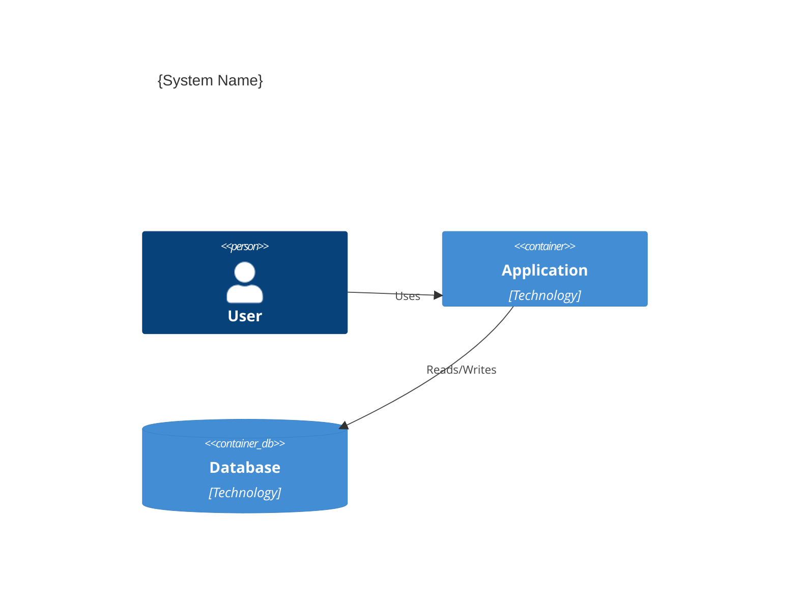

# Architecture Documentation Skill

## Purpose
Generate architecture documentation in standard formats including ADRs, C4 diagrams, and technical specifications with consistent structure and quality.

---

## Parameters

| Parameter | Type | Required | Validation | Default |
|-----------|------|----------|------------|---------|
| `doc_type` | enum | ✅ | adr\|c4\|sequence\|overview | - |
| `context` | string | ✅ | min: 20 chars | - |
| `format` | enum | ⚪ | markdown\|mermaid\|plantuml | `markdown` |
| `audience` | enum | ⚪ | technical\|executive\|mixed | `technical` |
| `detail_level` | enum | ⚪ | overview\|detailed | `detailed` |

---

## Execution Flow

```
┌──────────────────────────────────────────────────────────┐
│ 1. VALIDATE: Check doc_type and context                   │
│ 2. SELECT: Choose appropriate template                    │
│ 3. GATHER: Extract relevant information                   │
│ 4. GENERATE: Create documentation content                 │
│ 5. FORMAT: Apply output format (Mermaid, etc.)           │
│ 6. VALIDATE: Check completeness and consistency           │
│ 7. RETURN: Deliver formatted document                     │
└──────────────────────────────────────────────────────────┘
```

---

## Retry Logic

| Error | Retry | Backoff | Max Attempts |
|-------|-------|---------|--------------|
| `TEMPLATE_ERROR` | Yes | 1s | 2 |
| `VALIDATION_FAILED` | No | - | 1 |
| `FORMAT_ERROR` | Yes | 500ms | 3 |

---

## Logging & Observability

```yaml
log_points:
  - event: doc_generation_started
    level: info
    data: [doc_type, format]
  - event: doc_generation_complete
    level: info
    data: [doc_type, size_bytes, completeness_score]
  - event: validation_warning
    level: warn
    data: [missing_sections]

metrics:
  - name: docs_generated
    type: counter
    labels: [doc_type]
  - name: generation_time_ms
    type: histogram
  - name: completeness_score
    type: gauge
```

---

## Error Handling

| Error Code | Description | Recovery |
|------------|-------------|----------|
| `E101` | Missing context | Request system/decision context |
| `E102` | Invalid doc_type | Show available doc types |
| `E103` | Inconsistent content | Flag for review |
| `E104` | Diagram syntax error | Validate and fix Mermaid/PlantUML |

---

## Unit Test Template

```yaml
test_cases:
  - name: "Generate ADR"
    input:
      doc_type: "adr"
      context: "Choosing PostgreSQL for user data"
      format: "markdown"
    expected:
      contains: ["## Status", "## Decision", "## Consequences"]
      valid_markdown: true

  - name: "Generate C4 Container Diagram"
    input:
      doc_type: "c4"
      context: "E-commerce platform with React, Node.js, PostgreSQL"
      format: "mermaid"
    expected:
      contains: ["C4Container", "Container(", "Rel("]
      valid_mermaid: true

  - name: "Invalid doc_type"
    input:
      doc_type: "invalid"
    expected:
      error_code: "E102"
```

---

## Troubleshooting

### Common Issues

| Symptom | Root Cause | Resolution |
|---------|------------|------------|
| Incomplete ADR | Missing decision context | Add context, alternatives |
| Diagram won't render | Syntax error | Validate Mermaid syntax |
| Wrong audience level | Mismatched detail | Adjust detail_level param |

### Debug Checklist
```
□ Is doc_type supported?
□ Is context sufficient for doc type?
□ Is format appropriate for target?
□ Are all required sections present?
□ Is Mermaid/PlantUML syntax valid?
```

---

## Templates

### ADR Template
```markdown
# ADR-{NUMBER}: {TITLE}

## Status
{Proposed | Accepted | Deprecated | Superseded}

## Context
{Problem description}

## Decision
{What was decided}

## Consequences
### Positive
- {Benefit}
### Negative
- {Trade-off}
```

### C4 Container Template


---

## Integration

| Component | Trigger | Data Flow |
|-----------|---------|-----------|
| Agent 02 | Doc request | Receives context, returns formatted doc |
| Agent 01 | ADR trigger | Receives decision for documentation |

---

## Quality Standards

- **Complete:** All required sections populated
- **Consistent:** Follows standard templates
- **Current:** Reflects actual system state

---

## Version History

| Version | Date | Changes |
|---------|------|---------|
| 2.0.0 | 2025-01 | Production-grade: templates, tests, validation |
| 1.0.0 | 2024-12 | Initial release |
