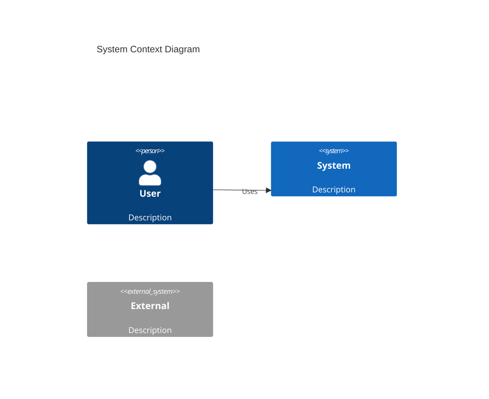
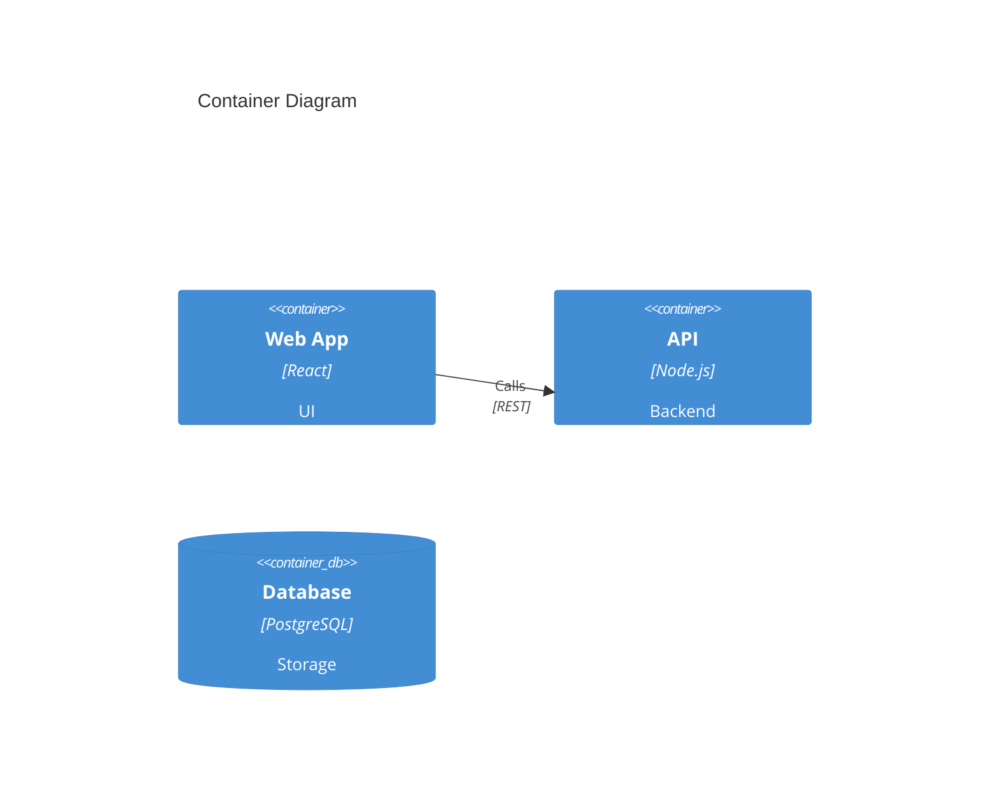

# C4 Modeling Skill

Create hierarchical architecture diagrams at four abstraction levels using the C4 model and Mermaid syntax.

## Variables

| Variable | Default | Description |
|----------|---------|-------------|
| DEFAULT_LEVEL | context | Start with `context`, `container`, `component`, or `code` |
| OUTPUT_FORMAT | mermaid | `mermaid`, `structurizr`, `plantuml` |
| INCLUDE_LEGEND | true | Add legend to diagrams |

## Instructions

**MANDATORY** - Follow the Workflow steps below when creating C4 diagrams.

- Always start at Level 1 (Context) and zoom in as needed
- Never mix abstraction levels in a single diagram
- Include descriptions for all elements

## Red Flags - STOP and Reconsider

If you're about to:
- Create a container diagram without first creating a context diagram
- Mix containers and components in the same diagram
- Show implementation details at the context level
- Create a code-level diagram for non-critical code

**STOP** -> Check the appropriate level guidelines in `reference/level-guidelines.md` -> Then proceed

## Workflow

1. [ ] Determine the audience and purpose
2. [ ] **CHECKPOINT**: Start at Level 1 (Context) unless you have higher-level diagrams
3. [ ] Identify all actors and systems at current level
4. [ ] Define relationships with labeled arrows
5. [ ] Add technology choices (for Level 2+)
6. [ ] **CHECKPOINT**: Verify you haven't mixed abstraction levels
7. [ ] Include descriptions for clarity

## C4 Levels

| Level | Name | Purpose | Audience |
|-------|------|---------|----------|
| 1 | Context | System in environment | Everyone |
| 2 | Container | Major components | Technical stakeholders |
| 3 | Component | Internal structure | Developers |
| 4 | Code | Implementation | Developers (sparingly) |

## Quick Reference

### Level 1: Context

Show: System, users, external systems
Hide: Internal details, databases, technology

### Level 2: Container

Show: Applications, APIs, databases, queues
Hide: Internal structure, classes

### Level 3: Component

Show: Modules, services, repositories
Hide: Individual classes, functions

### Level 4: Code

Show: Classes, interfaces, key abstractions
Use: Only for complex/critical areas

See `reference/level-guidelines.md` for detailed guidance.
See `reference/mermaid-syntax.md` for Mermaid C4 syntax.

## Mermaid Quick Syntax

See `reference/mermaid-syntax.md` for complete syntax reference.

## Output

Diagrams should include:
1. Title indicating level and system
2. All relevant elements with descriptions
3. Labeled relationships
4. Technology choices (Level 2+)
5. Clear boundaries for grouping
