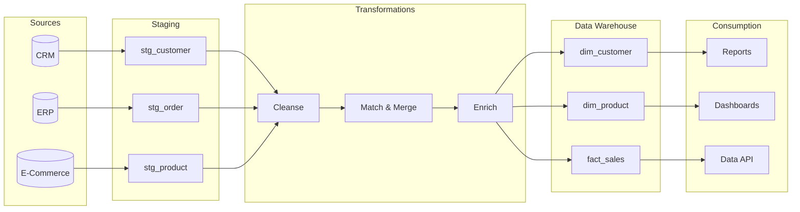
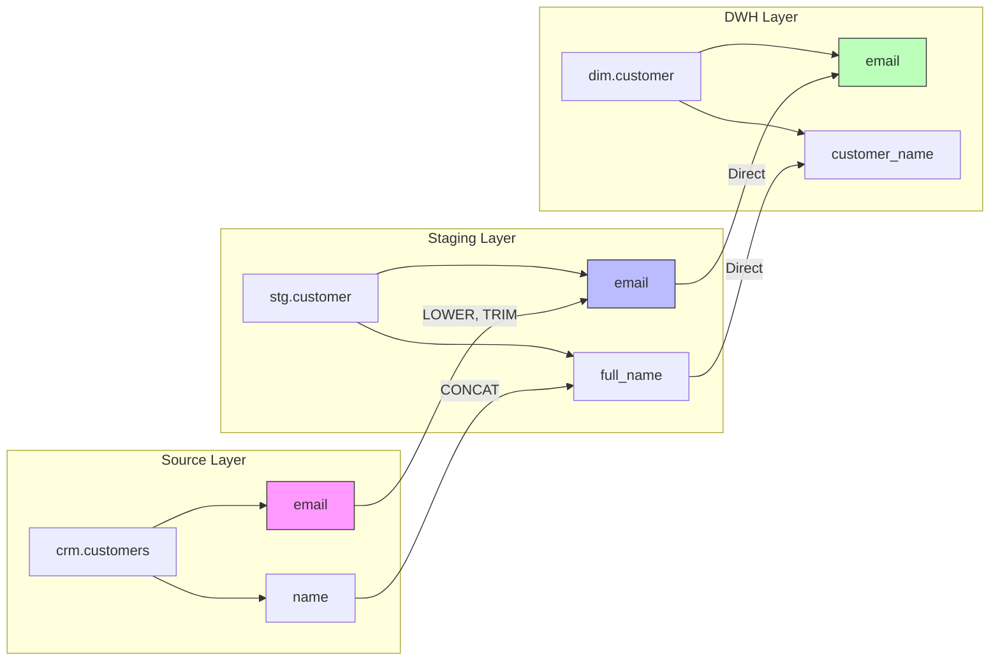

# Data Lineage Documentation

## When to Use This Skill

Use this skill when:

- **Data Lineage tasks** - Working on document data flow, transformation lineage, and impact analysis for traceability and compliance
- **Planning or design** - Need guidance on Data Lineage approaches
- **Best practices** - Want to follow established patterns and standards

## Overview

Data lineage tracks data from origin to destination, documenting every transformation along the way. Essential for impact analysis, debugging, compliance, and trust in data.

## Lineage Types

### Lineage Granularity

| Level | Description | Use Case |
|-------|-------------|----------|
| Dataset | Table/file level relationships | High-level architecture |
| Column | Field-level mappings | Detailed impact analysis |
| Cell | Record-level tracking | Audit trails |
| Business | Logical concept flow | Business understanding |

### Lineage Diagram

```text
SOURCE-TO-TARGET LINEAGE
┌──────────────────────────────────────────────────────────────────┐
│                                                                   │
│  ┌─────────┐    ┌─────────────┐    ┌─────────┐    ┌───────────┐ │
│  │  CRM    │───►│   STAGING   │───►│  DWH    │───►│  REPORTS  │ │
│  │ System  │    │   Tables    │    │  Facts  │    │   & BI    │ │
│  └─────────┘    └─────────────┘    └─────────┘    └───────────┘ │
│       │               │                 │                │       │
│       │               │                 │                │       │
│  ┌────┴────┐    ┌─────┴─────┐    ┌─────┴─────┐    ┌─────┴─────┐ │
│  │customers│    │stg_customer│    │dim_customer│   │sales_report│ │
│  │ orders  │    │stg_order   │    │fact_sales │   │cust_dashboard│
│  │products │    │stg_product │    │dim_product│   │product_analytics
│  └─────────┘    └───────────┘    └───────────┘   └───────────┘  │
│                                                                   │
└──────────────────────────────────────────────────────────────────┘
```

## Column-Level Lineage

### Mapping Documentation Template

```markdown
# Source-to-Target Mapping: dim_customer

## Target Table
- Schema: dbo
- Table: dim_customer
- Type: Dimension (SCD Type 2)

## Column Mappings

| Target Column | Source System | Source Table | Source Column | Transformation |
|---------------|---------------|--------------|---------------|----------------|
| customer_key | Generated | N/A | N/A | IDENTITY |
| customer_id | CRM | customers | customer_id | TRIM, UPPER |
| full_name | CRM | customers | first_name + last_name | CONCAT, TRIM |
| email | CRM | customers | email | LOWER, TRIM |
| segment | CRM | customers | tier | CASE mapping |
| city | CRM | addresses | city | TRIM |
| state | CRM | addresses | state_code | Lookup to ref_state |
| country | CRM | addresses | country_code | Lookup to ref_country |
| effective_date | Generated | N/A | N/A | GETUTCDATE() |
| is_current | Generated | N/A | N/A | 1 (new records) |

## Transformation Rules

### Rule 1: Full Name Concatenation
```sql
CONCAT(TRIM(first_name), ' ', TRIM(last_name))
```

### Rule 2: Segment Mapping

```sql
CASE tier
    WHEN 'G' THEN 'Gold'
    WHEN 'S' THEN 'Silver'
    WHEN 'B' THEN 'Bronze'
    ELSE 'Standard'
END
```

## Join Conditions

```sql
customers c
LEFT JOIN addresses a ON c.customer_id = a.customer_id
    AND a.address_type = 'PRIMARY'
LEFT JOIN ref_state rs ON a.state_code = rs.state_code
```

```text

```

## Data Flow Diagrams

### Mermaid Flow Diagram



## Transformation Catalog

### Transformation Types

| Type | Description | Example |
|------|-------------|---------|
| Direct Copy | No transformation | customer_id → customer_id |
| Formatting | Format change | date → YYYY-MM-DD |
| Concatenation | Combine fields | first + last → full_name |
| Lookup | Reference data | code → description |
| Calculation | Derived value | qty * price → amount |
| Aggregation | Summarize | SUM(amount) → total |
| Conditional | Business logic | CASE statements |
| Type Conversion | Data type change | VARCHAR → INT |

### Transformation Documentation

```markdown
# Transformation: Calculate Order Total

## Description
Calculates the extended amount for each order line item.

## Input Columns
| Column | Source | Type |
|--------|--------|------|
| quantity | stg_order | INT |
| unit_price | stg_product | DECIMAL(10,2) |
| discount_pct | stg_order | DECIMAL(5,2) |

## Output Column
| Column | Target | Type |
|--------|--------|------|
| extended_amount | fact_sales | DECIMAL(18,2) |

## Logic
```sql
(quantity * unit_price) * (1 - COALESCE(discount_pct, 0) / 100)
```

## Business Rules

- Discount cannot exceed 100%
- Negative quantities are returns
- NULL discount treated as 0%

```text

```

## Impact Analysis

### Forward Impact (What does this affect?)

```markdown
# Impact Analysis: customers.email

## Direct Dependents
| Object | Type | Relationship |
|--------|------|--------------|
| stg_customer.email | Staging Table | Source |
| dim_customer.email | Dimension | Target |
| marketing_list.email | Report | Display |

## Indirect Dependents
| Object | Type | Impact Path |
|--------|------|-------------|
| email_campaign_report | Report | dim_customer → email_metrics → report |
| customer_dashboard | Dashboard | dim_customer → customer_360 → dashboard |

## Change Impact Assessment
- **Schema Change**: Would break ETL pipeline
- **Data Quality Issue**: Affects all downstream reports
- **Removal**: Requires updates to 12 dependent objects
```

### Backward Impact (Where does this come from?)

```markdown
# Backward Lineage: fact_sales.total_revenue

## Immediate Sources
| Source | Transformation |
|--------|----------------|
| stg_order.quantity | Direct |
| stg_product.unit_price | Direct |
| stg_order.discount_pct | Direct |

## Origin Sources
| System | Table | Column |
|--------|-------|--------|
| ERP | orders | qty |
| ERP | order_lines | unit_price |
| CRM | promotions | discount |

## Full Lineage Path
ERP.orders.qty → stg_order.quantity → (calculation) → fact_sales.total_revenue
ERP.order_lines.unit_price → stg_product.unit_price → (calculation) → fact_sales.total_revenue
CRM.promotions.discount → stg_order.discount_pct → (calculation) → fact_sales.total_revenue
```

## Lineage Metadata Schema

```sql
-- Lineage storage schema (PascalCase - SQL Server Convention)
CREATE TABLE LineageDataset (
    DatasetId INT IDENTITY PRIMARY KEY,
    DatasetName VARCHAR(200) NOT NULL,
    DatasetType VARCHAR(50), -- Table, View, File, API
    SystemName VARCHAR(100),
    SchemaName VARCHAR(100),
    Description VARCHAR(500),
    CreatedAt DATETIME2 DEFAULT GETUTCDATE()
);

CREATE TABLE LineageColumn (
    ColumnId INT IDENTITY PRIMARY KEY,
    DatasetId INT FOREIGN KEY REFERENCES LineageDataset(DatasetId),
    ColumnName VARCHAR(200) NOT NULL,
    DataType VARCHAR(50),
    IsKey BIT,
    IsSensitive BIT,
    Description VARCHAR(500)
);

CREATE TABLE LineageMapping (
    MappingId INT IDENTITY PRIMARY KEY,
    SourceColumnId INT FOREIGN KEY REFERENCES LineageColumn(ColumnId),
    TargetColumnId INT FOREIGN KEY REFERENCES LineageColumn(ColumnId),
    TransformationType VARCHAR(50),
    TransformationLogic VARCHAR(2000),
    PipelineName VARCHAR(200),
    CreatedAt DATETIME2 DEFAULT GETUTCDATE()
);

CREATE TABLE LineagePipeline (
    PipelineId INT IDENTITY PRIMARY KEY,
    PipelineName VARCHAR(200) NOT NULL,
    PipelineType VARCHAR(50), -- ETL, CDC, Streaming
    Schedule VARCHAR(100),
    Owner VARCHAR(100),
    DocumentationUrl VARCHAR(500)
);
```

## C# Lineage Tracking

```csharp
public class LineageTracker
{
    private readonly ILineageRepository _repository;

    public async Task TrackTransformation(
        string pipelineName,
        IEnumerable<ColumnMapping> mappings,
        CancellationToken ct)
    {
        foreach (var mapping in mappings)
        {
            var lineage = new LineageMapping
            {
                SourceDataset = mapping.Source.Dataset,
                SourceColumn = mapping.Source.Column,
                TargetDataset = mapping.Target.Dataset,
                TargetColumn = mapping.Target.Column,
                TransformationType = mapping.TransformationType,
                TransformationLogic = mapping.Logic,
                PipelineName = pipelineName,
                ExecutedAt = DateTime.UtcNow
            };

            await _repository.AddAsync(lineage, ct);
        }
    }

    public async Task<IEnumerable<LineageMapping>> GetForwardLineage(
        string dataset,
        string column,
        int depth = 3,
        CancellationToken ct = default)
    {
        var results = new List<LineageMapping>();
        var queue = new Queue<(string Dataset, string Column, int Level)>();
        queue.Enqueue((dataset, column, 0));

        while (queue.Count > 0)
        {
            var (ds, col, level) = queue.Dequeue();
            if (level >= depth) continue;

            var mappings = await _repository.GetMappingsBySource(ds, col, ct);
            results.AddRange(mappings);

            foreach (var m in mappings)
            {
                queue.Enqueue((m.TargetDataset, m.TargetColumn, level + 1));
            }
        }

        return results;
    }
}
```

## Lineage Visualization

### Graph Representation



## Validation Checklist

- [ ] All source-to-target mappings documented
- [ ] Transformation logic captured for each mapping
- [ ] Join conditions documented
- [ ] Business rules included with mappings
- [ ] Lineage covers all data layers
- [ ] Impact analysis documented for critical fields
- [ ] Lineage metadata stored in accessible format
- [ ] Visualization available for key data flows

## Integration Points

**Inputs from**:

- `er-modeling` skill → Table relationships
- `migration-planning` skill → ETL specifications
- `schema-design` skill → Physical schemas

**Outputs to**:

- `data-governance` skill → Data catalog
- Impact analysis → Change management
- Compliance → Audit trails
- Debugging → Root cause analysis
