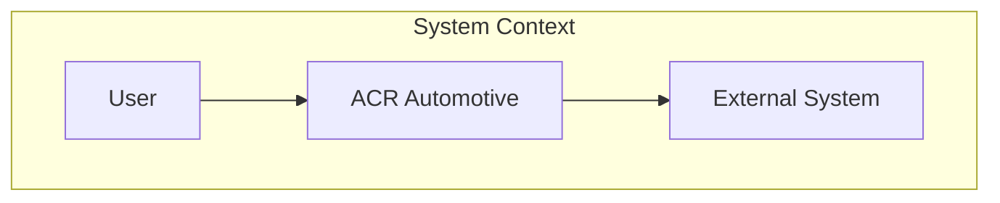

# Architecture Documentation Skill

## Purpose

Generate comprehensive architecture documentation using the **Arc42** template structure with **C4 model** diagrams. This produces "Explanation" type documentation in the Diátaxis framework.

## Smart Interaction

### ASK the User When:

- **Creating new architecture doc**: Confirm scope (full system vs specific subsystem)
- **Deleting architecture doc**: Always confirm before deletion
- **Major restructure**: Changing architecture doc organization

### PROCEED Autonomously When:

- **Updating existing doc**: Add new components, update diagrams
- **Adding diagrams**: Enhance existing documentation
- **Syncing with code**: Update to reflect architectural changes
- **Fixing outdated info**: Correct inaccuracies

## Instructions

When documenting system architecture:

1. **Explore the entire codebase** to understand the system
2. **Use the Arc42 template** at `templates/arc42.md`
3. **Generate C4 diagrams** in Mermaid at all 4 levels
4. **Document all architectural decisions** or link to ADRs
5. **Output to** `/docs/architecture/[system].md`

## Template

Use the template at: `.claude/skills/document-architecture/templates/arc42.md`

The template includes all 12 Arc42 sections:

1. Introduction and Goals
2. Constraints
3. Context and Scope
4. Solution Strategy
5. Building Block View
6. Runtime View
7. Deployment View
8. Crosscutting Concepts
9. Architecture Decisions
10. Quality Requirements
11. Risks and Technical Debt
12. Glossary

## C4 Diagram Standards

Use Mermaid with C4 naming conventions:

### C4 Levels

| Level        | Purpose                    | When to Use              |
| ------------ | -------------------------- | ------------------------ |
| 1. Context   | System in environment      | Always                   |
| 2. Container | High-level tech components | Always                   |
| 3. Component | Internal structure         | For complex containers   |
| 4. Code      | Class/function level       | Rarely, only when needed |

## Output Location

| Scope       | Output Path                         |
| ----------- | ----------------------------------- |
| Full system | `/docs/architecture/OVERVIEW.md`    |
| Subsystem   | `/docs/architecture/[SUBSYSTEM].md` |

## Quality Checklist

Before completing:

- [ ] All 12 Arc42 sections present
- [ ] C4 diagrams at context, container, component levels
- [ ] At least one runtime sequence diagram
- [ ] Links to existing ADRs
- [ ] Glossary with domain terms
- [ ] Quality scenarios defined with metrics

## Examples

### Creating New Docs (Will Ask User)

- "Document the system architecture" → Ask: Full system or specific subsystem?
- "Create architecture docs" → Creates `/docs/architecture/OVERVIEW.md`

### Updating Existing Docs (Autonomous)

- "Update architecture with new search service" → Updates existing OVERVIEW.md
- "Add deployment diagram" → Adds to existing doc
- "Document the new caching layer" → Adds to existing architecture doc

### Subsystem Documentation

- "Document the search system architecture" → Creates `/docs/architecture/SEARCH.md`
- "Create architecture docs for data import" → Creates `/docs/architecture/DATA_IMPORT.md`
