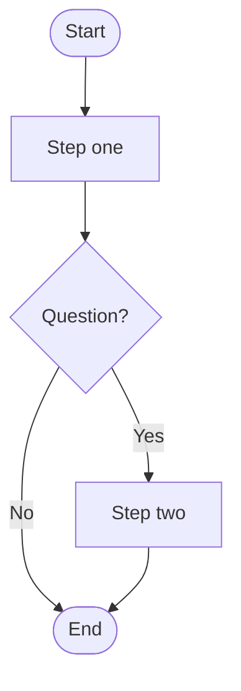

# Document to flowchart

Take a **document from the user**, extract the process / decision flow, and render it as a **Mermaid flowchart**. Do not invent steps that are not grounded in the source.

## Inputs

Accept any of:

1. Attached / pasted file contents
2. A workspace path the user names
3. Pasted text in chat

If no document is present, ask once: *“Please attach or paste the document (or give its path).”* Do not draw until you have source text.

## Process

```
Progress:
- [ ] 1. Obtain document text
- [ ] 2. Identify start, end, steps, decisions, and actors
- [ ] 3. Draft node list (id → label) grounded in the source
- [ ] 4. Emit Mermaid flowchart + short legend
- [ ] 5. Note gaps / ambiguities (do not invent edges)
```

Rules:

- Prefer `flowchart TD` (top-down). Use `LR` only if the user asks or the flow is clearly left-to-right.
- Decisions → diamond (`{ }`); process steps → rectangle (`[ ]`); start/end → stadium (`([ ])`).
- Keep node labels short (≤6 words); put detail in the legend, not on the node.
- One primary path first; side paths only if the document states them.
- If the doc describes multiple independent processes, produce **one diagram per process** (or ask which to draw if more than three).
- Mark inferred edges as uncertain in the notes — do not present guesses as facts.

## Output template

Deliver:

1. Title + source lines
2. A fenced `mermaid` block using `flowchart TD` (example shape):



3. Legend table (node/edge → meaning in the document)
4. Gaps (ambiguities or missing transitions)

## Optional follow-ups

Only if asked:

- Swimlanes by actor/role
- Sequence diagram instead of flowchart
- Export-oriented simplification (fewer nodes)
- Diff against a second document’s flow
