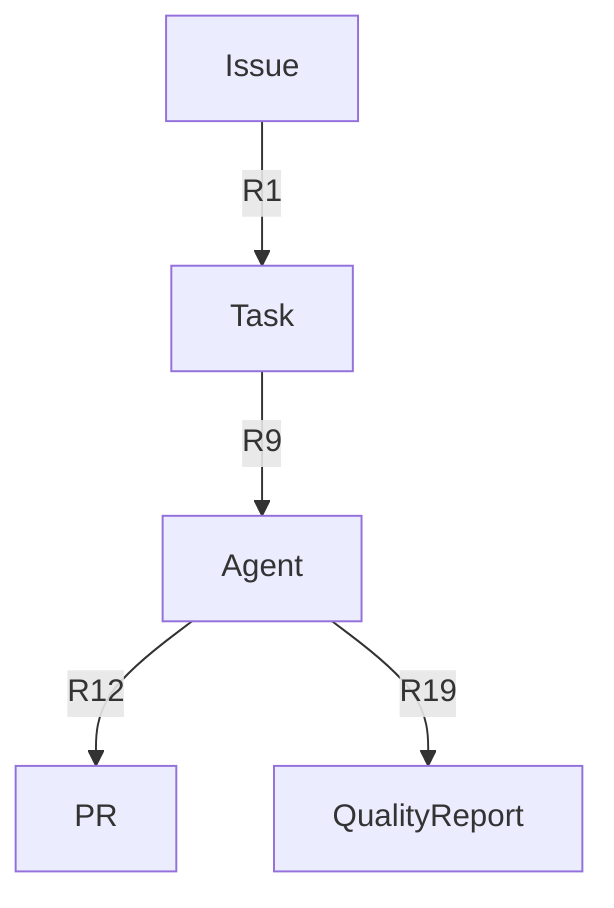

# 📚 Entity-Relation Based Documentation

**Version**: 2.0.0
**Last Updated**: 2025-11-22
**Priority**: ⭐⭐⭐ (P2 Level)
**Purpose**: Miyabi Entity-Relationモデルに基づくドキュメント自動生成

---

## 📋 概要

Miyabiの14エンティティ・39リレーションモデルに基づいた
ドキュメント生成、Mermaidダイアグラム作成を提供します。

---

## 🎯 P0: 呼び出しトリガー

| トリガー | 例 |
|---------|-----|
| ドキュメント化 | "document this feature" |
| アーキテクチャ | "update the architecture docs" |
| 説明 | "explain how X works" |
| 新機能後 | "after implementing new features" |

---

## 🔧 P1: Entity-Relationモデル

### 14 Entities

| Entity | 説明 | 関連数 |
|--------|------|--------|
| Issue | GitHub Issue | 8 |
| Task | 分解されたタスク | 6 |
| Agent | 実行Agent | 7 |
| PR | Pull Request | 4 |
| Label | ラベル | 5 |
| QualityReport | 品質レポート | 3 |
| Command | CLIコマンド | 2 |
| Escalation | エスカレーション | 3 |
| Deployment | デプロイメント | 3 |
| LDDLog | 学習ログ | 2 |
| DAG | タスクグラフ | 4 |
| Worktree | Git Worktree | 4 |
| DiscordCommunity | Discordコミュニティ | 4 |
| SubIssue | サブIssue | 3 |

### 39 Relations（カテゴリ別）

| カテゴリ | Relations | 数 |
|---------|----------|-----|
| Issue処理 | R1-R4 | 4 |
| Agent実行 | R9-R15 | 7 |
| ラベル制御 | R16-R18 | 3 |
| 品質管理 | R19-R23 | 5 |
| 並列実行 | R24-R27 | 4 |
| コミュニティ | R28-R35 | 8 |
| 階層 | R36-R39 | 4 |
| その他 | R5-R8 | 4 |

---

## 🚀 P2: ドキュメントパターン

### Pattern 1: 機能ドキュメント

```markdown
# [機能名]

## 概要
[1-2文で説明]

## Entity関係
- 主要Entity: [Entity名]
- 関連Entity: [Entity1], [Entity2]
- 使用Relations: R1, R9, R16

## 実装ファイル
- `crates/miyabi-xxx/src/lib.rs`
- `crates/miyabi-xxx/src/feature.rs`

## 使用方法
[コード例]

## 関連ドキュメント
- [リンク1]
- [リンク2]
```

### Pattern 2: Mermaidダイアグラム



### Pattern 3: アーキテクチャドキュメント

```markdown
# [コンポーネント名] Architecture

## レイヤー構造
```
[ASCII図]
```

## データフロー
[Mermaid sequence diagram]

## 依存関係
[依存グラフ]
```

---

## ⚡ P3: 自動生成ワークフロー

### Step 1: Entity特定

```bash
# コードからEntity参照を抽出
grep -r "Issue\|Task\|Agent" crates/
```

### Step 2: Relation特定

```bash
# 関係性パターンを検出
# creates, updates, triggers, etc.
```

### Step 3: ドキュメント生成

```markdown
自動生成セクション:
- [ ] 概要
- [ ] Entity関係図
- [ ] ファイルマッピング
- [ ] API リファレンス
- [ ] 使用例
```

---

## ✅ 成功基準

| チェック項目 | 基準 |
|-------------|------|
| Entity特定 | 関連Entity全て |
| Relation特定 | 使用Relation全て |
| ダイアグラム | Mermaid生成 |
| ファイルマッピング | 実装ファイル紐付け |
| 例示 | コード例含む |

---

## 🔗 関連ドキュメント

| ドキュメント | 用途 |
|-------------|------|
| `docs/ENTITY_RELATION_MODEL.md` | ERモデル詳細 |
| `context/miyabi-definition.md` | 定義一覧 |
| `docs/TEMPLATE_MASTER_INDEX.md` | テンプレート |

---

## 📝 関連Skills

- **Rust Development**: 実装コード確認
- **Issue Analysis**: Issue分析結果
- **Git Workflow**: 変更履歴参照
