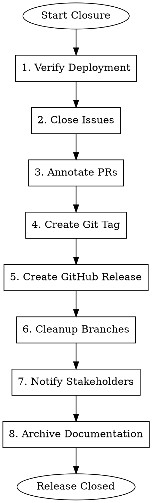

# Gmacko Release Closure

Finalize release by closing issues, creating GitHub release, and archiving documentation.

## When to Use

- Deployment is complete and verified
- Ready to close related issues
- Need to create GitHub release
- Archiving release documentation

## Prerequisites

- Deployment verified (web and/or mobile)
- Release summary exists
- `gh` CLI authenticated

## Workflow



## Execution Steps

### Step 1: Verify Deployment

Confirm all deployments are successful:

```markdown
## Deployment Verification

### Web (Vercel)
- [ ] Production URL accessible: https://app.example.com
- [ ] Smoke tests passed
- [ ] No error spikes in Sentry

### Mobile (if applicable)
- [ ] iOS build submitted/approved
- [ ] Android build submitted/approved
- [ ] OTA update published (if applicable)
```

Ask user:
> Before closing the release, please confirm:
>
> 1. Web production is stable? (yes/no)
> 2. Mobile apps are approved/live? (yes/no/not-applicable)
> 3. Any issues reported since deployment? (yes/no)

### Step 2: Close Issues

Find and close related issues:

```bash
# List issues that should be closed
gh issue list --state open --label "status:in-progress"

# Get issues linked to merged PRs
gh pr list --state merged --json number,title,closingIssuesReferences
```

Close each issue with comment:

```bash
# Close issue with release reference
gh issue close [number] --comment "Released in v[X.Y.Z]. 

Deployment verified on [date].
- Web: https://app.example.com
- Mobile: v[X.Y.Z] on App Store/Play Store"
```

Track closures:
```markdown
## Issues Closed

| Issue | Title | Closed |
|-------|-------|--------|
| #100 | [Title] | Yes |
| #101 | [Title] | Yes |
| #102 | [Title] | Deferred (partial) |
```

### Step 3: Annotate PRs

Add release info to merged PRs:

```bash
# Add comment to PR
gh pr comment [number] --body "Released in v[X.Y.Z] :rocket:

Production: https://app.example.com
Release Notes: https://github.com/gmacko/project/releases/tag/v[X.Y.Z]"
```

### Step 4: Create Git Tag

Create annotated tag for release:

```bash
# Create annotated tag
git tag -a "v[X.Y.Z]" -m "Release v[X.Y.Z]

Features:
- [Feature 1]
- [Feature 2]

Fixes:
- [Fix 1]
- [Fix 2]

See full changelog: docs/ai/releases/[date]-v[version].md"

# Push tag to remote
git push origin "v[X.Y.Z]"
```

### Step 5: Create GitHub Release

Create release with notes:

```bash
# Create release from tag
gh release create "v[X.Y.Z]" \
  --title "v[X.Y.Z]" \
  --notes-file /tmp/release-notes.md

# Or with inline notes
gh release create "v[X.Y.Z]" \
  --title "Release v[X.Y.Z]" \
  --notes "## What's New

### Features
- **[Feature]**: Description (#123)

### Bug Fixes
- Fixed [issue] (#124)

### Full Changelog
https://github.com/gmacko/project/compare/v[prev]...v[X.Y.Z]"
```

For mobile releases, attach build artifacts (optional):
```bash
# Upload build artifacts
gh release upload "v[X.Y.Z]" ./app-release.apk
```

### Step 6: Cleanup Branches

Clean up merged branches:

```bash
# List merged branches
git branch --merged main | grep -v "main\|staging\|dev"

# Delete local merged branches
git branch --merged main | grep -v "main\|staging\|dev" | xargs git branch -d

# Delete remote merged branches (with confirmation)
# gh api repos/gmacko/project/branches --jq '.[].name' | ...
```

Ask user before deleting:
> The following branches are merged and can be deleted:
> - feature/dark-mode
> - fix/login-bug
>
> Delete these branches? (yes/no/selective)

### Step 7: Notify Stakeholders

Prepare notification:

```markdown
## Release Notification

**Subject**: v[X.Y.Z] Released

**Body**:
Hi team,

We've just released v[X.Y.Z] to production!

### Highlights
- [Key feature 1]
- [Key feature 2]
- [Important fix]

### Links
- Production: https://app.example.com
- Release Notes: [GitHub Release URL]
- Mobile: Available on App Store / Play Store

### Metrics to Watch
- Error rate in Sentry
- Performance in Vercel Analytics
- User feedback

Let me know if you notice any issues!

[Your name]
```

Suggest notification channels:
- Slack #releases channel
- Email to stakeholders
- Update status page

### Step 8: Archive Documentation

Finalize release documentation:

```markdown
# Update docs/ai/releases/[date]-v[version].md

## Final Status

- **Released**: [timestamp]
- **GitHub Release**: [URL]
- **Git Tag**: v[X.Y.Z]

## Deployment Summary

| Platform | Status | URL/Version |
|----------|--------|-------------|
| Web | Live | https://app.example.com |
| iOS | Live | v[X.Y.Z] on App Store |
| Android | Live | v[X.Y.Z] on Play Store |

## Issues Closed
[List of closed issues]

## PRs Included
[List of merged PRs]

## Post-Release Observations

### First 24 Hours
- Error rate: [Normal/Elevated]
- Performance: [Normal/Degraded]
- User feedback: [Summary]

### Issues Discovered
- [Any post-release issues and how they were handled]

---

**Release Closed By**: AI Assistant
**Closed At**: [timestamp]
```

Move handoff docs to archive (optional):
```bash
# Move feature handoffs to completed folder
mkdir -p docs/ai/handoffs/completed/v[X.Y.Z]
mv docs/ai/handoffs/[feature]*.md docs/ai/handoffs/completed/v[X.Y.Z]/
```

## Final Summary

Present to user:

```
RELEASE CLOSED
==============

Version: v[X.Y.Z]
Released: [date]

Actions Completed:
- [x] Deployment verified
- [x] [N] issues closed
- [x] [N] PRs annotated
- [x] Git tag created
- [x] GitHub release published
- [x] [N] branches cleaned up
- [x] Notification prepared
- [x] Documentation archived

Links:
- GitHub Release: [URL]
- Production: [URL]
- Release Summary: docs/ai/releases/[date]-v[version].md

Release cycle complete! 🎉
```

## Red Flags

| Rationalization | Correction |
|-----------------|------------|
| "Close issues without verifying deployment" | ALWAYS verify before closing |
| "Skip GitHub release, tag is enough" | GitHub release enables release notes discovery |
| "Don't need to notify anyone" | Stakeholders should know about releases |
| "Documentation can be updated later" | Finalize docs while context is fresh |
| "Delete branches without checking" | Confirm before deleting any branch |

## Integration

- **Input**: Version, deployment verification status
- **References**: Release summary, merged PRs, closed issues
- **Output**: GitHub release, closed issues, final documentation
- **Next**: Monitor post-release, start next sprint
