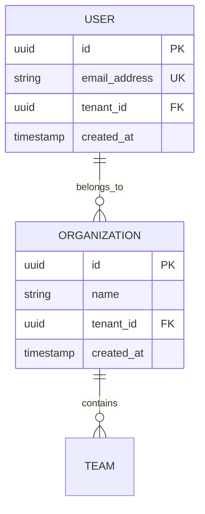
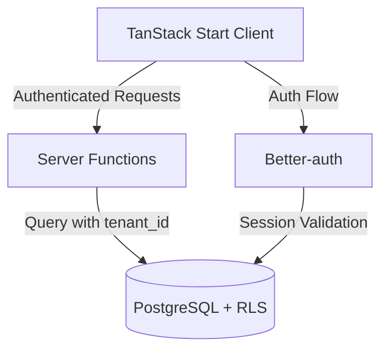

# Grey Haven Ontological Documentation

Create comprehensive ontological documentation that captures fundamental concepts, relationships, and classification systems within Grey Haven codebases and systems.

## When to Use This Skill

Use this skill when you need to:
- Document the conceptual structure and domain model of Grey Haven applications
- Extract and organize business concepts from TanStack Start or FastAPI codebases
- Create visual representations of multi-tenant system architectures
- Build semantic maps of entities, services, and their tenant-isolated interactions
- Design or document domain models for new Grey Haven features
- Analyze and communicate complex architectures to stakeholders
- Create knowledge graphs for Grey Haven development teams
- Onboard new developers to Grey Haven project structure

## Core Capabilities

### 1. Concept Extraction from Grey Haven Codebases

**TanStack Start (Frontend) Extraction:**
- Drizzle schema tables and relationships
- React components and their hierarchies
- TanStack Router route structure
- Better-auth session and user models
- Server functions and their dependencies
- Multi-tenant data patterns (tenant_id isolation)

**FastAPI (Backend) Extraction:**
- SQLModel entities and relationships
- Repository pattern implementations
- Service layer business logic
- API endpoint hierarchies
- Multi-tenant repository filters
- Pydantic schemas and validation models

### 2. Grey Haven Architecture Patterns

**Identify and Document:**
- **Multi-Tenant Patterns**: tenant_id isolation, RLS roles (admin/authenticated/anon)
- **Repository Pattern**: BaseRepository with automatic tenant filtering
- **Service Layer**: Business logic separation from endpoints
- **Database Conventions**: snake_case fields, UUID primary keys, timestamps
- **Authentication**: Better-auth integration with session management
- **Deployment**: Cloudflare Workers architecture

### 3. Visual Documentation Formats

**Mermaid Diagrams** (for README files):


**System Architecture**:


### 4. Domain Model Documentation Template

```markdown
## Entity: User

### Definition
Represents an authenticated user in the Grey Haven system with multi-tenant isolation.

### Database Schema
- **Table**: users (snake_case)
- **Primary Key**: id (UUID)
- **Tenant Isolation**: tenant_id (UUID, indexed)
- **Unique Constraints**: email_address per tenant
- **Timestamps**: created_at, updated_at (automatic)

### Relationships
- **Belongs To**: Organization (via tenant_id)
- **Has Many**: Sessions (Better-auth)
- **Has Many**: TeamMemberships

### Business Rules
- Email must be unique within tenant
- Cannot access data from other tenants
- Session expires after 30 days of inactivity
- RLS enforces tenant_id filtering at database level

### TypeScript Type
```typescript
interface User {
  id: string;
  emailAddress: string;
  tenantId: string;
  createdAt: Date;
  updatedAt: Date;
}
```

### Python Model
```python
class User(SQLModel, table=True):
    __tablename__ = "users"
    id: UUID = Field(default_factory=uuid4, primary_key=True)
    email_address: str = Field(unique=True, index=True)
    tenant_id: UUID = Field(foreign_key="organizations.id", index=True)
    created_at: datetime = Field(default_factory=datetime.utcnow)
    updated_at: datetime = Field(default_factory=datetime.utcnow)
```
```

## Workflow

### Step 1: Discovery and Extraction

**For TanStack Start Projects:**
1. Analyze Drizzle schema files in `src/lib/server/schema/`
2. Map React component structure in `src/lib/components/`
3. Document TanStack Router routes in `src/routes/`
4. Extract server functions from `src/lib/server/functions/`
5. Identify tenant isolation patterns

**For FastAPI Projects:**
1. Analyze SQLModel models in `app/db/models/`
2. Map repository pattern in `app/db/repositories/`
3. Document service layer in `app/services/`
4. Extract API routes from `app/routers/`
5. Identify BaseRepository tenant filtering

### Step 2: Ontology Construction

**Categorize by Grey Haven Patterns:**

1. **Core Entities** (tables with tenant_id)
   - User, Organization, Team, etc.
   - Always include tenant_id
   - UUID primary keys
   - snake_case field names

2. **Service Boundaries**
   - Repository layer (data access)
   - Service layer (business logic)
   - Router layer (API endpoints)
   - Clear separation of concerns

3. **Relationships and Dependencies**
   - Foreign key relationships
   - Repository dependencies
   - Service composition
   - API endpoint groupings

4. **Multi-Tenant Patterns**
   - RLS role usage (admin/authenticated/anon)
   - tenant_id filtering in repositories
   - Session-based tenant resolution
   - Cross-tenant access prevention

### Step 3: Documentation Creation

**Use Grey Haven Documentation Standards:**

1. **Entity Documentation**
   - Definition and purpose
   - Database schema with exact field names
   - Relationships to other entities
   - Business rules and constraints
   - TypeScript and Python representations

2. **Service Documentation**
   - Service responsibilities
   - Repository dependencies
   - Business logic patterns
   - Multi-tenant considerations

3. **API Documentation**
   - Endpoint hierarchies
   - Request/response schemas
   - Authentication requirements
   - Tenant isolation verification

### Step 4: Visualization

**Create Diagrams For:**

1. **Database ERD** - All tables with relationships and tenant_id fields
2. **Service Dependencies** - Repository → Service → Router layers
3. **Authentication Flow** - Better-auth integration with multi-tenant context
4. **Deployment Architecture** - Cloudflare Workers, Neon PostgreSQL, Redis
5. **Data Flow** - Client → Server Functions → Repository → Database (with RLS)

## Common Use Cases

### Use Case 1: New Developer Onboarding
*"I need to understand how Grey Haven's multi-tenant architecture works."*

**Approach:**
1. Extract all entities with tenant_id fields
2. Document BaseRepository tenant filtering pattern
3. Create ERD showing tenant_id relationships
4. Explain RLS roles and session-based tenant resolution
5. Show data flow with tenant isolation

### Use Case 2: Feature Design Documentation
*"Document the domain model for the new billing feature before implementation."*

**Approach:**
1. Design entity schema following Grey Haven conventions
2. Plan repository and service layer structure
3. Document API endpoints with tenant isolation
4. Create Mermaid diagrams for the feature
5. Validate multi-tenant patterns

### Use Case 3: Architecture Review
*"Analyze the current codebase to identify inconsistencies in multi-tenant patterns."*

**Approach:**
1. Extract all repositories and check tenant_id filtering
2. Review entities for proper tenant_id indexing
3. Audit RLS role usage across the application
4. Identify missing tenant isolation
5. Generate compliance report

### Use Case 4: Legacy Code Analysis
*"Understand the original domain model before refactoring the user management system."*

**Approach:**
1. Extract current User entity and relationships
2. Map all services depending on User
3. Document authentication flow with Better-auth
4. Identify refactoring boundaries
5. Create before/after architecture diagrams

## Grey Haven Specific Patterns

### Multi-Tenant Entity Pattern
```typescript
// Drizzle Schema (TanStack Start)
export const usersTable = pgTable("users", {
  id: uuid("id").primaryKey().defaultRandom(),
  emailAddress: text("email_address").unique().notNull(),
  tenantId: uuid("tenant_id").references(() => organizationsTable.id).notNull(),
  createdAt: timestamp("created_at").defaultNow().notNull(),
  updatedAt: timestamp("updated_at").defaultNow().notNull(),
});
```

```python
# SQLModel (FastAPI)
class User(SQLModel, table=True):
    __tablename__ = "users"

    id: UUID = Field(default_factory=uuid4, primary_key=True)
    email_address: str = Field(unique=True, index=True)
    tenant_id: UUID = Field(foreign_key="organizations.id", index=True)
    created_at: datetime = Field(default_factory=datetime.utcnow)
    updated_at: datetime = Field(default_factory=datetime.utcnow)
```

### Repository Pattern with Tenant Isolation
```python
# BaseRepository with automatic tenant filtering
class BaseRepository(Generic[T]):
    def __init__(self, session: AsyncSession, model: type[T]):
        self.session = session
        self.model = model

    async def get_by_id(self, id: UUID, tenant_id: UUID) -> Optional[T]:
        """Automatic tenant isolation."""
        result = await self.session.execute(
            select(self.model)
            .where(self.model.id == id)
            .where(self.model.tenant_id == tenant_id)  # Always filter
        )
        return result.scalar_one_or_none()
```

### RLS Role Pattern
```typescript
// Database connections with RLS roles
const adminDb = drizzle(process.env.DATABASE_URL_ADMIN);      // Full access
const authenticatedDb = drizzle(process.env.DATABASE_URL_AUTHENTICATED); // Tenant-scoped
const anonDb = drizzle(process.env.DATABASE_URL_ANON);        // Public only
```

## Documentation Output Structure

### Directory Organization
```
documentation/
├── architecture/
│   ├── system-overview.md
│   ├── multi-tenant-architecture.md
│   └── deployment-architecture.md
├── domain-model/
│   ├── entities/
│   │   ├── user.md
│   │   ├── organization.md
│   │   └── team.md
│   ├── relationships.md
│   └── business-rules.md
├── diagrams/
│   ├── database-erd.mmd
│   ├── service-dependencies.mmd
│   ├── auth-flow.mmd
│   └── deployment.mmd
└── ontology.json
```

### Ontology JSON Structure
```json
{
  "version": "1.0.0",
  "system": "Grey Haven Application",
  "architecture": "Multi-tenant TanStack Start + FastAPI",
  "entities": [
    {
      "name": "User",
      "table": "users",
      "primaryKey": "id",
      "tenantKey": "tenant_id",
      "fields": [...],
      "relationships": [...],
      "businessRules": [...]
    }
  ],
  "services": [...],
  "patterns": {
    "multiTenant": true,
    "rls": true,
    "repositoryPattern": true
  }
}
```

## When to Apply This Skill

Use ontological documentation when:
- Onboarding new developers to Grey Haven projects
- Designing new features with domain modeling
- Documenting multi-tenant architecture
- Analyzing legacy code before refactoring
- Creating architecture presentations for stakeholders
- Building knowledge bases for Grey Haven teams
- Ensuring consistency across TanStack Start and FastAPI implementations
- Auditing multi-tenant isolation patterns
- Planning database migrations or schema changes

## Integration with Other Grey Haven Skills

**Works Best With:**
- `grey-haven-database-conventions` - Ensure proper schema design
- `grey-haven-project-structure` - Understand codebase organization
- `grey-haven-authentication-patterns` - Document Better-auth integration
- `grey-haven-data-modeling` - Design Drizzle and SQLModel schemas
- `grey-haven-api-design-standards` - Document API hierarchies

## Critical Reminders

1. **Always document tenant_id** - Every entity must show tenant isolation
2. **Follow naming conventions** - snake_case for database, camelCase for TypeScript
3. **Include both TypeScript and Python** - Grey Haven uses both stacks
4. **Show RLS roles** - Document admin/authenticated/anon usage
5. **Repository pattern is required** - All data access goes through repositories
6. **UUID primary keys** - Never use auto-increment integers
7. **Timestamps are automatic** - created_at and updated_at
8. **Multi-tenant first** - Every design considers tenant isolation
9. **Visual diagrams required** - Mermaid for all architecture documentation
10. **Cross-reference skills** - Link to relevant Grey Haven skills

## Template References

These patterns are from Grey Haven's actual templates:
- **Frontend**: `cvi-template` (TanStack Start + React 19 + Drizzle)
- **Backend**: `cvi-backend-template` (FastAPI + SQLModel + Repository Pattern)
- **Multi-tenant**: Neon PostgreSQL with RLS
