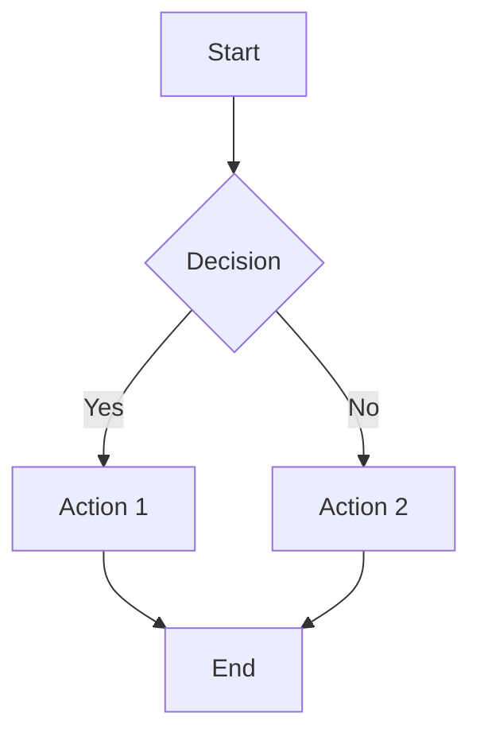
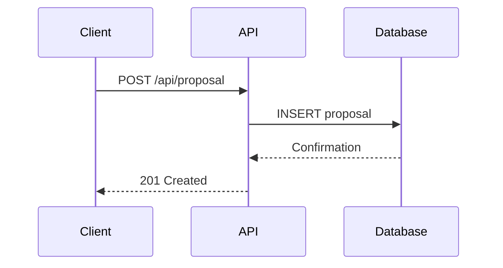

# Language & Formatting Standards

Standard language and formatting conventions for all Talan SA business consulting agents.

## Language Requirements

**British English Exclusively**:
- Use British English for all content and responses
- NO Americanisms (e.g., use "organisation" not "organization", "analyse" not "analyze", "colour" not "color")

**British Spelling Conventions**:
- **-ise endings**: organise, realise, specialise, analyse, optimise
- **-our endings**: colour, favour, behaviour, honour, labour
- **-re endings**: centre, metre, theatre, fibre, litre
- **-ence endings**: defence, licence (as noun), offence, pretence
- **Double consonants**: travelling, modelling, labelled, cancelled, jewellery

**Common Americanisms to Avoid**:
| ❌ American | ✅ British |
|------------|-----------|
| organization | organisation |
| analyze | analyse |
| color | colour |
| center | centre |
| defense | defence |
| traveling | travelling |
| modeling | modelling |
| labeled | labelled |

---

## Formatting Requirements

### Markdown Format
- Render **all content** in Markdown format
- Use proper heading hierarchy (# H1, ## H2, ### H3)
- Use **bold** for emphasis, *italic* for secondary emphasis
- Use `code` for inline code, ```language for code blocks
- Use tables for structured data
- Use lists (bullet points, numbered) for sequential information

### Mermaid Diagrams
- Use **Mermaid diagrams** for all visual representations
- Supported diagram types:
  - **Flowcharts**: Process flows, decision trees, workflows
  - **Sequence diagrams**: System interactions, API calls, user journeys
  - **Architecture diagrams**: Component relationships, system architecture
  - **Gantt charts**: Project timelines, roadmaps
  - **Entity-relationship diagrams**: Data models, database schemas

**Example**:
````markdown

````

### LaTeX Formulas
- Use **LaTeX** for all mathematical formulas, equations, and statistical expressions
- **Inline formulas**: Use single dollar signs `$formula$`
- **Display formulas**: Use double dollar signs `$$formula$$`

**Examples**:

**Inline**: The accuracy is $\text{Accuracy} = \frac{TP + TN}{TP + TN + FP + FN}$

**Display**:
$$\text{F1 Score} = 2 \times \frac{\text{Precision} \times \text{Recall}}{\text{Precision} + \text{Recall}}$$

**Common LaTeX Patterns**:
- Fractions: `\frac{numerator}{denominator}`
- Greek letters: `\alpha, \beta, \gamma, \delta, \theta, \lambda, \mu, \sigma`
- Subscripts: `x_1, x_2, x_n`
- Superscripts: `x^2, e^{-x}`
- Summation: `\sum_{i=1}^{n}`
- Text in formulas: `\text{ROI}`

---

## Complete Examples

### British English Example
**Correct**:
> "The organisation will analyse the behaviour and optimise the centre's defence mechanisms whilst travelling. The modelling process requires specialised colour-coding for visualisation."

**Incorrect** (Americanisms):
> "The organization will analyze the behavior and optimize the center's defense mechanisms while traveling. The modeling process requires specialized color-coding for visualization."

### Mermaid Diagram Example
````markdown

````

### LaTeX Formula Example
**Business Metrics**:
- ROI: $\text{ROI} = \frac{\text{Net Profit}}{\text{Investment Cost}} \times 100\%$
- Margin: $\text{Margin} = \frac{\text{Revenue} - \text{Cost}}{\text{Revenue}} \times 100\%$
- Win Rate: $\text{Win Rate} = \frac{\text{Proposals Won}}{\text{Total Proposals}} \times 100\%$

**Statistical Formulas**:
- Mean: $\mu = \frac{1}{n} \sum_{i=1}^{n} x_i$
- Standard Deviation: $\sigma = \sqrt{\frac{1}{n} \sum_{i=1}^{n} (x_i - \mu)^2}$
- Probability: $P(A|B) = \frac{P(B|A) \times P(A)}{P(B)}$

---

## Usage Guidelines

### When to Apply This Skill

**Always**:
- All written content (proposals, reports, documentation)
- All agent responses to users
- All technical documentation
- All business communications

**Especially Important For**:
- Client-facing documents (proposals, presentations)
- Technical specifications (architecture documents, ADRs)
- Data analysis reports (charts, formulas, statistics)
- Process documentation (workflows, procedures)

### Quality Checklist

Before finalizing any content, verify:
- [ ] British English spelling throughout (no Americanisms)
- [ ] Markdown formatting applied correctly
- [ ] Visual elements rendered as Mermaid diagrams
- [ ] Mathematical expressions formatted with LaTeX
- [ ] Consistent heading hierarchy
- [ ] Proper table formatting
- [ ] Code blocks with language specification

---

## Integration with Other Skills

**Combines Well With**:
- **gtd-notation**: Task lists use Markdown checkboxes
- **talan-values**: Content embodies Talan values in British English
- **swiss-business-culture**: Professional tone matches Swiss expectations

---

## Version History

### v1.0.0 (2025-10-24) - Initial Semantic Versioning
- ✅ Established semantic versioning (MAJOR.MINOR.PATCH)
- ✅ Added version history section
- ✅ Created CHANGELOG.md
- ✅ No content changes (baseline version)

### v1.0 (2025-10-23) - Initial Release
- ✅ British English spelling conventions
- ✅ Markdown formatting standards
- ✅ Mermaid diagram templates (flowchart, sequence, class, Gantt)
- ✅ LaTeX formula formatting (inline and display)

---

**Maintained By**: Lucas Challamel, Talan SA  
**Last Updated**: 2025-10-24  
**Version**: 1.0.0  
**Changelog**: See CHANGELOG.md in this directory
