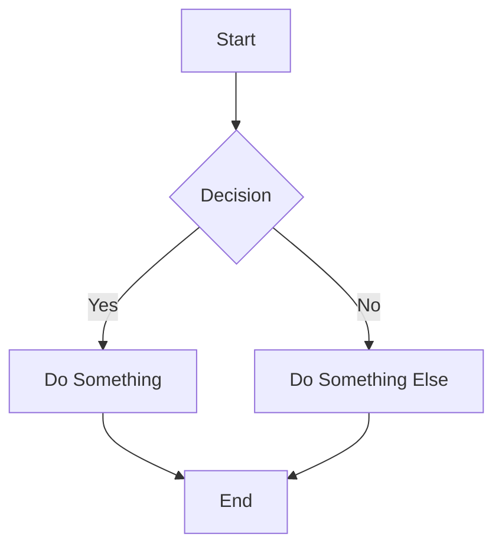
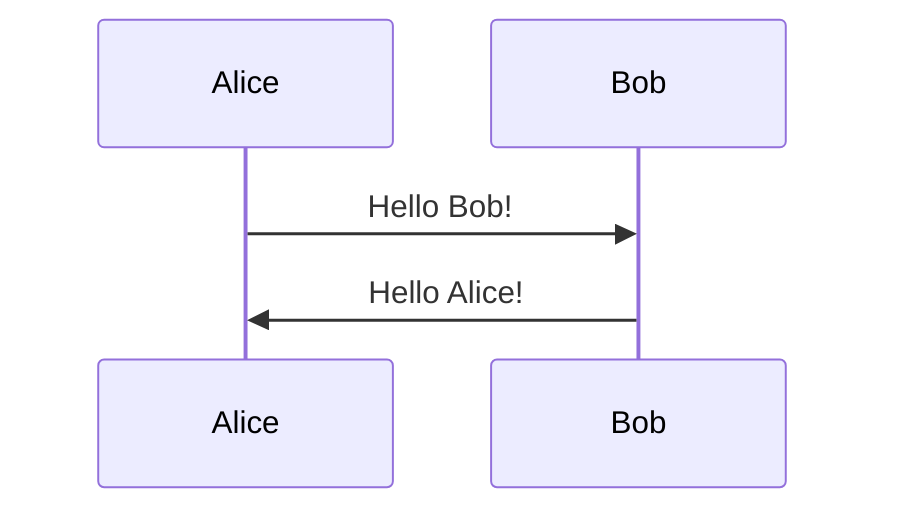

# Markdown Documentation

## Overview

Master markdown syntax and best practices for creating well-formatted, readable documentation using standard Markdown and GitHub Flavored Markdown (GFM).

## When to Use

- README files
- Documentation pages
- GitHub/GitLab wikis
- Blog posts
- Technical writing
- Project documentation
- Comment formatting

## Markdown Syntax Reference

### Headers

```markdown
# H1 Header
## H2 Header
### H3 Header
#### H4 Header
##### H5 Header
###### H6 Header

Alternative H1
==============

Alternative H2
--------------
```

### Text Formatting

```markdown
**Bold text**
__Also bold__

*Italic text*
_Also italic_

***Bold and italic***
___Also bold and italic___

~~Strikethrough~~

`Inline code`

> Blockquote
> Multiple lines
> in blockquote

---
Horizontal rule (also ___ or ***)
```

### Lists

```markdown
Unordered list:
- Item 1
- Item 2
  - Nested item 2.1
  - Nested item 2.2
- Item 3

Using asterisks:
* Item 1
* Item 2

Using plus:
+ Item 1
+ Item 2

Ordered list:
1. First item
2. Second item
   1. Nested item 2.1
   2. Nested item 2.2
3. Third item

Task list (GitHub Flavored Markdown):
- [x] Completed task
- [ ] Incomplete task
- [ ] Another task
```

### Links and Images

```markdown
[Link text](https://example.com)
[Link with title](https://example.com "Link title")

Reference-style link:
[Link text][reference]
[reference]: https://example.com

Automatic link:
<https://example.com>
<email@example.com>


Reference-style image:
![Alt text][image-ref]
[image-ref]: image.png
```

### Code Blocks

````markdown
Inline code: `const x = 5;`

Code block with language:
```javascript
function hello(name) {
  console.log(`Hello, ${name}!`);
}
```

```python
def hello(name):
    print(f"Hello, {name}!")
```

```bash
npm install
npm start
```

Indented code block (4 spaces):
    const x = 5;
    console.log(x);
````

### Tables

```markdown
Simple table:
| Column 1 | Column 2 | Column 3 |
|----------|----------|----------|
| Row 1    | Data     | Data     |
| Row 2    | Data     | Data     |

Aligned columns:
| Left | Center | Right |
|:-----|:------:|------:|
| Left | Center | Right |
| Text | Text   | Text  |

Minimal table:
Column 1 | Column 2
---------|----------
Data     | Data
Data     | Data
```

### Extended Syntax (GitHub Flavored Markdown)

```markdown
Footnotes:
Here's a sentence with a footnote[^1].

[^1]: This is the footnote.

Definition list:
Term
: Definition

Emoji:
:smile: :rocket: :heart:
:+1: :-1: :eyes:

Automatic URL linking:
https://github.com

Task lists in issues:
- [x] #739
- [ ] https://github.com/octo-org/repo/issues/1
- [ ] Add tests

Mentioning users and teams:
@username
@org/team-name

Referencing issues and PRs:
#123
GH-123
username/repo#123
```

## README Template

```markdown
# Project Name

Brief description of what this project does and who it's for.

[](https://github.com/user/repo/actions)
[](LICENSE)
[](https://www.npmjs.com/package/package-name)

## Table of Contents

- [Features](#features)
- [Demo](#demo)
- [Installation](#installation)
- [Usage](#usage)
- [API Reference](#api-reference)
- [Contributing](#contributing)
- [License](#license)
- [Contact](#contact)

## Features

- Feature 1
- Feature 2
- Feature 3

## Demo


Try it live: [https://demo.example.com](https://demo.example.com)

## Installation

### Prerequisites

- Node.js 18+
- npm or yarn

### Install via npm

```bash
npm install package-name
```

### Install via yarn

```bash
yarn add package-name
```

### From source

```bash
git clone https://github.com/user/repo.git
cd repo
npm install
npm run build
```

## Usage

Basic usage example:

```javascript
import { Package } from 'package-name';

const instance = new Package({
  option1: 'value1',
  option2: 'value2'
});

instance.doSomething();
```

### Advanced Usage

More complex example:

```javascript
const result = await instance.advancedMethod({
  param1: 'value',
  param2: 123
});

console.log(result);
```

## API Reference

### `Class.method(param1, param2)`

Description of what this method does.

**Parameters:**
- `param1` (string): Description of param1
- `param2` (number): Description of param2

**Returns:** Description of return value

**Example:**
```javascript
const result = instance.method('value', 42);
```

## Configuration

Create a `.configrc` file:

```json
{
  "setting1": "value1",
  "setting2": true,
  "setting3": {
    "nested": "value"
  }
}
```

## Contributing

Contributions are welcome! Please follow these steps:

1. Fork the repository
2. Create a feature branch (`git checkout -b feature/AmazingFeature`)
3. Commit your changes (`git commit -m 'Add some AmazingFeature'`)
4. Push to the branch (`git push origin feature/AmazingFeature`)
5. Open a Pull Request

Please read [CONTRIBUTING.md](CONTRIBUTING.md) for details on our code of conduct and development process.

## Testing

```bash
# Run all tests
npm test

# Run with coverage
npm run test:coverage

# Run in watch mode
npm run test:watch
```

## Deployment

```bash
# Build for production
npm run build

# Deploy
npm run deploy
```

## Built With

- [Framework 1](https://example.com) - Description
- [Library 2](https://example.com) - Description
- [Tool 3](https://example.com) - Description

## Versioning

We use [SemVer](http://semver.org/) for versioning. For available versions, see the [tags on this repository](https://github.com/user/repo/tags).

## Authors

- **Your Name** - *Initial work* - [YourUsername](https://github.com/YourUsername)

See also the list of [contributors](https://github.com/user/repo/contributors) who participated in this project.

## License

This project is licensed under the MIT License - see the [LICENSE](LICENSE) file for details.

## Acknowledgments

- Hat tip to anyone whose code was used
- Inspiration
- References

## Support

- Documentation: [https://docs.example.com](https://docs.example.com)
- Issues: [GitHub Issues](https://github.com/user/repo/issues)
- Discussions: [GitHub Discussions](https://github.com/user/repo/discussions)
- Email: support@example.com

## Roadmap

- [x] Feature 1
- [x] Feature 2
- [ ] Feature 3
- [ ] Feature 4

See the [open issues](https://github.com/user/repo/issues) for a full list of proposed features.

## FAQ

### Question 1?

Answer to question 1.

### Question 2?

Answer to question 2.

## Changelog

See [CHANGELOG.md](CHANGELOG.md) for a list of changes.
```

## Documentation Best Practices

### File Structure

```
docs/
├── README.md
├── CONTRIBUTING.md
├── CHANGELOG.md
├── LICENSE
├── CODE_OF_CONDUCT.md
├── SECURITY.md
├── guides/
│   ├── getting-started.md
│   ├── installation.md
│   └── configuration.md
├── api/
│   ├── authentication.md
│   ├── endpoints.md
│   └── errors.md
└── examples/
    ├── basic-usage.md
    └── advanced-usage.md
```

### Linking Between Documents

```markdown
Link to another doc:
[Installation Guide](guides/installation.md)

Link to section in current doc:
[See Configuration](#configuration)

Link to section in another doc:
[API Authentication](api/authentication.md#oauth2)

Link to external resource:
[GitHub Markdown Guide](https://guides.github.com/features/mastering-markdown/)
```

### Using Anchors

```markdown
Create custom anchors:

<a name="custom-anchor"></a>
## Section Title

Link to it:
[Jump to section](#custom-anchor)
```

### Collapsible Sections

```markdown
<details>
<summary>Click to expand</summary>

Hidden content goes here.

- Can include lists
- Code blocks
- Images

```javascript
const code = 'works too';
```

</details>
```

### Syntax Highlighting

````markdown
Common languages:
```javascript
```typescript
```python
```bash
```java
```go
```rust
```sql
```json
```yaml
```html
```css
```dockerfile
```graphql
```markdown
````

### Badges

```markdown


```

### Alerts and Callouts

```markdown
> **Note**
> This is a note

> **Warning**
> This is a warning

> **Important**
> This is important information

GitHub-style alerts (GFM):
> [!NOTE]
> Useful information

> [!TIP]
> Helpful advice

> [!IMPORTANT]
> Key information

> [!WARNING]
> Critical content

> [!CAUTION]
> Negative potential consequences
```

### Mermaid Diagrams

````markdown



````

## Markdown Tools

### Linters

```bash
# markdownlint
npm install -g markdownlint-cli
markdownlint '**/*.md'

# Configuration: .markdownlint.json
{
  "default": true,
  "MD013": false,
  "MD033": false
}
```

### Formatters

```bash
# prettier
npm install -g prettier
prettier --write '**/*.md'

# Configuration: .prettierrc
{
  "proseWrap": "always",
  "printWidth": 80
}
```

### Preview

```bash
# grip - GitHub README preview
pip install grip
grip README.md
# Open http://localhost:6419
```

## Best Practices

### ✅ DO
- Use descriptive link text
- Include table of contents for long documents
- Add alt text to images
- Use code blocks with language specification
- Keep lines under 80-100 characters
- Use relative links for internal docs
- Add badges for build status, coverage, etc.
- Include examples and screenshots
- Use semantic line breaks
- Test all links regularly

### ❌ DON'T
- Use "click here" as link text
- Forget alt text on images
- Mix HTML and Markdown unnecessarily
- Use absolute paths for local files
- Create walls of text without breaks
- Skip language specification in code blocks
- Use images for text content (accessibility)

## Resources

- [GitHub Markdown Guide](https://guides.github.com/features/mastering-markdown/)
- [CommonMark Spec](https://commonmark.org/)
- [Markdown Guide](https://www.markdownguide.org/)
- [GitHub Flavored Markdown Spec](https://github.github.com/gfm/)
- [Awesome README](https://github.com/matiassingers/awesome-readme)
