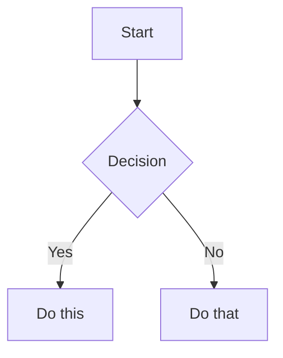

# Slidev Presentation Assistant

This skill helps create and manage presentations using Slidev, a developer-focused presentation framework that combines markdown simplicity with web technology power.

## Quick Start

### Creating a New Presentation

```bash
# Initialize new Slidev project
npm init slidev@latest

# Or use existing project
npm install @slidev/cli --save-dev
```

### Basic Slide Structure

```markdown
---
theme: seriph
background: https://source.unsplash.com/collection/94734566/1920x1080
---

# Welcome to Slidev

Presentation slides for developers

---

# Agenda

- Introduction
- Code Examples
- Live Demo
- Q&A

---
layout: two-cols
---

# Two Column Layout

::left::

Left side content

::right::

Right side content
```

## Core Commands

### Development
```bash
slidev                    # Start dev server (default: slides.md)
slidev slides.md -o       # Start and open in browser
slidev --port 3030        # Use custom port
```

### Building & Exporting
```bash
slidev build              # Build static SPA
slidev export             # Export to PDF (default)
slidev export --format pptx    # Export to PowerPoint
slidev export --format png     # Export as PNG images
slidev export --with-clicks    # Include animation steps
slidev export --range 1,4-8    # Export specific slides
```

### Export Verification

#### Automated Content Fit Verification (Recommended)

For comprehensive content verification, use the specialized agent:

```bash
# Claude Code will invoke the slidev-content-verifier agent
# This agent will automatically:
# 1. Export slides to PNG with proper wait times
# 2. Analyze each slide systematically
# 3. Check for all types of content issues
# 4. Provide specific fix recommendations
```

To use the agent, simply ask Claude Code:
- "Verify that all slide content fits properly"
- "Check my slides for content cutoffs"
- "Run content fit verification on the presentation"

The agent uses the workflow described below and provides a detailed report with specific fixes.

#### Manual Content Fit Verification Workflow
For manual verification or understanding the process, use PNG export with direct analysis:

```bash
# 1. Export slides to PNG with proper wait times
slidev export --format png --wait 2000 --timeout 120000

# Export specific slides for quick iteration
slidev export --format png --range 5,8,12 --wait 2000

# 2. List exported PNGs
ls -la slides-export/

# 3. Use Read tool to analyze each PNG directly
# The Read tool can display PNG images for visual inspection
# Check each slide systematically
```

**Analysis Workflow with Read Tool:**
```bash
# After export, use Read tool on each PNG to verify:
# - All text is visible and not cut off at edges
# - Code blocks are fully displayed with all lines
# - Bullet points and list items are complete
# - Headers and footers are within slide bounds
# - Images and diagrams are not clipped
# - Long URLs or file paths aren't truncated
# - Mermaid diagrams render completely
# - Tables fit within slide width

# Example verification process:
# Read slides-export/001.png - Check title slide
# Read slides-export/002.png - Verify agenda items all visible
# Read slides-export/003.png - Confirm code block not cut off
# Read slides-export/004.png - Check diagram fully renders
```

**Content Fit Checklist:**
When analyzing each PNG:
- ✓ Top margin: Header/title not cut off
- ✓ Bottom margin: Footer/content fully visible
- ✓ Left edge: No text clipping on bullet points or code
- ✓ Right edge: Long lines don't exceed slide width
- ✓ Code blocks: All lines visible, no vertical scroll needed
- ✓ Lists: All items and sub-items render completely
- ✓ Diagrams: Full diagram visible, no edge clipping

**Fixing Content That Doesn't Fit:**
```markdown
# If content is cut off, adjust the slide:

# Option 1: Reduce font size
---
class: text-sm
---

# Option 2: Use two-column layout
---
layout: two-cols
---

# Option 3: Split into multiple slides

# Option 4: Adjust slide-specific styling
<style>
.slidev-layout { font-size: 0.9em; }
</style>

# Option 5: Use smaller code font
```{4|6|all} {fontSize: '0.8em'}
```
```

#### Timing and Rendering Issues
To ensure proper rendering before export:
```bash
# Add wait time for animations/content loading
slidev export --wait 2000

# Use specific wait conditions for network resources
slidev export --wait-until networkidle

# Increase timeout for complex slides with heavy content
slidev export --timeout 120000

# Combine for best results
slidev export --format png --wait 3000 --wait-until networkidle --timeout 120000
```

## Essential Features

### Code Highlighting

````markdown
```ts {2,3|5|all}
function add(a: number, b: number): number {
  // This line highlights first
  return a + b
}
console.log(add(1, 2)) // Then this
```
````

### Components & Interactivity

```markdown
<Counter :count="10" />

<Tweet id="1390115482657726468" />

<Youtube id="eW7v-2ZKZOU" />
```

### Presenter Notes

```markdown
# My Slide

Content visible to audience

<!--
Presenter notes here
- Reminder point 1
- Key talking point
-->
```

### Animations

```markdown
# Animations

<v-clicks>

- First item appears
- Second item appears
- Third item appears

</v-clicks>

<v-click>

This appears on click

</v-click>
```

## Advanced Features

### Diagrams with Mermaid

````markdown

````

### LaTeX Math

```markdown
$\sqrt{3x-1}+(1+x)^2$

$$
\begin{array}{c}
\nabla \times \vec{\mathbf{B}} = \mu_0 \vec{\mathbf{J}}
\end{array}
$$
```

### Custom Layouts

```markdown
---
layout: center
class: text-center
---

# Centered Content

---
layout: image-right
image: ./path/to/image.png
---

# Content with Image

Text on the left, image on right
```

## Frontmatter Configuration

```yaml
---
theme: default          # Theme name
title: My Presentation  # HTML title
titleTemplate: '%s - Slidev'  # Title template
info: |                 # Info for overview
  ## My Presentation
  Learn about...
author: Your Name       # Presenter name
keywords: slidev,presentation  # SEO keywords
favicon: favicon.ico    # Custom favicon
highlighter: shiki      # Code highlighter
drawings:
  persist: false        # Persist drawings
transition: slide-left  # Slide transition
css: unocss            # CSS framework
fonts:
  sans: Roboto         # Custom fonts
  mono: Fira Code
---
```

## Theme Management

```bash
# Install themes
npm install @slidev/theme-seriph
npm install @slidev/theme-apple-basic

# Use in frontmatter
---
theme: seriph
---
```

## Common Workflows

### Creating Technical Presentation

1. Initialize project with appropriate theme
2. Structure content with clear sections
3. Add code examples with highlighting
4. Include diagrams for architecture
5. Test presenter mode
6. Export to PDF for sharing

### Live Coding Demo

```markdown
---
layout: iframe
url: https://stackblitz.com/edit/vue
---
```

### Recording Presentation

```bash
# Built-in recording (with camera)
slidev --record

# Export recording
slidev export --format webm
```

## Best Practices

### Slide Design
- Keep slides focused (one concept per slide)
- Use code highlighting strategically
- Leverage layouts for visual variety
- Include presenter notes for complex topics

### Performance
- Optimize images (use appropriate formats)
- Lazy load heavy components
- Test exports early to catch rendering issues
- Use `--wait` parameter for animation-heavy slides

### Accessibility
- Provide alt text for images
- Ensure sufficient color contrast
- Test keyboard navigation
- Include slide numbers for reference

## Troubleshooting

### Export Issues

**Text cut off in PDF:**
```bash
slidev export --wait 3000 --timeout 120000
```

**Missing emojis in export:**
```bash
# Install emoji font (Linux)
sudo apt-get install fonts-noto-color-emoji
```

**PPTX text not selectable:**
This is a known limitation - PPTX slides export as images.

### Development Issues

**Port already in use:**
```bash
slidev --port 3031
```

**Hot reload not working:**
```bash
# Clear cache and restart
rm -rf node_modules/.vite
slidev --force
```

## Quick Reference

### Keyboard Shortcuts
- `Space/Right`: Next slide
- `Left`: Previous slide
- `G`: Go to slide
- `O`: Toggle overview
- `D`: Toggle dark mode
- `F`: Toggle fullscreen
- `P`: Toggle presenter mode
- `C`: Show camera view
- `R`: Start recording

### Directory Structure
```
my-presentation/
 slides.md          # Main presentation file
 public/           # Static assets
 components/       # Custom Vue components
 layouts/          # Custom layouts
 styles/           # Custom styles
 .slidev/          # Generated files
```

## Examples

### Complete Slide with Features

```markdown
---
layout: two-cols
transition: fade-out
---

# Advanced Example

<v-clicks>

- Automated animations
- Code with highlighting
- Mathematical equations

</v-clicks>

::right::

```js {2|4|6}
const greeting = 'Hello'
console.log(greeting)

const name = 'Slidev'
console.log(name)

console.log(`${greeting} ${name}!`)
```

$E = mc^2$

<!--
Remember to explain the equation
-->
```

For additional customization and advanced features, refer to the [Slidev documentation](https://sli.dev).