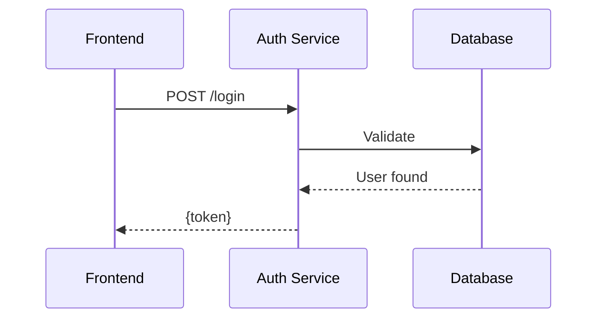

# Text to Slidev Converter

Convert technical text into **diagram-first, minimal-text** Slidev presentations.

## IMPORTANT: Load References First

Before generating slides, **read the reference files** for available layouts, components, and advanced features:

- [references/layouts.md](references/layouts.md) - All available layouts and when to use them
- [references/components.md](references/components.md) - Component API (Callout, VClicks, FolderTree, etc.)
- [references/advanced.md](references/advanced.md) - Mermaid diagrams, Magic Move, line highlighting
- [references/examples.md](references/examples.md) - Transformation examples

## Core Philosophy

> **"You are the content. Your slides are your Table of Contents."**

- Diagrams replace text — a good diagram replaces 200+ words
- One concept per slide — if you need "and", split it
- Speaker provides context; slides provide visual anchors
- Max 3-4 bullet points — prefer a diagram instead

## Required Frontmatter

```yaml
---
theme: '@alexop/slidev-theme-brand'
addons:
  - '@alexop/slidev-addon-utils'
title: [Generated Title]
layout: cover
---
```

## Workflow

1. **Read references** - Load layout/component/advanced docs
2. **Analyze** - Identify concepts that can be visualized
3. **Diagram First** - Ask: "Can this be a flowchart, sequence, or architecture diagram?"
4. **Minimize Text** - Short phrases, not sentences
5. **Structure** - Intro (`cover`) → body → conclusion (`section`)

## Diagram-First Approach

| Content Type | Use |
|--------------|-----|
| Process/workflow | `flowchart LR` or `TD` |
| API calls, interactions | `sequenceDiagram` |
| System architecture | `flowchart` with subgraphs |
| Data relationships | `erDiagram` |
| State transitions | `stateDiagram-v2` |

See [references/advanced.md](references/advanced.md) for Mermaid syntax and examples.

## Quick Layout Reference

| Pattern | Layout |
|---------|--------|
| Title slide | `cover` |
| New section | `section` |
| Diagram/content | `default` |
| Side-by-side | `two-cols` |
| Single metric | `fact` |
| Bold statement | `statement` |
| Closing | `section` or `end` |

See [references/layouts.md](references/layouts.md) for complete documentation.

## Key Rules

**Do:**
- One diagram per slide with short title (3-5 words)
- Use line highlighting for code: `ts {1|3-4|all}`
- Progressive reveal with `<VClicks>` (max 4 items)

**Don't:**
- Bullet lists explaining processes → use flowchart
- Paragraphs about architecture → use diagram
- Full sentences on slides → use 2-3 word phrases
- Diagram + long explanation → diagram + title only

## Example Transformation

**Input:** "When a user logs in, the frontend sends credentials to the auth service, which validates them against the database and returns a JWT token."

**Output:**
```markdown
# Login Flow


```

No bullet points. The diagram IS the explanation.
