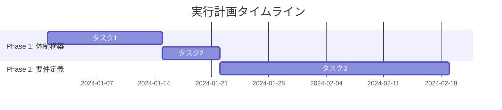

# UtilitySkills（共通ユーティリティ）

## 概要
Decision Governance Engineの各種ユーティリティ機能を提供するスキル集。

---

## 1. PDFレポート出力

### 機能
DecisionReportをPDF形式でエクスポートする。

### 入力スキーマ
```yaml
type: object
properties:
  report:
    type: object
    description: DecisionReportオブジェクト
  output_path:
    type: string
    description: 出力ファイルパス
  options:
    type: object
    properties:
      include_executive_summary:
        type: boolean
        default: true
      include_appendix:
        type: boolean
        default: false
      language:
        type: string
        enum: [ja, en]
        default: ja
```

### 出力スキーマ
```yaml
type: object
properties:
  success:
    type: boolean
  file_path:
    type: string
  file_size:
    type: integer
  pages:
    type: integer
```

### PDFレイアウト仕様

#### 表紙
- タイトル: 意思決定レポート
- レポートID
- 生成日時
- 機密レベル

#### 目次
1. エグゼクティブサマリー
2. 本質分析（道）
3. 戦略選定（法）
4. 実行計画（術）
5. 技術実装（器）
6. 検証結果（Review）

#### 各セクション
- 見出し + Agent名
- 構造化データをテーブル形式で表示
- グラフ・図表（成功確率、タイムラインなど）

#### フッター
- ページ番号
- 「本文書はDecision Governance Engineにより自動生成」

---

## 2. Markdown出力

### 機能
DecisionReportをMarkdown形式でエクスポートする。

### 入力スキーマ
```yaml
type: object
properties:
  report:
    type: object
  output_path:
    type: string
  options:
    type: object
    properties:
      include_mermaid:
        type: boolean
        default: true
        description: Mermaid図を含むか
```

### 出力形式
```markdown
# 意思決定レポート

## レポートID: DGE-20240101-ABC123

## エグゼクティブサマリー
- **一行結論**: [one_line_decision]
- **推奨アクション**: [recommended_action]
- **主要リスク**: [key_risks]
- **最初の一歩**: [first_step]

## 本質分析（道）
| 項目 | 内容 |
|------|------|
| 問題タイプ | [problem_type] |
| 本質 | [essence] |

...
```

---

## 3. タイムライン図生成

### 機能
ShuResultからGanttチャート（Mermaid形式）を生成する。

### 入力
```yaml
type: object
properties:
  shu_result:
    type: object
  format:
    type: string
    enum: [mermaid, plantuml, ascii]
    default: mermaid
```

### 出力（Mermaid形式）


---

## 4. リスクマトリクス生成

### 機能
FaResult/QiResultからリスクマトリクスを生成する。

### 入力
```yaml
type: object
properties:
  fa_result:
    type: object
  qi_result:
    type: object
```

### 出力（ASCII形式）
```
影響度 ↑
  高 │ ■ リスク1    ▲ リスク3
     │
  中 │        ● リスク2
     │
  低 │
     └────────────────────→ 発生確率
         低       中       高
```

---

## 5. エクスポート形式一覧

| 形式 | 拡張子 | 用途 |
|------|--------|------|
| PDF | .pdf | 印刷・共有・アーカイブ |
| Markdown | .md | ドキュメント管理・Wiki |
| JSON | .json | システム連携・API |
| HTML | .html | Web表示・プレゼン |
| CSV | .csv | データ分析・Excel |

---

## 6. 実装例（Python）

### PDFエクスポート
```python
from reportlab.lib.pagesizes import A4
from reportlab.platypus import SimpleDocTemplate, Paragraph, Table

async def export_to_pdf(report: DecisionReport, output_path: str) -> dict:
    """DecisionReportをPDFにエクスポート."""
    doc = SimpleDocTemplate(output_path, pagesize=A4)
    elements = []
    
    # タイトル
    elements.append(Paragraph(f"意思決定レポート: {report.report_id}"))
    
    # エグゼクティブサマリー
    elements.append(Paragraph("エグゼクティブサマリー"))
    summary_data = [
        ["一行結論", report.executive_summary.one_line_decision],
        ["推奨アクション", report.executive_summary.recommended_action],
    ]
    elements.append(Table(summary_data))
    
    # ... 各セクション追加
    
    doc.build(elements)
    
    return {
        "success": True,
        "file_path": output_path,
        "file_size": os.path.getsize(output_path),
        "pages": doc.page,
    }
```

### Markdownエクスポート
```python
def export_to_markdown(report: DecisionReport) -> str:
    """DecisionReportをMarkdownにエクスポート."""
    lines = [
        f"# 意思決定レポート",
        f"",
        f"**レポートID**: {report.report_id}",
        f"",
        f"## エグゼクティブサマリー",
        f"",
        f"| 項目 | 内容 |",
        f"|------|------|",
        f"| 一行結論 | {report.executive_summary.one_line_decision} |",
        f"| 推奨アクション | {report.executive_summary.recommended_action} |",
        # ...
    ]
    return "\n".join(lines)
```

---

## 7. 依存ライブラリ

| ライブラリ | バージョン | 用途 |
|------------|-----------|------|
| reportlab | >=4.0 | PDF生成 |
| Pillow | >=10.0 | 画像処理 |
| matplotlib | >=3.8 | グラフ生成 |
| pydantic | >=2.0 | データ検証 |

---

## 8. 使用例

```python
from apps.decision_governance_engine.skills.utils import (
    export_to_pdf,
    export_to_markdown,
    generate_timeline,
)

# PDF出力
result = await export_to_pdf(
    report=decision_report,
    output_path="./output/report.pdf",
    options={"include_executive_summary": True}
)

# Markdown出力
md_content = export_to_markdown(decision_report)

# タイムライン図
mermaid_code = generate_timeline(shu_result, format="mermaid")
```

