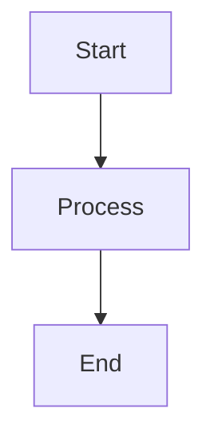

# Zenn Markdown Syntax Skill

## Overview

Zenn supports standard Markdown while providing unique extended syntax. This skill provides knowledge of Zenn-specific Markdown syntax to support effective article writing.

## Key Zenn-Specific Features

Zenn offers the following unique features:

1. **Message Blocks** - Styled notification boxes
2. **Accordion** - Collapsible sections
3. **Code Block Extensions** - Filename display, diff highlighting
4. **Embedded Content** - Link cards, videos, SNS, code platforms
5. **Mathematical Expressions** - KaTeX support
6. **Diagrams** - mermaid.js integration
7. **Image Controls** - Size specification, captions

## Commonly Used Syntax

### Message Blocks

Use to highlight supplementary information or notes for readers.

**Normal message:**
```markdown
:::message
Supplementary information or tips here
:::
```

**Alert message:**
```markdown
:::message alert
Important warnings or cautions here
:::
```

### Accordion

Use to collapse long supplementary explanations or optional information.

```markdown
:::details Title
Content to be hidden until expanded
:::
```

### Code Block Extensions

**Filename display:**
````markdown
```javascript:src/app.js
console.log('Hello, Zenn!');
```
````

**Diff display:**
````markdown
```diff javascript
- const old = 'old value';
+ const new = 'new value';
```
````

### Embedded Content

**Link card:**
```markdown
@[card](https://example.com)
```

**YouTube video:**
```markdown
@[youtube](VIDEO_ID)
```

**Twitter/X post:**
```markdown
https://twitter.com/username/status/1234567890
```

**Code platforms:**
```markdown
@[codesandbox](SANDBOX_ID)
@[stackblitz](PROJECT_ID)
```

### Mathematical Expressions

**Display mode:**
```markdown
$$
E = mc^2
$$
```

**Inline mode:**
```markdown
This equation $E = mc^2$ is Einstein's equation.
```

### Diagrams

Use mermaid.js to create flowcharts and sequence diagrams.

````markdown

````

**Limitations:** 2000 characters max, maximum 10 chain operators

## Image Placement Rules

Zenn uses dedicated image directories for each article.

**Directory structure:**
```
/images/[article-filename-without-extension]/[image-filename]
```

**Example:** For article file `20240101-my-article.md`
```
/images/20240101-my-article/screenshot.png
```

**Reference in article:**
```markdown

```

**Width specification:**
```markdown

```

**Caption:**
```markdown

*Image caption*
```

## Article Writing Recommendations

### Message Block Usage

- **`:::message`** - Use for supplementary information, hints, references
- **`:::message alert`** - Use for warnings, cautions, important information

Actively use where reader attention is needed.

### Accordion Usage

Collapse long supplementary explanations, detailed technical information, or optional steps to improve article readability.

### Code Block Tips

- Display filename to clarify which file the code belongs to
- Use diff display to visually highlight changes

### Effective Embedding Usage

- Use link cards for external article references
- Embed YouTube videos for content better explained with video
- Embed CodeSandbox or StackBlitz for interactive demos

### Visual Element Usage

- Visualize complex flows with mermaid diagrams
- Use KaTeX syntax for technical explanations requiring formulas
- Add appropriate size and captions to screenshots

## Syntax Usage Notes

### Nested Content

When nesting accordions or message blocks, add extra colons to outer containers.

```markdown
::::details Outer
Content

:::message
Nested message
:::

::::
```

### mermaid Limitations

Mermaid diagrams have limits of 2000 characters and maximum 10 chain operators. For overly complex diagrams, create with external tools and embed as images.

### HTML Comments

Only single-line HTML comments are supported. Multi-line comments cannot be used.

```markdown
<!-- This is a valid comment -->
```

## Additional Resources

### Detailed Reference

For more detailed syntax information, usage examples, and best practices, refer to the following reference file:

- **`references/syntax-guide.md`** - Complete reference for Zenn Markdown syntax

This reference contains detailed explanations of each syntax, multiple usage examples, and practical best practices.

## Practical Workflow

Follow this flow when writing articles using the syntax:

1. **Determine structure** - Decide heading structure
2. **Write content** - Write main text in standard Markdown
3. **Add extended syntax** - Add Zenn-specific syntax as needed
   - Supplementary info → Message blocks
   - Long explanations → Accordion
   - Code examples → Code blocks with filenames
   - External resources → Embeds
4. **Add visual elements** - Place diagrams, formulas, images
5. **Preview confirmation** - Preview with `npm run dev`

Prioritize syntax choices that help reader comprehension. Use syntax to effectively convey information, not just for decoration.
