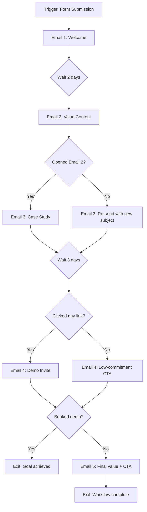

# Automation Workflow Designer

Designs marketing automation workflows with trigger logic, branching paths, timing delays, and platform-specific implementation specs. Outputs visual Mermaid diagrams and structured specs that can be directly implemented in HubSpot, Klaviyo, Mailchimp, or similar platforms.

## Prerequisites

- `agency.config.json` populated (services, ICP segments, outreach cadence)
- Workflow goal or use case
- Target platform (HubSpot, Klaviyo, Mailchimp, or platform-agnostic)

## Phase 0: Intake

Read `agency.config.json`:
- `services[]` -- for service-related workflow content
- `icp.segments[]` -- for segmentation logic
- `outreach.cadence` -- for timing reference
- `scoring` -- for lead scoring workflow design

Accept parameters:
- `workflow_type` -- (required) one of: `welcome-series`, `lead-nurture`, `abandoned-cart`, `post-purchase`, `re-engagement`, `lead-scoring`, `lifecycle-stage`, `event-triggered`, `custom`
- `platform` -- (required) one of: `hubspot`, `klaviyo`, `mailchimp`, `platform-agnostic`
- `goal` -- (required) the business outcome this workflow achieves
- `audience` -- (optional) segment definition for enrollment
- `touchpoints` -- (optional) number of emails/steps. Default: auto based on type
- `timeline` -- (optional) total workflow duration. Default: auto based on type

## Phase 1: Workflow Architecture

### Enrollment Trigger
Define what starts the workflow:

| Workflow Type | Default Trigger |
|--------------|----------------|
| Welcome Series | Form submission, signup, account creation |
| Lead Nurture | Lead score reaches threshold, downloads content |
| Abandoned Cart | Cart created + no purchase within 1 hour |
| Post-Purchase | Order confirmed |
| Re-engagement | No email open in 60 days, no site visit in 90 days |
| Lead Scoring | Any contact property change, page view, email interaction |
| Lifecycle Stage | Stage change (subscriber -> lead -> MQL -> SQL -> opportunity -> customer) |
| Event-Triggered | Specific event (webinar registration, demo request, pricing page visit) |

### Exit Conditions
Define what removes someone from the workflow:
- Achieved the goal (purchased, booked demo, etc.)
- Unsubscribed
- Entered a higher-priority workflow
- Manual removal
- Workflow completed all steps

### Suppression Rules
Define who should NOT enter:
- Existing customers (for acquisition workflows)
- Active deals in pipeline (for nurture workflows)
- Recently contacted (within 48 hours)
- Competitors or internal emails

## Phase 2: Workflow Steps

Design each step with:
```
STEP [N]:
  Type: [email / sms / wait / branch / score-update / property-update / notification / webhook]
  Timing: [immediately / delay: Xh/Xd / specific time / wait-for-event]

  If type = email:
    Subject: [subject line]
    Content theme: [what this email covers]
    CTA: [action to take]
    Personalization: [dynamic fields used]

  If type = branch:
    Condition: [what determines the path]
    YES path: [go to step X]
    NO path: [go to step Y]

  If type = score-update:
    Action: [add/subtract N points]
    Reason: [what triggered the score change]

  If type = wait:
    Duration: [hours/days]
    Smart timing: [send at optimal time in recipient's timezone]
```

### Workflow Templates by Type

**Welcome Series (5 emails over 14 days)**
```
Step 1: [Immediate] Welcome email - introduce brand, set expectations
Step 2: [Day 2] Value email - best content/resource, no sell
Step 3: [Branch] Opened Step 2?
  YES -> Step 4a: [Day 5] Case study / social proof
  NO -> Step 4b: [Day 5] Re-send Step 2 with new subject
Step 5: [Day 8] Educational content - teach something useful
Step 6: [Branch] Clicked any link in Steps 1-5?
  YES -> Step 7a: [Day 12] Soft CTA - invite to demo/call
  NO -> Step 7b: [Day 12] Different angle, lower commitment CTA
Step 8: [Day 14] Final value email + clear CTA
```

**Abandoned Cart (3 emails over 48 hours)**
```
Step 1: [1 hour] Reminder - "You left something behind"
Step 2: [Branch] Purchased?
  YES -> Exit
  NO -> Step 3: [24 hours] Social proof - reviews, bestseller status
Step 4: [Branch] Purchased?
  YES -> Exit
  NO -> Step 5: [48 hours] Urgency/incentive (if configured)
```

**Lead Scoring Workflow**
```
Step 1: [Trigger] Contact property or activity change
Step 2: [Branch] What activity?
  Email open -> +5 points
  Email click -> +10 points
  Page view (pricing) -> +20 points
  Page view (case study) -> +15 points
  Form submission -> +25 points
  Demo request -> +50 points, set lifecycle = MQL
Step 3: [Branch] Total score >= threshold?
  YES -> Notify sales, set lifecycle = SQL
  NO -> Continue nurture
```

## Phase 3: Branching Logic

Design conditional branches:

```
BRANCH: [descriptive name]
  Condition type: [property / event / score / list-membership / date]
  Condition: [specific logic]

  Example conditions:
  - "Contact opened email in last 7 days"
  - "Lead score > 50"
  - "Industry = D2C"
  - "Company size > 50 employees"
  - "Days since last website visit > 30"
  - "Lifecycle stage = MQL"
  - "Has NOT clicked any email in workflow"

  TRUE path: [action or next step]
  FALSE path: [action or next step]
```

## Phase 4: Mermaid Diagram

Generate a visual workflow as a Mermaid flowchart:



## Phase 5: Platform-Specific Implementation

### HubSpot
```
Workflow type: [Contact-based / Company-based / Deal-based]
Enrollment: [trigger criteria in HubSpot filter syntax]
Settings:
  - Re-enrollment: [yes/no]
  - Suppression lists: [list names]
  - Goal: [criteria that marks success]
  - Unenrollment: [criteria]
  - Execute on: [business days only / any day]
  - Time zone: [contact's timezone / fixed]

Step implementation:
  - Emails: Create in Marketing > Email > Automated
  - Delays: Use "Delay" action
  - Branches: Use "If/then branch"
  - Score: Use "Set contact property" for HubSpot Score
  - Notifications: Use "Send internal email notification"
```

### Klaviyo
```
Flow type: [Metric-triggered / List-triggered / Segment-triggered / Date-triggered]
Trigger: [metric name or list/segment]
Filters: [profile/event filters for enrollment]

Step implementation:
  - Emails: Flow emails (drag and drop)
  - SMS: Flow SMS action
  - Delays: Time delay or Smart Send Time
  - Branches: Conditional split (profile property, event, or flow activity)
  - Score: Use profile property update via webhook or custom integration
```

### Mailchimp
```
Journey type: [Welcome / Abandoned Cart / Custom]
Starting point: [tag added / list signup / purchase activity / custom event]

Step implementation:
  - Emails: Journey email steps
  - Delays: Wait steps (time-based)
  - Branches: If/Else (based on tags, activity, or purchase data)
  - Actions: Tag, untag, update merge field, archive
  - Limitations: No native lead scoring, requires Zapier integration
```

## Phase 6: Output

Return structured JSON:

```json
{
  "workflow_type": "welcome-series",
  "platform": "klaviyo",
  "goal": "Convert new subscribers to demo bookings within 14 days",
  "enrollment_trigger": "Added to 'Newsletter Subscribers' list",
  "exit_conditions": ["Booked demo", "Unsubscribed", "Workflow complete"],
  "suppression": ["Existing customers", "Active deal in pipeline"],
  "total_steps": 8,
  "total_emails": 5,
  "total_branches": 2,
  "timeline": "14 days",
  "steps": [
    {
      "step": 1,
      "type": "email",
      "timing": "immediate",
      "subject": "Welcome to Plasho -- here's what to expect",
      "content_theme": "Brand intro, value proposition, set email expectations",
      "cta": "Read our latest case study",
      "personalization": ["first_name", "company"]
    },
    {
      "step": 2,
      "type": "wait",
      "duration": "2 days",
      "smart_timing": true
    },
    {
      "step": 3,
      "type": "branch",
      "condition": "Opened email 1",
      "true_path": "step_4a",
      "false_path": "step_4b"
    }
  ],
  "mermaid_diagram": "graph TD\n    A[Trigger] --> B[Email 1]...",
  "platform_implementation": {
    "flow_type": "List-triggered",
    "trigger_list": "Newsletter Subscribers",
    "smart_send_time": true,
    "skip_weekends": true
  },
  "kpis_to_track": [
    "Open rate per email",
    "Click-through rate per email",
    "Demo booking rate",
    "Time to conversion",
    "Unsubscribe rate"
  ],
  "generated_at": "2026-03-13T10:00:00Z"
}
```

## Example Usage

Trigger phrases:
- "Design a welcome email series for new leads"
- "Build an abandoned cart flow for Klaviyo"
- "Create a lead scoring workflow for HubSpot"
- "Design a re-engagement campaign for dormant subscribers"
- "Plan a post-purchase follow-up sequence"
- "Build a lifecycle stage automation workflow"
- "Create a nurture sequence for MQLs"
