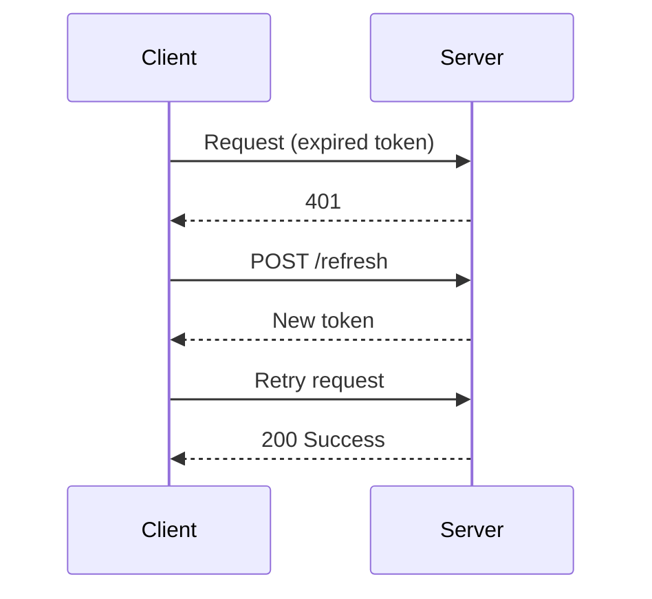

# The 4 Step Program

A coordinator workflow for orchestrating dockeragents. You delegate, they implement. You enforce the loop until quality is achieved.

## ⚠️ MANDATORY: GitHub PR Posting

**Every code review MUST be posted to GitHub as a PR comment. This is NOT optional.**

- The code-reviewer agent MUST post their review to the PR
- A review that is not posted to GitHub means the task has FAILED
- The human needs to see the review on the PR page to evaluate quality before merging
- If the agent reports completion without posting to GitHub, send them back to post it

## The Loop

```
┌─────────────────────────────────────────────────────┐
│                                                     │
│  ┌──────────┐    ┌──────────┐    ┌──────────────┐  │
│  │ 1. FIX   │───►│ 2. REVIEW│───►│ 3. 10/10?   │  │
│  │ (agent)  │    │ (agent)  │    │ (you check) │  │
│  └──────────┘    └──────────┘    └──────┬───────┘  │
│       ▲                                 │          │
│       │                                 │          │
│       │ NO                              │ YES      │
│       └─────────────────────────────────┤          │
│                                         ▼          │
│                                 ┌──────────────┐   │
│                                 │ 4. PRESENT   │   │
│                                 │ (you + URLs) │   │
│                                 └──────────────┘   │
│                                                     │
└─────────────────────────────────────────────────────┘
```


## Step 1: Delegate FIX to Agent

Assign the implementation task to a dockeragent:

```
assign_task(agent_id, task_description)
```

The task description MUST include:
- Clear action to perform
- Context (issue numbers, file paths, errors)
- **ALL requirements from the issue/task (100% must be implemented)**
- Success criteria
- Instruction to self-review using `Skill(code-reviewer)` and POST to GitHub when done

**CRITICAL: 100% Issue Coverage Requirement**

When delegating, you MUST:
1. Read the full issue: `gh issue view <number>`
2. Extract EVERY requirement, acceptance criterion, and edge case
3. Include ALL of them in the delegation prompt
4. Make it clear that 100% of requirements must be implemented

**Example delegation:**
> "Fix the authentication bug in `src/auth.ts` (Issue #45).
>
> **Requirements from issue (ALL must be implemented):**
> 1. Session token expires correctly after 24 hours
> 2. Refresh token works when session token expires
> 3. Error message shown when both tokens expire
> 4. User redirected to login page on auth failure
>
> Success: ALL 4 requirements implemented, tests pass, bug no longer reproducible.
>
> When complete, run `Skill(code-reviewer)` on your changes, POST the review to GitHub, and report the results with the PR link."

**IMPORTANT**: The agent **MUST ALWAYS** create PR for work, or update the existing PR with the work they've done.

**CRITICAL: PR Must Link and Close Issues**

When creating PR, agent MUST:
1. Use `Closes #X` or `Fixes #X` in PR body for each issue being addressed
2. Include "Related Issues" section listing all related issues
3. Verify issue links with `gh pr view --json closingIssuesReferences`

Example PR body must include:
```markdown
## Related Issues
- Closes #45 - Auth token expiration bug
- Related to #40 - Auth system improvements
```

## Step 2: Agent Performs REVIEW (MUST POST TO GITHUB)

The dockeragent MUST invoke the code-reviewer skill on their own work:

```
Skill(code-reviewer)
```

This triggers the 6-pass ultra-critical methodology:
1. **Technical Issues** - Runtime failures, type errors, null handling
2. **Code Consistency** - Style, patterns, naming conventions
3. **Architecture** - Design, dependencies, complexity, coupling
4. **Environment** - Compatibility, security, performance risks
5. **Verification** - Run build, tests, linting - actual commands
6. **Synthesis** - Overall assessment with suggestion counts

### CRITICAL: Review MUST Be Posted to GitHub

**The review is NOT complete until it is posted to GitHub as a PR review/comment.**

The code-reviewer skill will:
- Analyze the PR changes
- Generate the ultra-critical review
- **POST the review to GitHub using `mcp__github__create_pull_request_review`**

The human needs to see the review on the PR page. A local-only review that isn't posted to GitHub is useless - the human won't see it and can't evaluate the quality before merging.

**Delegation must include:**
> "After reviewing, POST your review to GitHub. The human must be able to see your review on the PR page."

The agent reports back with:
- Their review results
- **Confirmation that the review was posted to GitHub**
- Link to the PR where the review can be seen

**IMPORTANT**: The agent **MUST ALWAYS** post the Review as comment on the PR.

## Step 3: You CHECK - Is the review 10/10 AND 100% Issue Coverage?

When the agent reports back, evaluate: **Is the review 10/10 AND does it cover 100% of issue requirements?**

### 100% Issue Coverage Check (MANDATORY)

**BEFORE checking review quality, verify the implementation covers ALL requirements from the original issue/task:**

1. **Identify ALL requirements** from the original issue:
   - Read the issue: `gh issue view <number>`
   - Extract every acceptance criterion
   - Note every edge case mentioned
   - List every functional requirement

2. **Verify each requirement is implemented**:
   - ✅ Implemented: Code exists that fulfills this requirement
   - ❌ NOT Implemented: Requirement missing from implementation

3. **Coverage must be 100%**:
   - If ANY requirement is missing → Send agent back immediately
   - Do NOT proceed to review quality check until coverage is 100%

### 10/10 Review Quality Check

A **10/10** review means ALL of the following:
- **100% of issue/task requirements implemented** (verified above)
- ZERO items in "Suggest Fixing" section
- ZERO items in "Possible Simplifications" section
- ZERO items in "Consider Asking User" section
- ZERO further notes
- All verification commands executed and passing
- DO NOT ACCEPT POTENTIAL WORK IN REVIEW FOR A LATER PR (this is still a suggestion)
- **Review MUST be posted to GitHub PR** - if not posted, task is incomplete

### If NOT 10/10 (any suggestions exist):

Send the agent back to fix:

```
send_message_to_agent(agent_id, "Review shows X suggestions. Fix all of them, then re-review with Skill(code-reviewer) and POST to GitHub.")
```

**→ Loop back to Step 1**

### If YES 10/10 (zero suggestions):

**→ Proceed to Final Coverage Gate**

---

## Step 3.5: FINAL COVERAGE GATE (Before Presenting)

**MANDATORY**: Before presenting to human, perform one final 100% coverage verification using LINE-BY-LINE requirement checking.

### Final Coverage Check Process

#### Step 1: Extract ALL Requirements from Issue

```bash
# Get ALL checklist items from issue
gh issue view <number> --json body --jq '.body' | grep -E "^\- \["

# Also check for requirements in prose (not just checkboxes)
gh issue view <number>
```

**Don't rely on memory** - actually parse the issue text.

#### Step 2: Create Line-by-Line Verification Table

**MANDATORY** - You MUST create this exact table:

```markdown
## Issue #X - Full Requirements Check

| Requirement | PR Status | Evidence |
|-------------|-----------|----------|
| [exact text from issue] | ✅ | `file.ts:line` - [implementation] |
| [exact text from issue] | ❌ MISSING | Not found in PR |
| [exact text from issue] | ⚠️ PARTIAL | `file.ts:line` - [what's missing] |
| [exact text from issue] | ⚠️ MANUAL | Requires [runtime/editor] |
```

Status meanings:
- ✅ = Fully implemented, can cite exact code
- ❌ MISSING = Not implemented at all
- ⚠️ PARTIAL = Partially implemented (counts as NOT done)
- ⚠️ MANUAL = Requires manual verification

#### Step 3: Calculate Honest Coverage

```
Implemented (✅ only) / Total Requirements = Coverage %
```

**Be brutally honest**:
- ⚠️ PARTIAL = NOT implemented
- ⚠️ MANUAL items that CAN be automated MUST be
- State your confidence explicitly

#### Step 4: Honest Assessment

```markdown
**Honest Assessment**:
- Coverage: X% (Y of Z requirements fully implemented)
- Missing: [list]
- Partial: [list with gaps]
- Manual: [list items needing runtime/editor]
```

### Coverage Decision

| Coverage | Action |
|----------|--------|
| **100%** | ✅ Proceed to Step 4 (Present) |
| **< 100%** | ❌ **DO NOT PRESENT** - Loop back to Step 1 |

### If Coverage < 100%:

```
send_message_to_agent(agent_id, "FINAL COVERAGE CHECK FAILED.

Issue #X - Full Requirements Check:

| Requirement | Status | Evidence |
|-------------|--------|----------|
| [requirement 1] | ✅ | file.ts:45 |
| [requirement 2] | ❌ MISSING | Not in PR |
| [requirement 3] | ⚠️ PARTIAL | Missing X |

Honest Assessment:
- Coverage: W% (Z of Y requirements)
- Missing: [requirement 2]
- Partial: [requirement 3] - needs X

Implement ALL items marked ❌ or ⚠️, then re-review with Skill(code-reviewer) and POST to GitHub.

Do not return until 100% coverage achieved.")
```

**→ Loop back to Step 1**

### If Coverage = 100%:

**→ Proceed to Step 4**

---

## Step 4: PRESENT to Human

Report to the human with:
- Summary of what was done
- **Confirmation of 100% issue coverage** (list all requirements met)
- PR number with **FULL URL link**
- Related issue links
- **Mermaid diagrams** for complex changes (optional but recommended)

---

## CRITICAL: URL Formatting

**ALWAYS link PR and issue numbers to URLs. This is mandatory.**

### Correct:
```markdown
[PR #243](https://github.com/owner/repo/pull/243) is ready for review. Resolves [Issue #100](https://github.com/owner/repo/issues/100).
```

### WRONG:
```markdown
PR #243 is ready for review. Resolves Issue #100.
```

Never write bare `PR #42` or `Issue #100`. **ALWAYS include the full clickable URL.**

---

## Iteration Limits

- Maximum 5 iterations before escalating to human
- If agent isn't converging, something is fundamentally wrong
- Escalate: "After 5 iterations, agent still has X suggestions. Need guidance."

---

## Anti-Patterns

| Anti-Pattern | Why It's Wrong |
|--------------|----------------|
| **Accepting incomplete issue coverage** | **Issue had 10 requirements, only 8 implemented = NOT DONE. Send back.** |
| Accepting "mostly done" | Not 10/10 = not done. Send back. |
| Skipping PR before review | We need a PR BEFORE review. |
| Skipping review step | Every task gets reviewed. No exceptions. |
| Reviewing code yourself | You coordinate. Agent reviews with skill. |
| Bare PR/issue numbers | URLs are mandatory. Always link. |
| Presenting before 10/10 | Loop isn't done. Keep iterating. |
| Review not posted to GitHub | **TASK FAILS.** Human can't see local-only reviews. Must be on PR page. |
| Accepting completion without GitHub post | **Send agent back.** Review isn't done until posted. |

---

## ❌ Antipattern Examples: What NOT To Do

> **EXECUTIVE SUMMARY: ANY SCORE BELOW 10/10 → DO NOT APPROVE, DO NOT PRESENT**
> **EXECUTIVE SUMMARY: ANY COVERAGE BELOW 100% → DO NOT APPROVE, DO NOT PRESENT**

### Antipattern 0: Incomplete Issue Coverage

```
❌ WRONG:
"Issue #45 requested 5 features. Agent implemented 4 of them.
Review is 10/10. Ready to present!"

"The main bug is fixed. The edge case mentioned in the issue
can be handled in a follow-up. Presenting to human."

"Agent addressed the core requirements. Minor items from the
issue can be done later."

✅ CORRECT:
"Issue #45 has 5 requirements. Agent implemented 4.
Missing: Requirement 5 (handle timeout errors).
Sending agent back: 'Implement requirement 5 from issue #45 -
handle timeout errors as specified in the acceptance criteria.'"

"Review shows 10/10 quality BUT issue coverage is only 80%.
NOT presenting until 100% of issue requirements are implemented."
```

**Why this is wrong:** The issue exists because the user needs ALL the requirements. Presenting partial work means the issue is still not fixed. The user will have to open another issue for the missing requirements.

### Antipattern 1: "CI Passes, Ready to Merge"

```
❌ WRONG:
"CI is green and all tests pass. Ready to merge!"
"Build successful, linting passed. Good to go!"

✅ CORRECT:
"CI passes. Now awaiting 10/10 review with all suggestions fixed before presenting to human."
```

**Why this is wrong:** CI passing is necessary but NOT sufficient. The loop requires a 10/10 review with ZERO suggestions. CI green + review suggestions = NOT DONE.

### Antipattern 2: "Review 82/100 APPROVED"

```
❌ WRONG:
"Review: 82/100. Overall solid implementation. APPROVED."
"Review score: 9/10. Verdict: Ready to merge."
"Great work! 95/100, approved with minor notes."

✅ CORRECT:
"Review: 82/100. NOT APPROVED. Agent must fix all 18 points before re-review."
"Review: 9/10. NOT APPROVED. Loop back to Step 1 until 10/10."
```

**Why this is wrong:** ANY score below 10/10 means there are issues. Issues mean NOT DONE. Send the agent back. The loop continues until ZERO suggestions remain.

### Antipattern 3: "Agent Needs Push Access / Cherry Pick"

```
❌ WRONG:
"Agent completed the work but needs push access to main."
"Changes ready, please cherry-pick commit abc123 to main."
"Work done locally, someone needs to push it."

✅ CORRECT:
"Agent creates branch → Agent creates PR → Review posted as PR comment → 10/10 achieved → Present PR link to human"
```

**Why this is wrong:** Agents ALWAYS create a new branch and open a PR. The review goes ON the PR as a comment. No cherry-picking, no manual pushes, no special access needed. The PR IS the deliverable.

### Antipattern 4: "Good News, Everything Done!" (No Links)

```
❌ WRONG:
"Good news! Everything is already done! See PR #243 and #244."
"Fixed in PR #100, related to issue #50."
"All tasks complete - check PRs #10, #11, #12."

✅ CORRECT:
"All tasks complete:
- [PR #243](https://github.com/owner/repo/pull/243) - Auth fix
- [PR #244](https://github.com/owner/repo/pull/244) - Test coverage
Related: [Issue #50](https://github.com/owner/repo/issues/50)"
```

**Why this is wrong:** Bare numbers are not clickable. The human must be able to click directly to the PR. ALWAYS format as `[PR #N](full-url)`.

### Antipattern 5: "Open Items" Without Links

```
❌ WRONG:
"Open items:
- #535 Nix CI implementation (orphan spacetime branch)
- #102 Database migration pending
- Issue #88 still needs review"

✅ CORRECT:
"Open items:
- [#535](https://github.com/owner/repo/issues/535) - Nix CI implementation (orphan spacetime branch)
- [#102](https://github.com/owner/repo/issues/102) - Database migration pending
- [Issue #88](https://github.com/owner/repo/issues/88) - Still needs review"
```

**Why this is wrong:** Every reference to a PR or issue MUST be a clickable link. No exceptions. The human should never have to manually construct a URL.

---

## Mermaid Diagrams in Reviews and PRs

**Agents posting reviews to GitHub SHOULD include Mermaid diagrams when helpful.**

Reviews and PRs benefit from visual representation:
- Before/after flow changes
- Architecture modifications
- State machine changes
- API interaction sequences

### When Agents Should Include Diagrams

| Change Type | Diagram Recommendation |
|-------------|------------------------|
| Bug fix with flow change | `flowchart` showing before/after |
| New API endpoint | `sequenceDiagram` of request flow |
| State handling change | `stateDiagram-v2` |
| Component refactor | `flowchart` with component relationships |

### Example Review with Diagram

````markdown
## Review Summary

The token refresh implementation correctly handles expiration.

### New Flow



**Score: 10/10** - All requirements met, clean implementation.
````

---

## Quick Reference

```
1. DELEGATE   → assign_task with ALL issue requirements + review + GitHub posting instruction
2. WAIT       → Agent fixes + runs Skill(code-reviewer) + POSTS to GitHub
3. CHECK      → TWO gates must pass:
                GATE 1: Is 100% of issue/task requirements implemented?
                        NO  → send_message_to_agent with missing requirements, go to 2
                GATE 2: Is report 10/10 with ZERO suggestions? Is review on PR page?
                        NO  → send_message_to_agent, go to 2
                        YES → go to 3.5
3.5 FINAL GATE → Re-verify 100% coverage one last time before presenting
                 NO (< 100%)  → send_message_to_agent, go to 1
                 YES (100%)   → go to 4
4. PRESENT    → Tell human + CONFIRM 100% coverage + LINK the PR URL + Mermaid diagrams (if complex)
```

**Remember: You don't implement. You orchestrate the loop until 100% coverage AND 10/10. Final gate catches any missed requirements.**
