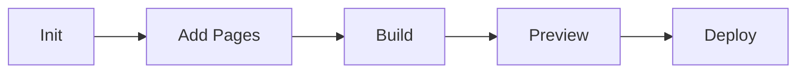

# agent-ops-mkdocs

Skill for managing MkDocs documentation sites: initializing, updating, building, and deploying.

## Purpose

Provide documentation site management capabilities:
1. Initialize MkDocs site from template
2. Add/update documentation pages
3. Generate navigation from directory structure
4. Build and preview locally
5. Deploy to GitHub Pages

## When to Use

- Setting up project documentation
- Adding new documentation pages
- Updating site configuration
- Deploying documentation updates

## Workflow Overview



## Commands

### Initialize Site

Set up a new MkDocs site with Material theme.

**Input:**
- Project name
- Site URL (optional)
- Theme options (optional)

**Process:**
1. Create `mkdocs.yml` with Material theme configuration
2. Create `docs/` directory structure
3. Create `docs/index.md` home page
4. Add recommended extensions (admonition, tabs, mermaid)

**Output:**
```
mkdocs.yml
docs/
├── index.md
├── getting-started.md
└── assets/
    └── .gitkeep
```

**Example:**
```
Initialize MkDocs documentation for this project
```

### Add Page

Add a new documentation page.

**Input:**
- Page title
- Section (optional)
- Content or template

**Process:**
1. Create markdown file in appropriate location
2. Update `nav` in mkdocs.yml
3. Add basic structure (title, sections)

**Example:**
```
Add a page called "API Reference" in the reference section
```

### Generate Navigation

Auto-generate nav structure from docs/ directory.

**Process:**
1. Scan docs/ directory recursively
2. Extract titles from markdown files
3. Build nav tree
4. Update mkdocs.yml

**Example:**
```
Update mkdocs navigation from directory structure
```

### Build Site

Build the static documentation site.

**Process:**
1. Run `mkdocs build`
2. Report any warnings/errors
3. Output to `site/` directory

**Example:**
```
Build the documentation site
```

### Preview Site

Start local development server.

**Process:**
1. Run `mkdocs serve`
2. Report URL (typically http://localhost:8000)
3. Watch for changes

**Example:**
```
Preview the documentation locally
```

### Deploy to GitHub Pages

Deploy documentation to GitHub Pages.

**Process:**
1. Build site with `mkdocs build --strict`
2. Deploy with `mkdocs gh-deploy`
3. Or use GitHub Actions workflow

**Example:**
```
Deploy documentation to GitHub Pages
```

## Configuration Templates

### Minimal mkdocs.yml

```yaml
site_name: Project Name
docs_dir: docs
site_dir: site

theme:
  name: material

plugins:
  - search

nav:
  - Home: index.md
```

### Full Featured mkdocs.yml

```yaml
site_name: Project Name
site_url: https://username.github.io/project/
site_description: Project description
docs_dir: docs
site_dir: site
use_directory_urls: true

repo_name: username/project
repo_url: https://github.com/username/project

theme:
  name: material
  features:
    - navigation.sections
    - navigation.tabs
    - navigation.tabs.sticky
    - navigation.expand
    - navigation.top
    - content.code.copy
    - content.code.annotate
    - search.suggest
    - search.highlight
  palette:
    - scheme: default
      primary: indigo
      accent: indigo
      toggle:
        icon: material/brightness-7
        name: Switch to dark mode
    - scheme: slate
      primary: indigo
      accent: indigo
      toggle:
        icon: material/brightness-4
        name: Switch to light mode

plugins:
  - search

markdown_extensions:
  - admonition
  - footnotes
  - tables
  - toc:
      permalink: true
  - pymdownx.superfences:
      custom_fences:
        - name: mermaid
          class: mermaid
          format: !!python/name:pymdownx.superfences.fence_code_format
  - pymdownx.details
  - pymdownx.highlight:
      anchor_linenums: true
      line_spans: __span
  - pymdownx.tabbed:
      alternate_style: true
  - pymdownx.emoji:
      emoji_index: !!python/name:material.extensions.emoji.twemoji
      emoji_generator: !!python/name:material.extensions.emoji.to_svg
  - attr_list
  - md_in_html

nav:
  - Home: index.md
  - Getting Started: getting-started.md
```

## Page Templates

### Standard Page

```markdown
# Page Title

Brief description of the page content.

## Section 1

Content...

## Section 2

Content...

## See Also

- [Related Page](related.md)
```

### API Reference Page

```markdown
# API Reference

## Endpoints

### GET /resource

Description of endpoint.

**Parameters:**

| Name | Type | Required | Description |
|------|------|----------|-------------|
| id | string | Yes | Resource identifier |

**Response:**

```json
{
  "id": "123",
  "name": "Example"
}
```

### POST /resource

...
```

### Tutorial Page

```markdown
# Tutorial: Feature Name

Learn how to use Feature Name in 10 minutes.

## Prerequisites

- Requirement 1
- Requirement 2

## Step 1: Setup

First, we need to...

## Step 2: Configuration

Next, configure...

## Step 3: Usage

Now you can...

## Summary

In this tutorial, you learned:

- Point 1
- Point 2

## Next Steps

- [Advanced Usage](advanced.md)
```

## Directory Structure Patterns

### Simple Project

```
docs/
├── index.md
├── getting-started.md
├── configuration.md
└── api-reference.md
```

### Medium Project

```
docs/
├── index.md
├── getting-started/
│   ├── installation.md
│   ├── quickstart.md
│   └── first-steps.md
├── guides/
│   ├── basic-usage.md
│   └── advanced-usage.md
├── reference/
│   ├── api.md
│   └── configuration.md
└── about/
    ├── changelog.md
    └── contributing.md
```

### Large Project

```
docs/
├── index.md
├── getting-started/
│   ├── index.md
│   ├── installation.md
│   ├── quickstart.md
│   └── tutorial.md
├── concepts/
│   ├── index.md
│   ├── architecture.md
│   └── terminology.md
├── guides/
│   ├── index.md
│   ├── user-guide.md
│   ├── admin-guide.md
│   └── developer-guide.md
├── reference/
│   ├── index.md
│   ├── api/
│   ├── cli/
│   └── configuration/
├── deployment/
│   ├── index.md
│   ├── docker.md
│   └── kubernetes.md
└── about/
    ├── changelog.md
    ├── roadmap.md
    └── contributing.md
```

## GitHub Actions Integration

### Deployment Workflow

```yaml
# .github/workflows/docs.yml
name: Deploy Documentation

on:
  push:
    branches: [main]
    paths:
      - 'docs/**'
      - 'mkdocs.yml'
  workflow_dispatch:

permissions:
  contents: write
  pages: write
  id-token: write

jobs:
  deploy:
    runs-on: ubuntu-latest
    steps:
      - uses: actions/checkout@v4
      - uses: actions/setup-python@v5
        with:
          python-version: '3.11'
      - run: pip install mkdocs-material pymdown-extensions
      - run: mkdocs gh-deploy --force
```

## Dependencies

Required Python packages:

```bash
pip install mkdocs mkdocs-material pymdown-extensions
```

Or with uv:

```bash
uv add --dev mkdocs mkdocs-material pymdown-extensions
```

## Validation

Before deploying, validate:

1. **Build succeeds**: `mkdocs build --strict`
2. **Links work**: No broken internal links
3. **Images load**: All referenced images exist
4. **Navigation correct**: All pages accessible

## Integration with Other Skills

| Skill | Integration |
|-------|-------------|
| `agent-ops-docs` | Documentation content management |
| `agent-ops-validation` | Include docs build in validation |
| `agent-ops-git` | Commit documentation changes |

## Troubleshooting

### "mkdocs: command not found"

Install MkDocs:
```bash
pip install mkdocs mkdocs-material
```

### "Theme 'material' not found"

Install Material theme:
```bash
pip install mkdocs-material
```

### "Mermaid diagrams not rendering"

Ensure superfences extension is configured correctly in mkdocs.yml.

### "Navigation not updating"

Regenerate nav:
```
Update mkdocs navigation from directory structure
```

### "GitHub Pages 404"

Check:
- `site_url` matches your GitHub Pages URL
- `use_directory_urls: true` is set
- gh-pages branch exists
