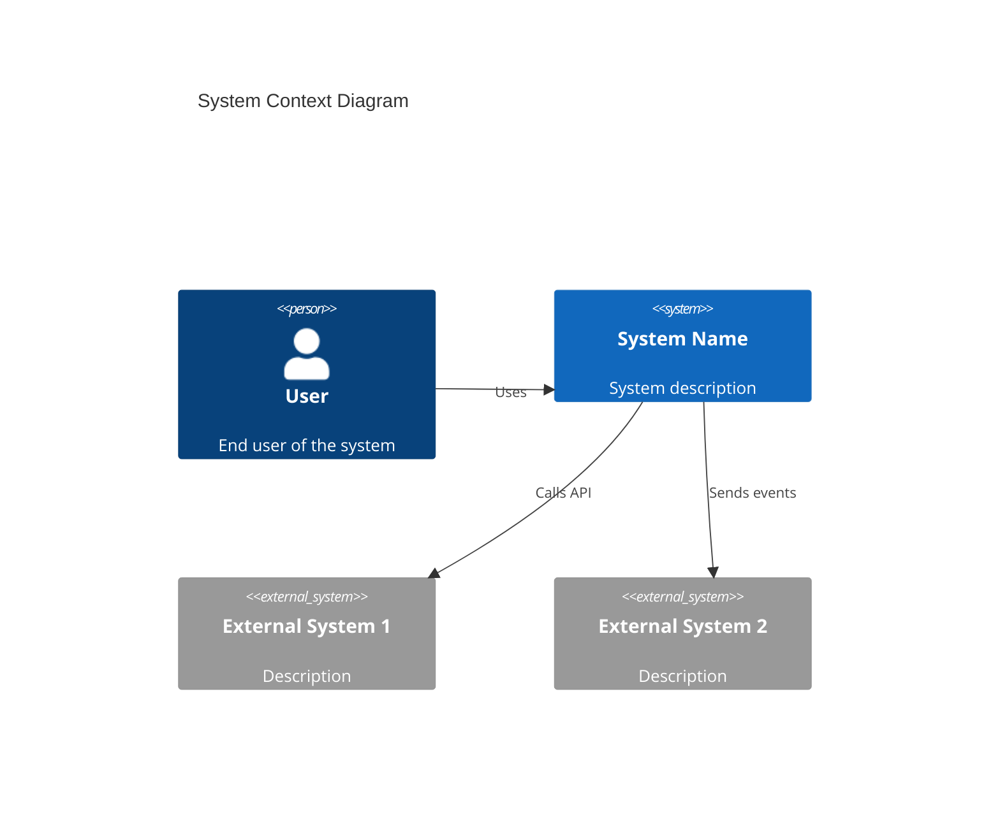
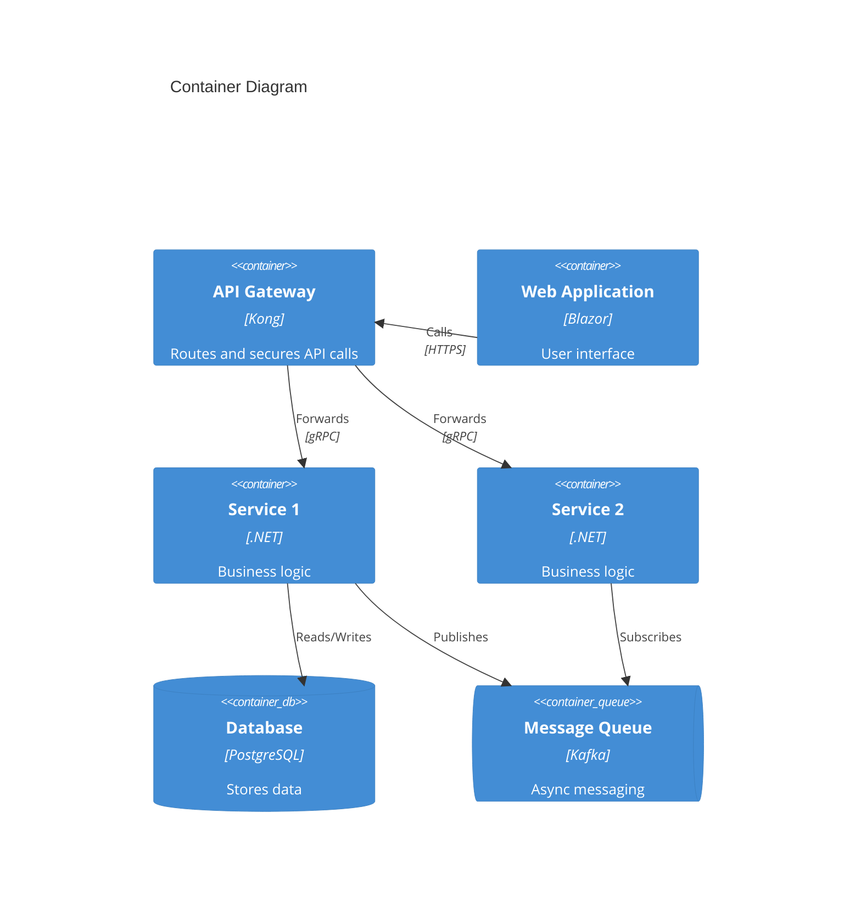
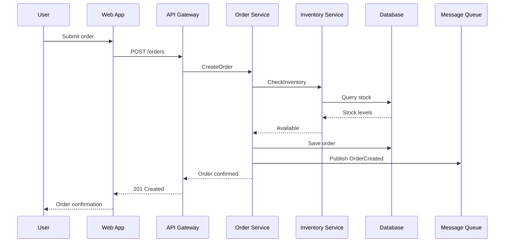
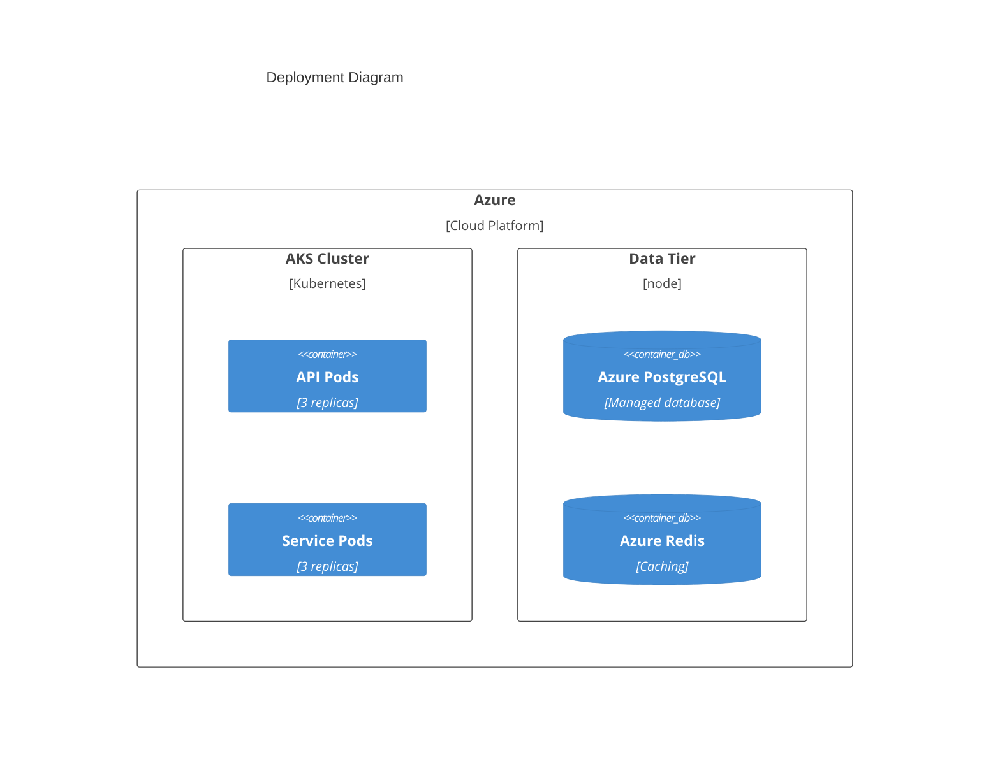
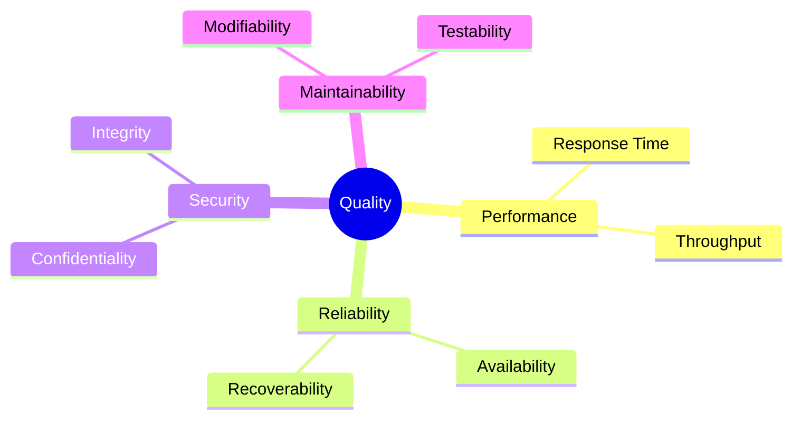

# arc42 Documentation Skill

## When to Use This Skill

Use this skill when:

- **Arc42 Documentation tasks** - Working on arc42 architecture documentation template and guidance
- **Planning or design** - Need guidance on Arc42 Documentation approaches
- **Best practices** - Want to follow established patterns and standards

## Overview

Create comprehensive architecture documentation using the arc42 template.

## MANDATORY: Documentation-First Approach

Before creating arc42 documentation:

1. **Invoke `docs-management` skill** for architecture documentation patterns
2. **Verify arc42 current version** via MCP servers (perplexity)
3. **Base guidance on official arc42 template**

## arc42 Template Structure

```text
arc42 Template (12 Sections):

┌─────────────────────────────────────────────────────────────────────────────┐
│  1. Introduction and Goals                                                   │
│     Requirements overview, quality goals, stakeholders                       │
├─────────────────────────────────────────────────────────────────────────────┤
│  2. Architecture Constraints                                                 │
│     Technical, organizational, and convention constraints                    │
├─────────────────────────────────────────────────────────────────────────────┤
│  3. System Scope and Context                                                 │
│     Business context, technical context                                      │
├─────────────────────────────────────────────────────────────────────────────┤
│  4. Solution Strategy                                                        │
│     Technology decisions, top-level decomposition, quality approaches        │
├─────────────────────────────────────────────────────────────────────────────┤
│  5. Building Block View                                                      │
│     Static decomposition: whitebox/blackbox at multiple levels               │
├─────────────────────────────────────────────────────────────────────────────┤
│  6. Runtime View                                                             │
│     Important scenarios, interactions, behaviors                             │
├─────────────────────────────────────────────────────────────────────────────┤
│  7. Deployment View                                                          │
│     Technical infrastructure, mapping of building blocks                     │
├─────────────────────────────────────────────────────────────────────────────┤
│  8. Cross-cutting Concepts                                                   │
│     Recurring patterns, approaches, principles                               │
├─────────────────────────────────────────────────────────────────────────────┤
│  9. Architecture Decisions                                                   │
│     Important decisions with rationale (may link to ADRs)                    │
├─────────────────────────────────────────────────────────────────────────────┤
│ 10. Quality Requirements                                                     │
│     Quality tree, quality scenarios                                          │
├─────────────────────────────────────────────────────────────────────────────┤
│ 11. Risks and Technical Debt                                                 │
│     Known risks, technical debt items                                        │
├─────────────────────────────────────────────────────────────────────────────┤
│ 12. Glossary                                                                 │
│     Important domain and technical terms                                     │
└─────────────────────────────────────────────────────────────────────────────┘
```

## Complete arc42 Template

```markdown
# Architecture Documentation: [System Name]

**Version:** 1.0
**Date:** [Date]
**Status:** Draft | Review | Final

---

## 1. Introduction and Goals

### 1.1 Requirements Overview

[Brief description of the system and its purpose. What business problem
does it solve? Who are the main users?]

**Key Features:**
- [Feature 1]
- [Feature 2]
- [Feature 3]

### 1.2 Quality Goals

| Priority | Quality Goal | Description |
|----------|--------------|-------------|
| 1 | [Goal] | [Description] |
| 2 | [Goal] | [Description] |
| 3 | [Goal] | [Description] |

### 1.3 Stakeholders

| Role | Name/Team | Expectations |
|------|-----------|--------------|
| Product Owner | [Name] | [Expectations] |
| Development Team | [Team] | [Expectations] |
| Operations | [Team] | [Expectations] |
| Security | [Team] | [Expectations] |

---

## 2. Architecture Constraints

### 2.1 Technical Constraints

| Constraint | Description | Background |
|------------|-------------|------------|
| [TC-1] | [Description] | [Why this constraint exists] |
| [TC-2] | [Description] | [Why this constraint exists] |

### 2.2 Organizational Constraints

| Constraint | Description | Background |
|------------|-------------|------------|
| [OC-1] | [Description] | [Why this constraint exists] |
| [OC-2] | [Description] | [Why this constraint exists] |

### 2.3 Conventions

| Convention | Description |
|------------|-------------|
| [CON-1] | [Description] |
| [CON-2] | [Description] |

---

## 3. System Scope and Context

### 3.1 Business Context

[Diagram showing the system in its business environment, with actors
and external systems it interacts with.]



| Actor/System | Description | Communication |
|--------------|-------------|---------------|
| [Actor 1] | [Description] | [Protocol/Format] |
| [External System 1] | [Description] | [Protocol/Format] |

### 3.2 Technical Context

[Technical details of integration: protocols, data formats, interfaces.]

| Interface | Technology | Description |
|-----------|------------|-------------|
| [API 1] | REST/JSON | [Description] |
| [Queue 1] | Kafka | [Description] |
| [File 1] | SFTP/CSV | [Description] |

---

## 4. Solution Strategy

### 4.1 Technology Decisions

| Decision | Technology | Rationale |
|----------|------------|-----------|
| Programming Language | C# (.NET 10) | [Rationale] |
| Database | PostgreSQL | [Rationale] |
| Message Broker | Kafka | [Rationale] |
| Cloud Platform | Azure | [Rationale] |

### 4.2 Top-Level Decomposition

[High-level description of how the system is structured.]

**Approach:** [Microservices / Modular Monolith / etc.]

**Key Modules:**

### 4.3 Approaches to Achieve Quality Goals

| Quality Goal | Approach |
|--------------|----------|
| Performance | Caching, async processing, optimized queries |
| Reliability | Redundancy, circuit breakers, retry patterns |
| Security | Defense in depth, encryption, audit logging |

---

## 5. Building Block View

### 5.1 Level 1: Whitebox Overall System



**Contained Building Blocks:**

| Building Block | Purpose |
|----------------|---------|
| API Gateway | Request routing, authentication, rate limiting |
| Web Application | User interface and presentation |
| Service 1 | [Core business function] |
| Service 2 | [Core business function] |

### 5.2 Level 2: [Building Block Name]

[Whitebox description of a specific building block, showing its
internal structure.]

**Responsibility:** [What this block does]

**Interfaces:**

**Internal Structure:**

| Component | Responsibility |
|-----------|---------------|
| [Component 1] | [Description] |
| [Component 2] | [Description] |

---

## 6. Runtime View

### 6.1 Scenario: [User Creates Order]



**Description:** [Explanation of the scenario and any important details]

### 6.2 Scenario: [Another Important Scenario]

[Similar structure...]

---

## 7. Deployment View

### 7.1 Infrastructure Level 1



### 7.2 Infrastructure Elements

| Element | Technology | Description |
|---------|------------|-------------|
| Kubernetes Cluster | AKS | Container orchestration |
| Load Balancer | Azure LB | Traffic distribution |
| Database | Azure PostgreSQL | Persistent storage |
| Cache | Azure Redis | In-memory caching |

---

## 8. Cross-cutting Concepts

### 8.1 Domain Model

[Core domain entities and their relationships]

### 8.2 Security

**Authentication:** OAuth 2.0 / OpenID Connect
**Authorization:** Role-based access control (RBAC)
**Data Protection:** Encryption at rest (AES-256), in transit (TLS 1.3)

### 8.3 Error Handling

**Strategy:** Structured error responses with correlation IDs
**Logging:** Structured logging with severity levels
**Monitoring:** Distributed tracing with OpenTelemetry

### 8.4 Testability

**Unit Testing:** xUnit, Moq, FluentAssertions
**Integration Testing:** TestContainers
**E2E Testing:** Playwright

---

## 9. Architecture Decisions

| ID | Decision | Status | Date |
|----|----------|--------|------|
| ADR-001 | [Decision title] | Accepted | [Date] |
| ADR-002 | [Decision title] | Accepted | [Date] |

[Link to detailed ADR documents]

---

## 10. Quality Requirements

### 10.1 Quality Tree



### 10.2 Quality Scenarios

| ID | Scenario | Attribute | Target |
|----|----------|-----------|--------|
| QS-1 | API response under load | Performance | P95 < 200ms |
| QS-2 | System availability | Reliability | 99.9% |
| QS-3 | Add new payment provider | Modifiability | < 5 days |

---

## 11. Risks and Technical Debt

### 11.1 Risks

| ID | Risk | Impact | Probability | Mitigation |
|----|------|--------|-------------|------------|
| R-1 | [Risk description] | High | Medium | [Mitigation] |
| R-2 | [Risk description] | Medium | Low | [Mitigation] |

### 11.2 Technical Debt

| ID | Debt Item | Impact | Priority |
|----|-----------|--------|----------|
| TD-1 | [Debt description] | [Impact] | High |
| TD-2 | [Debt description] | [Impact] | Medium |

---

## 12. Glossary

| Term | Definition |
|------|------------|
| [Term 1] | [Definition] |
| [Term 2] | [Definition] |
| [Term 3] | [Definition] |

```text

```

## Section Guidelines

### When to Include Each Section

| Section | Always Include | Include If... |
|---------|----------------|---------------|
| 1. Introduction | ✓ | - |
| 2. Constraints | ✓ | - |
| 3. Context | ✓ | - |
| 4. Solution Strategy | ✓ | - |
| 5. Building Blocks | ✓ | - |
| 6. Runtime | | Important scenarios exist |
| 7. Deployment | ✓ | - |
| 8. Cross-cutting | ✓ | - |
| 9. Decisions | ✓ | - |
| 10. Quality | | Quality requirements defined |
| 11. Risks | | Known risks exist |
| 12. Glossary | | Domain-specific terms |

## Workflow

When creating arc42 documentation:

1. **Start with context**: Sections 1-3 establish the "what" and "why"
2. **Document decisions**: Section 4 captures strategic choices
3. **Detail structure**: Section 5 shows how it's built
4. **Show behavior**: Section 6 demonstrates how it works
5. **Map to infrastructure**: Section 7 shows where it runs
6. **Capture patterns**: Section 8 documents recurring solutions
7. **Record decisions**: Section 9 links to ADRs
8. **Define quality**: Section 10 sets expectations
9. **Acknowledge risks**: Section 11 shows awareness
10. **Define terms**: Section 12 ensures shared understanding

## References

For detailed guidance:

---

**Last Updated:** 2025-12-26
