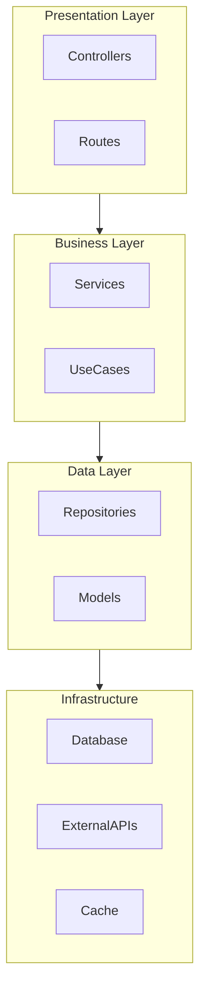

# Arch Visualizer Skill v1.0

**아키텍처 자동 문서화** - codebase-graph를 시각적 다이어그램과 문서로 자동 변환

## 핵심 컨셉

```yaml
Problem:
  Manual_Documentation:
    - "아키텍처 문서가 코드와 동기화 안 됨"
    - "다이어그램 수동 업데이트 번거로움"
    - "신규 개발자 온보딩 지연"

Solution:
  Auto_Visualization:
    - "codebase-graph 데이터로 자동 생성"
    - "코드 변경 시 자동 갱신"
    - "다양한 포맷 지원 (Mermaid, PlantUML, ASCII)"

Output_Types:
  - "codebase_graph.md: 전체 아키텍처 문서"
  - "모듈 의존성 다이어그램"
  - "클래스 다이어그램"
  - "호출 흐름 다이어그램"
  - "레이어 다이어그램"
```

## 자동 발동 조건

```yaml
Auto_Trigger_Conditions:
  Keywords_KO:
    - "아키텍처 문서, 구조 문서"
    - "다이어그램 생성, 시각화"
    - "프로젝트 구조, 코드 구조"
    - "codebase_graph.md 생성"
    - "의존성 다이어그램, 클래스 다이어그램"
    - "온보딩 문서, 신규 개발자 문서"

  Keywords_EN:
    - "architecture document, structure doc"
    - "generate diagram, visualize"
    - "project structure, code structure"
    - "dependency diagram, class diagram"
    - "onboarding document"

  Events:
    - "프로젝트 초기 분석 완료 후"
    - "대규모 리팩토링 후"
    - "/arch 명령어 실행 시"

  Scheduled:
    - "주요 변경사항 커밋 후 자동 갱신"
```

## 생성 가능한 다이어그램

### 1. 모듈 의존성 다이어그램
```yaml
Module_Dependency:
  purpose: "모듈/패키지 간 의존 관계"
  format: "Mermaid flowchart"
  shows:
    - "폴더/패키지 단위"
    - "import 방향"
    - "순환 참조 표시"
```

### 2. 클래스 다이어그램
```yaml
Class_Diagram:
  purpose: "클래스 간 상속/구현 관계"
  format: "Mermaid classDiagram"
  shows:
    - "클래스/인터페이스"
    - "상속 관계"
    - "구현 관계"
    - "주요 메서드"
```

### 3. 시퀀스 다이어그램
```yaml
Sequence_Diagram:
  purpose: "특정 기능의 호출 흐름"
  format: "Mermaid sequenceDiagram"
  shows:
    - "함수 호출 순서"
    - "비동기 호출"
    - "에러 핸들링 흐름"
```

### 4. 레이어 다이어그램
```yaml
Layer_Diagram:
  purpose: "계층 구조 (Controller→Service→Repository)"
  format: "Mermaid flowchart TB"
  shows:
    - "계층 분리"
    - "계층 간 통신"
    - "위반 사항 강조"
```

### 5. 컴포넌트 다이어그램
```yaml
Component_Diagram:
  purpose: "고수준 시스템 구조"
  format: "Mermaid/C4Model"
  shows:
    - "주요 컴포넌트"
    - "외부 시스템"
    - "데이터 흐름"
```

## codebase_graph.md 템플릿

```markdown
# {{projectName}} Architecture

> Auto-generated on {{generatedAt}}
> Based on codebase-graph analysis

## Overview

| Metric | Value |
|--------|-------|
| Total Files | {{totalFiles}} |
| Total Functions | {{totalFunctions}} |
| Total Classes | {{totalClasses}} |
| Total Types | {{totalTypes}} |
| Languages | {{languages}} |
| Framework | {{framework}} |

---

## Project Structure

```
{{projectTree}}
```

---

## Module Dependency Graph

```mermaid
flowchart LR
{{moduleDependencyMermaid}}
```

### Key Modules

| Module | Files | Functions | Complexity | Description |
|--------|-------|-----------|------------|-------------|
{{#each keyModules}}
| {{name}} | {{fileCount}} | {{functionCount}} | {{avgComplexity}} | {{description}} |
{{/each}}

---

## Layer Architecture



### Layer Distribution

| Layer | Files | % |
|-------|-------|---|
{{#each layers}}
| {{name}} | {{fileCount}} | {{percentage}}% |
{{/each}}

---

## Class Relationships

```mermaid
classDiagram
{{classDiagramMermaid}}
```

### Key Classes

{{#each keyClasses}}
#### {{name}}
- **Path**: `{{path}}`
- **Extends**: {{extends}}
- **Implements**: {{implements}}
- **Methods**: {{methodCount}}
- **Injected Dependencies**: {{dependencies}}
{{/each}}

---

## API Endpoints

| Method | Path | Handler | Description |
|--------|------|---------|-------------|
{{#each endpoints}}
| {{method}} | {{path}} | {{handler}} | {{description}} |
{{/each}}

---

## Entry Points

### Main Entry
- **File**: `{{mainEntry}}`
- **Bootstrap**: `{{bootstrapFunction}}`

### Route Entry Points
{{#each routeEntries}}
- `{{path}}` → {{handler}}
{{/each}}

---

## Hot Spots (High Complexity)

| Function | Complexity | LOC | File |
|----------|------------|-----|------|
{{#each hotSpots}}
| {{name}} | {{complexity}} | {{loc}} | {{file}} |
{{/each}}

---

## Circular Dependencies

{{#if circularDependencies.length}}
**Detected {{circularDependencies.length}} circular dependencies:**

{{#each circularDependencies}}
{{index}}. `{{cycle}}`
{{/each}}
{{else}}
No circular dependencies detected.
{{/if}}

---

## Orphan Code (Unused)

{{#if orphans.length}}
**Found {{orphans.length}} potentially unused exports:**

{{#each orphans}}
- `{{path}}:{{name}}`
{{/each}}
{{else}}
No unused exports detected.
{{/if}}

---

## Quick Navigation

### By Feature
{{#each features}}
- **{{name}}**: {{files}}
{{/each}}

### By Layer
- **Controllers**: {{controllerFiles}}
- **Services**: {{serviceFiles}}
- **Repositories**: {{repositoryFiles}}
- **Types**: {{typeFiles}}

---

## Onboarding Guide

### 1. Where to Start
{{startingPoints}}

### 2. Core Concepts
{{coreConcepts}}

### 3. Common Patterns
{{commonPatterns}}

### 4. Configuration
{{configurationGuide}}

---

*This document is auto-generated and will be updated when the codebase changes.*
*Last updated: {{lastUpdated}}*
```

## Mermaid 다이어그램 생성기

```typescript
class MermaidGenerator {
  private graph: CodebaseGraph;

  constructor(graph: CodebaseGraph) {
    this.graph = graph;
  }

  /**
   * 모듈 의존성 다이어그램 생성
   */
  generateModuleDependency(): string {
    const modules = this.getModules();
    const lines: string[] = ['flowchart LR'];

    // 모듈 노드 정의
    for (const mod of modules) {
      const sanitized = this.sanitizeId(mod.name);
      lines.push(`    ${sanitized}["${mod.name}"]`);
    }

    // 의존성 엣지
    const edges = this.graph.edges.filter(e => e.type === 'imports');
    const moduleEdges = this.aggregateToModules(edges);

    for (const { source, target, weight } of moduleEdges) {
      const sourceId = this.sanitizeId(source);
      const targetId = this.sanitizeId(target);

      if (weight > 5) {
        lines.push(`    ${sourceId} ==> ${targetId}`); // 강한 의존성
      } else {
        lines.push(`    ${sourceId} --> ${targetId}`);
      }
    }

    // 순환 참조 표시
    const cycles = this.graph.detectCircularDependencies();
    for (const cycle of cycles) {
      const cycleNodes = cycle.map(n => this.sanitizeId(n));
      lines.push(`    %% Circular: ${cycleNodes.join(' -> ')}`);
    }

    return lines.join('\n');
  }

  /**
   * 클래스 다이어그램 생성
   */
  generateClassDiagram(scope?: string): string {
    const classes = this.graph.nodes
      .filter(n => n.type === 'class')
      .filter(n => !scope || n.path.includes(scope));

    const lines: string[] = ['classDiagram'];

    // 클래스 정의
    for (const cls of classes) {
      lines.push(`    class ${cls.name} {`);

      // 프로퍼티
      for (const prop of cls.properties?.slice(0, 5) || []) {
        const visibility = prop.visibility === 'private' ? '-' :
                          prop.visibility === 'protected' ? '#' : '+';
        lines.push(`        ${visibility}${prop.name}: ${this.simplifyType(prop.type)}`);
      }

      // 메서드
      for (const methodId of cls.methods?.slice(0, 5) || []) {
        const method = this.graph.findNode(methodId);
        if (method) {
          lines.push(`        +${method.name}()`);
        }
      }

      lines.push(`    }`);
    }

    // 관계
    for (const cls of classes) {
      if (cls.extends) {
        lines.push(`    ${cls.extends} <|-- ${cls.name}`);
      }
      for (const impl of cls.implements || []) {
        lines.push(`    ${impl} <|.. ${cls.name}`);
      }
    }

    return lines.join('\n');
  }

  /**
   * 시퀀스 다이어그램 생성 (특정 흐름)
   */
  generateSequenceDiagram(entryPoint: string, depth: number = 5): string {
    const lines: string[] = ['sequenceDiagram'];
    const visited = new Set<string>();
    const participants = new Set<string>();

    const traverse = (nodeId: string, currentDepth: number, caller?: string) => {
      if (currentDepth > depth) return;
      if (visited.has(`${caller}->${nodeId}`)) return;
      visited.add(`${caller}->${nodeId}`);

      const node = this.graph.findNode(nodeId);
      if (!node) return;

      const participant = this.getParticipant(node);
      participants.add(participant);

      if (caller) {
        const callerParticipant = this.getParticipant(this.graph.findNode(caller)!);
        if (node.isAsync) {
          lines.push(`    ${callerParticipant}->>+${participant}: ${node.name}()`);
          lines.push(`    ${participant}-->>-${callerParticipant}: result`);
        } else {
          lines.push(`    ${callerParticipant}->>+${participant}: ${node.name}()`);
        }
      }

      // 호출하는 함수들 추적
      const calls = this.graph.getOutgoingEdges(nodeId, 'calls');
      for (const call of calls.slice(0, 5)) {
        traverse(call.target, currentDepth + 1, nodeId);
      }
    };

    traverse(entryPoint, 0);

    // 참여자 선언 추가
    const participantLines = Array.from(participants).map(p =>
      `    participant ${p}`
    );

    return [lines[0], ...participantLines, ...lines.slice(1)].join('\n');
  }

  /**
   * 레이어 다이어그램 생성
   */
  generateLayerDiagram(): string {
    const layers = this.detectLayers();
    const lines: string[] = ['flowchart TB'];

    // 레이어 서브그래프
    for (const layer of layers) {
      lines.push(`    subgraph ${layer.name}["${layer.displayName}"]`);
      for (const node of layer.nodes.slice(0, 10)) {
        const id = this.sanitizeId(node.name);
        lines.push(`        ${id}["${node.name}"]`);
      }
      lines.push(`    end`);
    }

    // 레이어 간 의존성
    for (let i = 0; i < layers.length - 1; i++) {
      lines.push(`    ${layers[i].name} --> ${layers[i + 1].name}`);
    }

    // 위반 사항 (아래 레이어가 위 레이어 참조)
    const violations = this.detectLayerViolations(layers);
    for (const v of violations) {
      lines.push(`    %% VIOLATION: ${v.from} --> ${v.to}`);
      lines.push(`    ${v.from} -.->|violation| ${v.to}`);
    }

    return lines.join('\n');
  }

  /**
   * 레이어 자동 감지
   */
  private detectLayers(): Layer[] {
    const layerPatterns = [
      { name: 'controllers', displayName: 'Presentation', patterns: ['controller', 'route', 'resolver'] },
      { name: 'services', displayName: 'Business', patterns: ['service', 'usecase', 'handler'] },
      { name: 'repositories', displayName: 'Data', patterns: ['repository', 'dao', 'model'] },
      { name: 'infrastructure', displayName: 'Infrastructure', patterns: ['database', 'cache', 'queue'] },
    ];

    return layerPatterns.map(layer => ({
      ...layer,
      nodes: this.graph.nodes.filter(n =>
        layer.patterns.some(p => n.path.toLowerCase().includes(p) || n.name.toLowerCase().includes(p))
      ),
    }));
  }

  /**
   * 레이어 위반 감지
   */
  private detectLayerViolations(layers: Layer[]): Violation[] {
    const violations: Violation[] = [];
    const layerOrder = layers.map(l => l.name);

    for (const edge of this.graph.edges.filter(e => e.type === 'imports')) {
      const sourceLayer = this.getLayerForNode(edge.source, layers);
      const targetLayer = this.getLayerForNode(edge.target, layers);

      if (sourceLayer && targetLayer) {
        const sourceIndex = layerOrder.indexOf(sourceLayer);
        const targetIndex = layerOrder.indexOf(targetLayer);

        // 아래 레이어가 위 레이어를 참조하면 위반
        if (sourceIndex > targetIndex) {
          violations.push({
            from: this.graph.findNode(edge.source)?.name || edge.source,
            to: this.graph.findNode(edge.target)?.name || edge.target,
            fromLayer: sourceLayer,
            toLayer: targetLayer,
          });
        }
      }
    }

    return violations;
  }

  private sanitizeId(name: string): string {
    return name.replace(/[^a-zA-Z0-9]/g, '_');
  }

  private simplifyType(type: string): string {
    if (type.length > 20) return type.substring(0, 17) + '...';
    return type;
  }

  private getParticipant(node: GraphNode): string {
    // 클래스 이름 또는 파일 이름
    const parts = node.path.split('/');
    return parts[parts.length - 1].replace('.ts', '');
  }

  private getModules(): { name: string; files: string[] }[] {
    const modules = new Map<string, string[]>();

    for (const node of this.graph.nodes.filter(n => n.type === 'file')) {
      const parts = node.path.split('/');
      const moduleName = parts.length > 2 ? parts.slice(0, -1).join('/') : parts[0];

      if (!modules.has(moduleName)) {
        modules.set(moduleName, []);
      }
      modules.get(moduleName)!.push(node.path);
    }

    return Array.from(modules.entries()).map(([name, files]) => ({ name, files }));
  }

  private aggregateToModules(edges: GraphEdge[]): { source: string; target: string; weight: number }[] {
    const moduleEdges = new Map<string, number>();

    for (const edge of edges) {
      const sourceModule = this.getModuleName(edge.source);
      const targetModule = this.getModuleName(edge.target);

      if (sourceModule !== targetModule) {
        const key = `${sourceModule}->${targetModule}`;
        moduleEdges.set(key, (moduleEdges.get(key) || 0) + 1);
      }
    }

    return Array.from(moduleEdges.entries()).map(([key, weight]) => {
      const [source, target] = key.split('->');
      return { source, target, weight };
    });
  }

  private getModuleName(path: string): string {
    const parts = path.split('/');
    return parts.length > 2 ? parts.slice(0, 2).join('/') : parts[0];
  }

  private getLayerForNode(nodeId: string, layers: Layer[]): string | null {
    for (const layer of layers) {
      if (layer.nodes.some(n => n.id === nodeId)) {
        return layer.name;
      }
    }
    return null;
  }
}
```

## Quick Commands

| Command | Action |
|---------|--------|
| `arch generate` | codebase_graph.md 전체 생성 |
| `arch modules` | 모듈 의존성 다이어그램 |
| `arch classes [scope]` | 클래스 다이어그램 |
| `arch sequence <entry>` | 시퀀스 다이어그램 |
| `arch layers` | 레이어 다이어그램 |
| `arch update` | 기존 문서 갱신 |
| `arch violations` | 레이어 위반 사항 |
| `arch onboarding` | 온보딩 문서 생성 |

## 다른 스킬과의 통합

```yaml
Integration:
  codebase-graph:
    type: "데이터 소스"
    usage: "그래프 데이터 조회"

  smart-context:
    type: "협력"
    usage: "문서화 컨텍스트 생성"

  code-reviewer:
    type: "소비자"
    usage: "리뷰 시 구조 참조"

  monorepo-architect:
    type: "협력"
    usage: "모노레포 구조 시각화"
```

## 문서 구조

```
arch-visualizer/
├── SKILL.md                      # 이 파일 (메인)
├── core/
│   ├── diagram-types.md          # 다이어그램 유형 설명
│   └── layer-detection.md        # 레이어 자동 감지
├── generators/
│   ├── mermaid-generator.md      # Mermaid 생성기
│   ├── plantuml-generator.md     # PlantUML 생성기
│   └── ascii-generator.md        # ASCII 생성기
├── templates/
│   ├── codebase-graph-template.md # 메인 문서 템플릿
│   └── onboarding-template.md    # 온보딩 문서 템플릿
└── quick-reference/
    ├── commands.md               # 명령어 가이드
    └── mermaid-syntax.md         # Mermaid 문법 참조
```

---

**Version**: 1.0.0
**Quality Target**: 90%
**Required Skill**: codebase-graph
**Related Skills**: smart-context, monorepo-architect, code-reviewer
