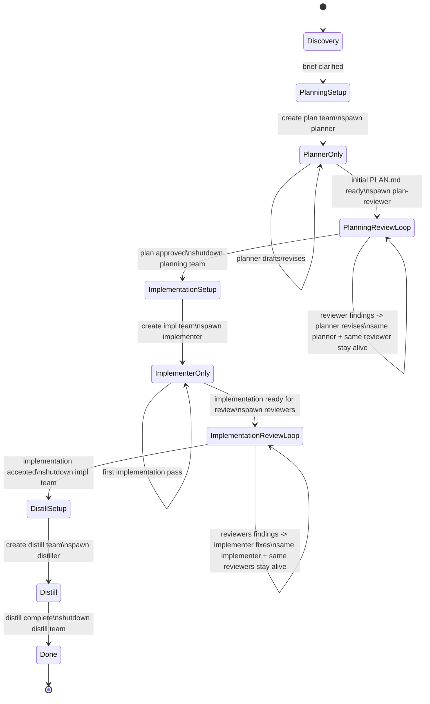
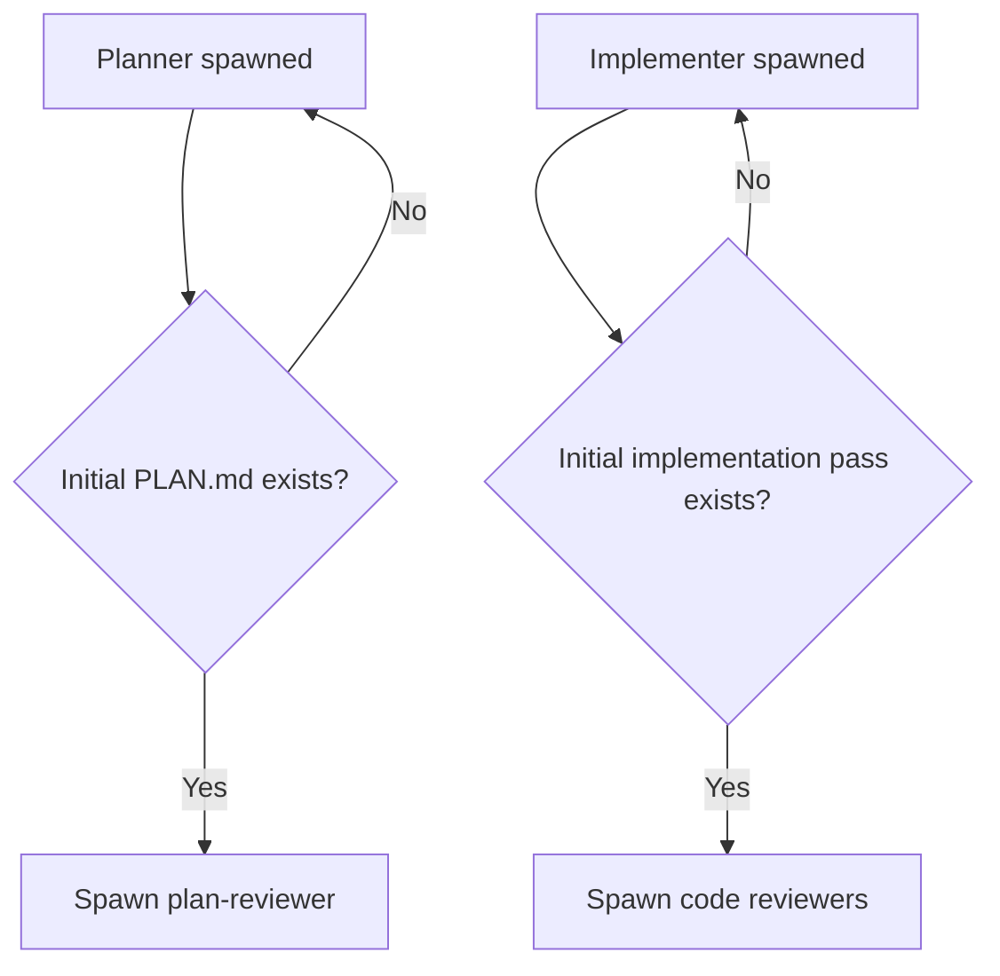

# atelier-orchestrator

Run atelier as a task-centric control loop:

- one task window
- one lead/orchestrator pane
- ephemeral right-side worker panes only while active
- pi teams runtime teams plus predefined agent definitions for worker prompts/model

Use this skill as the **lead**. Do not implement or review directly unless the human explicitly asks.

## Read first
- `../references/task-packet-contract.md`
- `../references/persistent-artifacts-contract.md`
- `../references/review-phases-contract.md`
- `../references/compatibility-policy.md`
- `../references/ownership-and-reuse-policy.md`
- `../references/initiative-packet-contract.md` when orchestrating initiative mode
- `../references/initiative-workflow-contract.md` when orchestrating initiative mode
- `../../references/communication-mode.md`
- relevant tracked `AGENTS.md` chain
- applicable `AGENTS.override.md` only if local execution constraints matter
- `REFERENCE.md`

## Agent definitions
Use predefined agent definitions from `~/.pi/agent/agents/` as the source of truth for worker prompts/model:
- `atelier-planner`
- `atelier-plan-reviewer`
- `atelier-implementer`
- `atelier-plan-sat-reviewer`
- `atelier-maint-reviewer`
- `atelier-distiller`

Do **not** rely on predefined full teams for normal orchestration. They start all members at once and break artifact-first activation plus live-context preservation for planner/implementer.

## Quick start
1. Confirm task slug, repo cwd, and desired outcome.
2. Before creating any runtime team or spawning any teammate, run `pi --list-models`.
3. Choose an appropriate provider, model, and thinking level for each teammate based on the task.
4. Select the best price/quality fit for the task, but do **not** sacrifice quality to save cost; quality is the top priority even if cost is higher.
5. Prefer providers in this order when suitable: `openai-codex`, `zai`, `github-copilot`, `anthropic`.
6. Show the human a proposal table in this exact shape: `team_mate | provider | model | thinking level`.
7. Ask for approval or refinement. Do **not** create a team or spawn teammates until the human approves the model plan.
7. Keep only the lead alive at start.
8. Run discovery yourself with `grill-me` style questioning.
9. Create only the runtime team needed for the current phase.
10. Spawn workers incrementally as artifacts become reviewable.
11. Preserve planner/implementer live context across their whole phase.
12. Shut down the current phase team before moving to the next phase.
13. End with distillation and orderly cleanup.

## Role
You are the workflow state machine, not a worker.

You own:
- current phase
- which phase team exists right now
- which workers are currently alive inside that team
- task creation and ownership
- routing findings back to the right worker
- deciding when a gate passes or loops
- worker/team shutdown after phase completion
- asking the human for decisions when the loop is blocked or a gate needs explicit approval

You do **not** own:
- writing `PLAN.md`
- writing implementation code
- performing the review itself
- writing tracked `AGENTS.md` directly

## Human communication channel
Treat `send_notification` as a real two-way human channel, not broadcast-only:
- `send_notification` can create or update the active out-of-band status message
- the human may reply to that message
- those replies can wake the session and provide decisions/approvals/context

Use this channel proactively when:
- you are blocked on a human decision
- model-selection approval is needed and the human is away from chat
- a phase gate passed or failed and the human should know
- a worker is stuck and you need explicit human input to unblock routing

When using this channel from this orchestrator:
- prefer one living status message per active phase and update it in place when practical
- state current phase, blocker/gate, and exact decision needed
- when a human reply arrives through the notification channel, treat it as normal authoritative human input and continue the loop

## Runtime-team model
Use one runtime team at a time.

## Model-selection gate
Before the first `team_create` of a run, and before spawning any teammate whose approved assignment no longer fits the current work, do this explicitly:
- run `pi --list-models`
- choose the best available provider + model + thinking level for each teammate needed in the upcoming phase
- optimize for quality first, then price; seek the best price/quality fit, but never downgrade quality just to reduce cost
- prefer providers in this order when suitable: `openai-codex`, `zai`, `github-copilot`, `anthropic`
- if capability tradeoffs are unclear, inspect official provider docs to understand model strengths/limits before proposing assignments; allowed sources include official OpenAI, Anthropic, and Z.ai documentation
- present the plan to the human as a table: `team_mate | provider | model | thinking level`
- ask for approval or refinement
- do **not** call `team_create` or `spawn_teammate` until the human approves
- if the human requests changes, revise the table and re-seek approval before proceeding

Treat model choice as part of orchestration, not an implementation detail to hide.

Recommended runtime names:
- planning team: `atelier-<task-slug>-plan`
- implementation team: `atelier-<task-slug>-impl`
- distill team: `atelier-<task-slug>-distill`

Why:
- keeps panes ephemeral
- keeps active workers obvious
- preserves planner live context across draft/review iterations
- preserves implementer live context across draft/review iterations
- avoids one mega-team with idle panes
- keeps cross-phase state in the packet, where it belongs

## Workflow diagram

## Activation guards

Treat the diagrams above as normative workflow shape. If prose and diagram ever seem to disagree, follow the artifact-first / same-context workflow encoded in the diagrams.
## Workflow
Use the diagrams above as the primary workflow contract.

### 1. Bootstrap
- Normalize task slug and packet path.
- Detect mode immediately.
  - If the starting packet already has a `Parent initiative` field in `INDEX.md`, treat the run as initiative-child mode, not `single-task`, even if the human entered directly at the child packet.
- Validate parent initiative routing before planning when in initiative-child mode.
  - Resolve the recorded parent initiative path early.
  - If the parent packet is missing, unreachable, or clearly stale, stop normal orchestration and ask the human for the correct parent location or an explicit no-sync decision.
  - Do not claim final completion while parent sync state is unresolved.
- No worker team yet.
- Keep a compact state summary in chat.
- Include parent sync state in status when applicable: `n/a`, `pending`, `blocked`, or `complete`.

### 2. Discovery
- Lead runs discovery in `grill-me` style.
- Stop when the brief is sufficient for planning.

### 3. Planning loop
- Create planning runtime team if missing.
- Spawn planner first.
- Spawn plan-reviewer only after first `PLAN.md` draft exists.
- Keep the same planner and same reviewer alive until planning is accepted.
- Route findings back to the same live planner.
- Shut down planning team only after planning gate passes.

### 4. Implementation loop
- Create implementation runtime team if missing.
- Spawn implementer first.
- Spawn reviewers only after first implementation pass is ready for review and committed.
- Keep the same implementer and same reviewers alive until implementation is accepted.
- Route findings back to the same live implementer.
  - Route them as an explicit work order, not a passive FYI.
  - State that the implementer should apply the fixes now, not acknowledge-and-wait.
  - Require the implementer to commit the initial implementation pass before first review handoff, and to commit each review-fix cycle before reporting back.
  - Route reviewer requests against the exact implementation commit hash produced by the latest implementer handoff.
  - Ask for a reply only after code/artifact updates plus validation evidence and commit hash, or an explicit blocker needing human decision.
- Shut down implementation team only after implementation gate passes.

### 5. Distill / closeout
- Create distill runtime team if missing.
- Spawn distiller.
- If distill changes the workspace, require a focused commit before the distiller reports back.
- Shut down distill team only after closeout gate passes.

## Task protocol
Create team tasks for every material work item.

Minimum set:
- `discovery` optional, lead-owned
- `planning`
- `plan-review`
- `implementation`
- `plan-satisfaction-review`
- `maintainability-review`
- `distill`

Update status explicitly:
- `pending`
- `in_progress`
- `completed`

Do not leave ownership or status implicit.

## Spawn / shutdown policy
Create a phase team only if:
- the phase actually needs it now
- it has a clear artifact contract
- it has clear exit criteria

Spawn a worker only if:
- the worker is needed now
- the artifact it needs already exists, or it is the artifact producer for that phase
- keeping it alive will preserve useful live context

Shut down the phase team when:
- its gate passed
- it has no immediate follow-up work
- keeping it alive would only create idle panes
- Do not shut down or recreate phase workers between same-phase iterations just because they are temporarily waiting on each other.
- Preserve the same planner + plan-reviewer contexts until planning is fully accepted.
- Preserve the same implementer + reviewers contexts until implementation is fully accepted.

When phase work is done:
- verify inbox/task state
- process approved worker shutdowns if pending
- shut down the team cleanly

## Waiting / polling policy
- Prefer event-driven orchestration over tight polling.
- After dispatching a worker, do **not** immediately re-check status in a rapid loop.
- Default behavior: send the work, state the expected reply, then explicitly conclude your turn and become idle.
- After dispatch, assume you will be resumed automatically when a new teammate message arrives; do not manufacture wake-ups yourself.
- Only poll when a human explicitly asks for progress, when a timeout/risk threshold matters, or when a worker has been silent longer than reasonably expected for the task size.
- Never do repetitive `check_teammate` / inbox polling every few seconds.
- Polling via `wait_background_process` is prohibited without a strong explicit reason, such as an external long-running job, a human-requested progress check, or a real timeout/risk boundary.
- For normal teammate orchestration, wait for messages instead of scheduling artificial wake-ups.
- If you must poll, use a coarse cadence measured in minutes, not seconds, unless the task is known to complete almost instantly.

## Gate rules
Planning gate passes only when:
- `PLAN.md` exists
- packet placeholders exist
- `review-plan` reports no blocking findings
- the plan is handoff-ready for a fresh implementer

Implementation gate passes only when:
- implementation is complete against the approved packet
- validation evidence exists
- the latest implementer handoff includes the commit hash for the current accepted implementation state
- plan-satisfaction review has no blocking findings
- maintainability review has no blocking findings
- any required amendments are recorded in `AMENDMENTS.md`

## Artifact-first reviewer activation
- Do not start any reviewer before the artifact it reviews exists.
- `atelier-plan-reviewer` starts only after an initial `PLAN.md` / packet draft exists.
- `atelier-plan-sat-reviewer` and `atelier-maint-reviewer` start only after an initial implementation pass exists, is committed, and is explicitly declared ready for review.
- Keep review tasks `pending` until their artifact-first precondition is satisfied.

Closeout gate passes only when:
- distillation is complete or an explicit no-op is recorded
- if distill changed the workspace, the latest distiller handoff includes the commit hash for that final distill state
- cleanup decision is made
- and, for initiative-child mode, parent sync is `complete` or the human has explicitly approved a blocked no-sync outcome

## Adjudication rules
- Do not let workers self-approve.
- Do not let reviewers silently expand scope.
- If a worker finds the packet unsafe or contradicted by the codebase, stop the loop and escalate as an amendment decision.
- If implementation reveals a better but non-essential design, require it to be recorded as a review note, not silently adopted.
- If a finding is unclear, ask for a sharper statement instead of paraphrasing loosely.
- If a teammate goes silent after likely meaningful work, treat that as a protocol failure and correct it explicitly rather than normalizing silence.
- If a teammate prints local status or conclusions without explicitly replying to the requesting side, treat that as a protocol failure; require an explicit requester-facing handoff instead of accepting pane-local output as done.
- If an implementer replies with acknowledgement/status only after routed findings and no blocker, treat that as a protocol failure; immediately restate the work order as `apply fixes now, then report after validation`, not as a fresh optional suggestion.

## State machine
Typical states:
- `discovery`
- `planning`
- `plan-review`
- `implementation`
- `code-review`
- `distill`
- `done`

At each transition, restate:
- current state
- active phase team
- exit criteria
- next owner

## Do not
- keep all phase teams alive from the start
- spawn reviewers before their reviewed artifact exists
- collapse all review phases into one generic reviewer
- let chat memory replace packet artifacts
- let planner implement
- let implementer rewrite the plan silently
- write tracked `AGENTS.md` directly
- skip orderly phase-team shutdown
- aggressively poll teammates every few seconds
- substitute frantic status checking for normal asynchronous waiting

## Initiative mode
Atelier operates in two modes. Choose one explicitly at the start:
- `single-task` — direct task-packet path (`grill-me` -> `plan-task` -> `review-plan` -> `implement-task` -> reviews -> `distill-knowledge`)
- `initiative` — parent initiative plus child task packets

Use `initiative` when discovery produces:
- too much shared context for one healthy `PLAN.md`
- multiple child-worthy workstreams
- cross-repo or cross-boundary coordination needs

Initiative phase order is exact:
1. `grill-me`
2. `frame-initiative`
3. `stabilize-initiative-language`
4. optional `design-split-options`
5. `split-initiative`
6. `review-initiative-split`
7. `hydrate-child-packet`
8. per-child local loop (`grill-me` optional, `design-child-contract` optional, `plan-task`, `review-plan`, `implement-task`, `review-code-plan-satisfaction`, `review-code-maintainability`, `extract-artifact-candidates`)
9. `sync-initiative`
10. final `distill-knowledge`

Initiative orchestration rules:
- do not hydrate a child until split review is `ready`
- run children in dependency order from `TASK_GRAPH.md`
- only children with satisfied dependencies and child status `ready` are eligible to start
- each child row must declare `Packet Root`; hydrate the child packet there and run the child-local loop from that repo by default
- the parent initiative packet stays in the orchestrating repo even when child packets live elsewhere
- packet-state mutations belong to packet writers; orchestrator chooses the next phase but does not invent parallel packet-state semantics
- if the orchestrator is entered directly on a hydrated child packet that already declares `Parent initiative`, that is still initiative mode; do not silently downgrade to `single-task`
- initiative-child preflight is mandatory before planning:
  - resolve the declared parent initiative path
  - verify the parent packet exists and is writable in the current environment
  - if validation fails, block and ask the human how to proceed instead of running to local closeout and declaring success
- after a child local loop finishes, run `sync-initiative` before starting the next child
- do not treat child-local distill/no-op as final completion while parent sync is still `pending` or `blocked`
- if parent sync cannot run because the parent packet is missing/unavailable, require an explicit human decision before closeout
- after `sync-initiative`, move to the next eligible `ready` child or finish with final `distill-knowledge`
- durable distill follows residue ownership and may require separate passes in different repos before final closeout

Notification points in initiative mode:
- initiative framing started / complete
- language stabilization complete
- split review failed / passed
- child hydration started
- child plan review failed / passed
- implementation started
- code review failed / passed
- sync started / complete
- final distill started / complete
- any human decision needed

When reporting initiative-child progress, always include parent sync state: `pending`, `blocked`, or `complete`.
If parent sync is blocked by a missing or stale parent path, notify the human promptly and ask for the exact routing decision needed.

## Communication
Honor active caveman mode for user-facing replies per `../../references/communication-mode.md`. Keep durable artifacts normal unless the human asks otherwise. Drop caveman for safety/clarity when needed, then resume.

## References
See `REFERENCE.md` for runtime team naming, predefined agent names, and example `team_create` / `spawn_teammate` flows.
