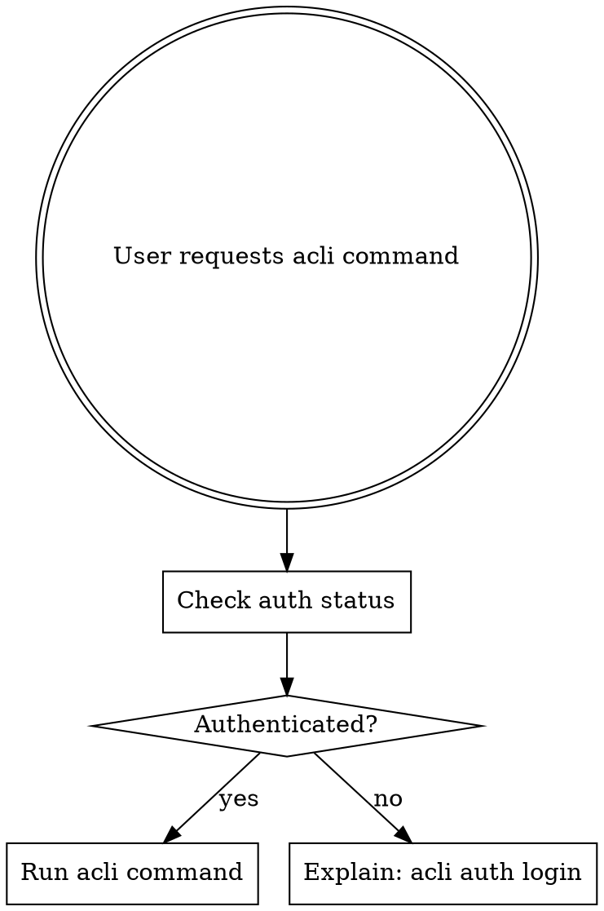
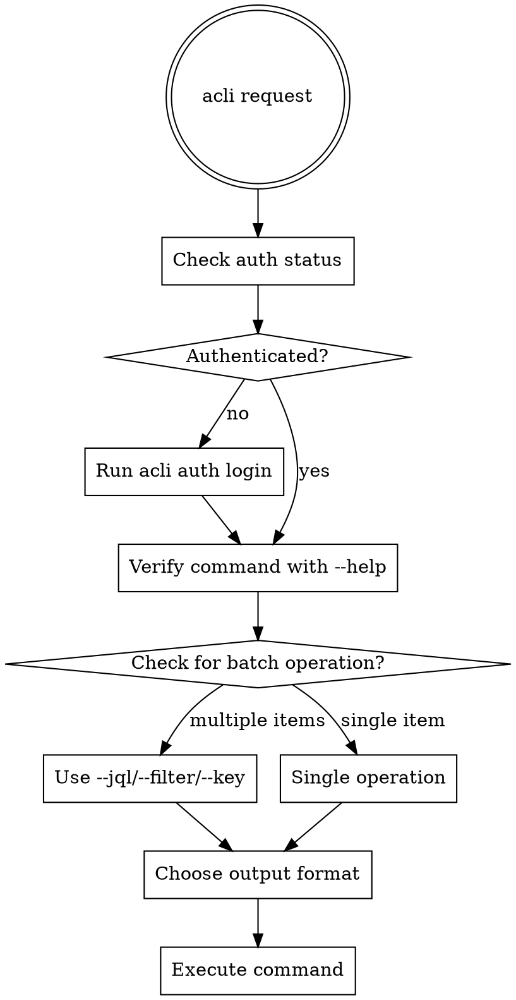

# Atlassian CLI (acli)

## Overview

The Atlassian CLI (`acli`) provides command-line access to Jira, Confluence, and other Atlassian products. **Core principle:** Always check authentication first, use correct command structure, and leverage batch operations.

## When to Use

- Creating, searching, or updating Jira issues
- Managing sprints, boards, or projects
- Working with Confluence spaces
- Bulk operations on multiple items
- Generating reports in CSV/JSON format
- Automating Atlassian workflows

**When NOT to use:**
- When web UI is more appropriate (one-off visual tasks)
- When API tokens/integrations are already available

## Authentication - FIRST STEP ALWAYS



**Before ANY acli operation:**
```bash
# Check if authenticated
acli auth status

# If not authenticated, login first
acli auth login
```

## Command Structure

**Format:** `acli <product> <entity> <action> [flags]`

**DO NOT use old-style syntax with `--action` flag.**

```bash
# ❌ WRONG - old syntax that doesn't work
acli jira --action getIssueList --jql "..."

# ✅ CORRECT - modern syntax
acli jira workitem search --jql "..."
```

## Quick Reference

### Common Products
- `auth` - Authentication management
- `jira` - Jira Cloud commands
- `confluence` - Confluence Cloud commands
- `admin` - Admin operations

### Jira Entities & Actions

| Entity | Common Actions | Example |
|--------|---------------|---------|
| `workitem` | search, create, create-bulk, edit, view, transition, assign, delete | `acli jira workitem search --jql "project = TEAM"` |
| `project` | list, view, create, update, delete, archive | `acli jira project list` |
| `sprint` | create, update, view, delete, list-workitems | `acli jira sprint view 123` |
| `board` | search, get, create, delete, list-sprints | `acli jira board list-sprints --board 42` |
| `workitem comment` | create, list, update, delete | `acli jira workitem comment create --key KEY-1 --comment "text"` |

### Confluence Entities

| Entity | Actions | Example |
|--------|---------|---------|
| `space` | list, view, create, update, archive, restore | `acli confluence space list` |

## Batch Operations

**Use JQL, filters, or key lists to operate on multiple items:**

```bash
# Edit multiple issues with JQL
acli jira workitem edit --jql "project = MOBILE AND status = 'In Review'" --assignee "user@example.com" --yes

# Transition multiple issues
acli jira workitem transition --jql "assignee = currentUser() AND status = 'To Do'" --status "In Progress" --yes

# Search with filter
acli jira workitem search --filter 10001 --csv

# Multiple keys
acli jira workitem assign --key "KEY-1,KEY-2,KEY-3" --assignee "@me"
```

**Batch flags:**
- `--jql` - JQL query for multiple items
- `--filter` - Filter ID for saved searches
- `--key` - Comma-separated issue keys
- `--yes` / `-y` - Skip confirmation prompts
- `--ignore-errors` - Continue on errors (useful for bulk ops)

## Output Formats

**Choose the right output format for your use case:**

```bash
# CSV for spreadsheets
acli jira workitem search --jql "sprint = 42" --csv

# JSON for scripts/automation
acli jira workitem search --jql "project = API" --json

# Web browser for viewing
acli jira workitem view KEY-123 --web

# Custom fields (default includes key, summary, status, etc.)
acli jira workitem search --jql "..." --fields "key,summary,assignee,priority"
```

**Common flags:**
- `--csv` - CSV output (NOT --outputFormat 999)
- `--json` - JSON output
- `--web` - Open in web browser
- `--fields` - Specify which fields to display (NOT --columns)
- `--count` - Show count only
- `--paginate` - Fetch all results

## Bulk Creation

**For creating multiple similar issues:**

```bash
# Generate JSON template
acli jira workitem create --generate-json

# Create from JSON file
acli jira workitem create --from-json workitem.json

# Bulk create multiple issues
acli jira workitem create-bulk

# Use file for description
acli jira workitem create --summary "Bug title" --project API --type Bug --from-file description.txt

# Use editor for interactive creation
acli jira workitem create --editor
```

**Don't create bash loops with 10 individual create commands when `create-bulk` or `--from-json` exists.**

## Common JQL Patterns

```bash
# Current user's issues
--jql "assignee = currentUser()"

# Specific project and status
--jql "project = TEAM AND status = 'In Progress'"

# Multiple criteria
--jql "project = API AND type = Bug AND status != Done"

# Sprint issues
--jql "project = TEAM AND sprint = 42"

# Recent updates
--jql "project = WEBAPP AND updated >= -7d"
```

## Common Mistakes

| Mistake | Why It's Wrong | Correct Approach |
|---------|---------------|-----------------|
| Skipping auth check | Commands fail without authentication | Always run `acli auth status` first |
| Using `--action` flag | Old syntax doesn't work in modern acli | Use `acli <product> <entity> <action>` |
| `--outputFormat 999` | Wrong flag | Use `--csv` |
| `--columns` parameter | Doesn't exist | Use `--fields` |
| Bash loops for creation | Inefficient, built-in features exist | Use `create-bulk`, `--from-json` |
| One-by-one edits | Slow for bulk operations | Use `--jql` or `--filter` with edit/transition |
| Making up commands | Wastes time | Run `acli <product> <entity> --help` to verify |

## Red Flags - STOP and Check Skill

These indicate you're about to make a mistake:

- Skipping authentication check
- Using `--action` in your command
- Writing bash loops for bulk operations
- Suggesting `--outputFormat` instead of `--csv`
- Using `--columns` instead of `--fields`
- Making up command names without checking --help
- "The old syntax probably still works"
- "They're probably already authenticated"
- "A bash loop is more flexible than built-in commands"

**All of these mean: Stop, re-read this skill, use correct syntax.**

## Workflow Pattern



## Example Workflows

### Sprint Report
```bash
# 1. Check auth
acli auth status

# 2. Search sprint issues with CSV output
acli jira workitem search --jql "project = TEAM AND sprint = 42" --fields "key,summary,status,assignee" --csv > sprint-report.csv
```

### Bulk Status Update
```bash
# 1. Check auth
acli auth status

# 2. Verify issues first
acli jira workitem search --jql "project = MOBILE AND status = 'In Review'" --count

# 3. Transition all
acli jira workitem transition --jql "project = MOBILE AND status = 'In Review'" --status "Done" --yes

# 4. Assign all
acli jira workitem assign --jql "project = MOBILE AND status = Done" --assignee "user@example.com" --yes
```

### Create Multiple Issues
```bash
# 1. Check auth
acli auth status

# 2. Generate template
acli jira workitem create --generate-json > template.json

# 3. Edit template.json with your data

# 4. Create from template (repeat for each)
acli jira workitem create --from-json issue1.json
acli jira workitem create --from-json issue2.json

# OR use create-bulk
acli jira workitem create-bulk
```

## Getting Help

```bash
# Top-level help
acli --help

# Product help
acli jira --help

# Entity help
acli jira workitem --help

# Action help
acli jira workitem search --help
```

**When in doubt, check `--help` for exact flags and syntax.**
