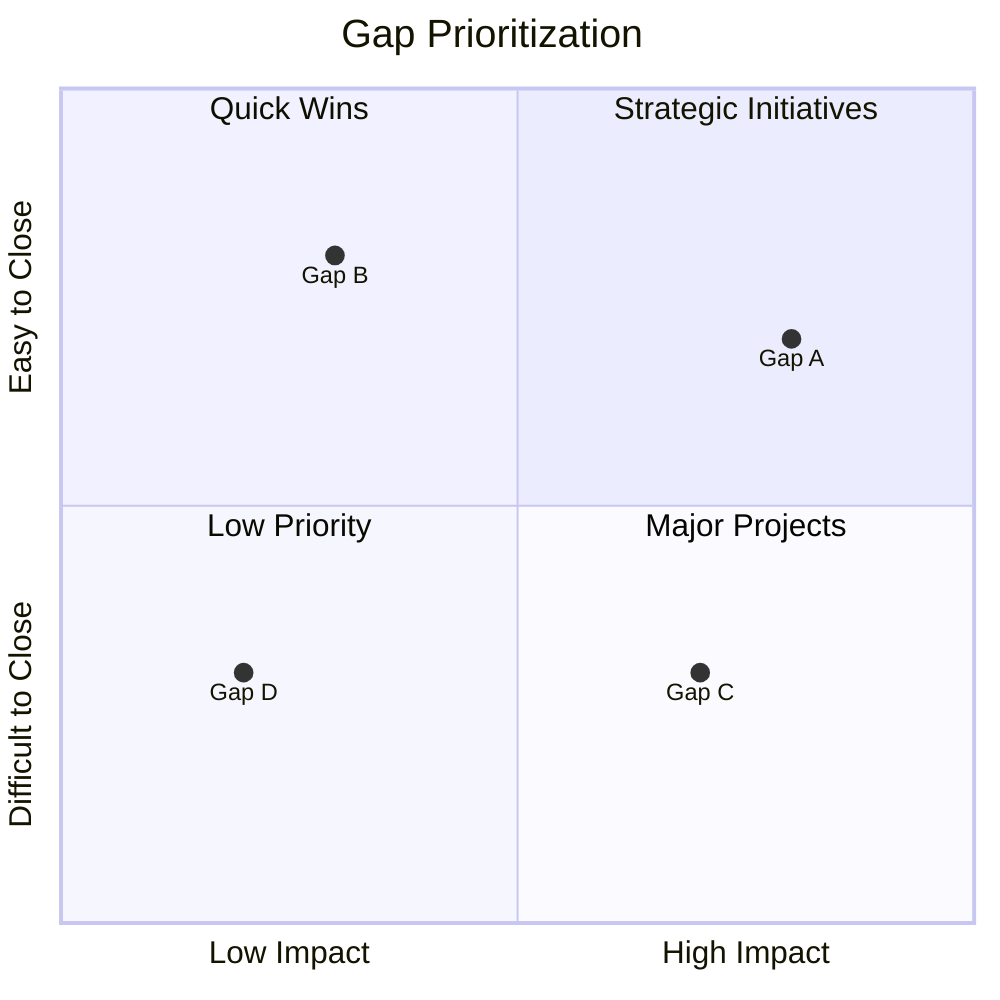
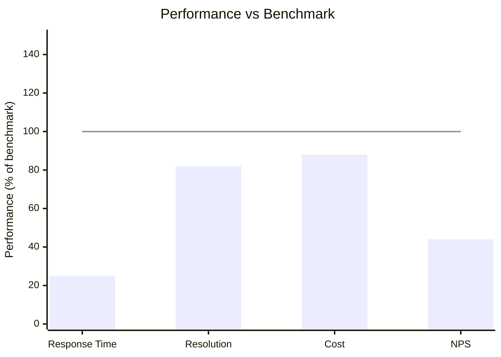

# Benchmarking

## When to Use This Skill

Use this skill when:

- **Benchmarking tasks** - Working on benchmarking and competitive analysis techniques. compares performance, processes, and practices against industry standards, competitors, and best-in-class organizations
- **Planning or design** - Need guidance on Benchmarking approaches
- **Best practices** - Want to follow established patterns and standards

## Overview

Systematically compare performance, processes, and practices against internal units, competitors, industry standards, or best-in-class organizations. Identifies gaps and improvement opportunities.

## What is Benchmarking?

**Benchmarking** is the process of measuring your organization's processes, products, or services against those of recognized leaders to identify gaps and improvement opportunities.

### Benchmarking Purpose

| Goal | Description |
|------|-------------|
| **Identify Gaps** | Where do we fall short of leaders? |
| **Set Targets** | What level of performance is achievable? |
| **Learn Practices** | How do leaders achieve superior results? |
| **Drive Improvement** | What changes will close the gaps? |

### Benchmarking vs Competitive Analysis

| Aspect | Benchmarking | Competitive Analysis |
|--------|--------------|---------------------|
| Focus | Processes and practices | Products and market position |
| Goal | Improve own performance | Understand competitors |
| Scope | Can include non-competitors | Direct competitors |
| Outcome | Improvement plan | Competitive strategy |

## Types of Benchmarking

### Internal Benchmarking

Compare across internal units, teams, or locations:

| Advantage | Disadvantage |
|-----------|--------------|
| Easy data access | Limited to internal best |
| Common context | May miss external innovations |
| Quick to implement | Political sensitivities |
| Low cost | May perpetuate mediocrity |

**When to Use:** Multiple locations, varied performance, starting point

### Competitive Benchmarking

Compare against direct competitors:

| Advantage | Disadvantage |
|-----------|--------------|
| Relevant comparison | Data hard to obtain |
| Direct market context | May be biased/incomplete |
| Stakeholder understanding | Legal considerations |
| Strategic relevance | Competitors may not be best |

**When to Use:** Market positioning, product comparison, pricing

### Functional Benchmarking

Compare similar functions across different industries:

| Advantage | Disadvantage |
|-----------|--------------|
| Best-in-class practices | Context differences |
| Innovative ideas | May not transfer directly |
| Less competitive sensitivity | Harder to arrange |
| Broader perspective | More complex adaptation |

**When to Use:** Process improvement, breakthrough thinking

### Strategic Benchmarking

Compare strategies and business models:

| Advantage | Disadvantage |
|-----------|--------------|
| Strategic insights | High-level, less actionable |
| Transformative potential | Longer time to implement |
| Industry-changing ideas | Harder to measure |
| Vision-setting | May require significant change |

**When to Use:** Strategy development, transformation, disruption

## Benchmarking Process

### Phase 1: Plan

#### Step 1: Define Scope

```markdown
## Benchmarking Scope

**Subject:** [What to benchmark]
**Type:** [Internal/Competitive/Functional/Strategic]
**Objective:** [Why benchmarking]
**Owner:** [Who's leading]
**Timeline:** [Start to finish]

### Success Criteria

- [What constitutes a successful benchmark study]
- [How results will be used]
```

#### Step 2: Identify Metrics

```markdown
## Key Performance Indicators

| Category | Metric | Current | Definition |
|----------|--------|---------|------------|
| Efficiency | [Metric 1] | [Value] | [How measured] |
| Quality | [Metric 2] | [Value] | [How measured] |
| Speed | [Metric 3] | [Value] | [How measured] |
| Cost | [Metric 4] | [Value] | [How measured] |
```

#### Step 3: Select Benchmarking Partners

| Criteria | Description |
|----------|-------------|
| **Relevant** | Similar processes or challenges |
| **Best-in-class** | Superior performance in area |
| **Willing** | Open to sharing |
| **Accessible** | Data or contact available |

### Phase 2: Collect

#### Step 1: Gather Internal Data

```markdown
## Internal Performance Data

| Process/Area | Metric | Current Performance | Trend |
|--------------|--------|--------------------:|-------|
| [Process 1] | [Metric] | [Value] | [Up/Down/Stable] |
| [Process 2] | [Metric] | [Value] | [Up/Down/Stable] |
```

#### Step 2: Gather External Data

| Source | Type | Reliability |
|--------|------|-------------|
| Industry reports | Secondary | Medium-High |
| Public filings | Secondary | High |
| Surveys | Primary | Medium |
| Site visits | Primary | High |
| Conferences | Secondary | Medium |
| Published case studies | Secondary | Medium |

#### Step 3: Normalize Data

Ensure comparability:

- Common definitions
- Same time periods
- Equivalent scope
- Currency/unit conversion
- Size adjustments (per employee, per revenue)

### Phase 3: Analyze

#### Step 1: Calculate Gaps

```markdown
## Gap Analysis

| Metric | Our Performance | Benchmark | Gap | Gap % |
|--------|----------------:|----------:|----:|------:|
| [Metric 1] | 85% | 95% | -10% | -11% |
| [Metric 2] | 24h | 4h | +20h | +500% |
| [Metric 3] | $50 | $30 | +$20 | +67% |
```

#### Step 2: Identify Root Causes

For each significant gap:

- Why does the gap exist?
- What practices enable superior performance?
- What barriers prevent us from closing the gap?
- What resources would be required?

#### Step 3: Prioritize Gaps



### Phase 4: Adapt

#### Step 1: Develop Improvement Actions

```markdown
## Improvement Plan

### Gap: [Metric] - [Our Value] vs [Benchmark Value]

**Root Cause:** [Why the gap exists]

**Best Practice:** [What benchmark leaders do differently]

**Adaptation:**
| Action | Owner | Timeline | Resources | Expected Impact |
|--------|-------|----------|-----------|-----------------|
| [Action 1] | [Name] | [Date] | [Cost] | [Target] |
| [Action 2] | [Name] | [Date] | [Cost] | [Target] |

**Success Metric:** [How we'll measure improvement]
```

#### Step 2: Set Targets

| Approach | Description | When to Use |
|----------|-------------|-------------|
| Match benchmark | Achieve same level | Realistic, proven possible |
| Exceed benchmark | Surpass best-in-class | Competitive advantage |
| Incremental | Close gap by X% | Resource-constrained |
| Breakthrough | Leapfrog to new level | Transformational |

#### Step 3: Implement and Monitor

- Execute improvement actions
- Track progress against targets
- Report on gap closure
- Iterate and refine

## Competitive Analysis Framework

### Porter's Five Forces Context

| Force | Benchmarking Focus |
|-------|-------------------|
| Rivalry | Direct competitor comparison |
| New Entrants | Emerging competitor practices |
| Substitutes | Alternative solution benchmarks |
| Supplier Power | Supply chain efficiency |
| Buyer Power | Customer satisfaction metrics |

### Competitive Profile Matrix

```markdown
## Competitive Profile Matrix

| Success Factor | Weight | Company A | Company B | Company C |
|----------------|-------:|----------:|----------:|----------:|
| | | Rating | Score | Rating | Score | Rating | Score |
| Product Quality | 0.20 | 4 | 0.80 | 3 | 0.60 | 5 | 1.00 |
| Price | 0.15 | 3 | 0.45 | 4 | 0.60 | 2 | 0.30 |
| Market Share | 0.15 | 4 | 0.60 | 2 | 0.30 | 5 | 0.75 |
| Customer Service | 0.20 | 3 | 0.60 | 4 | 0.80 | 3 | 0.60 |
| Innovation | 0.15 | 2 | 0.30 | 3 | 0.45 | 5 | 0.75 |
| Distribution | 0.15 | 4 | 0.60 | 3 | 0.45 | 4 | 0.60 |
| **Total** | **1.00** | | **3.35** | | **3.20** | | **4.00** |

Rating: 1=Major Weakness, 2=Minor Weakness, 3=Neutral, 4=Minor Strength, 5=Major Strength
```

### SWOT Integration

Benchmarking informs SWOT:

| SWOT Element | Benchmarking Input |
|--------------|-------------------|
| Strengths | Where we exceed benchmarks |
| Weaknesses | Where we fall short |
| Opportunities | Best practices to adopt |
| Threats | Competitor advantages |

## Output Formats

### Narrative Summary

```markdown
## Benchmarking Summary

**Subject:** [What was benchmarked]
**Date:** [ISO date]
**Type:** [Internal/Competitive/Functional/Strategic]
**Analyst:** benchmarking-analyst

### Executive Summary

[2-3 sentence overview of key findings]

### Benchmarking Partners

| Partner | Type | Why Selected |
|---------|------|--------------|
| [Partner 1] | [Type] | [Reason] |
| [Partner 2] | [Type] | [Reason] |

### Key Findings

#### Gap 1: [Area]
- **Our Performance:** [Value]
- **Benchmark:** [Value]
- **Gap:** [Delta]
- **Root Cause:** [Why]
- **Best Practice:** [What leaders do]

#### Gap 2: [Area]
[Same structure]

### Recommendations

| Priority | Gap | Action | Impact | Effort |
|----------|-----|--------|--------|--------|
| 1 | [Gap] | [Action] | High | Medium |
| 2 | [Gap] | [Action] | Medium | Low |

### Next Steps

1. [Immediate action]
2. [Short-term action]
3. [Long-term initiative]
```

### Structured Data (YAML)

```yaml
benchmarking:
  version: "1.0"
  date: "2025-01-15"
  subject: "Customer Service Operations"
  type: "competitive"
  analyst: "benchmarking-analyst"

  partners:
    - name: "Company A"
      type: "direct_competitor"
      selection_reason: "Market leader"
    - name: "Industry Average"
      type: "industry_benchmark"
      source: "Gartner Report 2024"

  metrics:
    - name: "First Response Time"
      category: "speed"
      our_performance:
        value: 24
        unit: "hours"
      benchmark:
        value: 4
        unit: "hours"
        source: "Company A"
      gap:
        absolute: 20
        percentage: 500
      priority: "critical"

    - name: "Customer Satisfaction"
      category: "quality"
      our_performance:
        value: 78
        unit: "percent"
      benchmark:
        value: 92
        unit: "percent"
        source: "Industry Average"
      gap:
        absolute: -14
        percentage: -15
      priority: "high"

  findings:
    - gap: "First Response Time"
      root_cause: "Manual ticket routing, no AI triage"
      best_practice: "AI-powered auto-routing and chatbot first response"
      impact: "high"
      effort: "medium"

  recommendations:
    - priority: 1
      gap: "First Response Time"
      action: "Implement AI ticket triage"
      owner: "Support Director"
      timeline: "Q2 2025"
      expected_improvement: "80% reduction"
      investment: "$50,000"

  targets:
    - metric: "First Response Time"
      current: 24
      target: 4
      timeline: "6 months"
    - metric: "Customer Satisfaction"
      current: 78
      target: 90
      timeline: "12 months"
```

### Comparison Table

```markdown
## Competitive Comparison

| Dimension | Us | Competitor A | Competitor B | Industry Avg | Best-in-Class |
|-----------|---:|-------------:|-------------:|-------------:|--------------:|
| Response Time | 24h | 8h | 12h | 10h | 1h |
| Resolution Rate | 78% | 85% | 82% | 80% | 95% |
| Cost per Ticket | $45 | $35 | $40 | $38 | $20 |
| NPS Score | 32 | 45 | 38 | 35 | 72 |

**Legend:** Green = above average, Yellow = average, Red = below average
```

### Gap Visualization



## Benchmarking Ethics

### Do's

- Use publicly available information
- Get permission for site visits/interviews
- Share appropriately if participating in consortium
- Protect confidential information
- Give credit to sources

### Don'ts

- Use deceptive practices to gather data
- Violate NDAs or trade secrets
- Misrepresent benchmarking data
- Use competitive intelligence unethically
- Ignore legal and antitrust considerations

## Common Pitfalls

| Pitfall | Prevention |
|---------|------------|
| Wrong metrics | Align with strategic objectives |
| Poor partners | Select truly best-in-class |
| Apples to oranges | Normalize data carefully |
| Data without action | Focus on actionable insights |
| One-time exercise | Continuous improvement cycle |
| Copying blindly | Adapt to your context |

## Integration

### Upstream

- **swot-pestle-analysis** - Strategic context
- **stakeholder-analysis** - Who cares about benchmarks
- **Requirements** - Performance requirements

### Downstream

- **Gap analysis** - Improvement priorities
- **prioritization** - Resource allocation
- **Roadmap** - Improvement initiatives

## Related Skills

- `swot-pestle-analysis` - Strategic environmental analysis
- `prioritization` - Prioritizing improvement actions
- `decision-analysis` - Evaluating improvement options
- `capability-mapping` - Capability maturity benchmarking

## Version History

- **v1.0.0** (2025-12-26): Initial release
