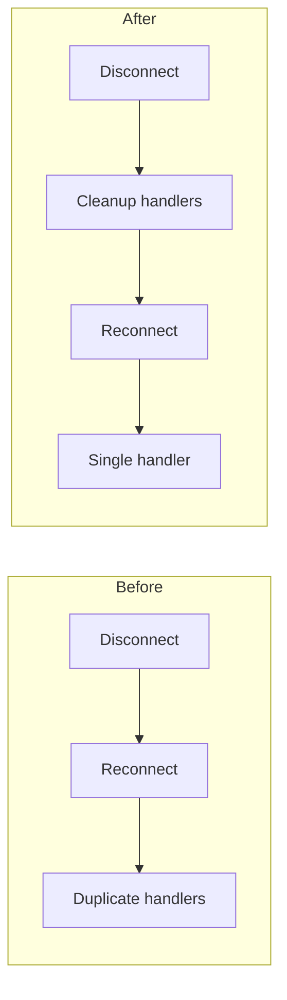

# The Blitz: Parallel Worktree + Agent Workflow

Parallelizes multi-issue sprints by running independent Claude agents in isolated git worktrees. Each agent creates a PR, self-reviews to 10/10 with 100% issue coverage, then PRs are sequentially merged to avoid conflicts. Herding 🐲.

## ⚠️ MANDATORY: 100% Issue Coverage Per Agent

**Every agent MUST implement 100% of their assigned issue's requirements before their PR can be merged.**

- Each agent receives COMPLETE issue requirements (extracted from GitHub issue)
- Review must verify ALL requirements are implemented
- Coverage < 100% = agent sent back to complete the work
- No PR merges until all requirements from the issue are addressed

## Prerequisites

**Required Tools:**
- `gh` CLI (authenticated)
- Git with worktree support (2.5+)
- Claude Code with agent spawning (Task tool)

**Required Skills:**
- `4-step-program` - Guides agents through fix-review-iterate-present loop
- `code-reviewer` - Self-review to 10/10 quality gate
- `delphi` - Parallel oracles for triage decisions (optional, for ambiguous triage)

## Workflow Phases

### Phase 1: Issue Triage

For ambiguous decisions on which issues to tackle, use the `delphi` skill:

```
Invoke Delphi: "Audit these open issues. For each, recommend: close (complete), fix (actionable), or defer (blocked)."
```

**Interpreting Delphi Results:**
- Unanimous agreement → Act on recommendation
- 2/3 agreement → Lean toward majority, investigate minority view
- Full divergence → Need more context; investigate manually

**Close complete issues immediately:**
```bash
gh issue close 1 2 3 --comment "Complete per Delphi audit"
```

For clear-cut issue lists, skip Delphi and proceed directly to Phase 2.

### Phase 2: Worktree Setup

Create one worktree per fixable issue from main:

```bash
git worktree add .worktrees/<slug> -b fix/<slug> main
```

**Branch Naming:** `fix/<descriptive-slug>` or `feat/<descriptive-slug>`

**Example setup for 4 issues:**
```bash
git worktree add .worktrees/test-isolation -b fix/test-isolation main
git worktree add .worktrees/config-theater -b fix/config-theater main
git worktree add .worktrees/wire-salience -b fix/wire-salience main
git worktree add .worktrees/testing-quality -b fix/testing-quality main
```

**Why Worktrees:**
- Complete filesystem isolation per agent
- No stash/checkout conflicts
- Agents work truly in parallel
- Each has independent node_modules, build artifacts

### Phase 3: Delegate to Parallel Agents

Spawn agents using the Task tool with structured prompts. Each agent needs:

1. **Working directory** (absolute path to worktree)
2. **Issue context** (number, description, acceptance criteria)
3. **COMPLETE list of ALL requirements from the issue** (extracted via `gh issue view`)
4. **Explicit instruction to use 4-step-program skill**

**CRITICAL: Before delegating, extract ALL requirements from each issue:**
```bash
gh issue view <number>
```
List EVERY requirement, acceptance criterion, and edge case in the agent prompt.

**Agent Prompt Template:**
```
Working directory: /absolute/path/to/.worktrees/<slug>
Issue: #<number> - <title>

**ALL REQUIREMENTS FROM ISSUE (100% must be implemented):**
1. [Requirement 1 from issue]
2. [Requirement 2 from issue]
3. [Requirement 3 from issue]
... (list ALL of them)

Use the 4-step-program skill to:
1. Implement ALL the above requirements (100% coverage required)
2. Run tests, verify passing
3. Create PR with `gh pr create` - **MUST include `Closes #<issue-number>` in body**
4. Self-review using code-reviewer skill (which will verify 100% coverage)
5. POST review to GitHub with `gh api`

**PR MUST include:**
- `Closes #<issue-number>` to auto-close the issue on merge
- "Related Issues" section in PR body
- Verify with `gh pr view --json closingIssuesReferences`

Do not return until you achieve 10/10 review score WITH 100% of issue requirements implemented AND issue properly linked.
```

**CRITICAL:** Agents must POST reviews to GitHub, not just print them:
```bash
gh api repos/OWNER/REPO/pulls/NUMBER/reviews \
  -f body="..." -f event="COMMENT"
```

**Launch agents in parallel** using multiple Task tool calls in a single message.

### Phase 4: Review Iteration Loop

Monitor each PR's review status:

```bash
gh pr view <NUMBER> --json reviews --jq '.reviews[-1].body'
```

**TWO gates must pass for each PR:**

**GATE 1: 100% Issue Coverage**
- Verify ALL requirements from original issue are implemented
- If ANY requirement is missing → Resume agent with missing requirements

**GATE 2: 10/10 Review Quality**
- Zero suggestions in review
- All verification commands pass

**If coverage < 100%:** Resume the agent with specific missing requirements:
```
PR #<NUMBER> coverage: 80% (4 of 5 requirements).
Missing requirement: [Requirement 5 from issue - specific text]
Implement this requirement and re-review.
```

**If score < 10/10 (but coverage 100%):** Resume the agent with specific feedback:
```
PR #<NUMBER> has 100% coverage but scored 8/10. Issues:
- <specific issue 1>
- <specific issue 2>

Fix these issues and re-review.
```

**10/10 + 100% Coverage Criteria:**
- **ALL requirements from original issue implemented**
- All functionality working
- Tests pass
- No obvious bugs or security issues
- Code follows project conventions
- Documentation updated if needed

### Phase 4.5: FINAL COVERAGE GATE (Before Merge)

**MANDATORY**: Before merging ANY PR, perform LINE-BY-LINE requirement verification.

For EACH PR ready to merge:

#### Step 1: Extract ALL Requirements

```bash
# Get ALL checklist items from issue
gh issue view <issue-number> --json body --jq '.body' | grep -E "^\- \["

# Also get full issue for prose requirements
gh issue view <issue-number>
```

#### Step 2: Create Line-by-Line Table

**MANDATORY** for each PR:

```markdown
## Issue #X - Full Requirements Check

| Requirement | PR Status | Evidence |
|-------------|-----------|----------|
| [exact text from issue] | ✅ | `file.cs:line` - [implementation] |
| [exact text from issue] | ❌ MISSING | Not found in PR |
| [exact text from issue] | ⚠️ PARTIAL | `file.cs:line` - [what's missing] |
| [exact text from issue] | ⚠️ MANUAL | Requires Unity Editor |
```

#### Step 3: Honest Assessment

```markdown
**Honest Assessment**:
- Coverage: X% (Y of Z requirements fully implemented)
- Missing: [list specific items]
- Partial: [list items and what's missing]
- Manual: [list items needing editor/runtime]
```

**FINAL GATE DECISION:**

| Coverage | Action |
|----------|--------|
| **100%** | ✅ Proceed to Phase 5 (Merge) |
| **< 100%** | ❌ **DO NOT MERGE** - Resume agent |

**If Final Coverage < 100%:**
```
Resume agent: "FINAL COVERAGE GATE FAILED for PR #<NUMBER>.

Issue #X - Full Requirements Check:

| Requirement | Status | Evidence |
|-------------|--------|----------|
| MeshDeformer component created | ✅ | MeshDeformer.cs |
| Create scene GameObject | ❌ MISSING | No scene modification |
| Cache hit rate >90% | ⚠️ MANUAL | Requires runtime profiler |

Honest Assessment:
- Coverage: 85% (11 of 13 requirements)
- Missing: scene GameObject creation
- Partial: none
- Manual: cache hit rate verification

Implement ALL items marked ❌. Items marked ⚠️ MANUAL that CAN be automated via mcp-unity MUST be automated.

Do not return until 100% coverage."
```

**→ Loop back to Phase 4 (Review Iteration)**

### Phase 5: Sequential Squash-Merge + Rebase

Merge PRs one at a time. Order by dependency (infrastructure first).

**Before merging, verify issue linking:**

```bash
# Verify PR will close the issue
gh pr view <NUMBER> --json closingIssuesReferences --jq '.closingIssuesReferences[].number'

# If empty, PR is missing issue link - send agent back to fix!
```

**For each PR:**

```bash
# 1. Squash merge (keeps history clean) - issues auto-close on merge
gh pr merge <NUMBER> --squash --delete-branch

# 2. Update local main
git checkout main && git pull

# 3. Rebase next PR onto updated main
cd .worktrees/<next-slug>
git fetch origin main
git rebase origin/main
git push --force-with-lease

# 4. Repeat merge for next PR
```

**Why This Order:**
- Squash merge keeps main history linear
- Rebasing before merge prevents conflicts
- Sequential merging catches integration issues early
- `--force-with-lease` prevents overwriting others' work

**Handling Conflicts:**
```bash
git rebase origin/main
# If conflicts:
# 1. Fix conflicts in affected files
# 2. git add <fixed-files>
# 3. git rebase --continue
# 4. git push --force-with-lease
```

### Phase 6: Cleanup

After all PRs merge:

```bash
# Remove worktrees
git worktree remove .worktrees/<slug>  # Repeat for each

# Delete local branches (remote already deleted by --delete-branch)
git branch -D fix/<slug>  # Repeat for each

# Sync main
git checkout main && git pull

# Verify clean state
git worktree list  # Should show only main
git branch         # Should show only main
```

## Quick Reference

See `references/commands.md` for complete command reference.
See `references/pitfalls.md` for common issues and solutions.

## Mermaid Diagrams in Blitz PRs

**Each agent's PR SHOULD include Mermaid diagrams when the change warrants visualization.**

### When Agents Should Add Diagrams

| Change Type | Diagram |
|-------------|---------|
| Flow change | `flowchart` before/after |
| API modification | `sequenceDiagram` |
| State handling | `stateDiagram-v2` |
| Architecture change | `flowchart` with subgraphs |

### Agent Delegation Should Include

When delegating to agents, add to the prompt:
```
If your changes involve flow modifications, state changes, or API interactions,
include a Mermaid diagram in the PR body showing the new behavior.
```

### Example PR with Diagram

````markdown
## Summary

Fixed race condition in WebSocket reconnection.

### Before/After



## Related Issues
- Closes #45 - WebSocket reconnection bug
````

---

## Checklist Summary

1. [ ] Triage issues (use `delphi` if ambiguous)
2. [ ] **Extract ALL requirements from each issue** (`gh issue view`)
3. [ ] Create worktrees for each fixable issue
4. [ ] Launch parallel agents with 4-step-program **including complete requirement lists**
5. [ ] Monitor and iterate until all PRs hit **100% issue coverage AND 10/10**
6. [ ] **FINAL COVERAGE GATE**: Re-verify 100% coverage before each merge
7. [ ] Sequential squash-merge with rebase between (only after gate passes)
8. [ ] Cleanup worktrees and branches
9. [ ] PRs include Mermaid diagrams where helpful
