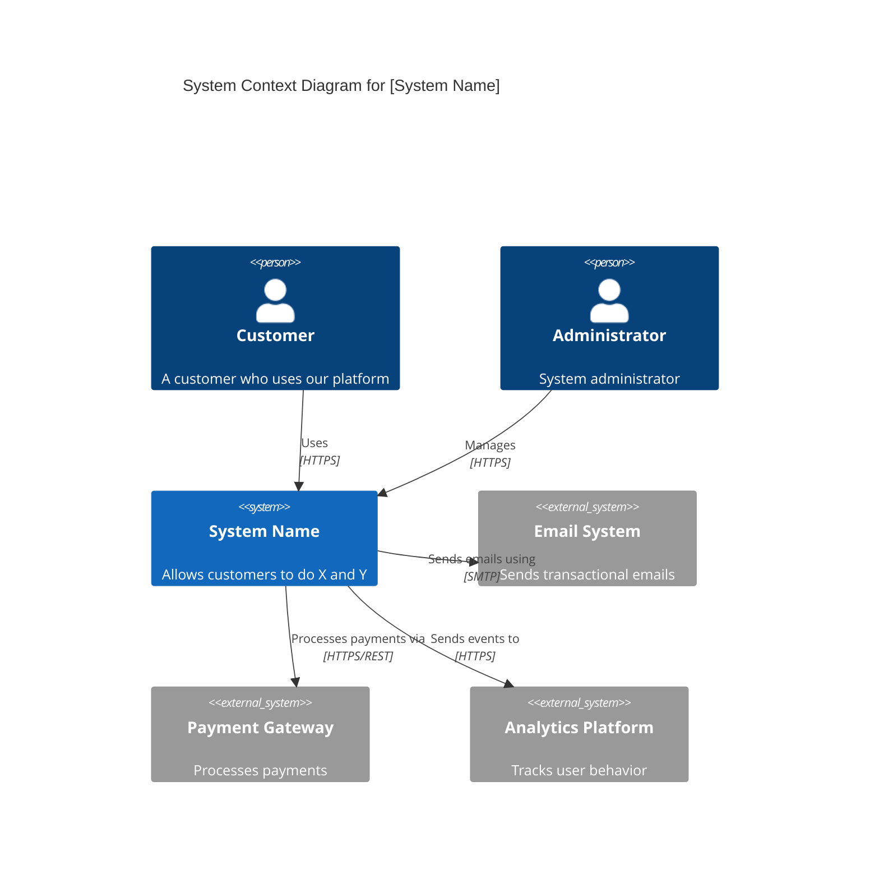
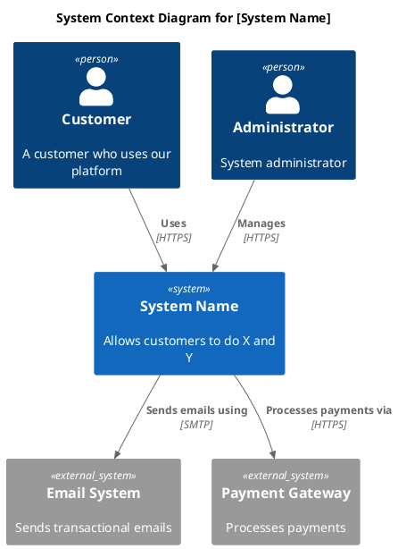
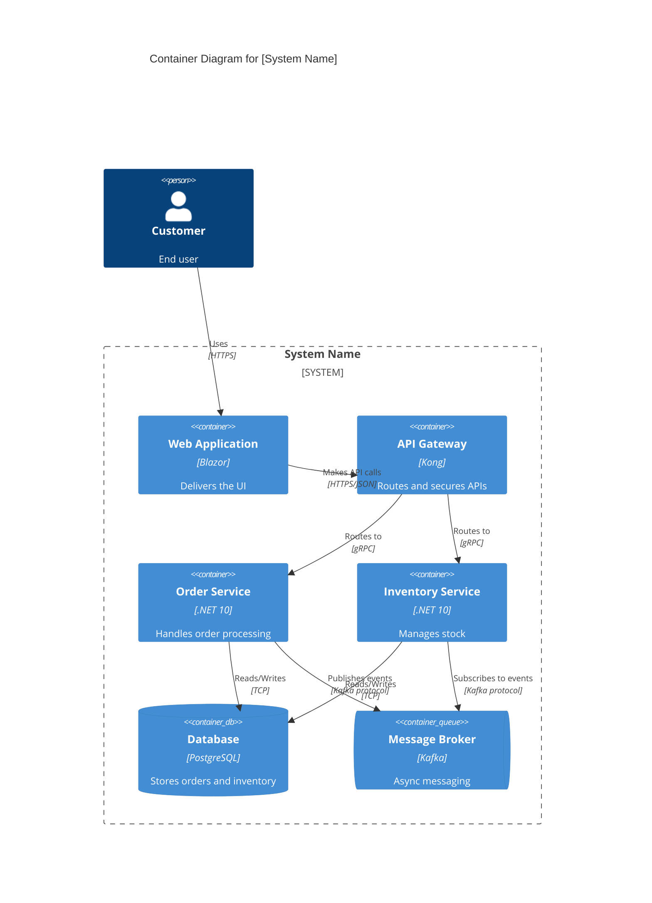
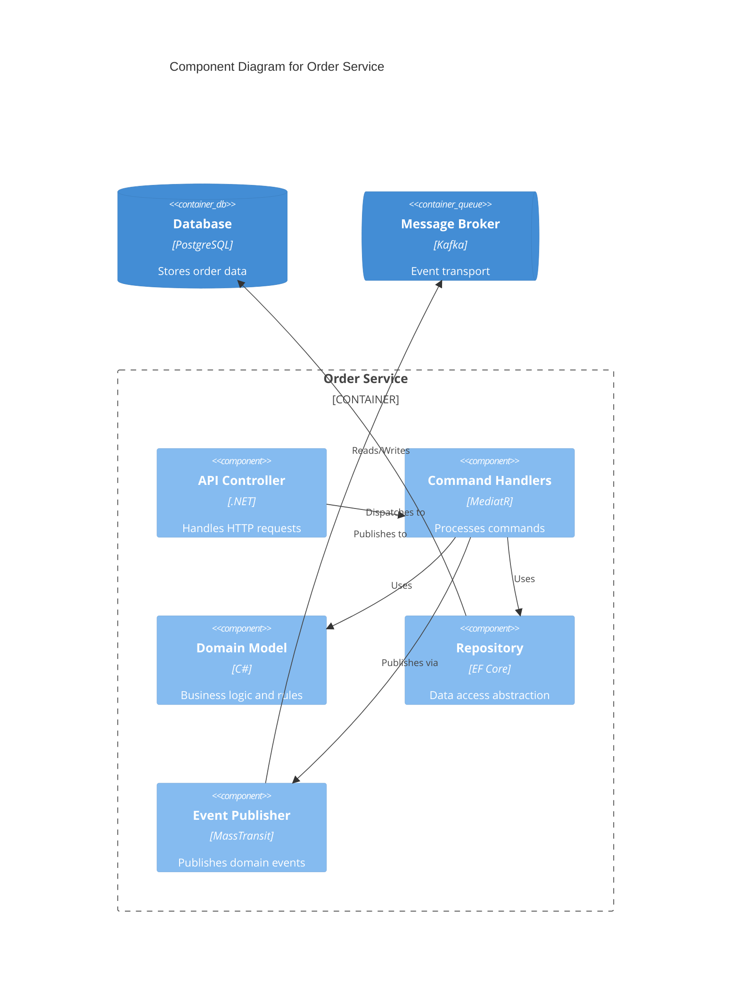
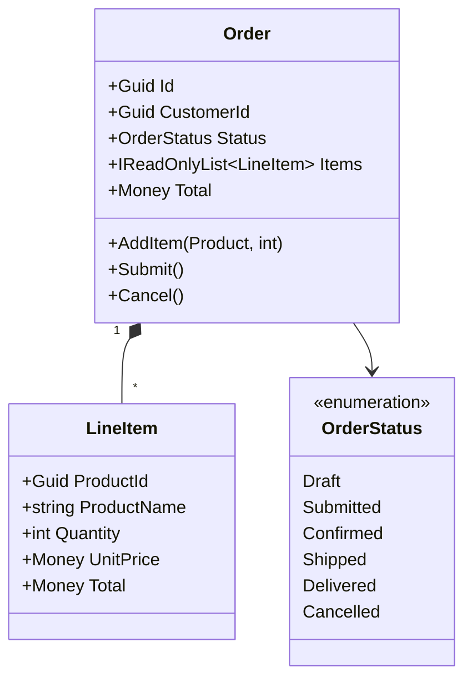
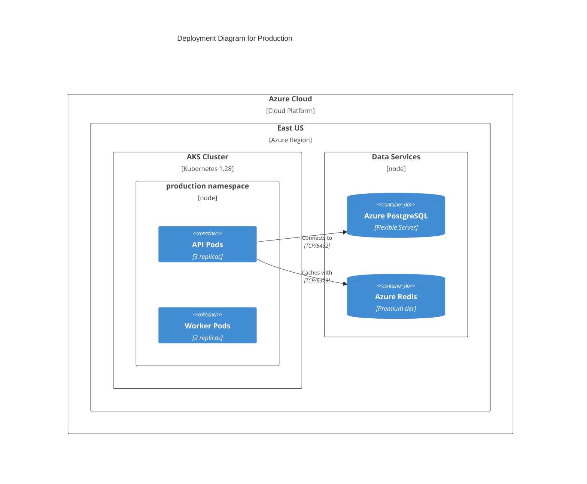
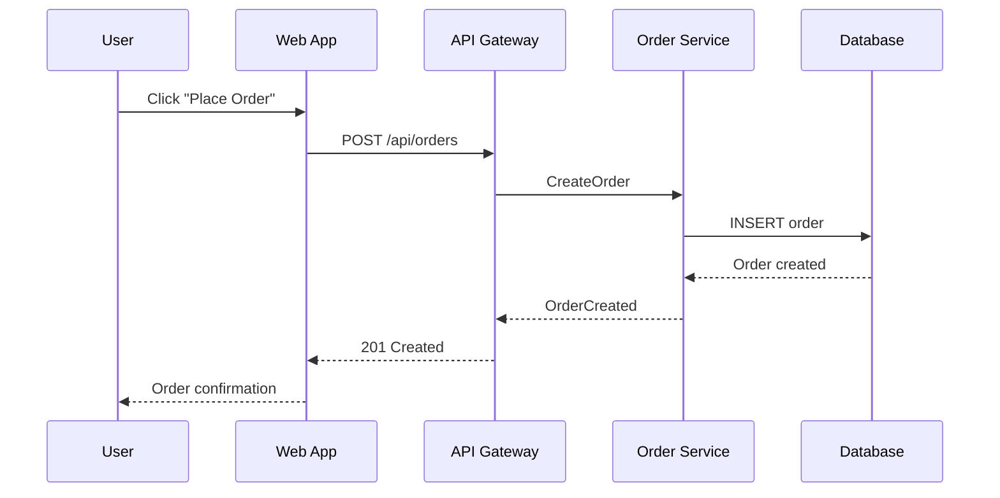

# C4 Documentation Skill

Create architecture documentation using the C4 model's four levels of abstraction.

## MANDATORY: Documentation-First Approach

Before creating C4 documentation:

1. **Invoke `docs-management` skill** for C4 patterns
2. **Verify C4 model syntax** via MCP servers (context7 for Structurizr/Mermaid)
3. **Base guidance on c4model.com official documentation**

## C4 Model Overview

```text
C4 Model - Four Levels of Abstraction:

Level 1: System Context
┌─────────────────────────────────────────────────────────────────────────────┐
│  Shows the system in context with users and external systems                 │
│  Audience: Everyone (technical and non-technical)                            │
└─────────────────────────────────────────────────────────────────────────────┘
                                    ↓
Level 2: Container
┌─────────────────────────────────────────────────────────────────────────────┐
│  Shows high-level technology choices and responsibilities                    │
│  Audience: Technical people (inside and outside the team)                    │
└─────────────────────────────────────────────────────────────────────────────┘
                                    ↓
Level 3: Component
┌─────────────────────────────────────────────────────────────────────────────┐
│  Shows components within a container                                         │
│  Audience: Software architects and developers                                │
└─────────────────────────────────────────────────────────────────────────────┘
                                    ↓
Level 4: Code (Optional)
┌─────────────────────────────────────────────────────────────────────────────┐
│  Shows classes, interfaces, and implementation details                       │
│  Audience: Developers (often auto-generated)                                 │
└─────────────────────────────────────────────────────────────────────────────┘
```

## Level 1: System Context Diagram

### Purpose

Shows the software system in the context of:

- Who uses it (people)
- What other systems it interacts with

### Mermaid Syntax



### PlantUML/Structurizr DSL



## Level 2: Container Diagram

### Purpose

Shows the high-level shape of the software architecture:

- Applications, data stores, microservices
- How they communicate
- Technology choices

### Mermaid Syntax



### Container Types

| Type | Usage | Example |
|------|-------|---------|
| `Container` | Application/service | API, web app, microservice |
| `ContainerDb` | Database | PostgreSQL, MongoDB, Redis |
| `ContainerQueue` | Message queue | Kafka, RabbitMQ, SQS |
| `Container_Ext` | External container | Third-party API hosted elsewhere |

## Level 3: Component Diagram

### Purpose

Shows the internal structure of a container:

- Major components and their responsibilities
- Interactions between components
- Technology implementation

### Mermaid Syntax



## Level 4: Code Diagram

### Purpose

Shows implementation details (usually auto-generated):

- Class diagrams
- Entity relationships
- Interface definitions

### When to Use

- Complex domain models
- Framework documentation
- Public API documentation



## Supplementary Diagrams

### Deployment Diagram



### Dynamic Diagram (Sequence)



## C4 Documentation Template

```markdown
# C4 Architecture Documentation: [System Name]

## 1. System Context

### Diagram

[Level 1 Context Diagram]

### Description

[Narrative explaining the context]

### Actors and External Systems

| Element | Type | Description |
|---------|------|-------------|
| [Name] | Person | [Description] |
| [Name] | External System | [Description] |

---

## 2. Container View

### Diagram

[Level 2 Container Diagram]

### Container Catalog

| Container | Technology | Responsibility |
|-----------|------------|----------------|
| [Name] | [Tech] | [What it does] |

---

## 3. Component Views

### 3.1 [Container Name] Components

#### Diagram

[Level 3 Component Diagram]

#### Component Catalog

| Component | Technology | Responsibility |
|-----------|------------|----------------|
| [Name] | [Tech] | [What it does] |

---

## 4. Deployment View

### Diagram

[Deployment Diagram]

### Infrastructure Elements

| Element | Technology | Purpose |
|---------|------------|---------|
| [Name] | [Tech] | [Purpose] |

---

## 5. Key Scenarios

### 5.1 [Scenario Name]

[Dynamic/Sequence Diagram]

[Narrative description]
```

## C# Model for C4 Elements

```csharp
// C4 Model Elements
public abstract record C4Element
{
    public required string Id { get; init; }
    public required string Name { get; init; }
    public string? Description { get; init; }
    public string? Technology { get; init; }
}

public sealed record Person : C4Element
{
    public string? Role { get; init; }
}

public sealed record SoftwareSystem : C4Element
{
    public bool IsExternal { get; init; }
    public IReadOnlyList<Container> Containers { get; init; } = [];
}

public sealed record Container : C4Element
{
    public required ContainerType Type { get; init; }
    public IReadOnlyList<Component> Components { get; init; } = [];
}

public enum ContainerType
{
    WebApplication,
    MobileApp,
    DesktopApp,
    Service,
    Database,
    FileSystem,
    MessageBroker,
    Cache
}

public sealed record Component : C4Element
{
    public string? Interface { get; init; }
}

public sealed record Relationship
{
    public required string SourceId { get; init; }
    public required string DestinationId { get; init; }
    public required string Description { get; init; }
    public string? Technology { get; init; }
}

// C4 Diagram Generator
public interface IC4DiagramGenerator
{
    string GenerateContextDiagram(
        SoftwareSystem system,
        IEnumerable<Person> people,
        IEnumerable<SoftwareSystem> externalSystems,
        IEnumerable<Relationship> relationships);

    string GenerateContainerDiagram(
        SoftwareSystem system,
        IEnumerable<Relationship> relationships);

    string GenerateComponentDiagram(
        Container container,
        IEnumerable<Relationship> relationships);
}
```

## Best Practices

### Do's

- Keep diagrams simple and focused
- Use consistent notation and colors
- Include a legend when needed
- Update diagrams when architecture changes
- Use automated generation where possible

### Don'ts

- Don't show every component on every diagram
- Don't mix abstraction levels
- Don't forget the narrative description
- Don't create diagrams that never get updated

## Workflow

When creating C4 documentation:

1. **Start with Context**: Level 1 shows the big picture
2. **Zoom into Containers**: Level 2 shows technology choices
3. **Detail as Needed**: Level 3 for complex containers
4. **Add Scenarios**: Dynamic diagrams for key flows
5. **Include Deployment**: Show infrastructure mapping
6. **Maintain Currency**: Keep diagrams synchronized with code

## References

For detailed guidance:

---

**Last Updated:** 2025-12-26
