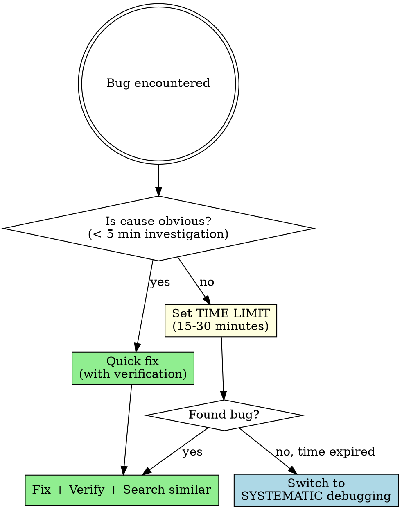
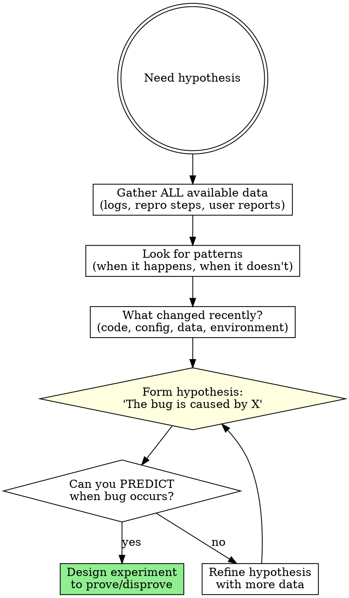

# Skill: cc-debugging

## STOP - Scientific Method Required

- **Do NOT skip to FIX** without STABILIZE → HYPOTHESIZE → EXPERIMENT
- **~50% of rushed fixes are wrong** - Slow down under pressure
- **Can you PREDICT when the bug occurs?** If not, you don't understand it yet

---

## CRISIS TRIAGE (2 minutes)

**Production down? Use this prioritized subset:**

### Immediate (30 seconds each)
1. **Can you reproduce it?** If no → stabilize the error first (make it predictable)
2. **What changed recently?** Check recent commits, deployments, config changes
3. **What do the logs say?** Look at actual error messages, stack traces

### Before Attempting Fix (60 seconds)
4. **Do you understand the root cause?** If no → don't guess, form a hypothesis first
5. **Can you predict when the bug occurs?** If no → you don't understand it yet

**Why triage works:** 90% of debugging is finding/understanding the bug. Only 10% is fixing it.

**Feeling pressure to "just fix it"?** That's exactly when you need to slow down. Rushed fixes are wrong ~50% of the time.

---

## Key Definitions

### Debugging
The process of identifying the root cause of an error and correcting it. Contrasts with testing (which detects errors initially).

### Stabilizing an Error
Making an intermittent defect occur reliably/predictably. Cannot debug what you cannot reproduce.

### Psychological Set
Seeing what you expect to see. Causes "debugging blindness" where programmers overlook defects because they expect the code to work.

### Psychological Distance
The ease with which two items can be differentiated. Variables with small psychological distance (shiftrn/shiftrm) are easily confused.

### Brute-Force Debugging
Techniques that are tedious but guaranteed to work. Use when quick approaches fail.

---

## Scientific Debugging Flowchart

```
+------------------+
|  Error Reported  |
+--------+---------+
         |
         v
+------------------+
| 1. STABILIZE     | <-- Make error occur reliably
|    the error     |     Narrow to simplest test case
+--------+---------+
         |
         v
+------------------+
| 1b. PATTERN      | <-- How were similar bugs fixed?
|     REUSE GATE   |     Search codebase for patterns
+--------+---------+
         |
         v
+------------------+
| 2. Form          | <-- Based on available data + patterns
|    HYPOTHESIS    |     What could cause this?
+--------+---------+
         |
         v
+------------------+
| 3. Design        | <-- How will you prove/disprove?
|    EXPERIMENT    |     Code inspection? Test case?
+--------+---------+
         |
         v
+------------------+     +---------------+
| 4. Run test      |---->| Disproved?    |
|   PROVE/DISPROVE |     +-------+-------+
+--------+---------+             | Yes
         | Proved                v
         v                +---------------+
+------------------+      | Refine        |
| 5. FIX the       |      | hypothesis    |--+
|    defect        |      +---------------+  |
+--------+---------+                         |
         |                                   |
         v                                   |
+------------------+                         |
| 6. TEST the fix  |                         |
|    (verify!)     |                         |
+--------+---------+                         |
         |                                   |
         v                                   |
+------------------+                         |
| 7. LOOK for      |<------------------------+
|    similar bugs  |
+------------------+
```

**CRITICAL:** Do NOT skip steps. Do NOT jump to step 5 without completing 1-4.

---

## Step 1b: Pattern Reuse Gate

**BEFORE forming your hypothesis, search the codebase:**

| Search For | Why |
|------------|-----|
| Similar bugs fixed before | How was it solved? Same root cause? |
| Same error type elsewhere | Is there an established fix pattern? |
| Same module/component bugs | What patterns emerge in this area? |

**Questions to answer:**
1. Has this bug (or similar) been fixed before in this codebase?
2. How do other parts of the code handle this situation?
3. Is there an established pattern I should follow?

**If pattern found:** Your hypothesis should account for it. Either:
- The pattern wasn't applied here (apply it)
- The pattern was applied but incorrectly (fix application)
- This is a new case the pattern doesn't cover (extend pattern)

**If no pattern found:** You're potentially establishing one. Be deliberate.

**See:** [pattern-reuse-gate.md](../../references/pattern-reuse-gate.md) for full gate protocol.

---

## Modes

### CHECKER
Purpose: Audit debugging approach for systematic methodology
Triggers:
  - "am I debugging correctly"
  - "review my debugging approach"
  - "check my bug investigation"
  - "audit debugging methodology"
Non-Triggers:
  - "help me find this bug" -> APPLIER
  - "review my code" -> cc-routine-and-class-design
Checklist: **See [checklists.md](./checklists.md)**
Output Format:
  | Step | Status | Evidence | Issue |
  |------|--------|----------|-------|
Severity:
  - VIOLATION: Skipped scientific method steps, made random changes, didn't verify fix
  - WARNING: Incomplete stabilization, weak hypothesis, no similar-bug search
  - PASS: Followed methodology systematically

### APPLIER
Purpose: Guide systematic debugging when stuck on a bug
Triggers:
  - "help me debug this"
  - "I can't find the bug"
  - "why isn't this working"
  - "figure out why this fails"
  - "investigate this error"
Non-Triggers:
  - "review my debugging process" -> CHECKER
  - "is my error handling good" -> cc-defensive-programming
Produces:
  - Stabilization strategy for intermittent bugs
  - Hypothesis formation guidance
  - Binary search narrowing approach
  - Fix verification recommendations
Constraints:
  - Must stabilize before hypothesizing
  - Must have hypothesis before fixing
  - Must verify fix before committing
  - Must search for similar bugs after fixing

---

## Decision Flowcharts

### Quick vs Systematic Debugging



### Hypothesis Formation



---

## Anti-Patterns

### Debug by Superstition
**Pattern:** Blaming the compiler, machine, framework, or external factors.
**Reality:** If you wrote it, it's your fault. Programs don't do something different every time.
**Counter:** Assume the error is yours. Take responsibility. This helps debugging AND credibility.

### Random Changes (Voodoo Programming)
**Pattern:** "I'll just put a -1 here and try it" without understanding why.
**Reality:** You learn nothing. The more you change without understanding, the less confidence you'll have.
**Counter:** Be confident the change will work BEFORE making it.

### Special-Case Fixes (CODING HORROR)
**Pattern:** `if (client == 45) { sum[45] = sum[45] + 3.45; }` to "fix" a calculation error.
**Reality:** Won't work (initialization bugs are unpredictable), unmaintainable, creates barnacles.
**Counter:** Fix the root cause in the algorithm. Never add special cases for specific values.

### Fix Symptom Not Cause
**Pattern:** Making the error message go away without understanding why it appeared.
**Reality:** Bug still exists. Will manifest differently later, harder to find.
**Counter:** Understand completely before fixing. Predict when bug occurs.

### Skip Verification Under Pressure
**Pattern:** Committing fix before skiing trip without testing.
**Reality:** ~50% of fixes are wrong the first time (Yourdon 1986b).
**Counter:** ALWAYS verify. No exceptions. "It might take more time, but it'll probably take less."

### Ignore Compiler Warnings
**Pattern:** Suppressing warnings instead of fixing them.
**Reality:** "Closing your eyes doesn't make the adult go away."
**Counter:** Fix every warning. Treat warnings as errors.

---

## Red Flags - STOP and Apply Scientific Method

**Tempted to Skip Stabilization:**
- "It's intermittent but I have a theory"
- "I saw it happen once, that's enough"
- "I'll just try this fix and see"

**Hypothesis-Free Zone:**
- "I have no idea what's causing this"
- "Let me just add some print statements"
- "I'll comment out code until it works"

**Blaming Externals:**
- "It must be the compiler"
- "Works on my machine"
- "Something must have changed in the environment"

**Pressure-Induced Shortcuts:**
- "I just need to ship this"
- "I'll investigate properly later"
- "It's probably fine"

**All of these mean: Return to step 1. Stabilize. Hypothesize. Experiment.**

---

## Rationalization Counters

| Excuse | Reality |
|--------|---------|
| "It's probably a compiler bug" | If you wrote it, it's your fault. Take responsibility. |
| "The problem is trivial, no need to understand it" | Simply finding it is not enough to fix it correctly |
| "I'll just add a special case for this one input" | Special cases become barnacles; code becomes unmaintainable |
| "I'll try random changes until it works" | Voodoo programming. You learn nothing. |
| "I need to ship, I'll just check it in" | Hurrying is time-ineffective. Verify before committing. |
| "I've been looking at this too long, I'll just guess" | Take a break. Let subconscious work. Come back fresh. |
| "I'll make several changes at once to save time" | Multiple changes = can't know which one mattered |
| "The debugger is a crutch" | Good thinking + good debugger = most effective |
| "I verified it works once" | Test the triangulation cases too. Add regression test. |
| "I'm just adding observability" | Logging without hypothesis is aimless exploration, not debugging. |
| "Reproduction is good enough (7/10)" | Partial reproduction = missing variable in hypothesis. 100% or keep searching. |
| "Tests pass so it's verified" | If tests passed WITH the bug, they don't test the bug. Add new test. |
| "I've seen this pattern before" | Familiarity breeds overconfidence. Form hypothesis from THIS data, not memory. |
| "I'll understand after deployment" | Production monitoring is not verification. Fix must be proven BEFORE commit. |

---

## Pressure Testing Scenarios

### Scenario 1: Intermittent Failure
**Situation:** Test fails randomly, maybe 1 in 10 runs.
**Wrong Response:** "I'll just run it again until it passes."
**REQUIRED Response:** Stabilize first. Common causes: initialization error, timing issue, dangling pointer. Find the pattern.

### Scenario 2: Production Emergency
**Situation:** App down in prod. Pressure to "just fix it."
**Wrong Response:** Make change, deploy immediately without testing.
**REQUIRED Response:** Take breath. Form hypothesis. Verify fix works. ~50% of rushed fixes are wrong.

### Scenario 3: "It Works Now"
**Situation:** Bug disappeared after making some changes.
**Wrong Response:** "Great, it's fixed!" Ship it.
**REQUIRED Response:** Do you understand WHY it's fixed? If not, you haven't fixed it - you've hidden it.

### Scenario 4: Cannot Reproduce
**Situation:** User reports bug you can't reproduce.
**Wrong Response:** "Works on my machine. Close ticket."
**REQUIRED Response:** Replicate user's environment. Get more data. The bug is real.

### Scenario 5: Deep in Code
**Situation:** Been debugging same issue for hours, getting frustrated.
**Wrong Response:** Keep staring at same code. Try random changes.
**REQUIRED Response:** Take a break. Talk to rubber duck. Look at completely different area.

---

## Binary Search for Bug Location

When defect location is unknown within large code region:

1. Use divide and conquer
2. Remove about half the code first time
3. Does bug persist? If yes → defect is in remaining half
4. Divide that section in half
5. Continue until defect found

**Methods:**
- Comment out calls to routines
- Use preprocessor to remove code
- Set breakpoint partway through
- Skip execution of certain routines in debugger

**When to use:** Defect in large region (>50 lines). Don't use for already-localized bugs.

---

## Brute-Force Techniques

When systematic debugging hasn't found the bug, use these guaranteed (but tedious) approaches:

- Perform full design/code review on broken code
- Throw away section and redesign/recode from scratch
- Compile with full debugging information
- Compile at pickiest warning level, fix ALL warnings
- Create unit test harness, test in isolation
- Create automated test suite, run all night
- Step through big loop manually until error
- Instrument with logging statements
- Compile with different compiler
- Compile/run in different environment
- Use special libraries that warn on misuse
- Replicate end-user's full machine configuration
- Integrate new code in small pieces

---

## Fix Verification Procedure

Before committing ANY fix:

1. **Triangulate:** Find cases that SHOULD and SHOULDN'T trigger bug
2. **Predict correctly** every time before attempting fix
3. **Understand vicinity** (~hundreds of lines, not just bug site)
4. **Confirm diagnosis** - rule out competing hypotheses FIRST
5. **Save original source** before changes
6. **Fix root cause** - no special-case workarounds
7. **One change at a time** - never batch
8. **Run triangulation test cases** again
9. **Run full regression tests**
10. **Add unit test** that exposes the defect (prevents regression)
11. **Search for similar defects** - defects cluster

---

## Evidence Summary

| Finding | Source | Implication |
|---------|--------|-------------|
| 20:1 debugging performance variation | Gould 1975, Gilb 1977, Curtis 1981 | Systematic approach dramatically outperforms guessing |
| ~50% of defect corrections wrong first time | Yourdon 1986b | Always verify fixes before committing |
| Global understanding improves success | Littman et al. 1986 | Understand vicinity (~hundreds of lines) |
| Best debuggers mentally slice irrelevant code | Basili, Selby, Hutchens 1986 | Focus narrows; risk is slicing too much |
| Finding defect is 90% of work | McConnell observation | Don't rush the fix - understand first |

---


---

## Chain

| After | Next |
|-------|------|
| Fix verified | SEARCH for similar defects |
| Similar defects found | Fix each, then done |
