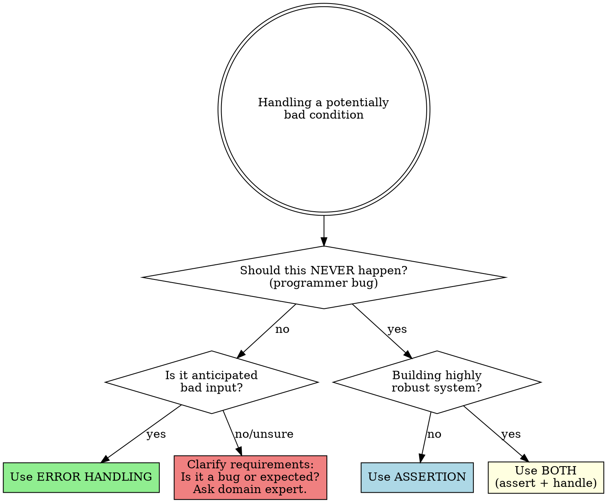
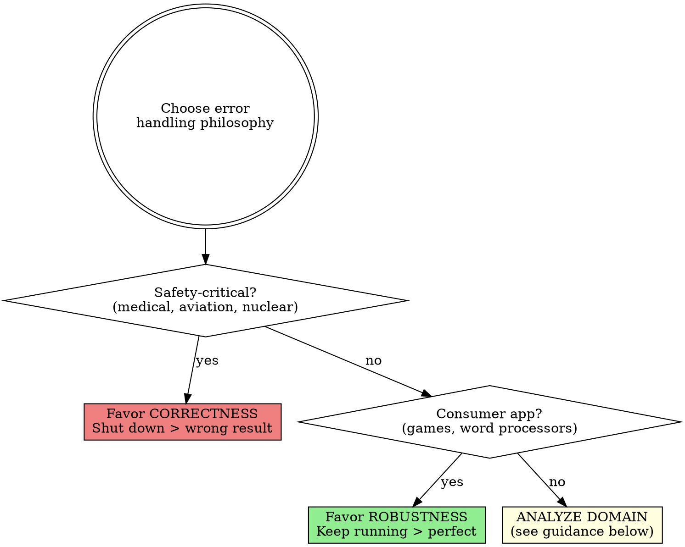
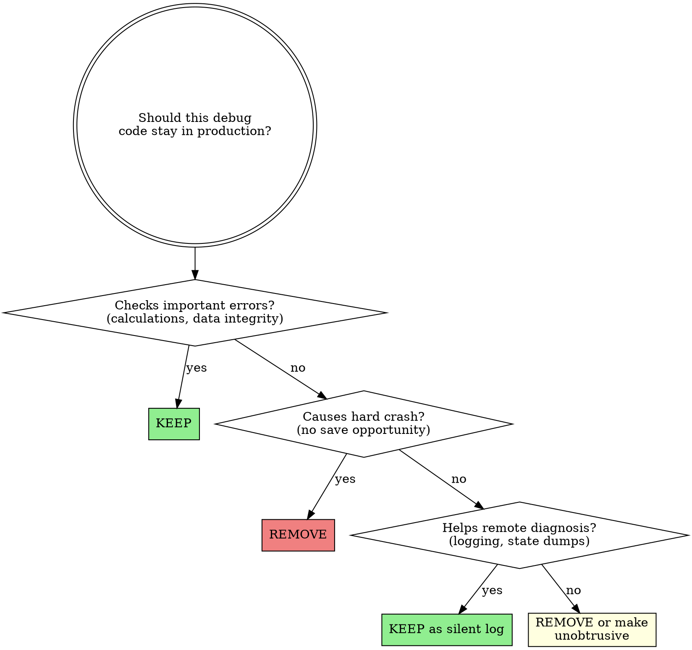

# Skill: cc-defensive-programming

## STOP - Never Skip

| Check | Why Critical |
|-------|--------------|
| **No executable code in assertions** | Code disappears in production builds |
| **No empty catch blocks** | Silently swallows bugs that compound |
| **External input validated** | Security vulnerabilities, data corruption |

---

## CRISIS TRIAGE (2 minutes)

**Production down? Use this prioritized subset:**

### Immediate (30 seconds each)
1. **Is external input validated at entry point?** If no → add validation NOW
2. **Any empty catch blocks hiding the real error?** If yes → add logging, find root cause
3. **Any assertions with side effects?** If yes → extract to separate statement

### Before Deploying Fix (60 seconds)
4. **Does fix match architectural error strategy?** (return code vs exception vs shut down)
5. **Are you catching at right abstraction level?** (not `EOFException` from `GetEmployee()`)

**Why triage works:** These 5 items catch 80% of defensive programming bugs. Full checklist (21 items) is for non-emergency review.

**Cutting corners in a crisis creates the NEXT crisis.** The "quick fix" empty catch block you add today becomes tomorrow's 3 AM page.

---

## Key Definitions

### External Input
**Any data not provably controlled by current code path:**
- User input (keyboard, forms, CLI args)
- Files (config, data, uploads)
- Network (APIs, databases, inter-service calls)
- Environment variables, system properties
- Data from ANY other service, even internal ones

**"Internal team API" is still external.** If it crosses a network boundary or process boundary, validate it.

### Assertion
Code used during development that allows a program to check itself as it runs. When true = operating as expected. When false = detected an unexpected error (bug). Use for conditions that should **never** occur.

### Barricade
A damage-containment strategy. Interfaces designated as boundaries to "safe" areas. Data crossing these boundaries is checked for validity.

**Limitation:** Barricades reduce redundant validation but do NOT replace defense-in-depth for security-critical operations. If barricade validation has a bug, what happens?

### Correctness vs Robustness
- **Correctness:** Never returning an inaccurate result; no result is better than wrong result (safety-critical)
- **Robustness:** Always trying to keep software operating, even if results are sometimes inaccurate (consumer apps)

### Preconditions / Postconditions
- **Preconditions:** Properties client code promises are true BEFORE calling routine
- **Postconditions:** Properties routine promises are true AFTER executing
- [XREF: Meyer 1997, "Design by Contract"]

## When NOT to Use

- **Pure functions without side effects** - Immutable data flows don't need defensive mutation protection (but still validate inputs at system boundaries)
- **Prototype/spike code** - Time-boxed exploration (max 1 week) before committing to error strategy
- **Test code** - Test doubles intentionally violate production patterns
- **Performance-critical inner loops** - Where assertion overhead matters (must show profiling data proving >5% overhead)

**SECURITY EXCEPTION:** Security-critical code (authentication, authorization, cryptographic operations, PII handling) is NEVER exempt from defensive programming regardless of other factors. When in doubt, validate.

## Crisis Invariants - NEVER SKIP

**These checks are almost always required. Exceptions need explicit justification and documentation:**

| Check | Time | Why Critical |
|-------|------|--------------|
| **No executable code in assertions** | 15 sec | Code disappears in production builds |
| **No empty catch blocks** | 15 sec | Silently swallows bugs that compound |
| **External input validated** | 30 sec | Security vulnerabilities, data corruption |
| **Assertions for bugs only** | 15 sec | Assertions disabled in production; anticipated errors need handling |

**Why these four?** Violations create silent failures that are nearly impossible to debug later. They don't crash loudly - they corrupt data and hide bugs.

**Rationalizing "I'll add proper error handling later"?** You likely won't. Error handling added later is often incomplete because edge cases are forgotten. However, if you genuinely must defer, create a tracked ticket with specific scope.

---

## Pattern Reuse Gate

**BEFORE implementing any error handling, search the codebase:**

| Search For | Why |
|------------|-----|
| Same error type elsewhere | How is it handled? Log? Throw? Return code? |
| Same module's error handling | What's the established pattern here? |
| Barricade/validation patterns | Where are the trust boundaries? |
| Exception hierarchy | What custom exceptions exist? |

**Questions to answer:**
1. How does this codebase handle this type of error elsewhere?
2. Is there an established error-handling strategy (exceptions vs return codes vs Result types)?
3. What logging/monitoring patterns are used?
4. Are there existing custom exception classes I should use?

**If pattern found:** Follow it. Consistency in error handling is critical for debugging.

**If no pattern found:** You're establishing one. Document your decision. Consider if this should become the pattern.

**See:** [pattern-reuse-gate.md](../../references/pattern-reuse-gate.md) for full gate protocol.

---

## Modes

### CHECKER
Purpose: Execute checklists for defensive programming, assertions, exceptions, and error handling
Triggers:
  - "review my error handling"
  - "check for defensive programming"
  - "review assertions"
  - "check exception handling"
  - "audit my validation code"
Non-Triggers:
  - "design my error handling strategy" -> APPLIER
  - "review my control flow" -> cc-control-flow-quality
  - "review my class design" -> cc-routine-and-class-design
Checklist: **See [checklists.md](./checklists.md)**
Output Format:
  | Item | Status | Evidence | Location |
  |------|--------|----------|----------|
Severity:
  - VIOLATION: Fails checklist item (missing validation, empty catch blocks, assertions with side effects)
  - WARNING: Partial compliance (inconsistent error handling, missing documentation)
  - PASS: Meets requirement

### APPLIER
Purpose: Apply defensive programming techniques when implementing error handling and validation
Triggers:
  - "how should I handle this error"
  - "should I use assertion or error handling"
  - "help me design barricades"
  - "set up defensive programming"
  - "implement input validation"
Non-Triggers:
  - "review my existing error handling" -> CHECKER
  - "optimize my error handling performance" -> performance skill
Produces:
  - Assertion placement recommendations
  - Error-handling strategy decisions
  - Barricade architecture designs
  - Input validation implementations
Constraints:
  - Use assertions for bugs that should never occur (p.191)
  - Use error handling for anticipated error conditions (p.194)
  - Design barricades at external interfaces (p.203)
  - Favor development debugging aids over production constraints (p.205)

## Decision Flowcharts

### Assertion vs Error Handling



### Correctness vs Robustness



**Domain Analysis Guidance** (for "Analyze domain" path):

| Domain Type | Lean Toward | Key Question |
|-------------|-------------|--------------|
| Enterprise/B2B | Correctness | "Would wrong data cause business decisions based on false info?" |
| SaaS platforms | Balanced | "What's the blast radius of a wrong answer vs unavailability?" |
| Internal tools | Robustness | "Is user technical enough to recover from a crash?" |
| Data pipelines | Correctness | "Does downstream processing assume data integrity?" |
| Real-time systems | Context-dependent | "Is stale data better or worse than no data?" |

### Keep Debug Code in Production?



## Decision Framework: Assertions vs Error Handling

| Condition Type | Use Assertion | Use Error Handling | Guidance |
|----------------|---------------|-------------------|----------|
| Should never occur (bug) | Yes | No | Assert documents the impossibility |
| Can occur at runtime | No | Yes | Handle gracefully |
| External input | No | Yes | Always validate external data |
| Internal interface (same module) | Yes | No | Assert for contract violations |
| Internal interface (cross-module) | Yes | Yes, if crossing trust boundary | Validate at module boundaries |
| Precondition violation | Yes | Yes, if public API | Public APIs need graceful errors |
| Security-critical | Both | Both | Defense in depth |
| Highly robust systems | Both | Both | Belt and suspenders |

## Barricade Design (p.203-204)

**MUST be performed in order:**

1. **Identify** external interfaces (user input, files, network, APIs, inter-service calls)
2. **Place** validation at barricade boundary - all external data checked here
3. **Inside** barricade: use assertions for internal bugs (data assumed validated)
4. **Strategy:** External = error handling; Internal = assertions

**Class-level barricade:** Public methods validate and sanitize; private methods within that class can assume data is safe.

**Critical caveat:** "Trust inside barricade" means reduced redundant validation, NOT zero validation. For security-critical paths (auth, crypto, PII), validate again even inside the barricade. Bugs in barricade validation happen.

## Async and Modern Patterns

Traditional exception propagation assumes synchronous call stacks. Modern patterns need different approaches:

### Promises/Async-Await
```javascript
// BAD: Unhandled rejection crashes Node.js
async function fetchUser(id) {
  const response = await fetch(`/api/users/${id}`); // Can reject
  return response.json();
}

// GOOD: Explicit error handling
async function fetchUser(id) {
  try {
    const response = await fetch(`/api/users/${id}`);
    if (!response.ok) {
      throw new UserNotFoundError(id); // Domain-level exception
    }
    return response.json();
  } catch (e) {
    if (e instanceof UserNotFoundError) throw e;
    throw new UserServiceError('Failed to fetch user', { cause: e });
  }
}
```

### Callbacks
- Errors don't propagate through callbacks - must be explicitly passed
- Use error-first callback pattern: `callback(error, result)`
- Wrap callback APIs in promises for better error handling

### Promise.all() Error Aggregation
```javascript
// BAD: First rejection loses other results
const results = await Promise.all(promises);

// GOOD: Collect all results including failures
const results = await Promise.allSettled(promises);
const failures = results.filter(r => r.status === 'rejected');
if (failures.length > 0) {
  logErrors(failures);
  // Decide: fail entirely or continue with partial results?
}
```

### Event Handlers / React Error Boundaries
- Synchronous exceptions in event handlers don't crash the app but ARE silently swallowed
- Use React Error Boundaries to catch rendering errors
- Log errors in event handlers explicitly

## Offensive Programming (p.206)

Make errors painful during development so they're found and fixed:

| Technique | Purpose |
|-----------|---------|
| **Make asserts abort** | Don't let programmers bypass known problems |
| **Fill allocated memory** | Detect memory allocation errors immediately |
| **Fill files/streams completely** | Flush out file-format errors early |
| **Default/else clauses fail hard** | Impossible to overlook unexpected cases |
| **Fill objects with junk before deletion** | Detect use-after-free immediately |
| **Email error logs to yourself** | Get notified of errors in the field |

**Paradox:** During development, make errors noticeable and obnoxious. During production, make errors unobtrusive with graceful recovery.

## Production Transition (p.209-210)

| Debug Code Type | Action | Rationale |
|-----------------|--------|-----------|
| Checks important errors (calculations, data) | **KEEP** | Tax calculation errors matter; messy screens don't |
| Checks trivial errors (screen updates) | **REMOVE** or log silently | Penalty is cosmetic only |
| Causes hard crashes | **REMOVE** | Users need chance to save work |
| Enables graceful crash with diagnostics | **KEEP** | Mars Pathfinder diagnosed issues remotely |
| Logging for tech support | **KEEP** | Convert assertions from halt to log |
| Exposes info to attackers | **REMOVE** | Error messages shouldn't help attackers |

## Red Flags - STOP and Reconsider

If you find yourself thinking any of these, you are about to violate the skill:

**Skipping Validation:**
- "This input comes from trusted source"
- "The caller will validate before passing"
- "We control the data, it can't be bad"
- "It's an internal API, only our team calls it"

**Assertion Misuse:**
- "I'll just put the action in the assert - it's convenient"
- "Assertions slow things down"
- "I'll use an assert for this user input check"

**Exception Abuse:**
- "Empty catch is fine, I don't care about this exception"
- "I'll catch Exception and figure it out later"
- "Throwing EOFException from GetEmployee() is fine"

**Deadline Pressure:**
- "I'll add proper error handling after we ship"
- "Garbage in, garbage out is acceptable for now"
- "We can clean up the exception handling later"

**Success Streak / Overconfidence:**
- "We've never had a problem with X"
- "This has been working fine for months"
- "I've done this pattern 10 times without issues"
- "Our error handling is already pretty good"

**Sunk Cost:**
- "But it works / passes all tests"
- "I already spent 4 hours on this approach"
- "Refactoring would take too long"

**All of these mean: Apply the checklists anyway. Neither deadline pressure nor past success exempts you from validation.**

## Rationalization Counters

| Excuse | Reality |
|--------|---------|
| "Garbage in, garbage out is fine" | For production software, it's the mark of a sloppy, nonsecure program (p.188) |
| "Assertions slow down my code" | Compile them out for production; trade speed for safety during development (p.205) |
| "I'll just put the action in the assertion" | Code won't execute when assertions are disabled in production (p.191) |
| "Empty catch blocks are fine" | Either the try or catch is wrong; find and fix the root cause (p.201) |
| "I'll add defensive code everywhere" | Too much defensive programming adds complexity and defects (p.210) |
| "One error strategy is enough" | For highly robust code, use both assertions AND error handling (p.193) |
| "I can handle it locally with an exception" | If you can handle locally, don't throw - handle locally (p.199) |
| "EOFException from GetTaxId() is fine" | Exceptions must match routine's abstraction level (p.200) |
| "I'll validate later" | Later never comes; edge cases are forgotten |
| "This is internal code, no validation needed" | Use assertions for internal bugs - but you still need SOMETHING |
| **"We've never had a problem with X"** | You prevented invisible failures; survivorship bias. The bugs you don't see are the ones you prevented. |
| **"But it works / passes tests"** | Working now ≠ maintainable later. Tests verify behavior, not design quality. |
| **"I already spent N hours on this"** | Sunk cost fallacy. Time spent is gone regardless. Question: fix now (2 hours) or debug later (20 hours)? |
| **"This has been running fine for months"** | Past success doesn't predict future safety. Each change is a new risk. The Mars Climate Orbiter worked for 9 months before unit conversion bug destroyed it. |

## Pressure Testing Scenarios

### Scenario 1: Deadline Crunch
**Situation:** Feature due tomorrow. You're tempted to skip input validation for the new API endpoint.
**Test:** Is external data entering the system?
**REQUIRED Response:** Yes. Validate it. Buffer overflows and SQL injection don't care about your deadline.

### Scenario 2: Quick Fix
**Situation:** Exception crashes prod. Quickest fix is empty catch block.
**Test:** Does the exception represent a real error condition?
**REQUIRED Response:** Yes. Either the try block is wrong (raises exception it shouldn't) or catch is wrong (not handling). Find root cause. At minimum, log it.

### Scenario 3: Convenient Assertion
**Situation:** You need to initialize a subsystem. Putting `InitSubsystem()` inside `Assert(InitSubsystem())` is convenient.
**Test:** Will this code be needed in production?
**REQUIRED Response:** Yes. Don't put it in assertion. Production builds disable assertions.

### Scenario 4: Trusted Source
**Situation:** "This data comes from our own database, not user input."
**Test:** Could the database ever contain bad data? (Migration errors, bugs, corruption)
**REQUIRED Response:** Yes. Use barricade design - validate at boundaries. Or use assertions if it's truly internal and indicates a bug.

### Scenario 5: Exception Abstraction
**Situation:** Your `Employee.GetTaxId()` method reads from a file. File throws `EOFException`. You propagate it.
**Test:** Is `EOFException` at the same abstraction level as "Employee"?
**REQUIRED Response:** No. Wrap in `EmployeeDataNotAvailable` or similar. Don't expose implementation details through exception types.

### Scenario 6: Success Streak
**Situation:** Last 5 features shipped without defensive programming review. No bugs reported.
**Test:** Does past success mean current code is safe?
**REQUIRED Response:** No. Survivorship bias - you don't see the bugs you prevented. Each change is new risk. Apply the skill anyway.

### Scenario 7: Sunk Cost
**Situation:** Spent 4 hours implementing error handling. It works but doesn't follow barricade design.
**Test:** Should you refactor to follow the skill?
**REQUIRED Response:** Evaluate: 2 hours refactoring now vs potential 20 hours debugging over project lifetime. Sunk cost is irrelevant to this calculation.

## Evidence Summary

| Claim | Source | Application |
|-------|--------|-------------|
| "Garbage in, garbage out" is obsolete | McConnell p.188 | Production software must validate or reject |
| Assertions especially useful in large/complex programs | McConnell p.189 | More code = more interface mismatches to catch |
| Error handling is architectural decision | McConnell p.197 | Decide at architecture level, enforce consistently |
| Trade speed for debugging aids | McConnell p.205 | Development builds can be slow if they catch bugs |
| Exceptions weaken encapsulation | McConnell p.198 | Callers must know what exceptions called code throws |
| Dead program does less damage than crippled one | Hunt & Thomas | Fail fast, fail loud during development |
| Mars Pathfinder used debug code in production | McConnell p.209 | JPL diagnosed and fixed remotely using left-in debug aids |
| **Bugs cost 100x more to fix in production** | IBM Systems Sciences Institute | Validates investment in early defensive programming |
| **15-50% of development time spent on debugging** | McConnell, citing multiple studies | Defensive programming reduces this significantly |
| **Mars Climate Orbiter lost due to unit mismatch** | NASA 1999 | 9 months of success doesn't mean code is safe |

## Error-Handling Strategy Options (p.194-197)

1. **Return neutral value** - Use for: display defaults, non-critical config
2. **Substitute next valid data** - Use for: streaming data, sensor readings with redundancy
3. **Return same answer as previous** - Use for: display refresh, non-critical caching (NOT financial data)
4. **Substitute closest legal value** - Use for: input clamping, slider bounds
5. **Log warning and continue** - Use for: non-critical degradation, feature flags
6. **Return error code** - Use for: APIs with status conventions, C-style interfaces
7. **Call centralized error handler** - Use for: consistent logging, monitoring integration
8. **Display error message** - Use for: user-facing apps (but don't leak security info)
9. **Shut down gracefully** - Use for: safety-critical, data-corrupting errors

**Strategy selection is an architectural decision - be consistent throughout.**

| Application Type | Favor | Avoid |
|------------------|-------|-------|
| Safety-critical (medical, aviation) | Shut down | Return guessed value |
| Consumer apps (games, word processors) | Keep running | Crash without save |
| Financial/audit | Fail with clear error | Silent substitution |
| Data pipelines | Fail and retry OR quarantine | Silent data loss |
| Real-time systems | Degrade gracefully | Hard crash |


---

## Chain

| After | Next |
|-------|------|
| Validation complete | cc-control-flow-quality (CHECKER) |
