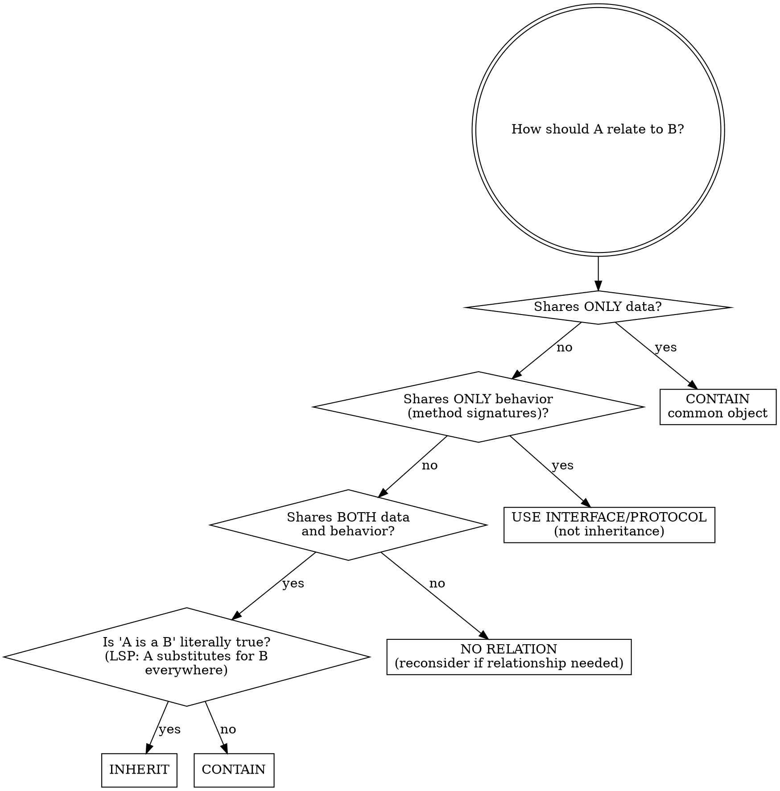
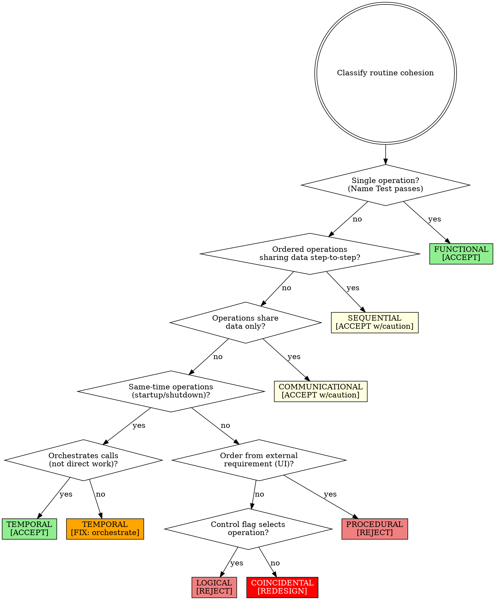

# Skill: cc-routine-and-class-design

## STOP - Crisis Invariants (NEVER SKIP)

| Check | Time | Why Non-Negotiable |
|-------|------|-------------------|
| **LSP Test** - "Is 'A is a B' literally true?" | 30 sec | Wrong inheritance creates debugging hell |
| **Containment Default** - If LSP feels wrong, use containment | 30 sec | Containment is fixable; inheritance requires architecture changes |
| **Parameter Count** - If >7 parameters, interface is wrong | 15 sec | High parameter count predicts interface errors |

---

## Prerequisites
This skill assumes:
- Object-oriented programming with class-based inheritance
- Mutable state (objects that change over time)
- Synchronous or simple async patterns

For functional programming, prototype-based inheritance, or heavily concurrent code, adapt principles rather than applying literally. See "Pattern-Specific Guidance" section.

## When NOT to Use

- **Scripting/automation code** - One-off scripts don't benefit from class design rigor
- **Prototyping phase** - When exploring ideas before committing to design (time-box to max 1 week)
- **Simple data transfer objects** - Pure DTOs without behavior are exempt from ADT requirements (but DTOs with validation, toString, equals are NOT exempt)
- **Framework-mandated patterns** - When framework REQUIRES inheritance to function (e.g., Android Activity won't work without extending Activity). "Framework supports inheritance" or "framework examples use inheritance" is NOT mandated
- **Performance-critical inner loops** - Where accessor overhead matters (measure first - must show profiling data)
- **Test doubles (mocks, stubs, fakes)** - Test code intentionally violates design rules; empty overrides and minimal abstractions are appropriate

## Crisis Invariants - NEVER SKIP

**These checks are NON-NEGOTIABLE regardless of deadline pressure:**

| Check | Time | Why Non-Negotiable |
|-------|------|-------------------|
| **LSP Test** - "Is 'A is a B' literally true?" | 30 sec | Wrong inheritance creates debugging hell that costs MORE time than it saves |
| **Containment Default** - If LSP feels like "purity theater," use containment | 30 sec | Containment problems are fixable; inheritance problems require architecture changes |
| **Parameter Count** - If >7 parameters, interface is wrong | 15 sec | High parameter count predicts interface errors |

**Why these three?** Violations create problems that CANNOT be easily fixed post-crisis. They require architectural changes, not patches.

**If you're rationalizing "I'll fix the design after the crisis":** Post-crisis "cleanup" rarely happens. Technical debt from wrong inheritance is architectural, not patchable.

## Modes

### CHECKER
Purpose: Execute design checklists against routines and classes
Triggers:
  - "review my class design"
  - "check routine quality"
  - "audit class interfaces"
  - "evaluate cohesion"
Non-Triggers:
  - "how should I design this class" -> APPLIER
  - "should I use inheritance here" -> APPLIER
  - "refactor this routine" -> cc-refactoring-guidance
Checklist: **See [checklists.md](./checklists.md)**
Output Format:
  | Item | Status | Evidence | Location |
  |------|--------|----------|----------|

**Severity Classification Rubric:**

| Severity | Criteria | Example |
|----------|----------|---------|
| VIOLATION | Explicitly fails checklist item | 12 parameters (> 7 limit) |
| VIOLATION | Breaks LSP/encapsulation | Empty override, protected base data |
| WARNING | Near limit, needs justification | 8 parameters, 3-level inheritance |
| WARNING | Subjective concern | Questionable abstraction consistency |
| PASS | Meets or exceeds requirement | Clear cohesion, ≤7 parameters |

**Note:** Test suite status is IRRELEVANT to checker results. A class can pass all tests and still have VIOLATION-level design issues that predict future maintenance problems.

### APPLIER
Purpose: Guide class interface design, inheritance decisions, and routine creation
Triggers:
  - "how should I design this class"
  - "should I use inheritance or containment"
  - "what cohesion type is this routine"
  - "how many parameters is too many"
  - "should I extract this to a routine"
Non-Triggers:
  - "review my class" -> CHECKER
  - "check this routine" -> CHECKER
  - "optimize this code" -> cc-performance-tuning
Produces: Class interface designs, inheritance/containment decisions, routine signatures, cohesion classifications
Constraints:
  - [p.133] Default to containment; only inherit if "is-a" is literally true (LSP)
  - [p.143] Inheritance depth: target <3 levels, WARNING at 3, VIOLATION at 4+, SEVERE at 6+
  - [p.178] Parameter limit: 7 maximum (8+ is VIOLATION requiring redesign)
  - [p.168] Target functional cohesion for routines
  - [p.139] Asking "What should this class hide?" drives good design

### Parameter Guidelines

**Threshold Table:**

| Count | Status | Action |
|-------|--------|--------|
| 1-5 | PASS | No action needed |
| 6-7 | PASS | Minor concern, document if unusual |
| 8-9 | WARNING | Justify in code review OR redesign |
| 10+ | VIOLATION | Must redesign - use Parameter Object or split responsibilities |

**"About 7" means:** 7 is the limit. 8 is over. Count ALL parameters including optional ones with defaults. Variadic args (`*args`/`...`) count as 1.

**Ordering convention** (implies data flow sequence - ORDER MATTERS):
1. Input-only parameters first
2. Input-and-output (modify) parameters second
3. Output-only parameters third

## Key Definitions

### LSP (Liskov Substitution Principle)

If A inherits from B, then everywhere code uses B, you can substitute A without breaking anything.

**Test:** Does calling *every* method on the base class make sense for the derived class?

**Inheritance requires BOTH:**
1. **Semantic test**: "A is a B" makes English sense to domain experts
   - YES: "Dog is an Animal", "Manager is an Employee"
   - NO: "EmployeeCensus is a ListContainer", "UserSession is a Logger"
2. **LSP test**: Every method of B works correctly when A is substituted
   - NO empty overrides (override to do nothing)
   - NO exceptions that base class doesn't throw
   - NO precondition strengthening

If EITHER fails: use containment instead.

### Functional Cohesion

Routine performs one and only one operation.

**Name Test:** If you need "and" or "then" in the name to describe what the routine does, it has multiple operations.
- PASS: `ValidateUserInput()`, `CalculateTotalPrice()`, `SendWelcomeEmail()`
- FAIL: `ValidateAndSaveUser()`, `ReadFileThenParseJSON()`, `InitializeAndConnect()`

**Scope:** "One operation" means one action at the routine's declared abstraction level.
- `CreateUser()` is ONE operation (user creation) even though it involves validation, hashing, insertion
- Those sub-steps are at a LOWER abstraction level

## Inheritance vs Containment Decision

**Question order rationale:** Data-only sharing → containment (simplest). Behavior-only sharing → interface/protocol. Both data and behavior → requires full LSP verification before inheriting.



**FINAL CHECK (apply AFTER flowchart determines INHERIT, BEFORE committing to inheritance):**
- Depth < 3 levels (definitely < 6)?
- No empty overrides needed?
- All base data private (not protected)?

If ANY answer is NO → use CONTAIN instead.

## Cohesion Classification

**Classification algorithm:** Questions test for highest-quality cohesion first. Stop at first YES answer - that's your classification. This prevents under-classifying (e.g., calling functional cohesion "sequential").

**Target: Functional cohesion** - routine performs one and only one operation.



**Evidence:** 50% of highly cohesive routines fault-free vs 18% low cohesion [Card et al. 1986, N=450 routines]. This is MAINTENANCE data, not shipping data - the 50% vs 18% gap appears during modifications.

### Cohesion Types Reference

**Types listed from BEST (top) to WORST (bottom) quality - ORDER MATTERS:**

| Type | Definition | Status | Code Example |
|------|------------|--------|--------------|
| **Functional** | Routine performs one and only one operation | ACCEPT | `calculateTax(amount)` - returns tax |
| **Sequential** | Operations share data step-to-step in required order, but don't form complete function | ACCEPT w/caution | `parse(input) -> validate(parsed) -> transform(validated)` |
| **Communicational** | Operations use same data but aren't otherwise related | ACCEPT w/caution | `printReport(data); emailReport(data)` - both use reportData |
| **Temporal** | Operations combined because done at same time (startup, shutdown) | ACCEPT if orchestrates | `startup()` calls `initDB()`, `initCache()`, `initLogger()` |
| **Procedural** | Operations ordered by external requirement (UI flow), not logical relationship | REJECT | `showPage1() -> showPage2() -> showPage3()` - wizard steps |
| **Logical** | Control flag selects one of several unrelated operations in big if/case | REJECT | `process(mode)` with switch between Parse, Validate, Format |
| **Coincidental** | Operations have no discernible relationship ("chaotic cohesion") | REDESIGN | `doStuff()` logs, validates, emails, calculates tax |

**"ACCEPT w/caution" means:**
1. Document in code comment WHY this cohesion type is acceptable here
2. Review whether functional cohesion is achievable with reasonable effort
3. Add TODO if cohesion should improve in future refactoring

"Caution" is not permission to ignore - it's permission with accountability.

### Detecting Orchestration Pattern

If description uses these verbs, likely ORCHESTRATION (temporal cohesion OK):
- "orchestrates", "coordinates", "delegates", "dispatches", "routes"

If description uses these verbs, likely DIRECT WORK (check cohesion type):
- "handles", "processes", "performs", "executes", "calculates"

**Orchestration Example (GOOD):**
```python
def startup():
    load_config()       # calls another routine
    init_database()     # calls another routine
    start_server()      # calls another routine
    log_startup_complete()
```

**Direct Work Example (FIX by extracting):**
```python
def startup():
    config = json.load(open('config.json'))  # direct work - extract
    db = Database(config['db_url'])          # direct work - extract
    db.connect()                             # direct work - extract
    server.start(config['port'])             # acceptable call
```

### Improving Cohesion

| Type | Improvement Steps |
|------|-------------------|
| **Sequential** | 1) Split into separate routines per operation 2) Have dependent routine call what it depends on 3) Both achieve functional cohesion |
| **Communicational** | 1) Identify operations related only by same data 2) Split into individual routines 3) Reinitialize data close to creation 4) Call both from higher-level routine |
| **Temporal** | 1) Make routine an organizer, not doer 2) Call other routines to perform activities 3) Name at right abstraction level (e.g., `Startup()` not `ReadConfigInitScratchEtc()`) |
| **Logical** | 1) Create separate routine for each distinct operation 2) Move shared code/data to lower-level routine 3) Package routines into a class |

## Pattern-Specific Guidance

### Builder Pattern
Builders exhibit intentional method chaining (fluent interface). Evaluate cohesion at the class level, not individual methods.
- Methods returning `this` are acceptable
- Class cohesion = "constructs one type of object"
- Skill's routine-level rules don't apply to builder methods

### Mixin/Trait Patterns
Mixins add behavior without "is-a" claims. Evaluate differently:
- Does the mixin have a single, focused responsibility?
- Are there fewer than 3 mixins per class?
- Could containment achieve the same goal more explicitly?
- **Prefer containment** - mixins hide the relationship; containment makes it explicit

### Singleton Pattern
Apply extra scrutiny:
- Does global state truly need to be global?
- Is this hiding a dependency that should be explicit?
- Would dependency injection be cleaner?

### Event Handlers and Callbacks
Cohesion evaluation differs for event-driven patterns:
- **Handler cohesion:** Does it handle ONE event type with ONE response?
- **Callback cohesion:** Does the callback do ONE thing when triggered?
- **Async routines:** Evaluate the complete operation, not just what runs before `await`

## Red Flags - STOP and Reconsider

If you find yourself thinking any of these, you are about to violate the skill:

**Design Shortcuts:**
- "Inheritance is faster/more convenient right now"
- "I'll fix the design properly after the crisis"
- "LSP purity can wait"
- "It's just [logging/configuration/etc.] - exempt from class design rigor"

**Sunk Cost:**
- "But it works / passes all tests"
- "I already spent N hours on this"
- "Refactoring would be too expensive"
- "Each inheritance level has a clear purpose"

**Success Streak:**
- "I've done this pattern before without problems"
- "The existing codebase uses this approach"
- "It's been working fine for months/years"

**Authority Pressure:**
- "Everyone does it that way here"
- "The senior engineer says skip it"
- "That's academic nonsense"

**All of these mean: Apply the checklists anyway. Follow the flowchart. Sunk cost and success streaks are not design justifications.**

## Rationalization Counters

| Excuse | Reality |
|--------|---------|
| "Inheriting from ListContainer is convenient" | Fails main test: "is-a" must be literally true; EmployeeCensus is NOT a ListContainer. Convenience is NEVER a valid reason for inheritance. |
| "Too simple to put in a routine" | Small operations turn into larger ones; simple routine saved 33 lines in maintenance example |
| "I'll just look at the implementation" | Bad judgment - contact author to improve interface documentation instead |
| "Deep inheritance gives me reuse" | Deep inheritance significantly associated with increased fault rates [Basili 1996] |
| "My parameters are fine" / "All these parameters are necessary" | If >7 parameters, coupling is too tight - redesign interface. Package related parameters in an object. |
| "I need this flag to control which operation" | Create separate routines for each operation instead of logical cohesion |
| "Routine length limits are arbitrary" | Let cohesion, nesting, variables dictate length naturally |
| "I'll override this routine to do nothing" | Indicates error in base class design - fix at source |
| "Private inheritance for containment is fine" | Creates overly cozy relationship, violates encapsulation |
| "Protected data is fine for derived classes" | Inheritance breaks encapsulation - make data private |
| "I'll design for reuse from the start" | NASA found identifying reuse candidates at project end prevents gold-plating |
| "Temporal cohesion is fine" | Only if routine orchestrates calls rather than doing work directly |
| "I'll just modify the input parameter" | Creates misleading names - copy to working variable instead |
| "These operations share data, so they belong together" | That's communicational cohesion - split into individual routines |
| **"But it works / passes all tests"** | Working code that violates design principles incurs compound maintenance debt. 50% vs 18% fault-free is MAINTENANCE data. "Works now" ≠ "maintainable later" |
| **"I already spent N hours on this"** | Sunk cost. Time spent is gone regardless. Question: Will you spend MORE time maintaining this, or refactoring now? |
| **"Refactoring this is too hard"** | Refactoring cost is paid once; every caller pays the complexity tax forever. Fix it now or document why in code review. |
| **"It worked the last N times"** | Design debt compounds silently; 50% vs 18% fault-free manifests in maintenance, not initial development |
| **"Everyone does it that way here"** | Team convention ≠ correct. Basili 1996: deep inheritance = higher fault rates regardless of team size |
| **"That's academic nonsense"** | These are industry studies (NASA, IBM), not academic theory. Card 1986, Basili 1996, Selby 1991 - measured in production code |
| **"This switch is very readable"** | Readability is subjective; separate routines are objectively more maintainable per Card data |

## Pressure Testing Scenarios

### Scenario 1: Deadline Pressure
**Situation:** You need to add logging to 5 classes by end of day. Quickest path is making them inherit from LoggableBase.
**Test:** Does "CustomerOrder is a LoggableBase" make semantic sense?
**REQUIRED Response:** No. Use containment - add Logger member to each class.

**STOP: If you're rationalizing "inheritance is faster right now," you MUST pass this test:**
- Does "CustomerOrder IS A LoggableBase" make semantic sense?
- If NO, inheritance is a VIOLATION regardless of time pressure.

The extra 30 minutes now prevents debugging hell later. Crisis pressure does not exempt you from LSP.

### Scenario 2: Teammate's Code
**Situation:** Colleague's PaymentProcessor class is confusing. You need to call it but can't figure out the interface. You're tempted to read the implementation.
**Test:** Are you about to program through the interface?
**REQUIRED Response:** Stop. Ask colleague to improve interface documentation. If urgent, document what you learn in the interface file, not just verbally.

### Scenario 3: Convenient Shortcut
**Situation:** You know UserSession.GetDatabase() returns a connected database because you read the implementation. You skip calling Database.Connect().
**Test:** Is this a semantic encapsulation violation?
**REQUIRED Response:** Yes. Always call Connect(). Your code shouldn't depend on implementation details that could change.

### Scenario 4: Sunk Cost Trap
**Situation:** You've spent 4 hours implementing a class with 12 parameters and 4-level inheritance. All tests pass. Now you're asked to apply design quality standards.
**Test:** Is "it works" stopping you from evaluating design quality?
**REQUIRED Response:** Working code ≠ well-designed code. Apply checklists. If violations found, refactor now. The 4 hours are already spent - the question is: spend 2 more hours refactoring, or spend 20 hours debugging over the next year?

### Scenario 5: Success Streak
**Situation:** Your last 5 class designs used patterns this skill flags as violations: deep inheritance, 9+ parameters, logical cohesion with switches. All shipped without immediate bugs. Now you're designing a new class.
**Test:** Are you about to skip the flowchart because "I know what works"?
**REQUIRED Response:** Follow the flowchart anyway. Card et al. found 50% of highly cohesive routines fault-free vs 18% low cohesion. This is a maintenance-phase statistic, not an initial-development statistic. Your 5 successes measure initial shipping, not long-term maintainability. The debt compounds silently.

### Scenario 6: CHECKER Mode Review
**Situation:** "Review my OrderProcessor class for quality issues"
**Test:** Does skill execute in CHECKER mode with proper output format?
**REQUIRED Response:** Execute checklist, produce severity-tagged table output (VIOLATION/WARNING/PASS), not design guidance.

## Minimum Viable Compliance (Time-Constrained)

When full checklist review is impractical, these 7 items are MANDATORY:

| # | Check | Time |
|---|-------|------|
| 1 | LSP test for any inheritance | 30 sec |
| 2 | Inheritance depth < 3 levels | 15 sec |
| 3 | No empty overrides | 30 sec |
| 4 | Parameter count ≤ 7 | 15 sec |
| 5 | Routine name describes everything it does | 30 sec |
| 6 | Class presents consistent abstraction level | 1 min |
| 7 | Implementation details hidden | 1 min |

**Total: ~4 minutes** - This is the floor, not the ceiling.

**Skipped items require:** Technical debt ticket with specific follow-up date.

## Evidence Summary

**Why These Rules Apply Even After Success:**

| Claim | Evidence | Limitation |
|-------|----------|------------|
| High cohesion = fewer faults | 50% fault-free vs 18% [Card et al. 1986] | N=450 routines, single study |
| Deep inheritance = more faults | Significantly associated [Basili 1996] | Correlation, not causation |
| Information hiding reduces faults | Factor of 4 reduction [Korson/Vaishnavi 1986] | Varies by context |
| High coupling = more errors | 7x errors, 20x fix cost [Selby 1991] | Coupling-to-cohesion ratio |
| Cognitive limit ~7 items | Miller 1956 | Original study was about memory chunks, application to parameters is heuristic |

**Critical insight:** This is MAINTENANCE data, not shipping data. All code "works" on day 1. The 50% vs 18% gap appears during modifications, extensions, and bug fixes. Your success streak measures day-1 shipping; these rules protect day-180 maintenance.


---

## Chain

| After | Next |
|-------|------|
| Design verified | cc-defensive-programming (CHECKER) |
