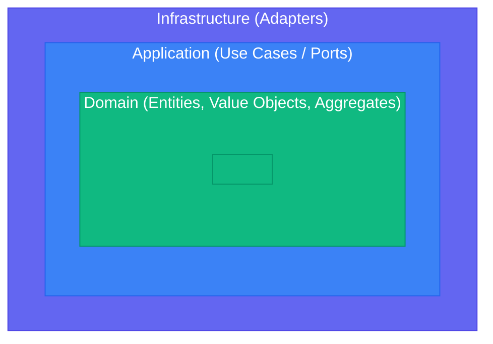

# Clean Architecture + DDD + Hexagonal

## Overview

This skill combines three complementary patterns for building maintainable, testable backend systems:

- **Domain-Driven Design (DDD)** - Strategic and tactical patterns for modeling complex business domains
- **Clean Architecture** - Dependency rules ensuring business logic independence
- **Hexagonal Architecture** - Ports & Adapters for external system isolation

**Key Sources:**
- Clean Architecture: Robert C. Martin (2012) - https://blog.cleancoder.com/uncle-bob/2012/08/13/the-clean-architecture.html
- Hexagonal Architecture: Alistair Cockburn (2005) - https://alistair.cockburn.us/hexagonal-architecture/
- Domain-Driven Design: Eric Evans (2003) - https://www.domainlanguage.com/ddd/

## Core Principles

### The Dependency Rule
Dependencies point **inward only**. Outer layers depend on inner layers, never the reverse.



### Hexagonal Ports & Adapters
- **Driver Ports** (Primary/Inbound): How the world uses your application
- **Driven Ports** (Secondary/Outbound): How your application uses external systems
- **Adapters**: Concrete implementations of ports

## Quick Reference Structure

```
src/
├── domain/                    # Core business logic (no dependencies)
│   ├── {aggregate}/
│   │   ├── entity.ts          # Aggregate root + entities
│   │   ├── value_objects.ts   # Immutable value types
│   │   ├── events.ts          # Domain events
│   │   ├── repository.ts      # Repository interface (port)
│   │   └── services.ts        # Domain services
│   └── shared/
│       └── errors.ts          # Domain errors
├── application/               # Use cases / Application services
│   ├── {use-case}/
│   │   ├── command.ts         # Command/Query DTOs
│   │   ├── handler.ts         # Use case implementation
│   │   └── port.ts            # Driver port interface
│   └── shared/
│       └── unit_of_work.ts    # Transaction abstraction
├── infrastructure/            # Adapters (external concerns)
│   ├── persistence/
│   │   ├── postgres/          # Database adapter
│   │   └── in_memory/         # Test adapter
│   ├── messaging/
│   │   └── rabbitmq/          # Message broker adapter
│   ├── http/
│   │   └── rest/              # REST API adapter (driver)
│   └── config/
│       └── di.ts              # Dependency injection
└── main.ts                    # Composition root
```

## DDD Building Blocks

| Pattern | Purpose | Layer |
|---------|---------|-------|
| **Entity** | Identity + behavior | Domain |
| **Value Object** | Immutable, equality by value | Domain |
| **Aggregate** | Consistency boundary | Domain |
| **Domain Event** | Record of something that happened | Domain |
| **Repository** | Collection-like persistence abstraction | Domain (interface), Infra (impl) |
| **Domain Service** | Stateless business logic | Domain |
| **Application Service** | Orchestrates use cases | Application |

## When Implementing

1. **Start with the Domain** - Model entities, value objects, and aggregates first
2. **Define Ports** - Interfaces for repositories and external services
3. **Implement Use Cases** - Application services orchestrating domain logic
4. **Add Adapters Last** - HTTP controllers, database implementations, etc.

## Reference Documentation

For detailed implementation guidance:

- **[Layer Structure](references/LAYERS.md)** - Complete layer specifications and responsibilities
- **[DDD Strategic Patterns](references/DDD-STRATEGIC.md)** - Bounded contexts, context mapping, subdomains
- **[DDD Tactical Patterns](references/DDD-TACTICAL.md)** - Entities, value objects, aggregates, repositories
- **[Hexagonal Patterns](references/HEXAGONAL.md)** - Ports, adapters, naming conventions
- **[Implementation Examples](references/IMPLEMENTATION.md)** - Code in Go, Rust, Python, TypeScript
- **[CQRS & Events](references/CQRS-EVENTS.md)** - Command/query separation, domain events
- **[Testing Patterns](references/TESTING.md)** - Unit, integration, and architecture tests
- **[Cheatsheet](references/CHEATSHEET.md)** - Quick decision guide and patterns

## Key Anti-Patterns to Avoid

- **Anemic Domain Model** - Entities with only getters/setters, logic in services
- **Repository per Entity** - Repositories are per Aggregate, not per table
- **Leaking Infrastructure** - Domain importing database/HTTP libraries
- **God Aggregates** - Aggregates too large; keep them small and focused
- **Skipping Ports** - Controllers calling repositories directly
- **CRUD Thinking** - Modeling around data, not behavior
