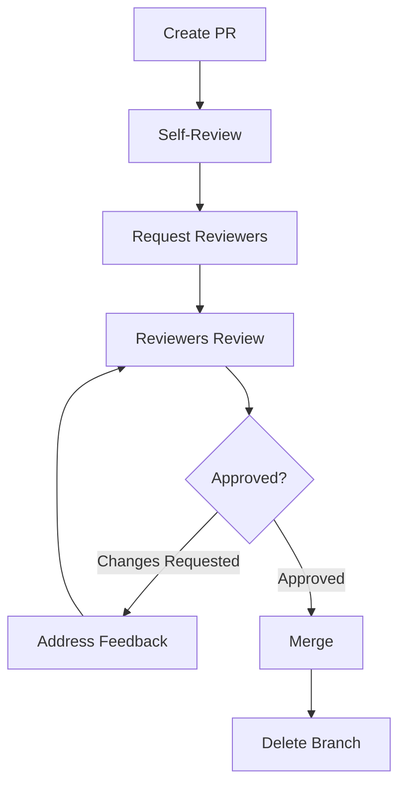

# Code Review Standards

## Overview

Code Review Standards define how teams review code to catch bugs, share knowledge, maintain quality, and ensure consistency. Good code reviews make teams stronger.

**Core Principle**: "Code review is about learning, not judging. Review the code, not the person."

---

## 1. Code Review Checklist

```markdown
# Code Review Checklist

## Functionality
- [ ] Code does what it's supposed to do
- [ ] Edge cases are handled
- [ ] Error handling is appropriate
- [ ] No obvious bugs

## Code Quality
- [ ] Code is readable and self-documenting
- [ ] Functions are small and focused
- [ ] No code duplication (DRY)
- [ ] Follows project conventions

## Testing
- [ ] Tests are included
- [ ] Tests cover edge cases
- [ ] Tests are readable
- [ ] All tests pass

## Security
- [ ] No sensitive data exposed
- [ ] Input is validated
- [ ] SQL injection prevented
- [ ] XSS vulnerabilities addressed

## Performance
- [ ] No obvious performance issues
- [ ] Database queries are optimized
- [ ] No N+1 queries
- [ ] Caching used appropriately

## Documentation
- [ ] Complex logic is commented
- [ ] API changes are documented
- [ ] README updated if needed
- [ ] Breaking changes noted
```

---

## 2. Review Process



---

## 3. Pull Request Template

```markdown
# Pull Request Template

## Description
[Brief description of what this PR does]

## Type of Change
- [ ] Bug fix
- [ ] New feature
- [ ] Breaking change
- [ ] Documentation update

## Related Issues
Closes #123

## Changes Made
- Added user authentication
- Updated database schema
- Added tests for login flow

## Screenshots (if applicable)
[Add screenshots for UI changes]

## Testing
- [ ] Unit tests added/updated
- [ ] Integration tests added/updated
- [ ] Tested locally
- [ ] Tested on staging

## Checklist
- [ ] Code follows style guidelines
- [ ] Self-reviewed my code
- [ ] Commented complex code
- [ ] Updated documentation
- [ ] No new warnings
- [ ] Added tests
- [ ] All tests pass
- [ ] No breaking changes (or documented)

## Deployment Notes
[Any special deployment considerations]

## Reviewer Notes
[Anything reviewers should pay special attention to]
```

---

## 4. Review Comments Guide

### Good Comments
```typescript
// ✅ Specific and actionable
"Consider using a Map instead of an object here for O(1) lookups"

// ✅ Asks questions
"What happens if userId is null here?"

// ✅ Suggests improvements
"This could be simplified using Array.filter()"

// ✅ Praises good code
"Nice! This is much more readable than the old version"

// ✅ Explains reasoning
"We should validate email format here to prevent invalid data in the database"
```

### Bad Comments
```typescript
// ❌ Vague
"This doesn't look right"

// ❌ Judgmental
"This is terrible code"

// ❌ Not actionable
"Needs improvement"

// ❌ Nitpicky without value
"Add a space here"

// ❌ Demanding without explanation
"Change this immediately"
```

---

## 5. Review Severity Levels

```markdown
## Comment Severity

### 🔴 Blocking (Must Fix)
- Security vulnerabilities
- Data loss risks
- Breaking changes without migration
- Critical bugs

**Example**: "🔴 This SQL query is vulnerable to injection. Use parameterized queries."

### 🟡 Important (Should Fix)
- Performance issues
- Code quality concerns
- Missing tests
- Poor error handling

**Example**: "🟡 This N+1 query will be slow. Consider using eager loading."

### 🟢 Suggestion (Nice to Have)
- Code style improvements
- Refactoring opportunities
- Alternative approaches

**Example**: "🟢 Consider extracting this into a helper function for reusability."

### 💡 Question (Seeking Clarification)
- Understanding intent
- Asking about edge cases

**Example**: "💡 What happens if the user is already logged in?"

### 🎉 Praise (Positive Feedback)
- Good solutions
- Clever implementations
- Learning moments

**Example**: "🎉 Great use of TypeScript generics here!"
```

---

## 6. Review Size Guidelines

```markdown
## Optimal PR Size

### Small (< 200 lines) ✅
- Easy to review thoroughly
- Quick feedback cycle
- Lower risk

### Medium (200-500 lines) ⚠️
- Acceptable
- May need multiple review sessions
- Consider breaking up if possible

### Large (> 500 lines) ❌
- Hard to review thoroughly
- Slow feedback
- High risk of missing issues

**Solution**: Break into smaller PRs
```

### Breaking Up Large PRs
```markdown
## Example: Large Feature → Multiple PRs

**Instead of**: One 2000-line PR with entire feature

**Do**:
1. PR #1: Database schema changes (100 lines)
2. PR #2: Backend API endpoints (300 lines)
3. PR #3: Frontend components (400 lines)
4. PR #4: Integration and tests (200 lines)

Each PR is reviewable and can be merged independently.
```

---

## 7. Review Turnaround Time

```markdown
## Response Time SLAs

| PR Size | First Response | Final Approval |
|---------|----------------|----------------|
| Small (< 200 lines) | 2 hours | 4 hours |
| Medium (200-500) | 4 hours | 8 hours |
| Large (> 500) | 8 hours | 24 hours |

### Tips for Reviewers
- Set aside dedicated review time daily
- Review small PRs immediately
- Use GitHub notifications
- Block calendar time for reviews
```

---

## 8. Self-Review Checklist

```markdown
# Before Requesting Review

## Code Quality
- [ ] Removed console.logs and debugger statements
- [ ] Removed commented-out code
- [ ] No TODO comments (or created issues for them)
- [ ] Formatted code (Prettier)
- [ ] Linted code (ESLint)

## Testing
- [ ] Ran all tests locally
- [ ] Added new tests
- [ ] Tested edge cases manually

## Documentation
- [ ] Updated README if needed
- [ ] Added JSDoc comments for public APIs
- [ ] Updated API documentation

## Git
- [ ] Meaningful commit messages
- [ ] Squashed WIP commits
- [ ] No merge commits (rebased)
- [ ] Branch is up to date with main

## PR Description
- [ ] Clear description of changes
- [ ] Screenshots for UI changes
- [ ] Linked related issues
- [ ] Added deployment notes
```

---

## 9. Handling Feedback

### For Authors
```markdown
## Responding to Feedback

### ✅ Good Responses
- "Good catch! Fixed in abc123"
- "I considered that, but chose X because Y. What do you think?"
- "Great suggestion! Implemented in def456"
- "I don't understand. Could you clarify?"

### ❌ Bad Responses
- "This is fine as is"
- "That's not important"
- "We can fix that later" (without creating issue)
- Ignoring comments

### When You Disagree
1. Explain your reasoning
2. Ask for clarification
3. Suggest alternatives
4. Escalate if needed (tech lead)
5. Default to reviewer if no strong opinion
```

### For Reviewers
```markdown
## Giving Feedback

### Do
- ✅ Be specific and actionable
- ✅ Explain the "why"
- ✅ Suggest alternatives
- ✅ Praise good code
- ✅ Ask questions

### Don't
- ❌ Be vague or judgmental
- ❌ Nitpick without value
- ❌ Demand changes without explanation
- ❌ Ignore the PR
- ❌ Approve without reading
```

---

## 10. Code Review Automation

### GitHub Actions
```yaml
# .github/workflows/pr-checks.yml
name: PR Checks

on: [pull_request]

jobs:
  lint:
    runs-on: ubuntu-latest
    steps:
      - uses: actions/checkout@v3
      - uses: actions/setup-node@v3
      - run: npm ci
      - run: npm run lint
      
  test:
    runs-on: ubuntu-latest
    steps:
      - uses: actions/checkout@v3
      - uses: actions/setup-node@v3
      - run: npm ci
      - run: npm test
      
  type-check:
    runs-on: ubuntu-latest
    steps:
      - uses: actions/checkout@v3
      - uses: actions/setup-node@v3
      - run: npm ci
      - run: npm run type-check
      
  size-check:
    runs-on: ubuntu-latest
    steps:
      - uses: actions/checkout@v3
      - name: Check PR size
        run: |
          FILES_CHANGED=$(git diff --name-only origin/main | wc -l)
          LINES_CHANGED=$(git diff --stat origin/main | tail -1 | awk '{print $4}')
          if [ $LINES_CHANGED -gt 500 ]; then
            echo "⚠️ PR is large ($LINES_CHANGED lines). Consider breaking it up."
          fi
```

### Danger.js (Automated Review Comments)
```javascript
// dangerfile.js
import { danger, warn, fail, message } from 'danger';

// Warn on large PRs
const bigPRThreshold = 500;
if (danger.github.pr.additions + danger.github.pr.deletions > bigPRThreshold) {
  warn('⚠️ This PR is quite large. Consider breaking it into smaller PRs.');
}

// Require tests
const hasTests = danger.git.modified_files.some(f => f.includes('.test.'));
if (!hasTests) {
  warn('⚠️ No test files were modified. Did you add tests?');
}

// Require description
if (danger.github.pr.body.length < 10) {
  fail('❌ Please add a description to your PR.');
}

// Check for console.log
const jsFiles = danger.git.modified_files.filter(f => f.endsWith('.ts') || f.endsWith('.js'));
for (const file of jsFiles) {
  const content = await danger.github.utils.fileContents(file);
  if (content.includes('console.log')) {
    warn(`⚠️ Found console.log in ${file}. Remove before merging.`);
  }
}

// Praise for good PR
if (danger.github.pr.additions < 200) {
  message('🎉 Nice small PR! Easy to review.');
}
```

---

## 11. Review Metrics

```typescript
interface ReviewMetrics {
  avgReviewTime: number;  // hours
  avgPRSize: number;  // lines
  approvalRate: number;  // percentage
  commentsPerPR: number;
  bugsFoundInReview: number;
}

// Track effectiveness
function calculateReviewQuality() {
  const bugsFoundInReview = 15;
  const bugsFoundInProduction = 2;
  
  return {
    catchRate: (bugsFoundInReview / (bugsFoundInReview + bugsFoundInProduction)) * 100,
    // Target: > 85%
  };
}
```

---

## 12. Code Review Standards Checklist

- [ ] **Process Defined**: Review process documented?
- [ ] **PR Template**: Template with checklist?
- [ ] **Review Checklist**: What to look for documented?
- [ ] **Comment Guidelines**: How to give feedback?
- [ ] **Severity Levels**: Blocking vs suggestions clear?
- [ ] **Size Guidelines**: PR size limits defined?
- [ ] **Turnaround SLAs**: Response time expectations?
- [ ] **Automation**: Automated checks in place?
- [ ] **Metrics**: Tracking review effectiveness?
- [ ] **Training**: Team trained on review standards?

---

## Related Skills
- `45-developer-experience/lint-format-typecheck`
- `45-developer-experience/commit-conventions`
- `45-developer-experience/onboarding-docs`
