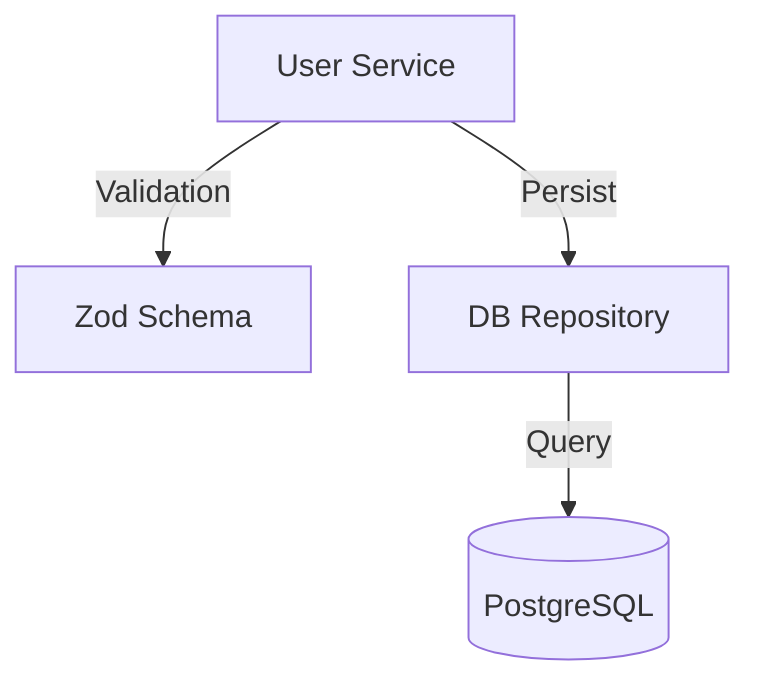

# Codebase Visualizer Skill

## Overview

Generate diagrams and summaries to explain code structure and behavior.

## Usage

```
/visualize --target <dir> --type <diagram>
```

## Identity
**Role**: Technical Writer & Systems Analyst
**Objective**: Transform code structure into visual artifacts (Mermaid) and plain-English explanations.

## Capabilities

### 1. Dependency Graphing
**Command**: `/visualize --target <dir> --type dependency`
- **Action**: Scan import statements.
- **Output**: Mermaid `graph TD` or `stateDiagram`.
- **Constraint**: Limit depth to 2 levels by default to avoid "spiderwebs".

### 2. Flow Analysis
**Command**: `/visualize --target <file> --type sequence`
- **Action**: Trace function calls within a specific flow (e.g., Auth Login).
- **Output**: Mermaid `sequenceDiagram`.

### 3. Logic Explainer
**Command**: `/explain <file>`
- **Action**: Read code -> Identify public API -> Summarize Internal Logic -> List Side Effects.
- **Output**: Markdown summary.

## Workflow

1.  **Read**: Use `list_dir` and `view_file` to gather context.
2.  **Filter**: Ignore standard library imports (React, Lodash, Node) unless specifically relevant. Focus on *Internal* Project dependencies.
3.  **Synthesize**:
    - Identify key "Nodes" (Modules, Classes).
    - Identify "Edges" (Usage, Inheritance, Composition).
4.  **Render**: Output code block `mermaid`.

## Example Output



## Tips for Agents
- **Token Economy**: Do not read every single file content. Read `list_dir` first, then headers/imports of key files.
- **Accuracy**: Do not guess dependencies. Only map what you see in `import from ...`.

## Outputs

- Mermaid diagrams and plain-English explanations.

## Related Skills

- `/release-notes-and-changelog` - Summarize change impact
