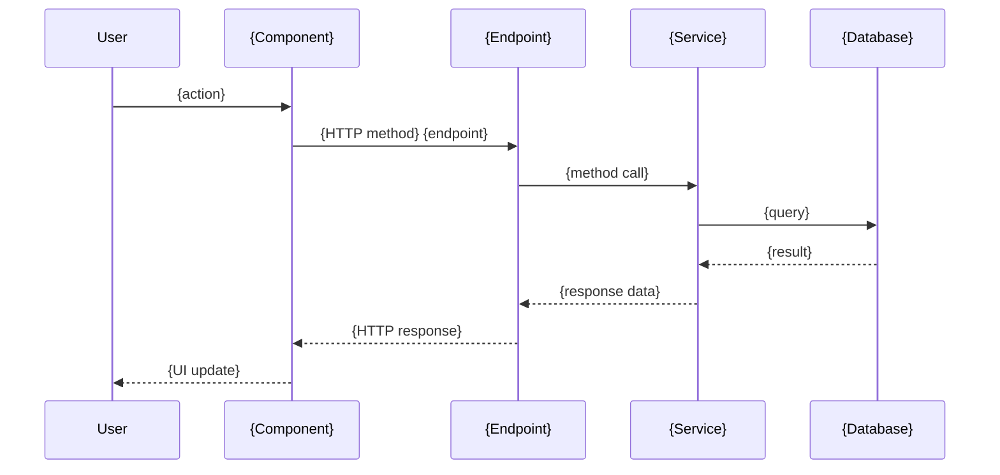
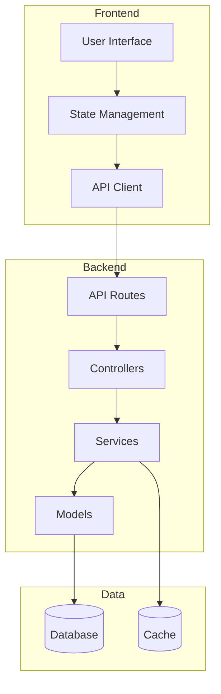
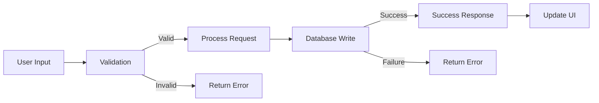
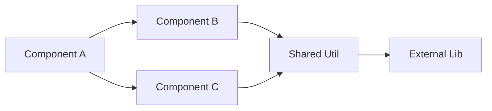

# Config Generator Skill

## Purpose

Generates master configuration files that define the structure, components, relationships, and interdependencies for web application features. These configs serve as single sources of truth that enable:

1. **Human rapid discovery** - Quickly understand what's touched or impacted by a given set of documents or events
2. **AI systematic propagation** - Enable AI agents to propagate changes across all affected parts of the system
3. **Bidirectional sync** - Keep documentation and implementation synchronized

## When to Use

Invoke this skill when you need to create a configuration document for:
- A new feature or use case in a web application
- A set of code components that work together
- User interaction flows that span multiple parts of the system
- Any complex operation that involves multiple files, APIs, or components

## Tier

**Tier 1** - Core Foundation (used during planning and implementation phases)

## Input Parameters

The skill expects one or more of the following:

### 1. Use Case Input
```yaml
use_case:
  name: "user-authentication-flow"
  description: "Complete user authentication including registration, login, password reset"
  user_role: "end-user"
  entry_points: ["registration page", "login page", "forgot password link"]
  success_criteria: "User can register, login, and reset password securely"
```

### 2. Code Components Input
```yaml
code_components:
  - type: "api-endpoint"
    path: "backend/api/auth/register.py"
    purpose: "Handle user registration"
    dependencies: ["database/models/user.py", "utils/email_validator.py"]

  - type: "component"
    path: "frontend/components/LoginForm.tsx"
    purpose: "User login UI"
    dependencies: ["api/auth.ts", "hooks/useAuth.ts"]

  - type: "database-model"
    path: "backend/models/user.py"
    purpose: "User data schema"
    dependencies: []
```

### 3. User Interaction Input
```yaml
user_interaction:
  user_type: "authenticated-user"
  interaction_name: "task-management-workflow"
  steps:
    - action: "Create new task"
      triggers: ["POST /api/tasks"]
      ui_components: ["TaskForm.tsx", "TaskList.tsx"]

    - action: "Update task status"
      triggers: ["PATCH /api/tasks/:id"]
      ui_components: ["TaskCard.tsx"]

    - action: "Delete task"
      triggers: ["DELETE /api/tasks/:id"]
      ui_components: ["TaskCard.tsx", "DeleteConfirmModal.tsx"]
```

## Process

### Step 1: Analyze Input

**Parse and understand what's being configured:**

For use cases:
- Identify all user roles involved
- Map user journeys and interaction points
- Determine success/failure paths
- List affected systems (frontend, backend, database, external services)

For code components:
- Build dependency graph
- Identify circular dependencies
- Map data flow (request → response)
- Categorize by context (backend, frontend, test, deployment)

For user interactions:
- Map UI to API to data layer
- Identify state changes
- List side effects (emails, notifications, logs)
- Determine rollback/error handling needs

### Step 2: Discover Related Files

**Systematically search the codebase:**

```bash
# Find related backend files
find . -path "./backend/*" -name "*{keyword}*"

# Find related frontend files
find . -path "./frontend/*" -name "*{keyword}*"

# Find related tests
find . -path "./tests/*" -name "*{keyword}*" -o -path "*/regressions/*" -name "*{keyword}*"

# Search for API endpoints
grep -r "api/{endpoint}" --include="*.py" --include="*.ts" --include="*.js"

# Search for component usage
grep -r "import.*{ComponentName}" --include="*.tsx" --include="*.ts" --include="*.jsx"
```

**Build complete inventory of:**
- All files that must be created
- All files that must be modified
- All tests that must be written
- All documentation that must be updated

### Step 3: Map Relationships

**Create relationship matrix showing:**

**File-to-File Dependencies:**
```
Component A → imports → Component B
API Endpoint → calls → Database Model
Frontend Hook → fetches from → API Route
```

**Event-to-Impact Mapping:**
```
When: User clicks "Create Task"
Then:
  - Frontend: TaskForm.tsx validates input
  - API: POST /api/tasks endpoint called
  - Backend: TaskController.create() invoked
  - Database: tasks table INSERT
  - State: Redux store updated
  - UI: TaskList.tsx re-renders
  - Side Effects: Notification sent
```

**Change-Propagation Paths:**
```
If: tasks table schema changes
Then propagate to:
  - backend/models/task.py (update model)
  - backend/migrations/ (create migration)
  - backend/api/tasks.py (update serialization)
  - frontend/types/task.ts (update TypeScript types)
  - frontend/components/TaskForm.tsx (update form fields)
  - tests/backend/test_tasks.py (update test fixtures)
  - tests/frontend/TaskForm.test.tsx (update component tests)
  - ai-state/regressions/backend/test_tasks_regression.py
```

### Step 4: Define Configuration Structure

**Create hierarchical structure matching the pattern:**

```markdown
# {Feature/UseCase} Configuration Reference

**Version:** 1.0 | **Updated:** {date} | **System:** Khujta Sphere Framework

> **Purpose:** Master configuration for {feature} that defines structure, components, and relationships. Enables rapid discovery for humans and systematic propagation for AI.

---

## Quick Reference

| Aspect | Value | Code Location |
|--------|-------|---------------|
| **Feature Entry Point** | {main UI component or API} | {file path} |
| **Backend Handler** | {controller/service} | {file path} |
| **Database Models** | {model names} | {file paths} |
| **Frontend Components** | {component names} | {file paths} |
| **Test Coverage** | {test locations} | {file paths} |
| **Related Docs** | {documentation} | {doc paths} |

---

## Components Involved

### Component 1: {Name}

**Location:** `{file path}`

**Purpose:** {What this component does}

**Type:** {API endpoint | UI component | Database model | Service | Utility}

**Dependencies:**
- {dependency 1} - {file path} - {why needed}
- {dependency 2} - {file path} - {why needed}

**Used By:**
- {dependent 1} - {file path} - {how it's used}
- {dependent 2} - {file path} - {how it's used}

**Key Exports:**
```typescript
// For TS/JS components
export function functionName(params): ReturnType
export interface TypeName { ... }
```

```python
# For Python components
def function_name(params) -> ReturnType:
class ClassName:
```

**Propagation:**
| Change Type | Files to Update | What to Change |
|-------------|-----------------|----------------|
| Add field | {list of files} | {specific changes needed} |
| Modify validation | {list of files} | {specific changes needed} |
| Change API contract | {list of files} | {specific changes needed} |

**Code Reference:**
- Main implementation: [{file}:{line_start}-{line_end}]({relative_path}#L{line_start}-L{line_end})
- Tests: [{test_file}:{line_start}-{line_end}]({relative_path}#L{line_start}-L{line_end})

---

## Use Case Flow

### Flow 1: {User Action Name}

**Trigger:** {What initiates this flow - user action, API call, scheduled job}

**Actor:** {User type or system component}

**Steps:**

1. **{Step Name}** - {Description}
   - Files involved: {list}
   - Data transformations: {input → output}
   - Validation rules: {list}
   - Error conditions: {list}

2. **{Step Name}** - {Description}
   - Files involved: {list}
   - Data transformations: {input → output}
   - Side effects: {emails, logs, notifications}
   - Success criteria: {what success looks like}

**Sequence Diagram:**


**Error Handling:**
| Error Condition | Where Caught | User Message | Logged As |
|-----------------|--------------|--------------|-----------|
| {error 1} | {file:line} | {message} | {log level + details} |
| {error 2} | {file:line} | {message} | {log level + details} |

**Rollback Strategy:**
- {What happens on failure}
- {How to undo partial changes}
- {Transaction boundaries}

---

## Data Flow

### Data Model: {Entity Name}

**Database Schema:**
```sql
CREATE TABLE {table_name} (
  {field}: {type} {constraints},
  ...
);
```

**Backend Model:**
```python
class {ModelName}:
    {field}: {type}  # {description}
```

**Frontend Type:**
```typescript
interface {TypeName} {
  {field}: {type};  // {description}
}
```

**Transformations:**

| Layer | Format | Location | Notes |
|-------|--------|----------|-------|
| Database | SQL row | {table} | {constraints} |
| Backend Model | Python object | {model file} | {ORM details} |
| API Response | JSON | {endpoint} | {serialization} |
| Frontend Type | TypeScript | {type file} | {validation} |

**Propagation - Schema Change:**
| Change | Impact Files | Required Updates |
|--------|--------------|------------------|
| Add field | {list all files} | {specific changes per file} |
| Rename field | {list all files} | {specific changes per file} |
| Change type | {list all files} | {specific changes per file} |
| Add constraint | {list all files} | {specific changes per file} |

---

## Testing Requirements

### Test Coverage Map

**Backend Tests:**
| Test Type | File Location | What's Tested | Required Tests |
|-----------|---------------|---------------|----------------|
| Unit | {path} | {component} | {list} |
| Integration | {path} | {flow} | {list} |
| Regression | ai-state/regressions/backend/ | {critical paths} | {list} |

**Frontend Tests:**
| Test Type | File Location | What's Tested | Required Tests |
|-----------|---------------|---------------|----------------|
| Component | {path} | {component} | {list} |
| Integration | {path} | {user flow} | {list} |
| E2E | {path} | {full workflow} | {list} |
| Regression | ai-state/regressions/frontend/ | {critical paths} | {list} |

**Test Data:**
```yaml
fixtures:
  - name: {fixture_name}
    location: {path}
    purpose: {what it's for}
    data: {sample data structure}
```

---

## Configuration & Environment

**Environment Variables:**
```bash
# Required for this feature
{VAR_NAME}={description}
{VAR_NAME}={description}
```

**Feature Flags:**
```yaml
feature_flags:
  - name: {flag_name}
    default: {true|false}
    purpose: {what it controls}
    files_affected: [{list}]
```

**External Dependencies:**
| Dependency | Version | Purpose | Fallback Strategy |
|------------|---------|---------|-------------------|
| {library} | {version} | {why needed} | {what if unavailable} |

---

## Event Impact Analysis

### Event: {Event Name}

**What triggers it:** {description}

**Immediate impacts:**
- {File 1}: {what changes}
- {File 2}: {what changes}
- {File 3}: {what changes}

**Cascading impacts:**
```
File A change
  → triggers File B update (because: {dependency})
    → triggers File C update (because: {dependency})
      → requires File D update (because: {dependency})
```

**Validation checklist after this event:**
- [ ] {Check 1 - what to verify}
- [ ] {Check 2 - what to verify}
- [ ] {Check 3 - what to verify}
- [ ] {Check 4 - what to verify}

---

## Modification Workflows

### Workflow 1: Adding {Capability}

**Use Case:** {When you'd do this}

**Steps:**

1. **Backend Changes**
   - [ ] Update {file} - {specific change}
   - [ ] Update {file} - {specific change}
   - [ ] Create migration: {migration description}
   - [ ] Add tests: {test file}

2. **Frontend Changes**
   - [ ] Update {file} - {specific change}
   - [ ] Update {file} - {specific change}
   - [ ] Add tests: {test file}

3. **Integration**
   - [ ] Update API contract: {file}
   - [ ] Update TypeScript types: {file}
   - [ ] Test integration: {how to verify}

4. **Validation**
   - [ ] Run backend tests: {command}
   - [ ] Run frontend tests: {command}
   - [ ] Manual verification: {steps}

**Propagation Checklist:**
```yaml
backend:
  - file: {path}
    change: {description}
    lines: {line range or function name}

frontend:
  - file: {path}
    change: {description}
    lines: {line range or function name}

tests:
  - file: {path}
    change: {description}
    type: {unit|integration|e2e}

docs:
  - file: {path}
    change: {description}
```

---

## Related Documentation

- [Component Implementation Guide]({path})
- [API Documentation]({path})
- [Database Schema Docs]({path})
- [Testing Strategy]({path})

---

## Version History

| Version | Date | Changes |
|---------|------|---------|
| 1.0 | {date} | Initial configuration for {feature} |

---

## Summary

This configuration defines all components, relationships, and workflows for {feature}. Use this document to:

1. **Understand structure** - See all components and how they connect
2. **Track impacts** - Know what changes when a file is modified
3. **Propagate changes** - Follow checklists to update all affected files
4. **Ensure completeness** - Verify all related tests and docs are updated

**Remember:** Update this config first when making architectural changes, then propagate to implementation files using the provided workflows.
```

### Step 5: Generate Visual Diagrams

**Include Mermaid diagrams for:**

**Architecture Overview:**


**Data Flow Diagram:**


**Dependency Graph:**


### Step 6: Write Configuration File

**Save to:** `ai-state/config/{feature-name}-config.md`

**Naming conventions:**
- Use kebab-case: `user-authentication-config.md`
- Be specific: `task-crud-operations-config.md` not `tasks-config.md`
- Include scope: `backend-api-setup-config.md` vs `frontend-routing-config.md`

**File structure requirements:**
- Must include "Quick Reference" table
- Must include "Propagation" tables for each component
- Must include at least one Mermaid diagram
- Must include "Modification Workflows" section
- Must include "Version History" table

### Step 7: Validate Configuration

**Completeness checks:**
- [ ] All referenced files exist or are marked as "to be created"
- [ ] All dependencies are documented
- [ ] All propagation paths are traced
- [ ] All modification workflows have checklists
- [ ] All diagrams render correctly

**Accuracy checks:**
- [ ] File paths are correct relative to project root
- [ ] Line number references are accurate (use code scanning)
- [ ] Component relationships match actual code
- [ ] Data flow matches implementation

**Utility checks:**
- [ ] A human can understand what's impacted by a change
- [ ] An AI can follow propagation tables to make changes
- [ ] Modification workflows are actionable
- [ ] Quick reference table provides fast lookup

## Output Format

The skill generates a single markdown file at `ai-state/config/{feature-name}-config.md` following the structure defined in Step 4.

**Success criteria:**
- Configuration file is comprehensive (all components documented)
- Configuration file is accurate (matches actual codebase)
- Configuration file is actionable (provides clear modification workflows)
- Configuration file is maintainable (easy to update when code changes)

## Integration Points

**Input from:**
- User specifications
- Existing codebase analysis
- `ai-state/active/tasks.yaml` - task context
- `ai-state/standards/*.md` - coding standards
- `.claude/docs/config/*.md` - configuration patterns

**Output to:**
- `ai-state/config/{feature}-config.md` - generated configuration
- Used by human developers for understanding
- Used by AI agents for propagation
- Referenced in modification workflows

## Examples

### Example 1: User Authentication Config

**Input:**
```yaml
use_case:
  name: "user-authentication"
  description: "User registration, login, JWT tokens"
  entry_points: ["POST /api/auth/register", "POST /api/auth/login"]
```

**Output:** `ai-state/config/user-authentication-config.md`

Key sections:
- Backend: auth routes, user model, JWT service
- Frontend: LoginForm, RegisterForm, useAuth hook
- Database: users table schema
- Flow diagrams: registration flow, login flow
- Propagation: what changes when adding OAuth

### Example 2: Task CRUD Config

**Input:**
```yaml
code_components:
  - path: "backend/api/tasks.py"
    type: "api-endpoint"
  - path: "frontend/components/TaskList.tsx"
    type: "component"
```

**Output:** `ai-state/config/task-crud-operations-config.md`

Key sections:
- CRUD endpoints: GET, POST, PATCH, DELETE /api/tasks
- Frontend components: TaskList, TaskForm, TaskCard
- Data flow: UI → API → Database
- Propagation: adding new task field

### Example 3: Multi-Step User Workflow

**Input:**
```yaml
user_interaction:
  interaction_name: "order-checkout-flow"
  steps:
    - action: "Add items to cart"
    - action: "Enter shipping info"
    - action: "Enter payment info"
    - action: "Confirm order"
```

**Output:** `ai-state/config/order-checkout-flow-config.md`

Key sections:
- Multi-step sequence diagram
- State management across steps
- Error handling at each step
- Rollback strategy for failures

## Best Practices

1. **Start broad, then narrow:**
   - Map entire feature first
   - Then detail each component
   - Finally add propagation tables

2. **Use code scanning, not assumptions:**
   - Use Grep/Glob tools to find actual files
   - Verify line numbers before documenting
   - Check dependencies with import analysis

3. **Think bidirectionally:**
   - Document "uses" and "used by"
   - Map both forward and backward dependencies
   - Consider circular dependencies

4. **Make it actionable:**
   - Every propagation table should have specific file:line references
   - Every workflow should have checkboxes
   - Every change should have validation steps

5. **Keep it fresh:**
   - Add version history entries
   - Update when code structure changes
   - Reference from commit messages

## Phase-Specific Behavior

**Prototype Phase:**
- Focus on happy path flows
- Minimal error handling documentation
- Basic component relationships

**MVP Phase:**
- Add error handling paths
- Document validation rules
- Include rollback strategies

**Growth Phase:**
- Add performance considerations
- Document caching strategies
- Include monitoring/observability

**Scale Phase:**
- Add security hardening notes
- Document disaster recovery
- Include multi-region considerations

## Quality Standards

- **Completeness:** All components documented, no orphaned files
- **Accuracy:** File paths and line numbers verified
- **Clarity:** Non-technical stakeholders can understand flows
- **Actionability:** AI agents can execute propagation tables
- **Maintainability:** Easy to update as code evolves

## Troubleshooting

**Issue:** Configuration is too large (>2000 lines)
**Solution:** Split into multiple configs by feature area or layer (backend-config.md, frontend-config.md)

**Issue:** Hard to keep file paths accurate
**Solution:** Use relative paths from project root, add validation script

**Issue:** Propagation tables are incomplete
**Solution:** Use dependency graph tools, trace all imports

**Issue:** Modification workflows are too generic
**Solution:** Base workflows on actual past changes, be specific

## Related Skills

- **standards-creator** - Creates implementation standards (this creates structural configs)
- **write-plan** - Creates tasks.yaml (this creates feature configs)
- **execute-tasks** - Executes tasks (uses configs for propagation)
- **brainstorm** - Refines requirements (input to this skill)

## Version

**1.0** - Initial config-generator skill for creating master configuration files
