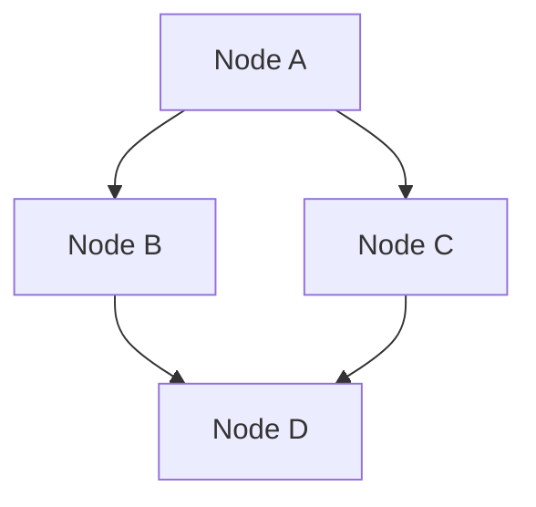
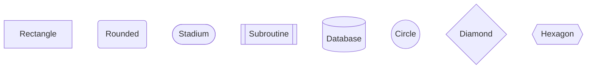
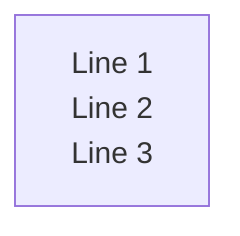
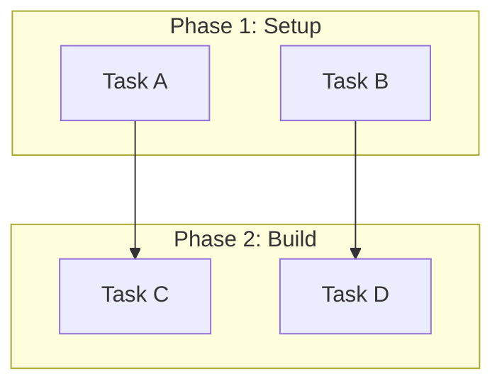
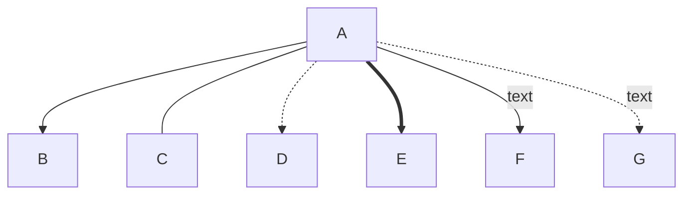
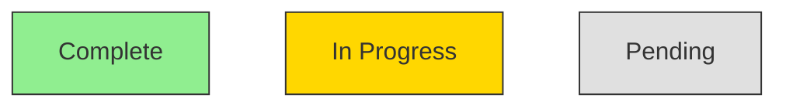
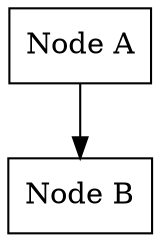
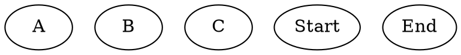
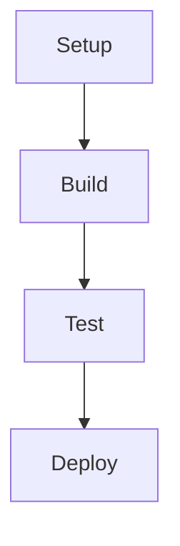

# Dependency Visualization Skill
# Project Autopilot - Visualization patterns and algorithms
# Copyright (c) 2026 Jeremy McSpadden <jeremy@fluxlabs.net>

Reference this skill for generating dependency graphs, critical path analysis, and visual representations of project structure.

---

## Mermaid Syntax Reference

### Basic Graph Structure



### Direction Options

| Directive | Meaning |
|-----------|---------|
| `graph TD` | Top to Down |
| `graph TB` | Top to Bottom (same as TD) |
| `graph BT` | Bottom to Top |
| `graph LR` | Left to Right |
| `graph RL` | Right to Left |

### Node Shapes



### Node Labels with Line Breaks



### Subgraphs



### Edge Styles



### Styling



### Class Definitions

```mermaid
graph TD
    A:::complete[Complete]
    B:::inProgress[In Progress]
    C:::pending[Pending]

    classDef complete fill:#90EE90,stroke:#333
    classDef inProgress fill:#FFD700,stroke:#333
    classDef pending fill:#E0E0E0,stroke:#333
```

---

## Color Scheme

### Status Colors

| Status | Hex Code | Usage |
|--------|----------|-------|
| Complete | `#90EE90` | Phase/task finished successfully |
| In Progress | `#FFD700` | Currently being worked on |
| Pending | `#E0E0E0` | Not yet started |
| Blocked | `#FF6B6B` | Cannot proceed due to dependency |
| Critical | `#FF6B6B` (stroke) | On critical path |
| Warning | `#FFA500` | Attention needed |

### Color by Phase Type

| Phase Type | Color | Hex |
|------------|-------|-----|
| Setup | Blue | `#87CEEB` |
| Database | Purple | `#DDA0DD` |
| Auth | Orange | `#FFB366` |
| API | Green | `#98FB98` |
| Business | Teal | `#20B2AA` |
| Frontend | Pink | `#FFB6C1` |
| Testing | Yellow | `#FFFF99` |
| Security | Red | `#F08080` |
| Docs | Gray | `#D3D3D3` |
| DevOps | Navy | `#6495ED` |

---

## Critical Path Algorithm

### Longest Path in DAG

```
ALGORITHM: FindCriticalPath(G, weights)

INPUT:
    G = Directed Acyclic Graph with nodes V and edges E
    weights = Map of node -> cost

OUTPUT:
    criticalPath = Array of nodes forming longest path
    pathLength = Total cost of critical path

PROCEDURE:

    # 1. Topological Sort
    sorted = TopologicalSort(G)

    # 2. Initialize distances
    dist = {}
    pred = {}
    FOR each v IN V:
        dist[v] = 0
        pred[v] = null

    # 3. Process in topological order
    FOR each u IN sorted:
        FOR each v IN G.neighbors(u):
            # Relaxation for longest path (use > instead of <)
            IF dist[u] + weights[v] > dist[v]:
                dist[v] = dist[u] + weights[v]
                pred[v] = u

    # 4. Find end node with maximum distance
    endNode = argmax(dist)

    # 5. Reconstruct path
    path = []
    current = endNode
    WHILE current != null:
        path.prepend(current)
        current = pred[current]

    RETURN {
        path: path,
        length: dist[endNode]
    }
```

### Topological Sort (Kahn's Algorithm)

```
ALGORITHM: TopologicalSort(G)

INPUT:
    G = Directed Acyclic Graph

OUTPUT:
    sorted = Array of nodes in topological order

PROCEDURE:

    # 1. Calculate in-degrees
    inDegree = {}
    FOR each v IN G.V:
        inDegree[v] = 0
    FOR each (u, v) IN G.E:
        inDegree[v]++

    # 2. Initialize queue with zero in-degree nodes
    queue = []
    FOR each v IN G.V:
        IF inDegree[v] == 0:
            queue.push(v)

    # 3. Process queue
    sorted = []
    WHILE queue not empty:
        u = queue.shift()
        sorted.push(u)

        FOR each v IN G.neighbors(u):
            inDegree[v]--
            IF inDegree[v] == 0:
                queue.push(v)

    # 4. Check for cycles
    IF sorted.length != G.V.length:
        ERROR "Graph has a cycle"

    RETURN sorted
```

---

## Parallelization Detection

### Finding Independent Phases

```
ALGORITHM: FindParallelizable(G)

INPUT:
    G = Directed Acyclic Graph

OUTPUT:
    groups = Array of arrays (phases that can run in parallel)

PROCEDURE:

    # Group by dependency depth
    depth = {}
    FOR each v IN TopologicalSort(G):
        maxParentDepth = -1
        FOR each u IN G.predecessors(v):
            maxParentDepth = max(maxParentDepth, depth[u])
        depth[v] = maxParentDepth + 1

    # Group nodes by depth
    groups = {}
    FOR each v IN G.V:
        IF NOT groups[depth[v]]:
            groups[depth[v]] = []
        groups[depth[v]].push(v)

    RETURN values(groups)
```

### Example Output

```
Depth 0: [001-Setup]
Depth 1: [002-Database, 003-Auth]  # Can run in parallel!
Depth 2: [004-API]
Depth 3: [005-Business]
Depth 4: [006-Frontend, 007-Testing]  # Partially parallel
Depth 5: [008-Security]
Depth 6: [009-Docs, 010-DevOps]  # Can run in parallel!
```

---

## Bottleneck Analysis

### Fan-out Metric

Phases with high fan-out (many dependent phases) are bottlenecks:

```
ALGORITHM: CalculateFanOut(G)

FOR each v IN G.V:
    # Direct dependents
    directDependents = G.neighbors(v).length

    # All reachable (transitive closure)
    allDependents = ReachableNodes(G, v).length

    bottleneckScore = allDependents / G.V.length

    STORE {
        node: v,
        directDependents: directDependents,
        totalDependents: allDependents,
        bottleneckScore: bottleneckScore
    }

SORT BY bottleneckScore DESC
```

### Impact Classification

| Score | Impact | Recommendation |
|-------|--------|----------------|
| > 0.5 | Critical | Prioritize, add resources |
| 0.3 - 0.5 | High | Monitor closely |
| 0.1 - 0.3 | Medium | Normal priority |
| < 0.1 | Low | Can be delayed if needed |

---

## ASCII Graph Rendering

### Box Drawing Characters

| Character | Unicode | Use |
|-----------|---------|-----|
| `─` | U+2500 | Horizontal line |
| `│` | U+2502 | Vertical line |
| `┌` | U+250C | Top-left corner |
| `┐` | U+2510 | Top-right corner |
| `└` | U+2514 | Bottom-left corner |
| `┘` | U+2518 | Bottom-right corner |
| `├` | U+251C | Left tee |
| `┤` | U+2524 | Right tee |
| `┬` | U+252C | Top tee |
| `┴` | U+2534 | Bottom tee |
| `┼` | U+253C | Cross |
| `▼` | U+25BC | Down arrow |
| `▶` | U+25B6 | Right arrow |

### Box Template

```
┌─────────────────┐
│   Phase Name    │
│    $0.15 ✅      │
└────────┬────────┘
         │
         ▼
```

### Layout Algorithm (Sugiyama)

1. **Layer Assignment** - Assign each node to a layer based on dependencies
2. **Crossing Reduction** - Minimize edge crossings within layers
3. **Coordinate Assignment** - Assign x,y coordinates
4. **Edge Routing** - Draw edges avoiding obstacles

---

## DOT/Graphviz Reference

### Basic Structure



### Useful Attributes

#### Node Attributes
| Attribute | Values | Description |
|-----------|--------|-------------|
| `shape` | box, ellipse, circle, diamond | Node shape |
| `style` | filled, rounded, bold | Fill/outline style |
| `fillcolor` | color name or hex | Background color |
| `fontname` | font name | Text font |
| `fontsize` | number | Text size |

#### Edge Attributes
| Attribute | Values | Description |
|-----------|--------|-------------|
| `style` | solid, dashed, dotted, bold | Line style |
| `color` | color name or hex | Line color |
| `arrowhead` | normal, none, diamond | Arrow type |
| `label` | text | Edge label |

### Rank Constraints



---

## Best Practices

### Graph Readability

1. **Limit width** - Max 5-6 nodes per row
2. **Consistent spacing** - Equal gaps between nodes
3. **Clear labels** - Short, descriptive text
4. **Legend included** - Explain colors and symbols
5. **Direction consistency** - Usually top-to-bottom for timelines

### Color Accessibility

- Use colorblind-safe palettes
- Don't rely solely on color - use icons/shapes too
- Ensure sufficient contrast
- Test with colorblindness simulators

### Performance

- For large graphs (>50 nodes), consider collapsing
- Use subgraphs to group related items
- Provide summary view option
- Cache generated graphs

---

## Integration Examples

### Embedding in Markdown

````markdown
## Project Roadmap


````

### Generating PNG (with Graphviz)

```bash
# Generate DOT file
/autopilot:graph --format=dot --output=graph.dot

# Convert to PNG
dot -Tpng graph.dot -o graph.png

# Or SVG for web
dot -Tsvg graph.dot -o graph.svg
```

### Mermaid CLI

```bash
# Install mermaid-cli
npm install -g @mermaid-js/mermaid-cli

# Generate PNG
mmdc -i graph.mmd -o graph.png

# Generate SVG
mmdc -i graph.mmd -o graph.svg
```
