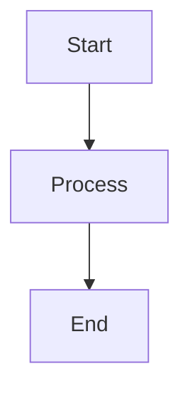

# Obsidian Editing and Formatting Skill

Comprehensive guide to Obsidian's editing and formatting capabilities, including markdown syntax, special formatting features, and best practices.

## When to Use This Skill

This skill should be triggered when:
- Writing or formatting content in Obsidian
- Using Obsidian markdown syntax
- Creating links, embeds, or references in Obsidian
- Using callouts, tables, or other advanced formatting
- Working with Obsidian-specific markdown extensions

## Basic Formatting Syntax

### Text Formatting

```markdown
**Bold text**
*Italic text*
***Bold and italic***
~~Strikethrough~~
==Highlight==
`Inline code`
```

### Headings

```markdown
# Heading 1
## Heading 2
### Heading 3
#### Heading 4
##### Heading 5
###### Heading 6
```

### Lists

**Unordered lists:**
```markdown
- Item 1
- Item 2
  - Nested item
  - Another nested item
- Item 3
```

**Ordered lists:**
```markdown
1. First item
2. Second item
   1. Nested item
   2. Another nested item
3. Third item
```

**Task lists:**
```markdown
- [ ] Incomplete task
- [x] Completed task
- [-] Cancelled task
- [>] Forwarded task
- [<] Scheduled task
```

## Links and References

### Internal Links

```markdown
[[Note name]]                    # Link to a note
[[Note name|Display text]]       # Link with custom text
[[Note name#Heading]]            # Link to a heading
[[Note name#^block-id]]          # Link to a block
```

### External Links

```markdown
[Display text](https://example.com)
<https://example.com>
```

### Embeds

```markdown
![[Note name]]                   # Embed entire note
![[Note name#Heading]]           # Embed from heading
![[Image.png]]                   # Embed image
![[Document.pdf]]                # Embed PDF
![[Audio.mp3]]                   # Embed audio
```

## Callouts

Obsidian supports various callout types for highlighting information:

```markdown
> [!note]
> This is a note callout

> [!tip]
> This is a tip callout

> [!important]
> This is an important callout

> [!warning]
> This is a warning callout

> [!caution]
> This is a caution callout

> [!info]
> This is an info callout

> [!success]
> This is a success callout

> [!question]
> This is a question callout

> [!failure]
> This is a failure callout

> [!danger]
> This is a danger callout

> [!bug]
> This is a bug callout

> [!example]
> This is an example callout

> [!quote]
> This is a quote callout
```

**Foldable callouts:**
```markdown
> [!note]- Collapsed by default
> Content here

> [!note]+ Expanded by default
> Content here
```

## Tables

```markdown
| Column 1 | Column 2 | Column 3 |
| -------- | -------- | -------- |
| Row 1    | Data     | Data     |
| Row 2    | Data     | Data     |

# With alignment
| Left | Center | Right |
| :--- | :----: | ----: |
| Text | Text   | Text  |
```

## Code Blocks

````markdown
```python
def hello_world():
    print("Hello, World!")
```

```javascript
console.log("Hello, World!");
```
````

## Block Quotes

```markdown
> This is a block quote
> It can span multiple lines
>
> And have multiple paragraphs
```

## Horizontal Rules

```markdown
---
***
___
```

## Footnotes

```markdown
Here's a sentence with a footnote.[^1]

[^1]: This is the footnote content.
```

## Comments

```markdown
%% This is a comment and won't be rendered %%

%%
Multi-line
comment
%%
```

## Mathematical Expressions

**Inline math:**
```markdown
$e^{i\pi} + 1 = 0$
```

**Block math:**
```markdown
$$
\int_{a}^{b} f(x) dx
$$
```

## Diagrams (Mermaid)

````markdown

````

## Tags

```markdown
#tag
#nested/tag
#multi-word-tag
```

## Block IDs

```markdown
This is a paragraph with a block ID. ^block-id

You can reference it with [[Note#^block-id]]
```

## Wikilinks vs Markdown Links

**Wikilinks (Obsidian-specific):**
- `[[Note name]]`
- Easier to type
- Automatically creates links to non-existent notes

**Markdown links (Standard):**
- `[Display text](path/to/note.md)`
- More portable across different systems
- Requires exact path

## Advanced Formatting Tips

### Nested Formatting

```markdown
**Bold text with *italic* inside**
*Italic text with ==highlight== inside*
```

### Escape Characters

Use backslash to escape special characters:
```markdown
\*Not italic\*
\[\[Not a link\]\]
\#Not a tag
```

### Line Breaks

- Use two spaces at the end of a line for a soft break
- Use a blank line for a paragraph break

### Combining Features

```markdown
# Heading with #tag

- [ ] Task with [[internal link]]
- [x] Task with **bold** and *italic*

> [!tip] Callout with formatting
> You can use **bold**, *italic*, and `code` inside callouts.
> You can also include [[links]] and #tags.
```

## Properties (Frontmatter)

Add metadata to your notes:

```markdown
---
title: My Note
tags: [tag1, tag2]
author: Your Name
date: 2025-10-29
---

# Note content starts here
```

## Canvas-Specific Features

When using Canvas view:
- Drag and drop notes onto canvas
- Create cards with text
- Draw connections between notes
- Group items with colors

## Editing Keyboard Shortcuts

Common shortcuts (Windows/Linux | Mac):
- **Bold**: `Ctrl+B` | `Cmd+B`
- **Italic**: `Ctrl+I` | `Cmd+I`
- **Insert link**: `Ctrl+K` | `Cmd+K`
- **Toggle checklist**: `Ctrl+L` | `Cmd+L`
- **Search in note**: `Ctrl+F` | `Cmd+F`
- **Open command palette**: `Ctrl+P` | `Cmd+P`
- **Open quick switcher**: `Ctrl+O` | `Cmd+O`

## Best Practices

1. **Use descriptive note names** - Makes linking easier
2. **Leverage tags** - For quick filtering and organization
3. **Use callouts** - To highlight important information
4. **Create MOCs** - Maps of Content for organizing related notes
5. **Use block IDs** - For precise references to specific content
6. **Consistent naming** - Helps with autocomplete and searching
7. **Use frontmatter** - For metadata and dataview queries
8. **Link liberally** - Create connections between related ideas

## Resources

- Official Obsidian Help: https://help.obsidian.md/
- Obsidian Forum: https://forum.obsidian.md/
- Obsidian Discord: https://discord.gg/obsidianmd

## Notes

- Obsidian uses a variant of Markdown with extensions
- Most standard Markdown syntax works in Obsidian
- Some features (like callouts) are Obsidian-specific
- Preview mode renders formatting, Edit mode shows raw markdown
- Use Reading view for final formatted appearance
