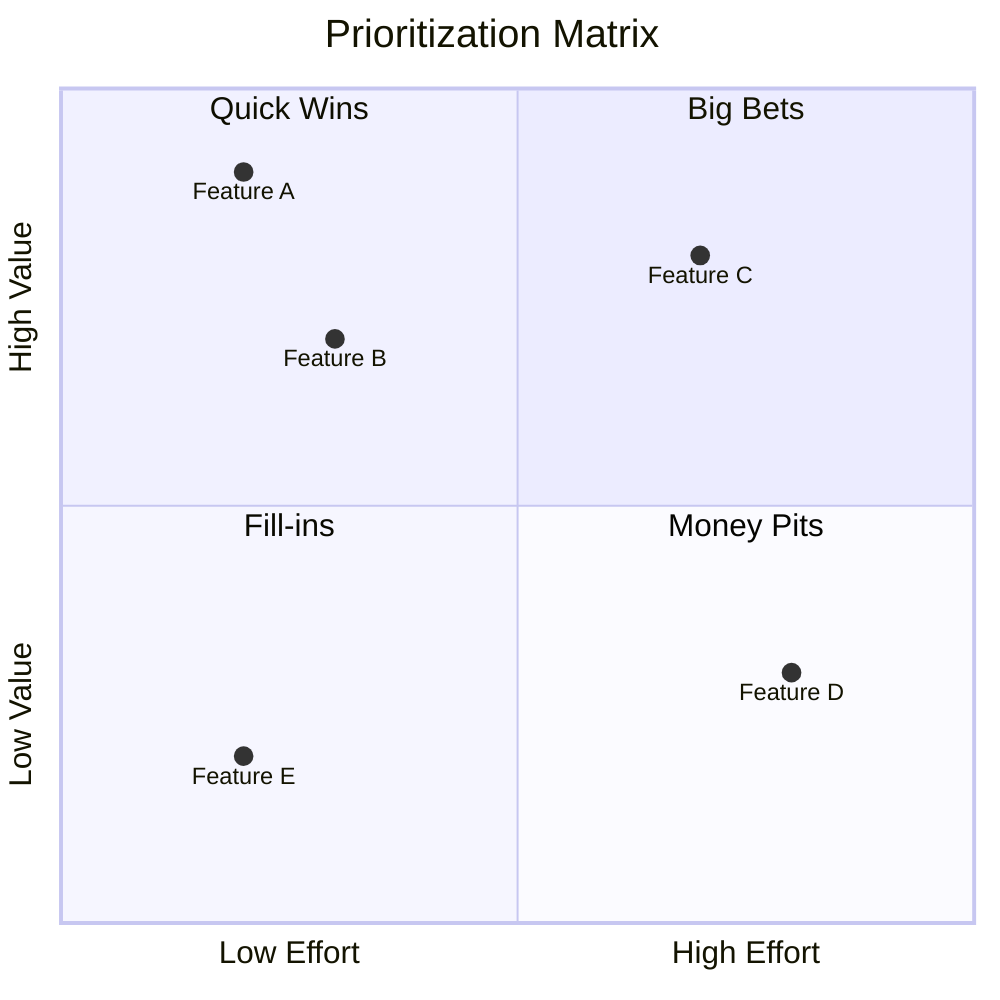
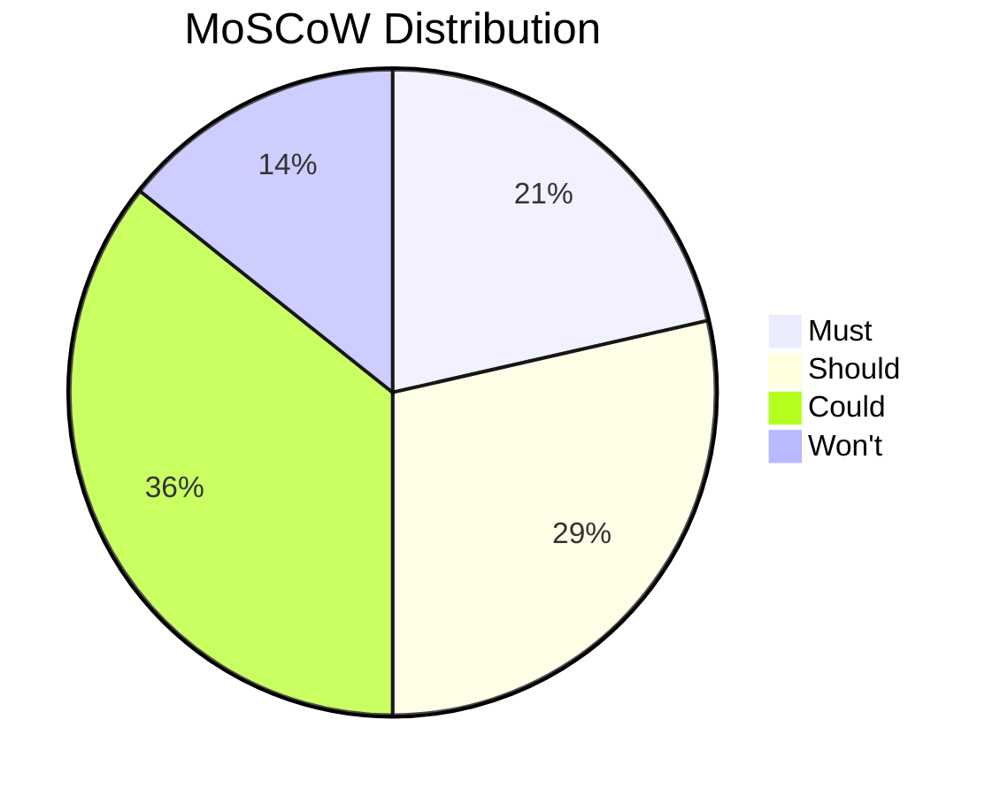

# Prioritization

Systematically rank and prioritize requirements, features, backlog items, and initiatives using proven prioritization frameworks. Supports MoSCoW, Kano model, weighted scoring, and value-effort analysis.

## What is Prioritization?

**Prioritization** is the process of determining relative importance and ordering of items to focus resources on what matters most. Effective prioritization balances:

- **Value**: Benefit to customers or business
- **Effort**: Cost, time, and resources required
- **Risk**: Uncertainty and potential downsides
- **Dependencies**: Constraints and sequencing

## Prioritization Techniques

### MoSCoW Method

Categorical prioritization for timeboxed delivery:

| Category | Definition | Guidance |
|----------|------------|----------|
| **Must** | Non-negotiable, required for success | Without these, delivery is a failure |
| **Should** | Important but not critical | Significant value, workarounds exist |
| **Could** | Desirable if resources permit | Nice to have, enhances experience |
| **Won't** | Explicitly excluded this time | Not now, maybe later |

**When to Use:** Sprint planning, release scoping, MVP definition, timeboxed projects

**Rules:**

- Musts should be ~60% of capacity (leave room for unknowns)
- Won'ts are explicitly stated (not silently dropped)
- Categories are relative to the timebox, not absolute

### Kano Model

Customer satisfaction-based classification:

| Category | If Present | If Absent | Detection |
|----------|------------|-----------|-----------|
| **Basic (Must-Be)** | No increase in satisfaction | Major dissatisfaction | Customers assume these exist |
| **Performance (Linear)** | Proportional satisfaction | Proportional dissatisfaction | Customers explicitly request |
| **Delighter (Excitement)** | High satisfaction | No dissatisfaction | Customers don't expect |
| **Indifferent** | No impact | No impact | No reaction either way |
| **Reverse** | Dissatisfaction | Satisfaction | Segment prefers absence |

**When to Use:** Product feature prioritization, understanding customer needs, differentiating from competitors

**Kano Questionnaire:**

- Functional: "How would you feel if this feature was present?"
- Dysfunctional: "How would you feel if this feature was absent?"

**Responses:** Like it, Expect it, Neutral, Can tolerate, Dislike it

### Weighted Scoring Matrix

Multi-criteria quantitative comparison:

#### Step 1: Define Criteria

| Criterion | Weight | Description |
|-----------|--------|-------------|
| Customer Value | 40% | Impact on customer satisfaction |
| Strategic Fit | 25% | Alignment with goals |
| Effort | 20% | Development cost (inverse) |
| Risk | 15% | Uncertainty/failure potential (inverse) |

#### Step 2: Score Items

| Item | Customer Value (1-5) | Strategic Fit (1-5) | Effort (1-5) | Risk (1-5) | Weighted Score |
|------|---------------------|---------------------|--------------|------------|----------------|
| A | 5 | 4 | 3 | 4 | 4.15 |
| B | 3 | 5 | 4 | 3 | 3.75 |

#### Step 3: Calculate Weighted Score

```text
Score = Σ (Weight × Score)
Item A = (0.40×5) + (0.25×4) + (0.20×3) + (0.15×4) = 4.20
```

**When to Use:** Complex trade-offs, multiple stakeholders, defensible decisions

### Value vs Effort Matrix

2×2 prioritization for quick decisions:

```mermaid
quadrantChart
    title Value vs Effort
    x-axis Low Effort --> High Effort
    y-axis Low Value --> High Value
    quadrant-1 Big Bets (Plan carefully)
    quadrant-2 Quick Wins (Do first)
    quadrant-3 Fill-ins (Do if time permits)
    quadrant-4 Money Pits (Avoid)
```

| Quadrant | Value | Effort | Action |
|----------|-------|--------|--------|
| Quick Wins | High | Low | Do first |
| Big Bets | High | High | Plan carefully |
| Fill-ins | Low | Low | Do if time permits |
| Money Pits | Low | High | Avoid or deprioritize |

**When to Use:** Fast initial triage, backlog grooming, stakeholder alignment

### RICE Scoring

Product management prioritization:

| Factor | Definition | Calculation |
|--------|------------|-------------|
| **R**each | Users/customers affected | Number per time period |
| **I**mpact | Effect on each user | 0.25 (minimal) to 3 (massive) |
| **C**onfidence | Certainty of estimates | 0.5 (low) to 1 (high) |
| **E**ffort | Person-months required | Number |

```text
RICE Score = (Reach × Impact × Confidence) / Effort
```

**When to Use:** Product roadmap prioritization, feature comparison

### WSJF (Weighted Shortest Job First)

SAFe/Lean prioritization for flow:

```text
WSJF = Cost of Delay / Job Duration

Cost of Delay = User/Business Value + Time Criticality + Risk Reduction
```

| Factor | Score (1-20) | Description |
|--------|--------------|-------------|
| User/Business Value | 1-20 | Benefit to users or business |
| Time Criticality | 1-20 | Urgency, deadlines, decay |
| Risk Reduction | 1-20 | Risk/opportunity addressed |
| Job Duration | 1-20 | Relative size (inverted) |

**When to Use:** Continuous flow environments, maximizing value delivery

## Workflow

### Phase 1: Prepare

#### Step 1: Gather Items to Prioritize

```markdown
## Prioritization Session

**Date:** [ISO date]
**Scope:** [What's being prioritized]
**Stakeholders:** [Who's involved]
**Constraint:** [Timebox, budget, capacity]

### Items

| ID | Description | Owner |
|----|-------------|-------|
| 1 | [Item 1] | [Name] |
| 2 | [Item 2] | [Name] |
```

#### Step 2: Select Prioritization Technique

| Situation | Recommended Technique |
|-----------|----------------------|
| Sprint/release planning | MoSCoW |
| Product feature decisions | Kano + RICE |
| Trade-off decisions | Weighted Scoring |
| Quick triage | Value vs Effort |
| Continuous flow | WSJF |
| Multiple criteria | Weighted Scoring |

### Phase 2: Execute

#### Step 1: Apply Selected Technique

Follow the specific technique workflow (see above).

#### Step 2: Validate Results

- Do top priorities align with strategy?
- Are dependencies respected?
- Does the team have capacity?
- Are stakeholders aligned?

#### Step 3: Document Rationale

```markdown
## Prioritization Rationale

### Top Priorities

1. **[Item A]** - Score: X
   - Rationale: [Why this is top priority]
   - Dependencies: [What it depends on]

2. **[Item B]** - Score: Y
   - Rationale: [Why this is second]
   - Dependencies: [What it depends on]

### Deferred Items

- **[Item C]** - Reason: [Why deferred]
```

### Phase 3: Communicate

#### Step 1: Create Prioritized Backlog

```markdown
## Prioritized Backlog

| Rank | Item | Priority/Score | Owner | Target |
|------|------|----------------|-------|--------|
| 1 | [Item A] | Must / 4.5 | [Name] | Sprint 1 |
| 2 | [Item B] | Must / 4.2 | [Name] | Sprint 1 |
| 3 | [Item C] | Should / 3.8 | [Name] | Sprint 2 |
```

#### Step 2: Communicate Decisions

- Share prioritization results with stakeholders
- Explain rationale for key decisions
- Address concerns about deprioritized items
- Set expectations for what's not included

## Output Formats

### Narrative Summary

```markdown
## Prioritization Summary

**Session:** [Scope/context]
**Date:** [ISO date]
**Technique:** [MoSCoW/Kano/Weighted Scoring/etc.]
**Facilitator:** prioritization-analyst

### Results Overview

- **Total Items:** N
- **Top Priority:** [Count]
- **Deferred:** [Count]

### Priority Distribution

| Category | Count | % |
|----------|-------|---|
| Must/Quick Wins | X | Y% |
| Should/Big Bets | X | Y% |
| Could/Fill-ins | X | Y% |
| Won't/Money Pits | X | Y% |

### Key Decisions

1. **[Top Item]**: Prioritized because [reason]
2. **[Deferred Item]**: Deferred because [reason]

### Next Steps

1. Begin work on top priority items
2. Re-prioritize at [next review point]
```

### Structured Data (YAML)

```yaml
prioritization:
  version: "1.0"
  date: "2025-01-15"
  scope: "Q1 Feature Backlog"
  technique: "weighted_scoring"
  facilitator: "prioritization-analyst"

  criteria:
    - name: "Customer Value"
      weight: 0.40
    - name: "Strategic Fit"
      weight: 0.25
    - name: "Effort"
      weight: 0.20
      inverse: true
    - name: "Risk"
      weight: 0.15
      inverse: true

  items:
    - id: "FEAT-001"
      name: "User Dashboard"
      scores:
        customer_value: 5
        strategic_fit: 4
        effort: 3
        risk: 4
      weighted_score: 4.20
      priority: 1
      rationale: "Highest customer value, manageable effort"

    - id: "FEAT-002"
      name: "API Integration"
      scores:
        customer_value: 3
        strategic_fit: 5
        effort: 4
        risk: 3
      weighted_score: 3.75
      priority: 2
      rationale: "Strong strategic alignment"

  moscow_summary:
    must: ["FEAT-001"]
    should: ["FEAT-002", "FEAT-003"]
    could: ["FEAT-004"]
    wont: ["FEAT-005"]
```

### Mermaid Visualizations

**Value-Effort Matrix:**



**MoSCoW Distribution:**



## When to Use Each Technique

| Technique | Best For | Team Size | Time Required |
|-----------|----------|-----------|---------------|
| MoSCoW | Sprint/release planning | Any | 30-60 min |
| Kano | Product features | Product team | 2-4 hours |
| Weighted Scoring | Complex trade-offs | Cross-functional | 1-2 hours |
| Value vs Effort | Quick triage | Any | 15-30 min |
| RICE | Product roadmap | Product team | 1-2 hours |
| WSJF | Continuous flow | SAFe teams | 30-60 min |

## Common Pitfalls

| Pitfall | Prevention |
|---------|------------|
| Everything is "Must" | Enforce category limits (60% capacity) |
| HiPPO (highest paid person's opinion) | Use objective scoring criteria |
| Ignoring effort | Always consider cost/effort dimension |
| Static prioritization | Re-prioritize regularly as context changes |
| Overcomplicating | Start simple, add complexity only if needed |
| Ignoring dependencies | Map dependencies before finalizing order |

## Integration

### Upstream

- **Requirements** - Items to prioritize
- **stakeholder-analysis** - Stakeholder input on value
- **swot-pestle-analysis** - Strategic context

### Downstream

- **Sprint planning** - Ordered backlog
- **Roadmaps** - Prioritized initiatives
- **decision-analysis** - Detailed option evaluation

## Related Skills

- `decision-analysis` - For complex option evaluation
- `stakeholder-analysis` - Stakeholder input on priorities
- `risk-analysis` - Risk dimension of prioritization
- `capability-mapping` - Capability investment prioritization

## Version History

- **v1.0.0** (2025-12-26): Initial release
