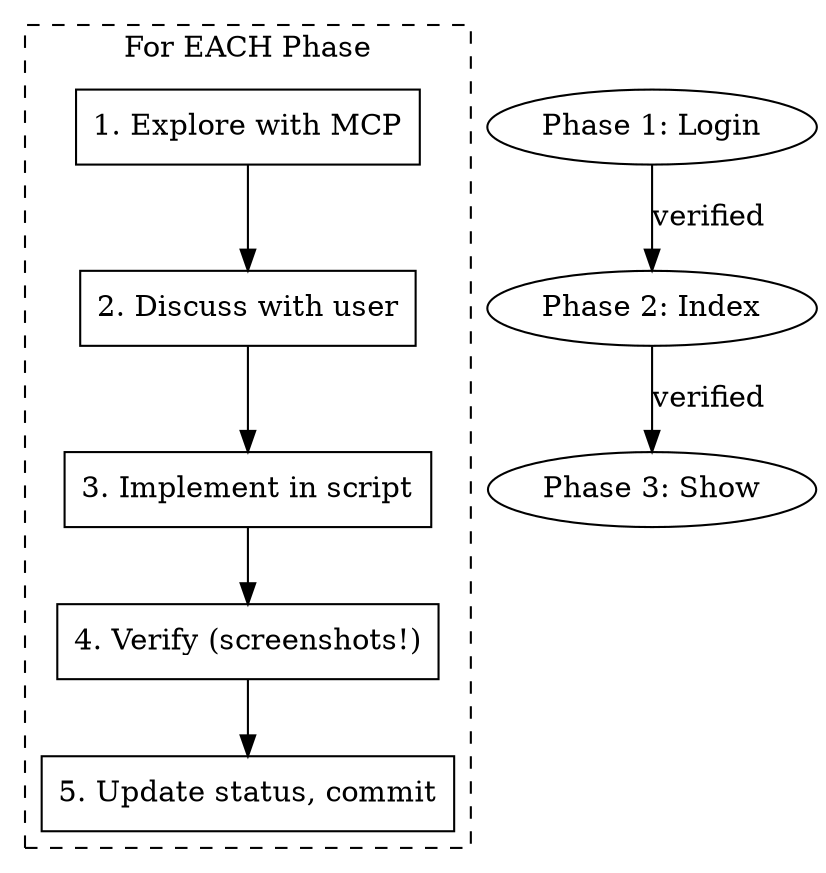

# Web Scraping with Playwright

## Overview

Web scraping follows a **3-phase sequential process**: Login → Index → Show. Each phase must complete and be verified before the next begins. Use MCP Playwright tools to explore, then build a standalone script incrementally.

**Core principle:** The script is the source of truth. MCP tools are for exploration; the script memorializes knowledge. If the agent dies or runs out of context, reading the script tells you exactly where you are.

## Core Principles

| Principle | Meaning | Failure Mode |
|-----------|---------|--------------|
| **Reproducible** | Same site state → identical output. No timing dependencies. | Returns 89 items one run, 93 the next |
| **Verified** | Validate every extraction. Fail loud on unexpected data. | Extracts "Sign in to account" as "Account" button |
| **Thorough** | Know total count upfront. Track progress. Report captured vs skipped. | Scrapes 89 of 93 items, doesn't notice 4 missing |
| **Robust** | Semantic selectors that survive minor site updates. | Breaks when `mt-4` changes to `mt-6` |
| **Recoverable** | Save progress after each item. Resume from any failure. | Crashes at item 50, restarts from scratch |

## The Process



## Phase 1: Login

**Goal:** Detect authentication state and handle manual login if needed.

**Detection strategy:**
- Element presence, not URL
- Semantic containers: `header`, `nav`, `[role="banner"]`
- Exact text: `:text-is("Account")` not `:has-text("Account")`
- Scope first: `header button:text-is("Account")`

**Auth persistence pattern:**
```typescript
const AUTH_STATE_FILE = "./auth-state.json"

// Load saved state if exists
const context = fs.existsSync(AUTH_STATE_FILE)
  ? await browser.newContext({ storageState: AUTH_STATE_FILE })
  : await browser.newContext()

// After successful login, save state
await context.storageState({ path: AUTH_STATE_FILE })
```

Add `auth-state.json` to `.gitignore`.

## Phase 2: Index

**Goal:** Before extraction, understand three things:
1. **Information hierarchy** - what entities exist, how they nest
2. **Capture method** - DOM scraping vs HTTP API
3. **Output data model** - what to capture, how to store

**Critical rule:** If you detect logged-out state during exploration, STOP. Don't waste tokens on paywalled content.

**REFERENCE:** See `index-phase.md` for detailed exploration workflow, hierarchy mapping, capture method decision tree, and data model design.

**Summary format before Phase 3:**
```markdown
## Phase 2 Summary

### Hierarchy: Category → Section → Item → Variant
### Capture Method: DOM scraping (data embedded in JS bundle)
### Output: index.json + individual files by category/item
### Counts: X categories, Y items total

Ready to proceed?
```

## Phase 3: Show

**Goal:** Extract detailed data from each item page.

1. Navigate to item page
2. Identify data fields
3. Handle dynamic content (tabs, accordions, framework selectors)
4. Save to appropriate format

## Selector Design

**REFERENCE:** See `selector-patterns.md` for complete selector strategies, React/HeadlessUI patterns, and verification requirements.

**Quick reference:**

| Prefer | Over | Why |
|--------|------|-----|
| `<header>`, `<main>` | `div`, `[class*="..."]` | Semantic = stable |
| `:text-is("exact")` | `:has-text("contains")` | Avoids false matches |
| `header button` | `button` | Scoped = precise |
| `getByRole()`, `selectOption()` | `page.evaluate()` + dispatchEvent | Triggers React state |

## MCP vs Script

| MCP Exploration | Script Implementation |
|-----------------|----------------------|
| Ephemeral refs (`e65`) | Stable CSS/ARIA selectors |
| Interactive debugging | Must work unattended |
| Click by ref | Click by role, text, selector |

**Workflow:** MCP to understand structure → Script with stable selectors from that understanding. Never try to replicate MCP's internal locator chains.

## Script Structure

```
project/
  scraper.ts        # Main scraper with phase status header
  test-login.ts     # Phase 1 test
  test-index.ts     # Phase 2 test
  screenshots/      # Verification images
  output/           # Scraped data
```

**Status header pattern:**
```typescript
/**
 * Site Scraper
 * STATUS: Phase 2 complete, starting Phase 3
 *
 * Phase 1 (Login): DONE - header button:text-is("Account")
 * Phase 2 (Index): DONE - 3 categories, 93 items
 * Phase 3 (Show): IN PROGRESS - extracting code blocks
 */
```

## Output Verification

**File count is not verification. Content type is.**

After scraping, verify:
1. **Count matches expected** - 657 components × 6 variants = 3942 files
2. **No empty files** - `find output -type f -empty`
3. **Content matches file type** - React code in `.html` = BUG

```bash
# Check first lines match expected format
head -1 output/*.html | grep -l "^'use client'" # Should be empty!
head -1 output/*.tsx | grep -l "^<template>"    # Should be empty!
```

**Always sample-check first component** - index-based selectors fail silently at `nth(0)`.

## Common Mistakes

| Mistake | Fix |
|---------|-----|
| Rushing all phases at once | Complete each phase fully before next |
| URL-based login detection | Element presence in semantic container |
| `:has-text()` for exact matches | `:text-is()` for exact text |
| Trusting selectors without verify | Screenshot + HTML dump at every step |
| `page.evaluate()` with dispatchEvent | `page.selectOption()` triggers React state |
| Treating MCP refs as stable | Refs are ephemeral; build stable selectors |
| Guessing when selector fails | Inspect actual DOM state with debug evaluate |
| Batching actions then checking | Verify state after EACH action |
| Trusting file count as verification | Check content matches expected type (React in .html = bug) |
| Multi-component tabpanel accumulation | Click Preview on previous before processing next |
| First-component selector edge case | `.nth(0)` can fail silently; verify first item content |
