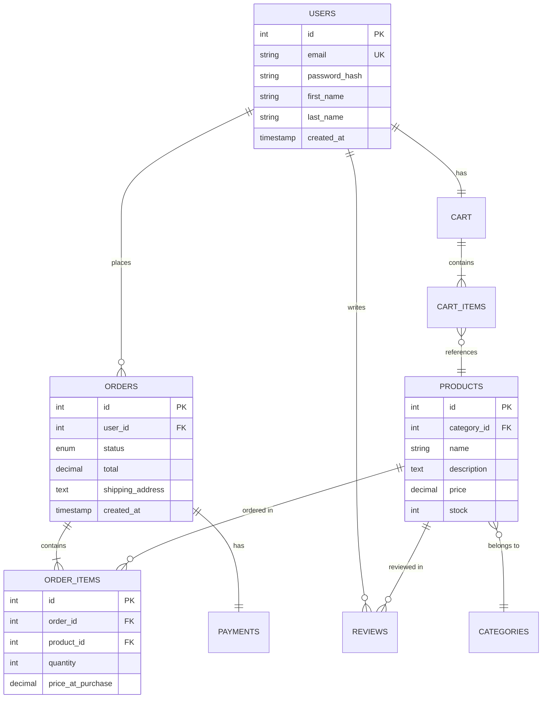
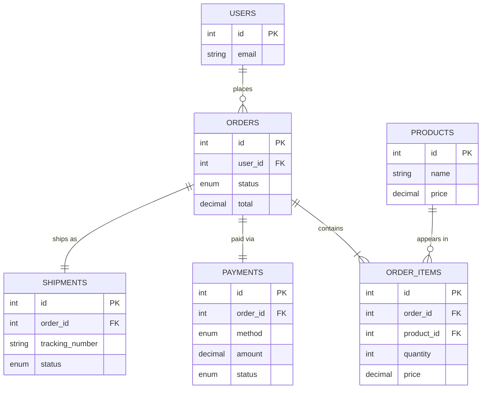

## Overview

This skill assists in designing robust and normalized database schemas. It provides guidance on normalization principles, helps map relationships between entities, generates ERD diagrams for visualization, and ultimately produces SQL CREATE statements.

## How It Works

1. **Schema Definition**: Claude analyzes the user's request to understand the application's data requirements.
2. **Normalization & Relationship Mapping**: Claude applies normalization principles (1NF to BCNF) and defines relationships between entities (one-to-one, one-to-many, many-to-many).
3. **ERD Generation**: Claude generates a Mermaid diagram representing the Entity-Relationship Diagram.
4. **SQL Generation**: Claude creates SQL CREATE statements for the tables, columns, indexes, and constraints.

## When to Use This Skill

This skill activates when you need to:
- Design a new database schema from scratch.
- Normalize an existing database schema.
- Generate an ERD diagram for a database.
- Create SQL CREATE statements for a database.

## Examples

### Example 1: Designing a Social Media Database

User request: "Design a database schema for a social media application with users, posts, and comments."

The skill will:
1. Design tables for users, posts, and comments, including relevant attributes (e.g., user_id, username, post_id, content, timestamp).
2. Define relationships between the tables (e.g., one user can have many posts, one post can have many comments).
3. Generate an ERD diagram visualizing the relationships.
4. Create SQL CREATE TABLE statements for the tables, including primary keys, foreign keys, and indexes.

### Example 2: Normalizing an E-commerce Database

User request: "Normalize a database schema for an e-commerce application with customers, orders, and products."

The skill will:
1. Analyze the existing schema for normalization violations.
2. Decompose tables to eliminate redundancy and improve data integrity.
3. Create new tables and relationships to achieve a normalized schema (e.g., separating product details into a separate table).
4. Generate SQL CREATE TABLE statements for the new tables and ALTER TABLE statements to modify existing tables.

## Best Practices

- **Normalization**: Always aim for at least 3NF to minimize data redundancy and improve data integrity. Consider BCNF for more complex scenarios.
- **Indexing**: Add indexes to frequently queried columns to improve query performance.
- **Relationship Integrity**: Use foreign keys to enforce referential integrity and prevent orphaned records.

## Integration

This skill can be integrated with other Claude Code plugins, such as a SQL execution plugin, to automatically create the database schema in a database server. It can also work with a documentation plugin to generate documentation for the database schema.

---

## Part 2: Generating Database Documentation

### How Documentation Generation Works

1. **Schema Analysis**: Connect to existing database and analyze schema structure
2. **Extract Metadata**: Gather information about tables, columns, relationships, indexes, triggers, stored procedures
3. **Generate ERD**: Create visual ERD diagrams showing entity relationships
4. **Create Documentation**: Produce data dictionaries, HTML docs, and markdown files

### When to Use Documentation Generation

- Document existing databases for team onboarding
- Create ERD diagrams for architectural reviews
- Produce data dictionaries for data governance
- Generate API documentation for database access
- Maintain up-to-date schema reference docs

### Documentation Examples

#### Example 1: Auto-Documenting Existing Database

**User request**: "Generate database documentation for the 'ecommerce' database."

**Generated Documentation**:

**HTML Index (index.html)**:
```html
<!DOCTYPE html>
<html>
<head>
  <title>E-Commerce Database Documentation</title>
</head>
<body>
  <h1>E-Commerce Database Schema</h1>
  <nav>
    <a href="#tables">Tables</a> |
    <a href="#erd">ERD Diagram</a> |
    <a href="#relationships">Relationships</a>
  </nav>
  
  <section id="overview">
    <h2>Database Overview</h2>
    <ul>
      <li>Database: ecommerce</li>
      <li>Engine: PostgreSQL 14</li>
      <li>Tables: 12</li>
      <li>Views: 3</li>
      <li>Stored Procedures: 5</li>
    </ul>
  </section>
</body>
</html>
```

**Data Dictionary (data_dictionary.md)**:
```markdown
# E-Commerce Database - Data Dictionary

## Table: users

**Description**: Stores customer account information

| Column | Type | Nullable | Default | Description |
|--------|------|----------|---------|-------------|
| id | INTEGER | NO | AUTO_INCREMENT | Primary key |
| email | VARCHAR(255) | NO | - | User email (unique) |
| password_hash | VARCHAR(255) | NO | - | Bcrypt hashed password |
| first_name | VARCHAR(100) | YES | NULL | User first name |
| last_name | VARCHAR(100) | YES | NULL | User last name |
| created_at | TIMESTAMP | NO | CURRENT_TIMESTAMP | Account creation date |
| updated_at | TIMESTAMP | NO | CURRENT_TIMESTAMP | Last update timestamp |

**Indexes**:
- PRIMARY KEY (id)
- UNIQUE INDEX idx_users_email (email)
- INDEX idx_users_created (created_at)

**Foreign Keys**:
- None (root table)

**Referenced By**:
- orders.user_id → users.id
- reviews.user_id → users.id
- cart.user_id → users.id

---

## Table: orders

**Description**: Customer purchase orders

| Column | Type | Nullable | Default | Description |
|--------|------|----------|---------|-------------|
| id | INTEGER | NO | AUTO_INCREMENT | Primary key |
| user_id | INTEGER | NO | - | Reference to users table |
| status | ENUM | NO | 'pending' | Order status |
| total | DECIMAL(10,2) | NO | - | Total order amount |
| shipping_address | TEXT | NO | - | Full shipping address |
| created_at | TIMESTAMP | NO | CURRENT_TIMESTAMP | Order placement date |

**Indexes**:
- PRIMARY KEY (id)
- INDEX idx_orders_user (user_id)
- INDEX idx_orders_status (status)
- INDEX idx_orders_created (created_at)

**Foreign Keys**:
- user_id → users(id) ON DELETE RESTRICT

**Referenced By**:
- order_items.order_id → orders.id
- payments.order_id → orders.id
```

**ERD Diagram (erd.mermaid)**:


#### Example 2: Focused ERD for Specific Tables

**User request**: "Create an ERD diagram for just the orders-related tables."

**Generated ERD**:


### Documentation Best Practices

- **Keep Updated**: Regenerate docs after schema changes
- **Version Control**: Store documentation in git alongside code
- **Include Examples**: Add sample queries and use cases
- **Describe Business Logic**: Explain constraints and triggers
- **Document Assumptions**: Note design decisions and trade-offs

---

**Combined Skill**: This skill now handles both schema design (creating new databases) and documentation generation (documenting existing databases).