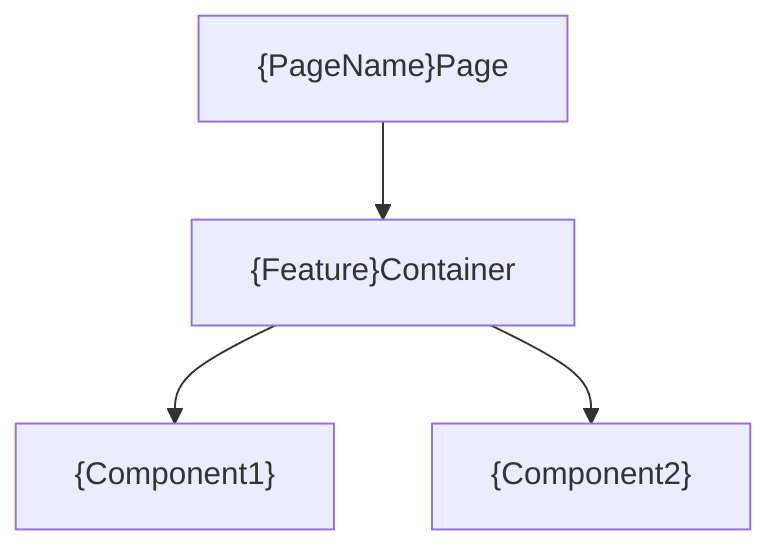
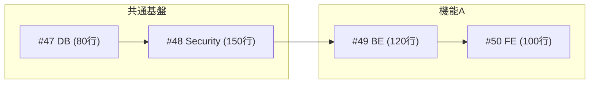

# 詳細設計テンプレート集

> **参照元**: detailed-design-workflow コマンド

---

## フロントエンド設計書テンプレート

画面を持つ機能には以下の構成で `フロントエンド設計書.md` を作成する。

```markdown
# {機能名} フロントエンド設計書

## メタ情報
| 項目 | 内容 |
|------|------|
| ドキュメントID | DETAIL-{機能ID}-FRONTEND-001 |
| 親設計書 | [詳細設計書.md](./詳細設計書.md) |

---

## 1. コンポーネント構成

### 1.1 コンポーネント階層図



### 1.2 コンポーネント一覧

| コンポーネント名 | 種類 | 責務 | Props |
|----------------|------|------|-------|
| `{Feature}Page` | Page | ルーティング、レイアウト | - |
| `{Feature}Container` | Container | 状態管理、API呼び出し | - |
| `{Component}` | Presentational | UI表示 | `data`, `onAction` |

---

## 2. 状態管理設計

### 2.1 状態の種類と管理方針

| 状態 | スコープ | 管理方法 | 永続化 |
|------|---------|---------|--------|
| ユーザー認証 | グローバル | Zustand/Context | LocalStorage |
| フォーム入力 | ローカル | useState/useForm | - |
| サーバーデータ | キャッシュ | React Query/SWR | - |

### 2.2 グローバル状態

```typescript
interface {Feature}State {
  // 状態の型定義
}
```

---

## 3. カスタムフック設計

| フック名 | 責務 | 引数 | 戻り値 |
|---------|------|------|--------|
| `use{Feature}` | {機能}のロジック | - | `{ data, isLoading, error }` |
| `use{Feature}Mutation` | データ更新 | - | `{ mutate, isPending }` |

---

## 4. API連携設計

### 4.1 使用エンドポイント

| API | メソッド | 用途 | フック |
|-----|---------|------|--------|
| `/api/xxx` | GET | データ取得 | `use{Feature}Query` |
| `/api/xxx` | POST | データ作成 | `use{Feature}Mutation` |

### 4.2 エラーハンドリング

| エラーコード | 画面表示 | リカバリ方法 |
|------------|---------|-------------|
| 400 | バリデーションエラー表示 | フォーム修正を促す |
| 401 | ログイン画面へリダイレクト | - |
| 500 | エラーメッセージ表示 | リトライボタン |

---

## 5. フォームバリデーション

| フィールド | ルール | ライブラリ | エラーメッセージ |
|-----------|--------|-----------|-----------------|
| email | 必須, メール形式 | zod/yup | メールアドレスを入力してください |

---

## 6. ルーティング設計

| パス | コンポーネント | 認証 | ガード |
|-----|--------------|:----:|--------|
| `/xxx` | `{Feature}Page` | O | `AuthGuard` |

---

## 7. パフォーマンス考慮

| 最適化項目 | 実装方法 |
|-----------|---------|
| 不要な再レンダリング防止 | `React.memo`, `useMemo`, `useCallback` |
| 遅延読み込み | `React.lazy`, `Suspense` |
| 仮想スクロール | `react-virtuoso` (大量データ時) |

---

## 8. テスト方針

| テスト種別 | 対象 | ツール |
|-----------|------|--------|
| Unit | カスタムフック | Jest, React Testing Library |
| Integration | Container + API | MSW |
| E2E | ユーザーフロー | Playwright |

---

## 9. 呼び出し元（Integration Points）⚠️ 必須

> **重要**: このセクションがないと Phase 6.6（設計書整合性チェック）で統合漏れを検出できません。

### 9.1 このコンポーネントを使用する場所

| 呼び出し元 | 使用方法 | 統合Issue |
|-----------|---------|----------|
| `app/{path}/page.tsx` | `<{FeatureName} />` をレンダリング | #{issue_number} |
| `components/layout.tsx` | Navigationから `/{path}` へリンク | #{issue_number} |

### 9.2 ルーティング統合

| パス | ページコンポーネント | 統合確認コマンド |
|-----|-------------------|----------------|
| `/{path}` | `{Feature}Page` | `grep -r '{Feature}' app/` |

### 9.3 統合確認手順

```bash
# 1. ページが正しく配置されているか
ls app/{path}/page.tsx

# 2. ナビゲーションからリンクされているか
grep -r '/{path}' components/

# 3. 実際にブラウザで動作確認
npm run dev
# → http://localhost:3000/{path} にアクセス
```

---

## 変更履歴

| 日付 | バージョン | 変更内容 | 担当者 |
|:---|:---|:---|:---|
| YYYY-MM-DD | 1.0.0 | 初版作成 | - |
```

---

## Issue作成テンプレート

### Epic Issue構成

- 概要
- 関連ドキュメント
- スコープ（機能一覧）
- 技術スタック
- 工数見積もり
- 子Issue一覧（**各200行以下**）
- ドキュメント更新Issue
- 依存関係（Mermaid形式）

### 子Issueテンプレート

```markdown
## 概要
{1-2文で機能を説明}

## 親Issue
- Epic: #{epic_issue_number}

## 設計書
- [{設計書名}]({path_to_design_doc})

## 推定規模
| 項目 | 値 |
|------|-----|
| コード量 | {XX}行 |
| ファイル数 | {N}件 |

## 対象ファイル
- `{path/to/file1.rs}` (新規 / 変更)

## 実装内容
- [ ] {実装項目1}
- [ ] {実装項目2}

## 呼び出し元（Integration Points）⚠️ 必須

> **重要**: このセクションがないと Phase 6.6（設計書整合性チェック）で統合漏れを検出できません。

### このモジュールを使用する場所

| 呼び出し元ファイル | 使用方法 | 統合Issue |
|------------------|---------|----------|
| `{path/to/caller.rs}` | `{ClassName}::{method}()` を呼び出す | #{issue_number} |
| `{path/to/cli.rs}` | `{command}` コマンドで使用 | #{issue_number} |

### 統合確認コマンド

```bash
# 呼び出し元から実際に参照されているか確認
grep -r '{ModuleName}\|{ClassName}' {caller_path}

# CLIコマンドの動作確認（該当する場合）
{cli_command} --help
{cli_command} {test_args}
```

### この機能を使用する他のIssue

- #{related_issue} - {概要}

## 完了条件
- [ ] 実装完了（200行以下）
- [ ] テスト通過
- [ ] レビュー9点以上
- [ ] **呼び出し元からの統合確認** ⚠️ 新規追加

## 依存
- #{依存するIssue番号}
```

### ドキュメント更新Issueテンプレート

```markdown
## 概要
{機能名}の実装完了に伴い、関連ドキュメントを更新する。

## 親Issue
- Epic: #{epic_issue_number}

## 対象ドキュメント
| ファイル | 更新内容 | 必須/任意 |
|----------|---------|----------|
| `README.md` | 機能概要、使用例の追記 | 必須 |
| `CHANGELOG.md` | 変更履歴の追記 | 必須 |

## 更新内容
- [ ] README.md: 機能概要セクションに{機能名}を追加
- [ ] CHANGELOG.md: バージョン・変更内容・日付を追記

## 完了条件
- [ ] 全対象ドキュメントが更新されている
- [ ] マークダウンの構文エラーがない
- [ ] リンク切れがない

## 依存
- 全実装Issue完了後に着手可能
```

---

## 依存関係の記述方法

**禁止: ASCII形式**
```
#47 (DB) ─┬─> #48 (Security)
```

**必須: Mermaid形式**
````markdown

````

---

## 画面設計書の記述ルール

### 禁止事項
- ASCII art / テキストベースのワイヤーフレーム
- 罫線文字（`┌─┐│└┘`等）を使った図表現
- コードブロック内のUI表現

### 必須事項
- 視覚表現は**HTMLモックアップ + スクリーンショット画像のみ**
- 状態の説明は**表形式**または**箇条書き**で記述
- ワイヤーフレーム定義は **Wireframe DSL（YAML形式）** で記述

---

## Wireframe DSL スキーマ

> **詳細リファレンス**: {{skill:wireframe-generator}} を参照

画面設計書内に ` ```yaml wireframe ` ブロックでYAML定義を記述する。

### 対応タイプ（概要）

| カテゴリ | タイプ例 |
|---------|---------|
| フォーム系 | `form`, `auth`, `wizard`, `settings` |
| 一覧系 | `table`, `card-grid`, `gallery`, `kanban`, `calendar`, `timeline` |
| 詳細・ダッシュボード | `detail`, `profile`, `dashboard`, `stats` |
| 複合・オーバーレイ | `crud`, `tabs`, `layout`, `modal`, `drawer`, `confirm`, `alert` |
| その他 | `empty-state`, `hero`, `pricing`, `faq`, `chat` |

### 生成コマンド

```bash
cd .opencode/skill/wireframe-generator/scripts
bun install
bun run generate.ts <markdown-file> [output-dir]
```
---

## リバースエンジニアリング設計書テンプレート

既存コードから自動生成する設計書の構成。

```markdown
# {モジュール名} 詳細設計書（リバースエンジニアリング）

## メタ情報
| 項目 | 内容 |
|------|------|
| ドキュメントID | {module-name} |
| 生成日 | {DATE} |
| 対象コード | `{TARGET_PATH}` |
| 言語 | {LANGUAGE} |

> 注意: このドキュメントは既存コードから自動生成されました。

---

## 1. 概要
### 1.1 目的
{モジュールの目的 - docstringから抽出}

### 1.2 スコープ
{主要機能のリスト}

---

## 2. モジュール設計
### 2.1 モジュール構成
{ディレクトリ構造}

### 2.2 モジュール依存関係
{Mermaid図}

---

## 3. データ型定義
### 3.1 列挙型（Enum）
### 3.2 構造体（Struct）
### 3.3 トレイト/インターフェース

---

## 4. コアロジック
### 4.1 主要関数/メソッド
| 関数名 | 説明 | 引数 | 戻り値 |
|--------|------|------|--------|

---

## 5. エラーハンドリング
### 5.1 エラー型
### 5.2 エラー処理方針

---

## 6. テスト方針
### 6.1 既存テスト一覧
| テスト名 | テスト内容（推測） | ファイル |
|---------|------------------|---------|

---

## 7. 未解決事項・推測
| ID | 内容 | 確認方法 |
|----|------|---------|
```

### 言語別追加セクション

| 言語 | 追加セクション |
|------|---------------|
| Rust | クレート依存、Feature flags、unsafe使用箇所 |
| TypeScript | コンポーネント階層、状態管理、API連携 |
| Python | デコレータ、型ヒント、依存注入 |
| Go | パッケージ構成、goroutine使用、エラーラップ |
