<div align="center">

[🏠 Home](../../README.md) › [🔧 Implementation](../README.md) › [📦 Components](./) › **📚 Skill**

[← 🦴 Slash Command](slash-command.md) ━━━━━━━━━━━━━━━━━━━━━●━━━━━━━━━━━━━━ [🪝 Hook →](hook.md)

</div>

---

# 📚 Skill

> A **Skill** is a reusable capability that provides specialized knowledge or methodology for specific task types.

---

## Key Characteristics

| Property | Value |
|----------|-------|
| **Invocation** | Skill tool or automatic based on context |
| **Location** | `.claude/skills/*/SKILL.md` |
| **Loading** | On-demand when relevant |
| **Scope** | Enhances 🐔 main agent capabilities |

---

## File Structure

```bash
.claude/skills/test-driven-development/
└── SKILL.md
```

```markdown
# .claude/skills/test-driven-development/SKILL.md

---
description: Use when implementing features - write tests first, then code
---

# Test-Driven Development Skill

## Methodology
1. RED: Write a failing test
2. GREEN: Write minimal code to pass
3. REFACTOR: Clean up while tests pass
```

> **Note**: Skill name from directory name. Frontmatter: `name` (optional), `description` (required), `allowed-tools` (optional).

---

## Frontmatter Reference

| Field | Required | Description |
|-------|----------|-------------|
| `name` | No | Skill name (default: directory name, max 64 chars) |
| `description` | Yes | When to use this skill (max 1024 chars) |
| `allowed-tools` | No | Restricts tool access for this skill |

---

## Mermaid Representation

```mermaid
%%{init: {'theme': 'base', 'themeVariables': {'lineColor': '#64748b'}}}%%
flowchart TB
    classDef user fill:#6366f1,stroke:#4f46e5,stroke-width:2px,color:#ffffff
    classDef main fill:#8b5cf6,stroke:#7c3aed,stroke-width:2px,color:#ffffff
    classDef skill fill:#8b5cf6,stroke:#7c3aed,stroke-width:2px,color:#ffffff
    classDef decision fill:#f59e0b,stroke:#d97706,stroke-width:2px,color:#ffffff

    REQ["🙋‍♀️📥 User Request"]:::user --> CHECK{"📚 Skill Applicable?"}:::decision
    CHECK -->|Yes| LOAD["📚 Load Skill"]:::skill
    CHECK -->|No| DIRECT["🐔⚡ Direct Execution"]:::main
    LOAD --> APPLY["🐔📚 Apply Methodology"]:::main
    APPLY --> EXEC["🐔⚡ Execute with Skill"]:::main
    EXEC --> RESULT["💁‍♀️📤 Enhanced Result"]
    DIRECT --> RESULT
```



---

## How Skills Work

1. **Detection**: Claude analyzes the request context
2. **Matching**: Compares against skill descriptions
3. **Loading**: Injects skill content into context
4. **Application**: Follows methodology during execution

---

## Progressive Skills Mechanism

```mermaid
%%{init: {'theme': 'base', 'themeVariables': {'lineColor': '#64748b'}}}%%
flowchart TB
    classDef main fill:#8b5cf6,stroke:#7c3aed,stroke-width:2px,color:#ffffff
    classDef skill fill:#8b5cf6,stroke:#7c3aed,stroke-width:2px,color:#ffffff
    classDef decision fill:#f59e0b,stroke:#d97706,stroke-width:2px,color:#ffffff

    REQ["🙋‍♀️📥 User Request"] --> MA["🐔 Main Agent"]:::main
    MA --> CHECK{"📚 Match Skills?"}:::decision

    CHECK -->|TDD Task| TDD["📚 test-driven-development"]:::skill
    CHECK -->|Debug Task| DEBUG["📚 systematic-debugging"]:::skill
    CHECK -->|Review Task| REVIEW["📚 code-review"]:::skill
    CHECK -->|None| DIRECT[Direct Execution]

    TDD --> EXEC["✅ Enhanced Execution"]
    DEBUG --> EXEC
    REVIEW --> EXEC
    DIRECT --> EXEC
```



---

## Example Skill Content

```markdown
# .claude/skills/systematic-debugging/SKILL.md

---
description: Use when debugging errors or unexpected behavior - systematic root cause analysis
---

# Systematic Debugging

## Process
1. **Reproduce**: Confirm the issue is reproducible
2. **Isolate**: Narrow down to smallest failing case
3. **Hypothesize**: Form theories about cause
4. **Test**: Verify each hypothesis
5. **Fix**: Apply minimal fix
6. **Verify**: Confirm fix works without regressions
```

---

## Tips

- Write clear, actionable descriptions
- Include step-by-step methodologies
- Document when to use (and when NOT to use)
- Keep skills focused on single concerns

---

<div align="center">

[← 🦴 Slash Command](slash-command.md) ━━━━━━━━━━━━━━━━━━━━━●━━━━━━━━━━━━━━ [🪝 Hook →](hook.md)

</div>
