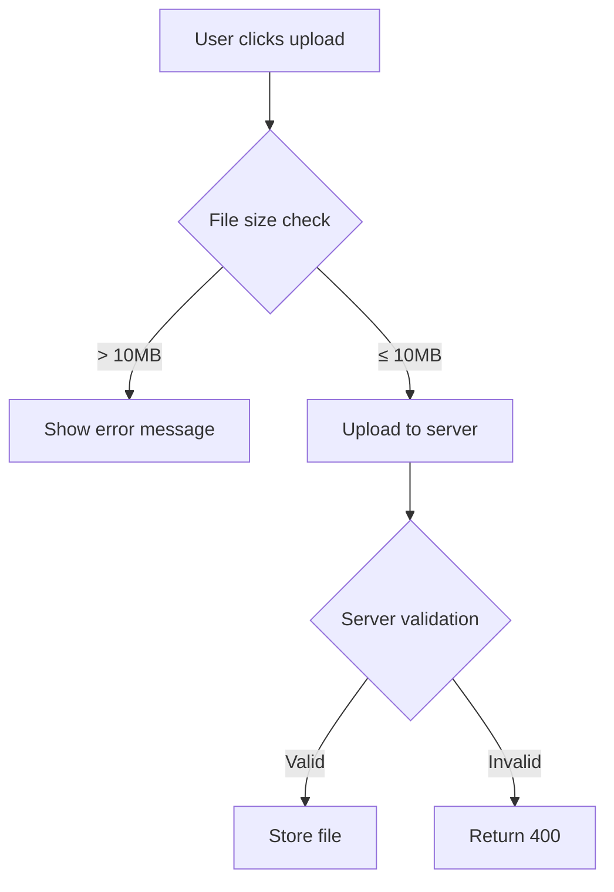
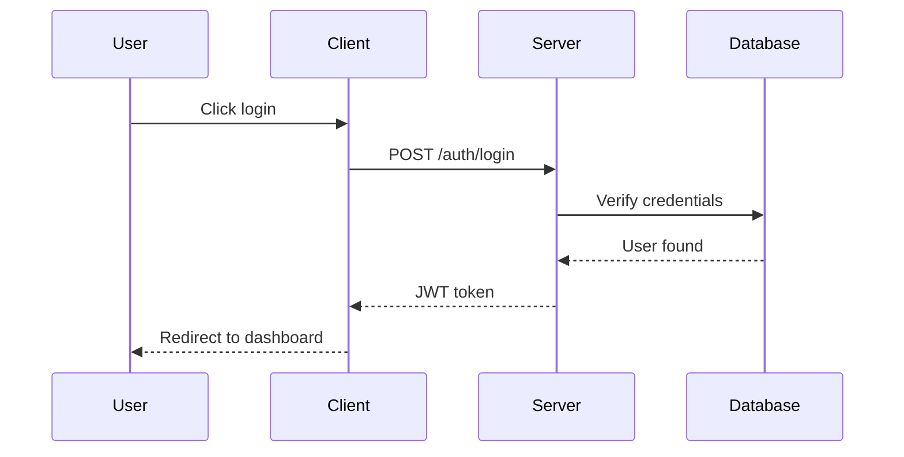
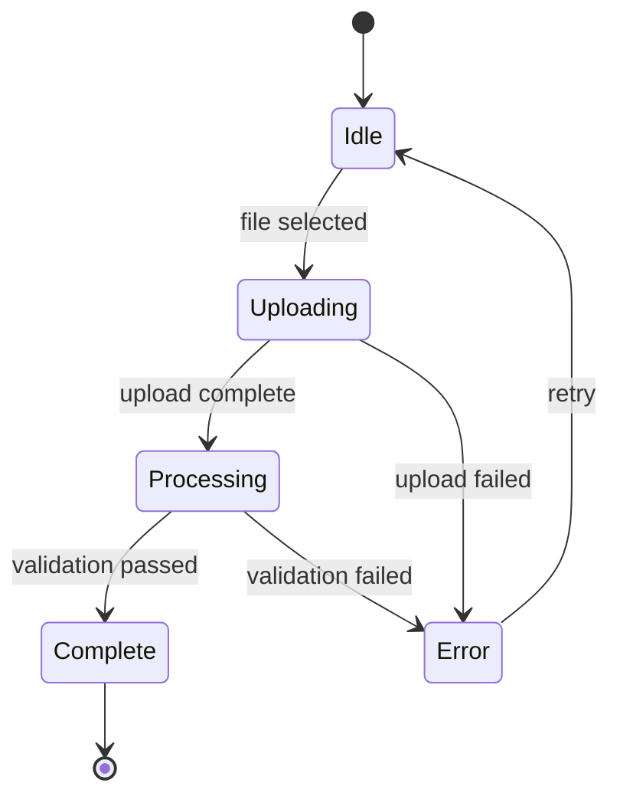

# GitHub Ticket (Create or Update)

## Why This Skill Exists

**The moment you decide to create a ticket, you have MAXIMUM CONTEXT.**

- You just investigated the problem
- You understand the codebase state
- You know the requirements
- You have the error messages fresh
- You understand the dependencies

**If you don't capture this NOW, it's lost forever.** The implementer (even if it's you later) will have to re-discover everything.

## The Cost of Vague Tickets

| Vague Ticket | Cost |
|--------------|------|
| "Fix auth bug" | Implementer spends 2 hours finding which bug |
| "Add user settings" | 5 back-and-forth clarifications |
| "Improve performance" | Implementation doesn't match intent |
| "Handle edge case" | Which edge case? What behavior? |

**Every minute spent writing a good ticket saves 10 minutes of implementation confusion.**

---

## When to Use This Skill

- **Creating** a new GitHub issue
- **Updating** an existing issue with new context/requirements
- **Expanding** a vague issue into a comprehensive spec
- **Adding** implementation details discovered during investigation

---

## Ticket Process (Create or Update)

### Phase 1: Context Capture (DO THIS FIRST)

Before writing anything, gather ALL available context:

#### Step 1: Dump Current Context

Ask yourself and document:

```markdown
## Context Dump (will be refined)

### What triggered this?
- [User request? Bug report? Code review finding? Your own observation?]

### What do I know right now?
- [Everything in your head about this issue]

### What files are involved?
- [List every file you've looked at or that's relevant]

### What did I discover?
- [Findings from investigation, errors seen, behavior observed]

### What's the current state?
- [How does it work now? What's broken?]

### What should the end state be?
- [Desired behavior, expected outcome]
```

#### Step 2: Gather Technical Evidence

```bash
# If there's an error, capture it
# If there are relevant files, note their paths
# If there's relevant git history, capture it
git log --oneline -10 -- path/to/relevant/file

# If there's related code, note the exact locations
grep -n "relevant_function" src/**/*.ts
```

#### Step 3: Check for Related Context

```bash
# Related issues?
gh issue list --search "related keywords"

# Related PRs?
gh pr list --search "related keywords"

# Any existing documentation?
find . -name "*.md" | xargs grep -l "related topic"
```

---

### Phase 2: Requirements Extraction

**CRITICAL**: Extract EVERY requirement as a checkbox item.

#### Functional Requirements

What must the implementation DO?

```markdown
## Requirements

### Functional
- [ ] [Specific action/behavior 1]
- [ ] [Specific action/behavior 2]
- [ ] [Specific action/behavior 3]
```

**Rules for writing requirements:**
- Start with a verb (Create, Add, Update, Remove, Fix, Handle)
- Be specific (not "handle errors" but "return 400 with validation message when email invalid")
- One requirement per checkbox
- If it's complex, break it down

#### Edge Cases

What edge cases must be handled?

```markdown
### Edge Cases
- [ ] Handle empty input: [expected behavior]
- [ ] Handle null/undefined: [expected behavior]
- [ ] Handle network failure: [expected behavior]
- [ ] Handle concurrent access: [expected behavior]
```

#### Acceptance Criteria

How do we KNOW it's done?

```markdown
### Acceptance Criteria
- [ ] [Specific testable criterion 1]
- [ ] [Specific testable criterion 2]
- [ ] Unit tests pass
- [ ] Integration tests pass
- [ ] No TypeScript errors
- [ ] Linting passes
```

---

### Phase 3: Implementation Guidance

Give the implementer a head start with everything you know.

#### Affected Files

```markdown
## Implementation Notes

### Files to Modify
- `src/services/auth.ts` - Add token refresh logic
- `src/api/handlers/login.ts` - Update error responses
- `src/types/auth.ts` - Add new type for refresh token

### Files to Create
- `src/services/token-refresh.ts` - New service for refresh logic

### Files to Delete
- `src/utils/old-auth-helper.ts` - Replaced by new service
```

#### Relevant Code Locations

```markdown
### Key Code Locations

**Entry point**: `src/api/handlers/login.ts:45` - `handleLogin()`
**Token generation**: `src/services/auth.ts:120` - `generateToken()`
**Related type**: `src/types/auth.ts:15` - `AuthToken`

**Similar pattern exists in**: `src/services/session.ts:80` - follow this pattern
```

#### Dependencies & Blockers

```markdown
### Dependencies
- Depends on: #123 (database migration must be done first)
- Blocks: #456 (this must be done before that can start)
- Related to: #789 (similar work, coordinate)

### Blockers
- [ ] Waiting on API spec from backend team
- [ ] Need design mockup for UI
```

---

### Phase 4: Ticket Structure Template

Use this exact structure for every ticket:

```markdown
## Summary

[1-2 sentence description of what this ticket accomplishes]

## Context

### Background
[Why does this need to happen? What triggered this?]

### Current State
[How does it work now? What's the problem?]

### Desired State
[How should it work after implementation?]

## Requirements

### Functional Requirements
- [ ] [Requirement 1 - specific, actionable]
- [ ] [Requirement 2 - specific, actionable]
- [ ] [Requirement 3 - specific, actionable]

### Edge Cases
- [ ] [Edge case 1]: [expected behavior]
- [ ] [Edge case 2]: [expected behavior]

### Acceptance Criteria
- [ ] [Criterion 1 - testable]
- [ ] [Criterion 2 - testable]
- [ ] All tests pass
- [ ] No TypeScript errors
- [ ] Code review approved

## Implementation Notes

### Files to Modify
- `path/to/file1.ts` - [what changes]
- `path/to/file2.ts` - [what changes]

### Files to Create
- `path/to/new-file.ts` - [purpose]

### Files to Delete
- `path/to/old-file.ts` - [why removing]

### Key Code Locations
- `file.ts:line` - [relevant function/class]
- `file.ts:line` - [related code to reference]

### Suggested Approach
[If you have ideas on HOW to implement, share them]

### Similar Patterns
[Point to existing code that solves similar problems]

## Dependencies

- Depends on: [#issue or description]
- Blocks: [#issue or description]
- Related: [#issue or description]

## Out of Scope

[Explicitly list what this ticket does NOT cover to prevent scope creep]

- Not doing X (that's #456)
- Not changing Y (separate ticket needed)

## Technical Notes

[Any technical context that helps: error messages, stack traces, config values, environment details]

```

---

### Phase 5: Create or Update the Ticket

#### Creating a New Issue

```bash
# Create with full body using heredoc
gh issue create --title "[Type]: Brief description" --body "$(cat <<'EOF'
[Full ticket body here using template above]
EOF
)"

# Or create from file
echo "[ticket content]" > /tmp/ticket.md
gh issue create --title "[Type]: Brief description" --body-file /tmp/ticket.md

# Add labels
gh issue edit <number> --add-label "type:feature,priority:high"
```

#### Updating an Existing Issue

```bash
# View current issue content
gh issue view <number>

# Update issue body (replaces entire body)
gh issue edit <number> --body "$(cat <<'EOF'
[Updated full ticket body]
EOF
)"

# Update just the title
gh issue edit <number> --title "[Type]: Updated description"

# Add a comment with new context (preserves original body)
gh issue comment <number> --body "$(cat <<'EOF'
## Additional Context Discovered

[New findings, updated requirements, implementation notes]
EOF
)"

# Add labels
gh issue edit <number> --add-label "type:feature,priority:high"
```

#### When to Update vs Comment

| Situation | Action |
|-----------|--------|
| Issue was vague, now have full spec | **Update body** - replace with complete spec |
| Found new requirements during investigation | **Update body** - add to requirements section |
| Progress update or status change | **Comment** - preserve history |
| Minor clarification | **Comment** - don't rewrite whole issue |
| Issue scope changed significantly | **Update body** - rewrite with new scope |

#### Title Format

```
[Type]: Brief, specific description

Types:
- feat: New feature
- fix: Bug fix
- refactor: Code restructuring
- docs: Documentation
- test: Testing
- chore: Maintenance

Examples:
- feat: Add token refresh for expired sessions
- fix: Handle null response in user API
- refactor: Extract auth logic into dedicated service
```

---

## Ticket Quality Checklist

Before creating, verify:

### Completeness
- [ ] Summary clearly states what and why
- [ ] Context explains background and current state
- [ ] ALL requirements are listed as checkboxes
- [ ] Edge cases are identified
- [ ] Acceptance criteria are testable
- [ ] Implementation notes provide file locations

### Specificity
- [ ] No vague requirements ("improve", "fix", "handle")
- [ ] Every requirement starts with a verb
- [ ] File paths are exact, not approximate
- [ ] Line numbers cited where relevant

### Context Preservation
- [ ] Error messages included (if applicable)
- [ ] Current behavior documented
- [ ] Related issues/PRs linked
- [ ] Technical context captured

### Implementability
- [ ] Someone unfamiliar could start working immediately
- [ ] No questions need to be asked before starting
- [ ] Dependencies are clear
- [ ] Out of scope is defined

---

## Anti-Patterns

### Vague Requirements

```markdown
❌ WRONG:
- [ ] Fix the authentication

✅ CORRECT:
- [ ] Return 401 when access token is expired (currently returns 500)
- [ ] Include `token_expired` error code in response body
- [ ] Log failed auth attempts with user ID and timestamp
```

### Missing Context

```markdown
❌ WRONG:
## Summary
Add user settings

✅ CORRECT:
## Summary
Add user settings page with theme, notification, and privacy preferences.

## Context
### Background
Users have requested ability to customize their experience. Currently all settings
are hardcoded. Design mockup approved in Figma (link).

### Current State
No user settings exist. Theme is system default, notifications always on.

### Desired State
Users can: toggle dark mode, enable/disable notifications, set privacy level.
Settings persist across sessions in user profile.
```

### Assumed Knowledge

```markdown
❌ WRONG:
Fix the thing we discussed

✅ CORRECT:
Fix the race condition in WebSocket reconnection.

Per discussion on 2024-01-15: when connection drops and reconnects rapidly,
duplicate event handlers accumulate. See error in production logs:
"MaxListenersExceededWarning: 11 listeners added to connection"
```

### No Acceptance Criteria

```markdown
❌ WRONG:
- [ ] Add caching

✅ CORRECT:
- [ ] Add Redis caching for user profile queries
- [ ] Cache TTL: 5 minutes
- [ ] Cache invalidates on profile update
- [ ] Cache miss falls back to database
- [ ] Metric: Cache hit rate logged to DataDog
- [ ] Acceptance: Profile page loads in <100ms (currently 400ms)
```

---

## Examples

### Bug Report

```markdown
## Summary

Fix crash when uploading files larger than 10MB.

## Context

### Background
Users report app crashes when uploading large attachments. Error reported by
3 users this week, all with files >10MB.

### Current State
Files >10MB cause uncaught exception in upload handler. Server returns 500,
client shows generic error. No file size validation exists.

### Desired State
Large files are rejected gracefully with clear error message before upload starts.
Server handles oversized uploads without crashing.

## Requirements

### Functional Requirements
- [ ] Add client-side file size check before upload
- [ ] Display error: "File too large. Maximum size is 10MB"
- [ ] Add server-side file size limit (defense in depth)
- [ ] Return 413 (Payload Too Large) for oversized requests
- [ ] Log oversized upload attempts with file size and user ID

### Edge Cases
- [ ] Multiple files where one exceeds limit: reject only that file
- [ ] Exactly 10MB: allow (limit is exclusive >10MB)
- [ ] Zero-byte files: allow (separate validation if needed)

### Acceptance Criteria
- [ ] Upload 15MB file: see error message, no crash
- [ ] Upload 10MB file: succeeds
- [ ] Upload 5MB file: succeeds
- [ ] Server logs show rejection reason
- [ ] No unhandled exceptions in error monitoring

## Implementation Notes

### Files to Modify
- `src/components/FileUpload.tsx:45` - Add size check before `handleUpload()`
- `src/api/upload.ts:23` - Add size validation middleware
- `src/config/limits.ts` - Add `MAX_FILE_SIZE_MB = 10`

### Key Code Locations
- Upload handler: `src/api/upload.ts:23` - `uploadFile()`
- File input: `src/components/FileUpload.tsx:45` - `onChange` handler

### Error to Fix
```
TypeError: Cannot read property 'buffer' of undefined
    at uploadFile (src/api/upload.ts:67)
    at processTicksAndRejections (internal/process/task_queues.js:95:5)
```

## Technical Notes

- Current multer config has no size limit
- Nginx also needs limit: `client_max_body_size 10m;`
- Consider chunked upload for larger files (future ticket)
```

### Feature Request

```markdown
## Summary

Add dark mode toggle to user settings with system preference detection.

## Context

### Background
Dark mode requested by users (12 upvotes on feedback board). Improves
accessibility and reduces eye strain for night usage.

### Current State
App uses light theme only. No theme preference storage.

### Desired State
Users can choose: Light, Dark, or System (auto-detect). Preference persists
across sessions. Theme applies immediately without page reload.

## Requirements

### Functional Requirements
- [ ] Add theme toggle in Settings > Appearance
- [ ] Options: Light, Dark, System (follows OS preference)
- [ ] Store preference in user profile (database)
- [ ] Apply theme immediately on change (no reload)
- [ ] Respect system preference when "System" selected
- [ ] Default to "System" for new users

### Edge Cases
- [ ] User changes OS theme while app open: update if "System" selected
- [ ] Logged out users: store preference in localStorage
- [ ] Theme loads before page paint (no flash of wrong theme)

### Acceptance Criteria
- [ ] Toggle between themes in settings
- [ ] Preference persists after logout/login
- [ ] "System" follows OS dark mode setting
- [ ] No flash of unstyled/wrong theme on page load
- [ ] Works on all pages (verify: dashboard, settings, profile)

## Implementation Notes

### Files to Modify
- `src/styles/theme.ts` - Add dark theme colors
- `src/contexts/ThemeContext.tsx` - Add theme state management
- `src/components/Settings/Appearance.tsx` - Add toggle UI
- `src/api/user.ts` - Add theme preference endpoint

### Files to Create
- `src/hooks/useTheme.ts` - Theme hook with system detection
- `src/styles/dark-theme.css` - Dark mode CSS variables

### Key Code Locations
- Current theme setup: `src/styles/theme.ts:1`
- Settings page: `src/pages/Settings.tsx:45`
- User profile API: `src/api/user.ts:78`

### Suggested Approach
1. Add CSS custom properties for theme colors
2. Create ThemeContext with Light/Dark/System state
3. Use `prefers-color-scheme` media query for system detection
4. Store in user.preferences.theme (string enum)

### Similar Patterns
- Notification preferences: `src/components/Settings/Notifications.tsx`
- User preference storage: `src/api/user.ts:updatePreferences()`

## Dependencies

- Related: #234 (accessibility improvements)
- Future: #567 (custom accent colors - builds on this)

## Out of Scope

- Custom color themes (future ticket)
- Per-page theme overrides (not needed)
- Theme scheduling (auto dark at night)
```

---

## Mermaid Diagrams for Visual Clarity

**Use Mermaid diagrams to visualize complex relationships, flows, and architectures.**

GitHub renders Mermaid diagrams natively in issue bodies and comments. Use them when:
- Showing data/control flow
- Illustrating state machines
- Depicting component relationships
- Mapping user journeys
- Visualizing before/after states

### When to Include Diagrams

| Scenario | Diagram Type |
|----------|--------------|
| API request flow | `flowchart` or `sequenceDiagram` |
| State changes | `stateDiagram-v2` |
| Component dependencies | `flowchart` with subgraphs |
| Data model relationships | `erDiagram` |
| Process workflow | `flowchart TD` |
| Timeline of events | `sequenceDiagram` |

### Diagram Examples

#### Flow Diagram

````markdown

````

#### Sequence Diagram

````markdown

````

#### State Diagram

````markdown

````

### Integration with Ticket Template

Add diagrams in the **Context** or **Implementation Notes** sections:

```markdown
## Context

### Current Flow
[Mermaid diagram showing current broken flow]

### Desired Flow
[Mermaid diagram showing fixed flow]

## Implementation Notes

### Component Architecture
[Mermaid diagram showing how components interact]
```

**Tips:**
- Keep diagrams focused (5-10 nodes max)
- Use clear labels, not abbreviations
- Show before/after when fixing bugs
- Include diagrams in the ticket, not as external links

---

## Critical Principles

- **CAPTURE EVERYTHING NOW** - Context fades fast, write it all down
- **REQUIREMENTS AS CHECKBOXES** - Implementer needs clear checklist
- **CITE CODE LOCATIONS** - Don't make them search
- **INCLUDE ERRORS/LOGS** - Exact error messages save debugging time
- **DEFINE DONE** - Testable acceptance criteria
- **EXPLICIT SCOPE** - What's in AND what's out
- **ASSUME FRESH EYES** - Write for someone who knows nothing about this
- **VISUALIZE WITH MERMAID** - A diagram is worth 1000 words
