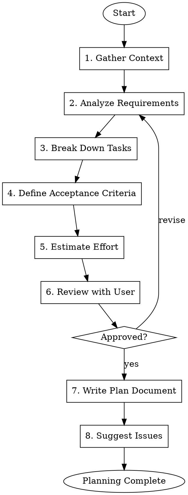

# Gmacko Feature Planning

Break down feature requests into detailed implementation plans with tasks and acceptance criteria.

## When to Use

- User describes a new feature to implement
- A GitHub issue needs task breakdown
- Planning sprint work
- Converting INITIAL_PLAN.md milestones into actionable tasks

## Workflow



## Execution Steps

### Step 1: Gather Context

Before planning, gather necessary context:

**Questions to Ask:**
1. What is the feature name/title?
2. What problem does it solve?
3. Which platforms are affected? (web/mobile/api/all)
4. Is this in the INITIAL_PLAN.md? If so, which milestone?
5. Any existing related code to reference?
6. Any design mockups or references?
7. Are there dependencies on other features?

**Files to Check:**
- `INITIAL_PLAN.md` - For context on planned features
- `PROJECT_MANIFEST.json` - For enabled integrations
- `packages/db/src/schema.ts` - For existing data model
- `packages/api/src/routers/` - For existing API patterns

### Step 2: Analyze Requirements

Break down the feature into components:

```markdown
## Feature Analysis

### User Stories
- As a [user type], I want [capability] so that [benefit]

### Affected Areas
- [ ] Database schema changes
- [ ] API endpoints (tRPC routers)
- [ ] Web UI components
- [ ] Mobile UI components
- [ ] Shared package updates
- [ ] Third-party integrations

### Technical Considerations
- Authentication required: yes/no
- Real-time updates needed: yes/no
- Analytics events to track: [list]
- Error states to handle: [list]
```

### Step 3: Break Down Tasks

Create a hierarchical task breakdown:

```markdown
## Task Breakdown

### 1. Database Layer
- [ ] Add/modify schema in `packages/db/src/schema.ts`
- [ ] Create migration
- [ ] Add indexes if needed

### 2. API Layer
- [ ] Create/update tRPC router in `packages/api/src/routers/`
- [ ] Add input validation (Zod schemas)
- [ ] Implement business logic
- [ ] Add error handling

### 3. Web UI
- [ ] Create page/component in `apps/web/src/`
- [ ] Connect to tRPC hooks
- [ ] Add loading/error states
- [ ] Implement responsive design

### 4. Mobile UI (if applicable)
- [ ] Create screen/component in `apps/mobile/src/`
- [ ] Connect to tRPC hooks
- [ ] Handle platform-specific UI

### 5. Integration
- [ ] Add analytics events
- [ ] Add error tracking
- [ ] Update i18n strings

### 6. Testing & QA
- [ ] Write test cases
- [ ] Manual testing checklist
- [ ] Cross-platform verification
```

### Step 4: Define Acceptance Criteria

Write clear, testable acceptance criteria:

```markdown
## Acceptance Criteria

### Functional
- [ ] User can [action 1]
- [ ] System displays [expected behavior]
- [ ] Data is persisted correctly
- [ ] Errors are handled gracefully

### Non-Functional
- [ ] Page loads in < 2 seconds
- [ ] Works on mobile viewports
- [ ] Accessible (keyboard navigation, screen readers)
- [ ] No console errors

### Edge Cases
- [ ] Empty state handled
- [ ] Maximum limits respected
- [ ] Concurrent access handled
```

### Step 5: Estimate Effort

Provide rough estimates:

| Task | Estimate | Complexity |
|------|----------|------------|
| Database changes | 1h | Low |
| API implementation | 2h | Medium |
| Web UI | 4h | Medium |
| Mobile UI | 3h | Medium |
| Testing | 2h | Low |
| **Total** | **12h** | - |

### Step 6: Review with User

Present the plan summary:

> **Feature Plan: [Feature Name]**
>
> **Summary**: [One sentence description]
>
> **Scope**:
> - Platforms: [Web/Mobile/Both]
> - Dependencies: [None/List]
> - Estimated effort: [X hours]
>
> **Tasks**: [X] tasks across [Y] areas
>
> Does this look complete? Should I adjust anything?

### Step 7: Write Plan Document

Write to `docs/ai/handoffs/{feature-id}-plan.md`:

```markdown
# Feature Plan: [Feature Name]

> Generated on [date]
> Author: AI Assistant

## Overview

**Feature**: [Name]
**Issue**: #[number] (if exists)
**Milestone**: [From INITIAL_PLAN.md]
**Estimated Effort**: [X hours]

## Problem Statement

[What problem this solves]

## User Stories

- As a [user], I want [goal] so that [benefit]

## Technical Design

### Data Model Changes

```typescript
// New/modified schema
```

### API Changes

```typescript
// New/modified procedures
```

### UI Components

- Web: [List of components]
- Mobile: [List of screens] (if applicable)

## Task Breakdown

[Detailed task list from Step 3]

## Acceptance Criteria

[Criteria from Step 4]

## Test Plan

### Manual Testing
1. [Test case 1]
2. [Test case 2]

### Automated Testing
- [ ] Unit tests for [component]
- [ ] Integration tests for [API]

## Dependencies

- Requires: [Other features/issues]
- Blocks: [Dependent features]

## Rollback Plan

If issues arise:
1. [Rollback step 1]
2. [Rollback step 2]

## Open Questions

- [ ] [Question 1]
- [ ] [Question 2]
```

### Step 8: Suggest Issues

Recommend GitHub issue creation:

> Based on this plan, I recommend creating these issues:
>
> 1. **[Feature]: [Main feature name]** - Epic/parent issue
> 2. **[Task]: Database schema for [feature]** - Subtask
> 3. **[Task]: API endpoints for [feature]** - Subtask
> 4. **[Task]: Web UI for [feature]** - Subtask
>
> Would you like me to create these issues using `gmacko-dev-issue-create`?

## Output Artifacts

- `docs/ai/handoffs/{feature-id}-plan.md` - Detailed plan
- Suggested GitHub issues (optional)

## Red Flags

| Rationalization | Correction |
|-----------------|------------|
| "This is simple, no need for a plan" | ALL features get plans; even small ones |
| "I'll skip acceptance criteria" | Criteria are required for QA handoff |
| "User knows what they want, no questions needed" | ALWAYS gather context first |
| "Estimates don't matter" | Estimates help prioritization |

## Integration Points

- **Input**: Feature request (verbal or issue)
- **References**: `INITIAL_PLAN.md`, `PROJECT_MANIFEST.json`
- **Output**: `docs/ai/handoffs/{id}-plan.md`
- **Next**: `gmacko-dev-issue-create` or direct implementation
